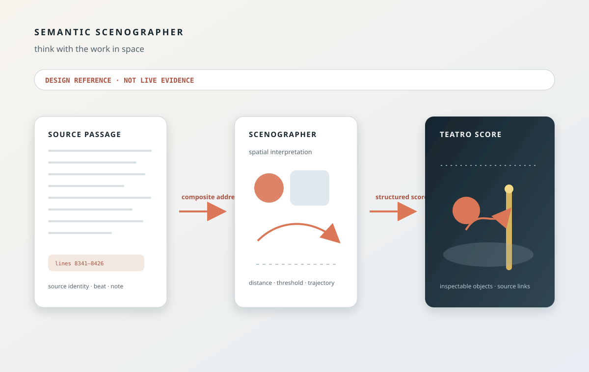

# Semantic Scenographer — Think with the Work in Space

> Chapter summary: Reframe may turn source-addressed dramatic and semantic relations into structured spatial
> propositions. The Semantic Scenographer interprets; Teatro scores and renders; neither becomes the authority for
> the source or for uncertainty.



## Purpose

Reframe needs a way to think with dramatic material spatially without confusing spatial imagination with source fact.
The Semantic Scenographer is that instrument.

It asks:

> What spatial arrangement would make the relations in this material perceptible?

It does not ask an image generator to decorate a scene. It receives material already situated in Reframe's semantic
spine — source identity, source range, beat or movement context, lane or note identity where applicable, uncertainty
state, and other admitted evidence — and proposes how those relations might exist in space.

The governing distinction is:

```text
Reframe establishes what is there.
The Semantic Scenographer proposes how it might exist in space.
Teatro scores and renders that proposition.
```

The illustration above is a design reference for this boundary. It is not a runtime screenshot, Store receipt, AX
capture, or live acceptance claim.

## The decision

The Semantic Scenographer is a distinct downstream instrument. It is not Source View, not Lane View, not an image
generator, and not a replacement for the uncertainty model.

The current writer-facing Lane View direction is therefore retired as a product navigation surface. `UncertaintyScoreKit`
remains valuable as an internal model projection: it stores and exposes uncertainty states, spans, and addresses for
downstream consumers. Reading Navigation remains the user's semantic index. The scenographer may consume those
addresses, but it does not create a second navigation system.

```text
source / beat / lane / note
          ↓
composite semantic address
          ↓
AI scenographic interpretation
          ↓
structured Teatro composition
          ↓
deterministic SVG, animation, storyboard, or score
```

## Authority boundaries

### Source View

Source View remains authoritative for the exact Markdown stream and supported `.fountain` subset. The scenographer
may cite a source range and propose a spatial reading of it, but it may not rewrite, summarize over, or replace the
source. A scenographic object is never evidence that the source literally contains its geometry.

### UncertaintyScoreKit

`UncertaintyScoreKit` remains the internal authority for uncertainty structure: lanes, notes, states, spans, and
composite addresses. The scenographer can use a note's state as an input condition — for example, an unresolved
question may become an open distance or threshold — but it may not invent, close, or conceal that uncertainty.

### Reading Navigation

Reading Navigation establishes the user's semantic starting point. The writer can select a passage, beat, movement,
question, or note and ask Copilot to stage the relations there. The scenographer may return a selectable spatial
proposal, but selection is a shortcut back to the already-established address, not a new finding.

### Teatro

Teatro is the structured representation and rendering boundary. It may express geometry, transitions, symbolic
objects, spatial scores, and animation. It does not own source parsing, uncertainty meaning, provider choice,
Copilot mediation, or AX truth.

## Instrument role

The scenographer converts semantic relations into spatial form through a small declared vocabulary:

- figure, object, field, zone, distance, threshold, boundary, and axis;
- entry, exit, void, density, isolation, cluster, and witness;
- foreground, background, trajectory, pause, repetition, overlap, containment, exposure, and concealment.

These are compositional primitives, not hidden facts. A relation such as “A seeks contact, B withdraws, and the
question remains open” might become an advancing trajectory, a receding zone, and an unresolved distance field. The
result is explicitly a scenographic proposition.

The initial capability vocabulary should remain small and typed. Candidate operations are:

```text
scenography.stage
scenography.spatialize
scenography.score
scenography.sequence
scenography.compare
scenography.revise
```

The final operation names, input contract, and lifecycle belong in the Fountain Coach capability registry and MIDI2
instrument contract. They must not be invented independently by a UI.

## Teatro composition contract

A composition is structured rather than flattened imagery:

```text
Stage
 ├── Field
 ├── Figure
 ├── Object
 ├── Threshold
 ├── Path
 └── Annotation
```

Each interactive object should preserve:

- a stable object identity;
- its source document and exact source range;
- the originating beat, movement, lane, or note address where applicable;
- a declared spatial role;
- geometry and temporal state;
- label, visibility, and transition data;
- the instrument, score, renderer, and provenance versions.

For example:

```text
TeatroObject {
    id: "threshold-04"
    sourceDocumentID: "screenplay:fixture:source"
    startLine: 8341
    endLine: 8426
    laneID: "questions"
    noteID: "q-018"
    role: "threshold"
}
```

The exact serialized type remains a kit contract to be admitted. The address relationship is already a governance
requirement.

## Copilot experience

The writer remains in Copilot. They may ask:

- “Stage the conflict in this passage.”
- “Show me how these three movements relate spatially.”
- “Make the distance between them visible.”
- “Turn this beat into a spatial score.”
- “Give me three different stagings of the same source.”
- “Keep the source fixed but make the threshold more dominant.”
- “Show the unresolved question as a spatial condition.”

Reframe resolves the relevant semantic address and admitted context before the instrument runs. The writer does not
manage SVG, layout engines, geometry stores, or renderer credentials. The projection may appear beside the manuscript,
on a dedicated stage surface, or in a responsive contextual arrangement. Layout is implementation detail; identity and
addressability are the contract.

## AI responsibility and limits

The AI may choose which relationships deserve emphasis, select declared spatial primitives, compose several relations,
produce temporal sequences, and generate alternative stagings.

It may not:

- invent source facts and present them as established;
- mutate the manuscript without a separate authorized operation;
- reinterpret uncertainty as certainty;
- hide an unresolved state or failed input;
- treat a decorative inference as evidence;
- persist a spatial proposal as a semantic finding merely because it rendered.

Every result must remain identifiable as a scenographic proposal.

## Determinism, provenance, and variants

The interpretive act and the render must remain distinguishable. Once the AI has produced a structured Teatro score,
rendering should be deterministic wherever possible from:

```text
source identity
semantic addresses
instrument version
AI-generated Teatro score
renderer version
render parameters
```

The resulting artifact carries a digest and provenance record. Re-rendering the same stored score with the same
renderer and parameters must produce the same geometric result.

Scenography is exploratory. Several variants may be anchored to the same source address:

```text
A — compression
B — distance
C — shared field
```

Variants remain distinct proposals. None is promoted automatically to source truth, uncertainty truth, or canonical
staging.

## Image generation is downstream

An image renderer may later interpret a Teatro score, but it must remain downstream:

```text
source → Semantic Scenographer → Teatro score → optional image interpretation
```

The structured score remains primary because it can be inspected, discussed, revised, compared, addressed, and
deterministically rerendered. A flattened bitmap cannot replace that lineage.

## Address-preserving interaction

Selecting a Teatro object must preserve the same semantic address through the workspace:

```text
focus Teatro object
    → focus linked Lane/View context where applicable
    → scroll Source View to the exact range
    → expose the same address through AX
```

If the object has no unambiguous source address, it must be presented as unlinked proposal material. It may not guess
or silently attach itself to a nearby passage. If multiple notes overlap, the composite identity remains composite.

## Acceptance order

The first bounded implementation should:

1. select one exact source range;
2. resolve its semantic address;
3. optionally include linked beat and uncertainty context;
4. request one structured Teatro proposition;
5. render it deterministically as SVG;
6. preserve source addresses on every linked object;
7. expose every interactive object through AX;
8. support object selection back to Source View focus;
9. support revision and alternative staging as separate proposals; and
10. persist the Teatro score and provenance separately from the source.

Acceptance requires proving exact source identity, absence of source mutation, absence of invented uncertainty,
stable object identity, AX parity, deterministic rerender, distinct variants, and visible failure for missing or
insufficient semantic input. Attractive SVG alone is not acceptance.

## Relationship to existing governance

This chapter extends [Chapter 24](24-the-reasoning-is-an-uncertainty-map.md), [Chapter 36](36-every-gap-keeps-its-address.md),
[Chapter 79](79-default-semantic-manuscript-projection.md), and [Chapter 98](98-apple-native-markdown-presentation-and-transferable-engraving-rules.md).
It supersedes the writer-facing Lane View direction in [Chapter 99](99-decoupled-manuscript-instruments.md), while
retaining Chapter 99's separation of source authority, semantic addresses, and projection ownership where compatible.
Chapter 08 remains the evidence authority for AX, Store, window-ID, and independent acceptance.

## Governing sentence

The Semantic Scenographer receives source-addressed meaning from Reframe, uses AI to propose spatial relations, and
expresses those relations as structured Teatro scores whose objects remain inspectable and traceable to the work; it
may imagine space, but it never becomes the authority for the source or the reading.
