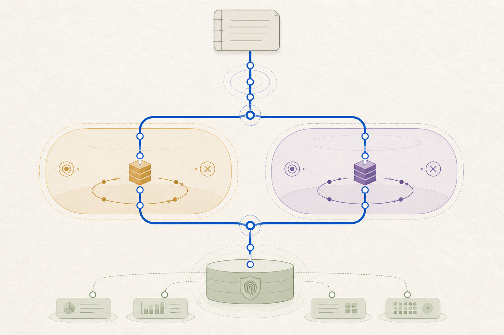

# Semantic Inference Execution, Session, and Latency Governance

> Chapter summary: Every semantic lane uses the same source-window execution contract. A warm runtime may be
> reused, but semantic context is isolated per window, completion is event-driven, results are typed and persisted,
> and latency is measured from the same evidence boundary across local and Codex execution.



*Principal illustration — MIDI2 carries one governed execution spine across local and Codex transports and into
durable evidence. Design illustration; not live acceptance evidence.*

## Purpose

Reframe's semantic reading is not a collection of unrelated model calls. It is one governed execution capability that
may be realized by more than one lane. This chapter establishes the boundary between the Reframe semantic run, the
runtime that carries it, the context used for one source window, and the result that becomes evidence in FountainStore.

The immediate reason is practical: a semantic run may spend most of its time waiting for provider or runtime work,
while source extraction and persistence are comparatively small. Improving that path requires an architectural seam,
not a change to the meaning of a page. The seam must apply equally to the local lane and to Codex execution.

The governing distinction is:

```text
Reframe semantic run
        ↓
isolated semantic session
        ↓
bounded source-window turn
        ↓
typed result and validation
        ↓
FountainStore receipt and coverage
```

An implementation may keep a process warm. It may not let warm process state silently become semantic context for the
next source window.

## MIDI2 is the execution seam

MIDI2 is the universal command, lifecycle, telemetry, and evidence seam around this execution. It is not a third
semantic lane and it is not the model runtime. The local runtime and the Codex app-server are execution backends behind
the same MIDI2 instrument boundary:

```text
Reframe / Copilot intent
          ↓ MIDI2 command
semantic execution adapter
     ├── local runtime
     └── Codex app-server
          ↓ MIDI2 lifecycle and telemetry
FountainStore · AX · MIDI2 Monitor
```

The MIDI2 operation carries the governed identity and state for the run, session, source window, and turn. It exposes
admission, readiness, progress, completion, cancellation, timeout, refusal, and failure without requiring the host to
inspect provider prose or process output. The execution backend may use its native protocol internally, but it must not
create a second Reframe lifecycle or evidence model.

MIDI2 therefore owns the cross-lane contract for:

- the typed instrument operation and correlation identifiers;
- run, session, window, and turn lifecycle events;
- telemetry, budgets, chunk rules, and resume tokens;
- cancellation and terminal-state propagation;
- the handoff to FountainStore, AX, and MIDI2 Monitor.

FountainStore remains the durable behavioral authority, AX remains the machine-readable user-surface authority, and the
MIDI2 Monitor remains the live event mirror. None of these projections is allowed to infer completion independently.
The provider or local runtime result becomes a Reframe result only after the MIDI2 adapter validates it and emits the
corresponding governed event and Store receipt.

This makes the transport substitution explicit:

```text
same MIDI2 command
       ├── local execution protocol
       └── Codex execution protocol
same MIDI2 lifecycle, telemetry, cancellation, and evidence
```

The adapter is consequently the place where native runtime events become MIDI2 events, not the place where semantic
meaning is invented. It must preserve the exact source address and lane decision while translating readiness,
completion, cancellation, and failure. A successful child-process exit, a local callback, or a streamed assistant
message without the corresponding MIDI2 terminal event is not an accepted Reframe completion.

## Scope and lane neutrality

This chapter applies to every semantic lane that Reframe admits, including:

- the local Apple-native or in-process lane;
- Codex execution through a governed app-server boundary;
- a future admitted lane with the same typed contract.

The lane resolver remains outside the reusable execution session. It chooses one admitted lane for the run and records
that choice. A session consumes that decision; it does not select a provider, inspect credentials, fall back to another
lane, or rewrite the run's budget.

Local execution is not exempt because it is on the same machine. Its runtime session, source-window isolation,
cancellation, retries, provenance, and terminal evidence must have the same meaning as the Codex path. The transport
differs; the semantic contract does not.

## Definitions

| Term | Meaning |
| --- | --- |
| Run | One admitted Reframe semantic operation with one source identity, lane decision, Store lineage, and coverage goal. |
| Runtime | The long-lived executable or in-process execution facility that can carry sessions. |
| Session | A run-scoped semantic execution context. It may be backed by a warm runtime. |
| Thread/context | The isolated reasoning context for one source window. It is never reused for an unrelated window. |
| Turn | One bounded request and its event stream inside that context. |
| Window | An exact source range plus its semantic address and admitted supporting context. |
| Result | A typed, validated semantic output tied to the window and its provenance. |
| Enrichment | Non-causal work that may be deferred or replayed after the source-window result is durable. |

“Session” therefore does not mean “the whole conversation,” and “warm” does not mean “shared.” A warm process is an
optimization of startup. A fresh window context is an integrity boundary.

## Runtime and context boundary

The permitted implementation shape is:

```text
one Reframe run
 └── one admitted lane decision
     └── one warm runtime, if useful
         └── one session
             ├── window A → isolated context → turn → result
             ├── window B → isolated context → turn → result
             └── window C → isolated context → turn → result
```

The runtime may be persistent across windows. The session must retain the run identity and cancellation authority.
Each window must carry its own source document identity, source digest or version, exact range, semantic address,
lane identity, instrument version, and parent run identity. A result missing any required address is incomplete, not a
result to attach to the nearest visible passage.

The local lane may implement the context as a fresh request object, a fresh actor state, or an equivalent isolated
in-process boundary. The Codex lane may implement it as a fresh app-server thread or equivalent protocol context.
Neither lane may use a full transcript, an unrelated prior turn, or a hidden semantic index as a substitute for the
admitted window context.

## Lifecycle and terminal truth

The session exposes one typed lifecycle:

```text
candidate → admitted → started → producing → completed
                                      ├→ cancelled
                                      ├→ timed_out
                                      ├→ failed
                                      └→ refused
```

Completion is established by the lane's terminal event and the typed result, not by process existence, a partial
stream, a log line, or an attractive projection. Cancellation is a first-class terminal outcome. A runtime that is
still alive after cancellation does not make the turn successful.

The host must be able to associate every event with run, session, window, and turn identity. The Store receipt records
the terminal outcome, the exact source address, the selected lane, and the evidence needed to resume or explain the
outcome. AX and MIDI2 projections may mirror this state; they do not replace the Store receipt.

## Source-window semantics

Window selection is semantic and structural. Numeric token or byte counts may be observed for telemetry and transport
limits, but they may not silently decide which meaning is included, truncate the source, or cap the model's answer.
The window is admitted from the source authority and names its exact range before execution begins.

The executor must preserve:

- source document identity and source version or digest;
- exact start and end range;
- beat, movement, question, lane, note, or composite address where applicable;
- the context-selection reason and instrument version;
- run, session, and turn identity;
- retry and terminal history.

The semantic result may interpret the window. It may not replace the source, create a new uncertainty authority, or
silently broaden the range. Backfill is a new, explicitly addressed window or a recorded retry of the same window.

## Concurrency and the critical path

Causal interpretation of adjacent source windows is serial by default. Independent work may overlap only when its
independence is explicit and its results cannot change the meaning or address of an in-flight causal turn.

Permitted examples include immutable source extraction, deterministic validation, telemetry emission, and persistence
preparation. Enrichment, synopsis, or alternative projections may run after the authoritative window result is durable
or under a separately recorded dependency. They must not delay or masquerade as the window's terminal result.

The implementation must measure the critical path as separate spans:

```text
admission → extraction → context preparation → runtime wait
          → semantic completion → validation → Store receipt
```

Provider startup, context creation, retries, backoff, persistence, and enrichment must not be hidden inside one
undifferentiated “page” duration. The measurement itself must not alter semantic inclusion or output allowance.

## Retry, timeout, and resume

Retries preserve the source address and run lineage. They do not silently change lane, widen meaning, or turn a timeout
into a smaller semantic answer. A retry is recorded with its reason, attempt identity, and terminal outcome.

Timeouts are transport and execution safety boundaries. They are not evidence that the source should be truncated. When
a timeout leaves an uncertain or partial result, Reframe records the incomplete state and either resumes the same
address under the declared policy or presents a visible failure requiring a governed decision.

Resume uses the Store's durable receipt and coverage state. It does not reconstruct state from UI text, process memory,
or a guessed latest run. A completed window is not re-read merely because a warm runtime was restarted; a missing or
invalid receipt is not treated as completed merely because a response was once displayed.

## Result and evidence contract

Before admission as a semantic result, the executor validates:

1. terminal lifecycle state is present;
2. output belongs to the expected run, session, and turn;
3. source identity and exact range match the requested window;
4. the result schema is valid and its semantic role is declared;
5. uncertainty is preserved rather than invented or collapsed;
6. the Store receipt and coverage update can be written without changing source authority.

Malformed, missing, ambiguous, or out-of-scope output is a typed failure. The host must not repair it by parsing
assistant prose, attaching it to a nearby range, or displaying it as completed evidence.

The interpretive result and any later projection remain separate artifacts. Source View remains source authority,
UncertaintyScoreKit remains an internal uncertainty projection, and Semantic Scenographer consumes admitted addresses
downstream. This execution chapter does not grant a semantic lane authority over any of those boundaries.

## Latency and quality acceptance

An optimization is accepted only when it improves measured end-to-end completion without weakening semantic or evidence
quality. At minimum, a before/after comparison must report the same source fixture, source coverage, lane decision,
window policy, terminal predicate, Store receipt, retry/cancellation behavior, and executable provenance.

The acceptance record distinguishes:

- runtime startup and session setup;
- per-window extraction and context preparation;
- provider or local runtime wait;
- retry and backoff time;
- validation and persistence;
- deferred enrichment;
- total run completion.

Lower time without a terminal receipt, exact coverage, reproducible provenance, or equivalent output validation is not
an optimization claim. A warm Codex app-server process or a warm local runtime becomes the default only after the same
terminal and cancellation matrix proves it is at least as correct as the established path and materially improves the
measured critical path. Until then it remains an explicit candidate transport.

## Failure and operational boundaries

The session must fail closed on missing runtime readiness, missing terminal event, wrong source identity, stale lane
identity, malformed output, cancellation loss, Store write failure, or provenance mismatch. It must expose the bounded
failure and preserve enough receipt state for diagnosis and governed resume.

This chapter does not authorize provider credential changes, infrastructure mutation, a production deployment, a new
semantic provider, or an external security claim. It governs the execution boundary needed before those separate
transitions can be evaluated.

## Relationship to existing governance

[Chapter 85](85-storify-source-auto-reads-a-defined-whole.md) governs Storify Source Auto's immutable source admission,
named ranges, serial causal reading, and terminal coverage. [Chapter 86](86-apple-native-semantic-pipeline-is-one-midi2-graph.md)
governs the composed Apple-native semantic pipeline and typed stage lineage. [Chapter 88](88-codexkit-is-a-governed-codex-app-server-boundary.md)
governs the Codex app-server boundary. [Chapter 91](91-fcis-kit-instrument-store-is-the-capability-plane.md) governs
the FCIS-KIT capability plane. [Chapter 93](93-instrument-creation-is-a-governed-promotion-path.md) governs
scenario-first instrument creation and promotion. [Chapter 98](98-apple-native-markdown-presentation-and-transferable-engraving-rules.md)
governs Markdown presentation and prohibits renderer authority from becoming text authority. [Chapter 99](99-decoupled-manuscript-instruments.md),
[Chapter 100](100-semantic-scenographer.md), and [Chapter 101](101-teatro-stage-engine-semantic-scenography.md)
preserve the decoupled manuscript instruments and the Teatro stage boundary.

The chapter also participates in the Fountain Coach publication estate defined by [Chapter 92](92-fountain-coach-publication-estate.md).
The external Kit and composed event-stream boundary that consumes this execution contract is defined by [Chapter 103](103-fcis-kit-semantic-factory-and-wired-instrument-event-stream.md).
The reviewed public authorities are linked explicitly: [Fountain Coach identity](https://fountain.coach/),
[Governance — rules and authority](https://governance.fountain.coach/), [MIDI2 — machine-readable specification](https://midi2.fountain.coach/),
[Instruments — capability catalog](https://instruments.fountain.coach/), and [Status — company and legal context](https://status.fountain.coach/).
These are publication links, not claims that a sibling domain, runtime, instrument release, or live acceptance has been
established by this chapter.

This chapter supplies the shared execution rule beneath those capabilities: local and Codex lanes may differ in
transport, but they must not differ in semantic isolation, terminal truth, provenance, cancellation, or evidence.

## Acceptance order

Acceptance proceeds in this order:

1. prove the typed session contract independently for local and Codex transports;
2. prove fresh source-window isolation over a multi-window fixture;
3. prove terminal completion, cancellation, timeout, retry, and resume receipts;
4. prove exact source coverage and unchanged uncertainty/source authorities;
5. measure the decomposed critical path with the same executable and fixture provenance;
6. compare candidate and established transports without promoting the faster unproven path;
7. live-drive the admitted Reframe surface through AX, MIDI2, window-ID, and FountainStore evidence;
8. promote a transport or kit only through its own scenario, release, and publication gates.

## Governing sentence

Reframe may keep semantic runtimes warm, but every source window receives an isolated context, a typed terminal result,
and a traceable Store receipt; local and Codex lanes share this execution and latency contract, while transport remains
an implementation detail that cannot become semantic authority.
