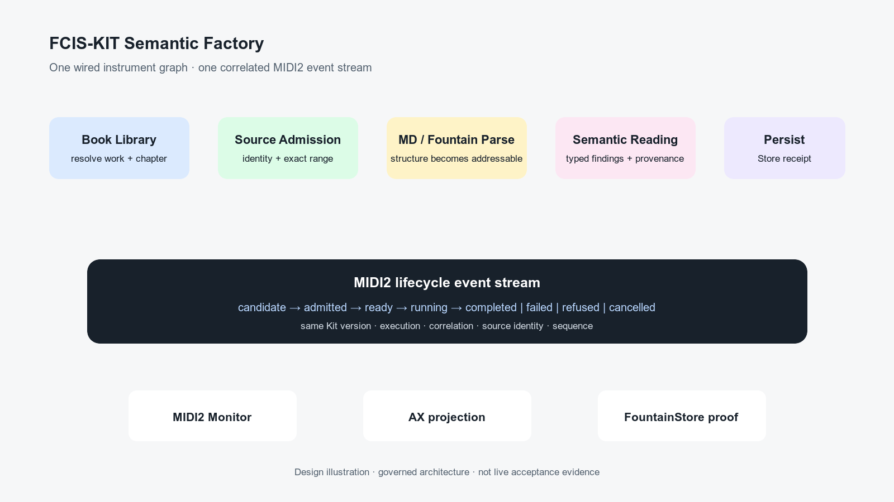

# FCIS-KIT Semantic Factory and the Wired Instrument Event Stream

> Chapter summary: The Semantic Factory is a versioned FCIS-KIT composition of source-grounded instruments. Its typed
> lifecycle is one shared MIDI2 event stream, observed by MIDI2 Monitor and persisted by FountainStore without either
> projection becoming a second authority.



*Principal illustration — a deterministic design illustration of the Kit boundary and event mirror. It is not live
acceptance evidence and does not claim that the external package, remote fetch, or monitor integration is complete.*

## Purpose

[Chapter 91](91-fcis-kit-instrument-store-is-the-capability-plane.md) establishes FCIS-KIT as the capability plane,
and [Chapter 93](93-instrument-creation-is-a-governed-promotion-path.md) establishes instrument creation as a
governed promotion path. [Chapter 86](86-apple-native-semantic-pipeline-is-one-midi2-graph.md), [Chapter
87](87-midi2-monitor-is-the-live-event-mirror.md), and [Chapter 102](102-semantic-inference-execution-session-and-latency-governance.md)
establish MIDI2 as the typed execution and live-event seam for semantic work. This chapter joins those decisions for
the Semantic Factory.

The Semantic Factory is not a visual metaphor and not a private Reframe coordinator. It is a reusable, external
FCIS-KIT composition whose instruments are wired by a declared contract and whose execution can be observed from
admission through durable result.

The governing distinction is:

```text
FCIS-KIT release
        ↓
declared instrument graph
        ↓
one correlated MIDI2 lifecycle stream
        ↓
MIDI2 Monitor · AX projection · FountainStore evidence
```

Reframe remains the host and mediation surface. The Kit owns reusable capability contracts. MIDI2 carries the
operational language. FountainStore proves durable behavior. The monitor mirrors what the backplane observed.

## The decision

The Semantic Factory is a first-class FCIS-KIT library, fetched as a pinned SemVer dependency and consumed through a
Reframe adapter. It is not implemented only as application-local helper code.

The first governed composition contains these conceptual instruments:

```text
Book Library resolution
        ↓
Source admission
        ↓
Markdown/Fountain structure parsing
        ↓
Semantic reading execution
        ↓
Reading persistence
```

The composition may later add Teatro scenography or another downstream projection, but it must not make a projection
an authority for source, uncertainty, or persistence.

## External Kit boundary and SemVer

The reusable package is owned and released by Fountain Coach under the FCIS-KIT instrument contract. Reframe pins an
exact released version and records that version in the execution and provenance evidence.

The Kit boundary contains:

- instrument identities and capability declarations;
- typed input, output, lifecycle, failure, and cancellation contracts;
- the composition graph and its compatibility rules;
- the event envelope and correlation requirements;
- version and provenance declarations;
- deterministic validation and test fixtures that do not contain private manuscript or Store data.

The Kit boundary does not contain:

- Reframe SwiftUI views or host-specific layout;
- FountainStore credentials, leases, or private documents;
- provider credentials or lane-selection policy;
- Copilot conversation state;
- source authority or an uncertainty authority;
- a second MIDI2 vocabulary;
- fabricated live receipts or acceptance claims.

SemVer has operational meaning:

| Change | Required version effect |
| --- | --- |
| Additive optional event field or capability | Minor release, with backward-compatible decoding |
| New instrument operation or optional graph edge | Minor release |
| Changed required field, lifecycle meaning, identity, or terminal predicate | Major release |
| Correctness fix with unchanged contract | Patch release |
| Renderer-only or host-only change outside the Kit contract | Host release, not a silent Kit change |

The consuming Reframe build records the exact package revision and resolved version. A floating branch, an unpinned
working copy, or a local package path is development evidence only; it is not a released Kit dependency.

## The wired instrument graph

The graph is a declared composition, not an opaque chain of callbacks. Every node has a stable instrument identity,
Kit version, input/output contract, and source-address policy. Every edge declares what it consumes and produces.

For the initial library-to-reading path:

```text
library.import
   │ published work identity, chapter selection
   ▼
source.admit
   │ source document, digest, exact range
   ▼
source.parse
   │ Markdown/Fountain structural units
   ▼
semantic.read
   │ typed movements, questions, and source-addressed results
   ▼
reading.persist
   │ Store receipt and coverage
```

An instrument may refuse an input that lacks the identity or evidence required by its contract. The graph must surface
that refusal at the named node. It must not silently skip a node, substitute a fixture, or present a downstream
projection as if the missing stage succeeded.

The graph is semantic rather than merely sequential: source identity, source range, session, execution, and
correlation travel across every edge. A stage may enrich the result, but it may not change the authority of the input
or erase its provenance.

## One typed MIDI2 event stream

The wired graph emits one event stream per admitted execution. Each event carries, at minimum:

- Kit identity and exact SemVer;
- instrument identity and operation;
- graph execution and correlation identity;
- parent run, session, and source identity;
- source range or an explicit reason that no range exists yet;
- lifecycle phase and monotonic sequence;
- event timestamp and telemetry fields;
- terminal classification where applicable;
- Store receipt reference once durable evidence exists.

The lifecycle is explicit:

```text
candidate → admitted → ready → running → completed
                                      ├→ cancelled
                                      ├→ refused
                                      ├→ timed_out
                                      └→ failed
```

`ready` means the named instrument and its dependencies are admitted and available. It does not mean that semantic
work has completed. `completed` requires the typed result and its required validation. Process existence, a rendered
card, a provider response, or a monitor colour is not a terminal predicate.

The stream is the operational mirror, not the durable authority. FountainStore persists the accepted lifecycle and
result. MIDI2 Monitor displays the observed stream. AX exposes the same state to the writer and to acceptance tooling.
No projection may infer a missing event from a later Store document or from the visual appearance of a downstream
surface.

## What MIDI2 Monitor must show

The monitor must stop presenting a generic fixed peer as the explanation for every execution. It remains a peer
surface, but the selected execution must expose the wired factory graph and its current node.

At minimum, the monitor shows:

1. the Kit name and exact SemVer;
2. the graph or instrument sequence;
3. the active instrument and lifecycle phase;
4. source, work, chapter, and range identity when admitted;
5. correlation, execution, session, and Store identities;
6. progress, refusal, cancellation, and failure at the exact node;
7. the terminal result and evidence state;
8. an AX representation with the same labels, values, and actions.

The monitor may use a compact top-down flow, a stage list, or another accessible projection. It may not reduce the
stream to colour rhythm, a generic “failed” label, or a peer card that hides which instrument failed.

The monitor's display is read-only with respect to semantic truth. Any retry, cancellation, or resume action is a
typed operation sent through the governed command boundary and is itself recorded in the same lineage.

## Library extension

The Semantic Factory begins before Storify. When the writer asks for a work or chapter, the Book Library instrument is
the first node in the same factory execution. The Reading Navigation factory projection and the MIDI2 Monitor must
therefore be able to show the library phase without pretending that a local fixture is the published source.

For a library-backed run, the minimum admitted identity is:

```text
library work → edition/source identity → chapter or bounded range → source digest
```

If library resolution fails, parsing and semantic reading are not “pending” in an ambiguous way; they are blocked by a
named upstream failure. If library resolution succeeds, the source receipt is the handoff evidence for the next node.

## Acceptance and promotion

The Kit is not released because its graph can be drawn. Promotion follows Chapter 93:

```text
intent → scenario → contract → implementation → build → execution
       → event evidence → Store proof → AX/monitor proof → admission → release
```

The bounded acceptance scenario must prove at least:

- the external SemVer package resolves from the declared release;
- every wired instrument emits its expected lifecycle events;
- the same correlation and source identity survive every edge;
- a library failure identifies the library node and prevents false downstream completion;
- a successful run persists the terminal result and coverage in FountainStore;
- MIDI2 Monitor and AX expose the same active and terminal state;
- replaying the stored event/result contract does not require provider access;
- no source text, uncertainty state, credential, or private Store data is published.

The scenario may establish the Kit's behavior only for its named build and exact dependency resolution. It does not
establish production deployment, external security review, or public release unless those separate gates pass.

## Relations inside the governance estate

This chapter is the Kit-and-observability bridge between the surrounding doctrine:

- [Chapter 91](91-fcis-kit-instrument-store-is-the-capability-plane.md) governs the FCIS-KIT capability plane.
- [Chapter 93](93-instrument-creation-is-a-governed-promotion-path.md) governs scenario-first creation, admission,
  release, and reuse.
- [Chapter 87](87-midi2-monitor-is-the-live-event-mirror.md) governs the monitor as a read-only live event mirror.
- [Chapter 102](102-semantic-inference-execution-session-and-latency-governance.md) governs execution sessions,
  terminal events, provenance, and comparable latency.
- [Chapter 99](99-decoupled-manuscript-instruments.md), [Chapter 100](100-semantic-scenographer.md), and [Chapter
  101](101-teatro-stage-engine-semantic-scenography.md) govern the downstream manuscript and Teatro projections.
- [Chapter 92](92-fountain-coach-publication-estate.md) governs the public estate in which this chapter is published;
  the corresponding public semantic edges are [Book](https://book.fountain.coach/),
  [Instruments](https://instruments.fountain.coach/), and [Status](https://status.fountain.coach/).

These are semantic edges, not claims that a sibling site, Kit release, or runtime execution is currently live. The
chapter route on `governance.fountain.coach` remains the authority for this rule.

## Ownership

| Boundary | Owns | Must not own |
| --- | --- | --- |
| FCIS-KIT Semantic Factory | reusable graph, typed contracts, SemVer, event envelope | Reframe UI, private Store, provider credentials |
| Reframe adapter | mediation, host state, source selection, AX binding | a second graph or second lifecycle vocabulary |
| MIDI2 | command, lifecycle, telemetry, and event transport | semantic source authority or durable proof |
| MIDI2 Monitor | live read-only event projection | inferred completion or rewritten event history |
| FountainStore | durable lifecycle, receipts, coverage, and evidence | transient visual state |
| Source View / Reading Navigation | readable source and semantic address navigation | factory completion claims |

## Rules

1. The Semantic Factory MUST be released as an external, exact-versioned FCIS-KIT dependency before it is claimed as a
   reusable library.
2. Every composed instrument MUST declare identity, version, input/output contract, lifecycle, and provenance rules.
3. Every execution MUST emit one correlated typed MIDI2 event stream across all wired instruments.
4. MIDI2 Monitor MUST expose the active instrument and exact stage of progress or failure; a generic peer fixture is
   not sufficient evidence.
5. Reading Navigation, AX, MIDI2 Monitor, and FountainStore MUST project the same execution lineage without creating
   competing authorities.
6. A downstream stage MUST NOT run or appear complete when a required upstream stage refused or failed.
7. A Kit release MUST preserve backward compatibility according to SemVer or publish a major-version migration.
8. Public publication MUST describe the Kit and its evidence boundary without exposing private source, Store data,
   credentials, or unestablished live claims.

## Governing sentence

The Semantic Factory is a SemVer-released FCIS-KIT composition whose wired instruments speak one correlated MIDI2
event stream; Reframe mediates it, MIDI2 Monitor makes it visible, FountainStore proves what became durable, and no
projection may become a second authority.
