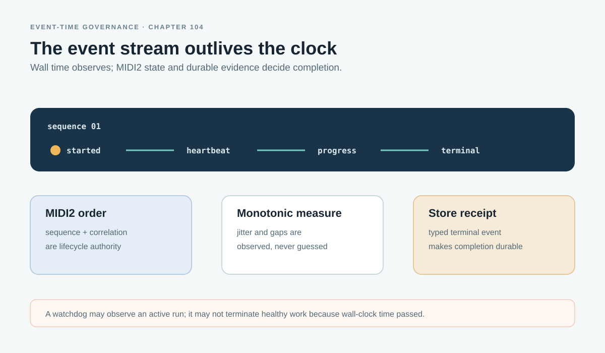

# MIDI2 Event Time, Jitter, and Asynchronous Completion Governance

> Chapter summary: Event-driven Reframe execution is ordered by the MIDI2 lifecycle, measured with a monotonic
> clock, and completed by a typed terminal event plus durable FountainStore evidence. A watchdog may observe the run;
> it may not terminate an active execution merely because wall-clock time has passed.



*Principal illustration — an ordered event spine, measured jitter, an observational heartbeat, and durable completion.
Design illustration; not live acceptance evidence.*

## Purpose

Reframe's semantic factory is an asynchronous instrument graph. It can wait for a library, parser, semantic lane,
or Store operation while MIDI2 carries lifecycle events and the writer continues to have an inspectable state. A
previous implementation mistake treated a wall-clock watchdog or page deadline as if it were completion authority.
That made a slow but healthy event stream look like failure and encouraged the runner to stop work that had not
reached a typed terminal state.

This chapter establishes the correction. The system must distinguish:

```text
event ordering       → MIDI2 correlation and sequence
elapsed measurement  → monotonic host time
jitter observation   → inter-event timing telemetry
completion           → typed terminal event + durable Store receipt
operator intervention→ explicit cancellation
```

Wall-clock time can describe when a human saw a message or when an alert was emitted. It is not the semantic authority
for an in-flight MIDI2 execution.

## The governing decision

Every event-driven execution remains alive until one of these things occurs:

- a valid typed terminal event is received and its result is durably recorded;
- the writer or governed operator explicitly cancels the execution;
- the transport or protocol produces a typed terminal failure;
- the Store cannot record the terminal result and emits the corresponding durable failure.

An elapsed-time threshold may emit a heartbeat, diagnostic alert, or request for inspection. It must not convert an
active execution into `timed_out`, `failed`, or `completed` by itself. A runner may stop waiting only after a terminal
event, explicit cancellation, or typed transport failure—not because a loop has waited “long enough.”

This is an asynchronous completion contract, not an invitation to wait without evidence. The event stream and Store
receipt make the waiting observable and resumable.

## Time has separate authorities

### MIDI2 event identity and ordering

The MIDI2 envelope is the ordering authority for the wired instrument graph. Each event must preserve the run,
session, source window, turn, operation, correlation, and sequence identity required by the IDL. Consumers order and
deduplicate by governed identity and sequence; they do not infer lifecycle from the prose of a log line or from the
order in which UI updates happen to render.

When an adapter receives an event from a native runtime that has no equivalent provider timestamp, the adapter attaches
the host's monotonic observation time for measurement. It must not invent a semantic event time or reorder the governed
MIDI2 sequence.

### Monotonic elapsed time

The host monotonic clock measures duration because it is not altered by wall-clock correction, sleep/wake calendar
changes, or timezone changes. Implementations record the monotonic instants needed to decompose the critical path:

```text
admitted → started → first event → producing → terminal event → Store durable
```

Those instants support latency, queue delay, and inter-event-gap measurements. They do not decide which source context
is semantically relevant, truncate output, or terminate a run.

### Jitter

Jitter is an observation of the event stream, not a second lifecycle. For a correlated sequence, the runtime may report
inter-event deltas, expected-versus-observed cadence, gaps, burstiness, and summary statistics such as median, tail,
and maximum deviation. The report must retain the sequence and correlation identity that made it measurable.

Jitter can explain why a run feels slow or why a transport is unstable. It cannot turn a valid late event into an
invalid result, and it cannot authorize a semantic fallback or a smaller answer.

### Wall-clock observation and heartbeat

Wall-clock timestamps remain useful for human-facing audit and cross-machine incident correlation. A configured
`watchdogSec`, page deadline, or similar interval is therefore an observation interval: it schedules a heartbeat or an
alert that says the execution is still awaiting its typed terminal event. Its name and UI copy must not imply that it
is a semantic completion deadline.

The heartbeat should expose, where available:

- last accepted MIDI2 sequence;
- time since the last event using the monotonic clock;
- current lifecycle stage;
- current run/session/window/turn identity;
- Store receipt state;
- whether cancellation is available.

## Completion, cancellation, and failure

The completion predicate is deliberately conjunctive:

```text
typed terminal MIDI2 event
        + exact identity and source-address match
        + validated result or explicit terminal outcome
        + durable FountainStore receipt
        = accepted terminal state
```

Process existence, an open socket, a partial assistant stream, a UI message, or a child-process exit is not completion.
Likewise, silence is not failure until the transport itself reports a typed failure or a writer explicitly cancels.

Cancellation is different from a watchdog alert. It is an authorized terminal action, recorded with its initiator,
reason, sequence, and Store receipt. A cancelled runtime may continue cleaning up; that cleanup does not turn the
cancelled operation into success.

Resume starts from durable evidence and the exact source address. It does not reconstruct terminal truth from a
screen, a log tail, or a guessed latest process. A late event after cancellation is retained as a late or rejected
event according to the IDL; it must not overwrite the terminal receipt.

## The factory and its event stream

Chapter 103's Semantic Factory is the concrete application of this rule:

```text
library resolution → source admission → structure parsing
        → semantic reading → reading persistence
                 ↓
          one correlated MIDI2 stream
                 ↓
       MIDI2 Monitor + AX + FountainStore
```

Every instrument in the composition emits lifecycle and telemetry through the same correlation lineage. A downstream
stage may wait asynchronously for an upstream event, but it may not claim completion while its required predecessor is
still unresolved. MIDI2 Monitor shows the live sequence and heartbeat; AX exposes the same state to the writer; and
FountainStore records the durable result. None of the three creates an independent timeout or completion authority.

The local lane and Codex app-server lane follow the same rule. Their native transports may have different latency and
jitter profiles, but a lane is not allowed to manufacture a different terminal predicate. Chapter 102's reusable
session boundary therefore remains valid: warm runtime is an optimization, isolated source-window context and typed
terminal evidence are integrity requirements.

## Implementation requirements

Implementations must:

1. model the run as an asynchronous event subscription or equivalent event-driven wait;
2. keep MIDI2 correlation and sequence identity through every factory stage;
3. use a monotonic clock for elapsed time and jitter telemetry;
4. treat watchdog intervals as heartbeat/diagnostic intervals only;
5. require typed terminal event, exact address binding, validation, and Store durability for success;
6. make explicit cancellation visible and durable;
7. preserve late, duplicate, out-of-order, and rejected-event evidence without rewriting terminal truth;
8. avoid semantic truncation, provider fallback, or lane substitution as a response to elapsed time;
9. expose last sequence, stage, heartbeat, jitter, and receipt state through MIDI2 Monitor and AX;
10. report timing decomposition and event-stream quality separately from semantic correctness.

No numeric budget, byte count, token count, or wall-clock threshold may decide semantic inclusion or output allowance.
Transport-required maximums remain physical provider constraints and must be surfaced as such, never disguised as
semantic completion rules.

## Acceptance contract

The governed acceptance sequence is:

1. validate the IDL event envelope and terminal predicates;
2. drive a deterministic fixture with deliberate long gaps and controlled jitter;
3. prove that heartbeat emission leaves the active execution alive;
4. prove that a typed terminal event plus Store receipt completes the same operation;
5. prove explicit cancellation and typed transport failure as distinct terminal outcomes;
6. prove duplicate, late, and out-of-order event handling without receipt corruption;
7. compare local and Codex transports using the same source address, executable provenance, MIDI2 ports, and Store
   evidence;
8. live-drive through AX, MIDI2 Monitor, window-ID evidence, and FountainStore;
9. report observed timings, jitter, and terminal evidence without presenting a diagnostic heartbeat as failure.

An acceptance snapshot is incomplete if it contains only process liveness, a screenshot, or a partially rendered
response. It must identify the terminal event and the durable receipt bound to the same run, session, window, turn,
source revision, and Store.

## Relationship to existing governance

[Chapter 102](102-semantic-inference-execution-session-and-latency-governance.md) defines the shared local/Codex
execution session, isolated source-window context, typed lifecycle, and decomposed latency path. This chapter refines
its timeout boundary: execution safety must not be implemented as an arbitrary wall-clock termination of a healthy
MIDI2 event stream.

[Chapter 103](103-fcis-kit-semantic-factory-and-wired-instrument-event-stream.md) defines the external SemVer FCIS-KIT
Semantic Factory and its one correlated wired event stream. This chapter defines how that stream is timed, observed,
cancelled, and completed.

[Chapter 87](87-midi2-monitor-is-the-live-event-mirror.md) governs the MIDI2 Monitor as a mirror rather than an
authority. [Chapter 88](88-codexkit-is-a-governed-codex-app-server-boundary.md) governs the app-server process and
typed transport boundary. [Chapter 07](07-scenario-first-development-and-evidence.md) and [Chapter
08](08-fountainstore-evidence-and-terminal-proof.md) govern scenario evidence and durable terminal proof.

## Governing sentence

MIDI2 sequence orders the work, monotonic time measures it, jitter explains its transport behavior, heartbeat observes
it, and only an explicit terminal event with durable FountainStore evidence completes it.
