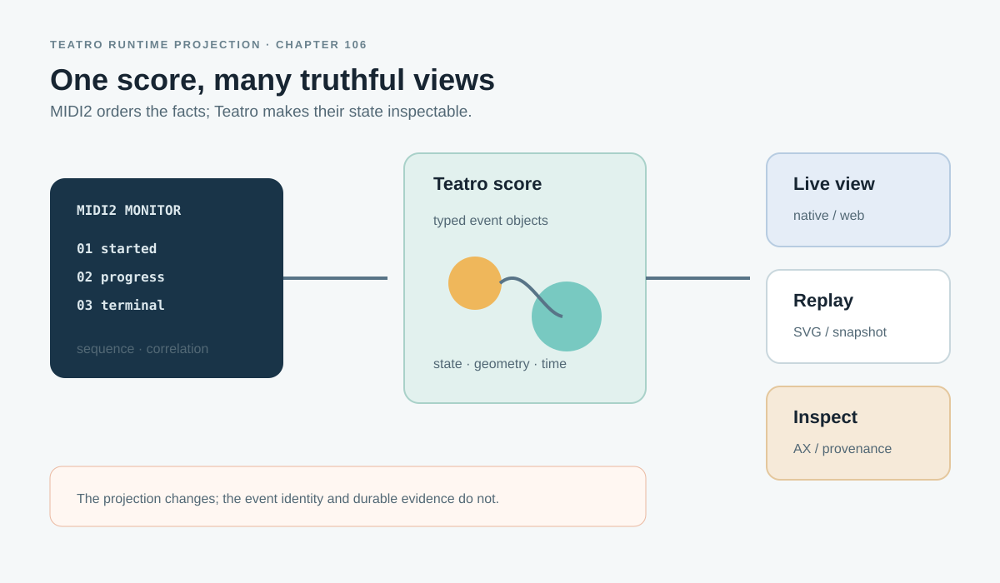

# Teatro MIDI2 Monitor — Canonical Runtime Projection

> Chapter summary: The MIDI2 Monitor becomes a truthful Teatro runtime projection of typed event facts. One versioned
> Teatro score serves live 3D, SVG, recording, replay, inspection, and later scenographic restaging without allowing
> Teatro or Semantic Scenographer to replace MIDI2 or FountainStore authority.



*Principal illustration — a design reference for a canonical runtime projection. It is not a live monitor capture and
does not claim that the illustrated participants, route, receipt, or witness exist in a running session.*

## Purpose

Chapter 87 establishes the MIDI2 Monitor as the live event mirror. Chapter 103 establishes one correlated wired
instrument stream. Chapter 104 establishes MIDI2 sequence and correlation as ordering authority and durable terminal
evidence as completion authority. The supplied Teatro brief defines the next architectural step: the monitor should
use Teatro as its spatial projection layer rather than leaving the event stream as a disconnected decorative card.

This is not a 3D dashboard. It is a deterministic projection of typed runtime facts into the Teatro scene model.
The same score must support an interactive host, an isometric or SVG document, recording, replay, inspection, and an
explicit handoff to Semantic Scenographer.

The governing distinction is:

```text
typed MIDI2 facts
        ↓
TeatroMIDIRuntimeProjection
        ↓
one versioned Teatro runtime score
        ├── interactive stage host
        ├── SVG / isometric document
        ├── recording and replay
        └── optional Semantic Scenographer restaging
```

The MIDI2 Monitor shows what the system is doing now. Semantic Scenographer may later restage what those facts mean.
Both use the same typed scene vocabulary, but they do not have the same authority.

## The decision

Create a dedicated, headless projection layer whose sole responsibility is converting typed MIDI2 runtime state into
a stable Teatro runtime score. It must be deterministic and testable without a renderer.

The conceptual boundary is:

```text
MIDI2 runtime facts → TeatroMIDIRuntimeProjection → Teatro scene/snapshot → host or document renderer
```

Teatro is the spatial representation. TeatroStageEngine remains the stage authority for geometry, constraints,
camera semantics, snapshots, and deterministic state evolution. MIDI2 remains authoritative for operation identity,
topology, lifecycle, routing, consent, timing, and terminal state. FountainStore remains authoritative for durable
receipts and persistence. The renderer is a projection, never a source of facts.

## Runtime score contract

The projection must preserve, where present:

- participant and peer identity, role, and local/remote status;
- discovered and negotiated capability state;
- instrument, invocation, correlation, route, and transport identity;
- consent or authorization state;
- lifecycle, progress, terminal, timestamp, and monotonic ordering facts;
- receipt, persistence, and independent witness state;
- replay time and projection version.

Its output is one stable score containing stage objects, relations or constraints, visible state, temporal markers,
semantic roles, selection metadata, and provenance pointers. The concrete types must be discovered in the owned Teatro,
MIDI2, FountainStore, and Reframe packages before naming a new API.

```text
TeatroRuntimeScore {
    version
    time
    objects
    relations
    provenance
}
```

This shape is conceptual, not permission to duplicate an existing canonical type.

## Versioned spatial grammar

The first grammar is explicit and deterministic:

### X axis — participants and topology

Horizontal separation represents stable participant identity and topology: local host, remote peer, external MIDI2
participant, cloud capability host, instrument surface, or persistence witness. Stable identities retain stable
placement for a session unless explicit runtime facts change the topology.

### Z axis — execution depth

Depth represents the mediation path: ingress/source, negotiation/mediation, capability execution, persistence/receipt,
and externally accepted witness where such a witness exists. This is a spatial encoding of typed execution phase, not
a decorative metaphor.

### Y axis — active state

Vertical displacement is used sparingly. Resting facts remain near the stage plane; active operations lift from it;
progress changes a bounded state property; terminal operations settle into receipt or persisted state. Failure remains
visible and inspectable rather than disappearing.

The grammar is versioned. A renderer may change appearance, but it may not change the meaning of an axis or state
without a projection-version change and compatibility evidence.

## Canonical runtime object roles

The initial roles are deliberately small:

- **Participant** — a concrete runtime participant with identity, role, transport facts, and provenance.
- **Instrument** — an addressable capability surface with ownership, availability, negotiation, and provenance.
- **Invocation** — an operation with invocation, correlation, source, target, lifecycle, progress, and terminal state.
- **Boundary** — a fact-backed authority or mediation boundary such as consent, remote/local, capability, or
  persistence. No boundary is created from visual inference.
- **Route** — a typed relation between participants, instruments, invocations, receipts, or witnesses. Arbitrary
  connector lines are not semantic relations.
- **Receipt** — a terminal or persisted result with its originating identity, status, timestamp, and Store state.
- **Witness** — an independent observation only when the runtime actually provides that fact. Missing witness data is
  not rendered as acceptance.

Every visible object is selectable. Its inspector exposes the exact runtime facts that created it, including role,
canonical ID, event IDs, correlation, lifecycle, timestamps, route, persistence, projection version, and whether it
belongs to the canonical runtime score or an interpretative score.

## Lifecycle as deterministic stage motion

The default motion follows typed lifecycle, never random animation:

```text
created → admitted → mediated → executing → progress → completed → persisted
```

Creation places an invocation at its source participant. Admission binds it to the command-plane field. Mediation
advances it through the recorded boundary. Execution attaches it to the target instrument. Progress changes the
declared bounded state. Completion establishes a terminal object state. Persistence creates or links the receipt.
Failure remains a terminal, inspectable state.

The monitor may animate the transition, but it may not infer a transition because an object moved, changed colour, or
disappeared.

## Live, replay, and semantic restaging

Live and replay consume the same score semantics. Replay must preserve IDs and provenance, support pause, resume, seek,
scrub, and inspection, and reproduce the same canonical geometry from identical ordered facts and projection version.
An event record or snapshot must retain enough provenance to return to the source runtime records.

Semantic Scenographer can consume canonical runtime facts or snapshots to produce an alternate Teatro score for
questions such as “Where does authority change hands?” or “Stage the latency problem.” Such a score must be visibly
interpretative and carry its source fact set, snapshot IDs, score identity, provenance, time, and model/tool identity
where available. The user must be able to return to the canonical live view immediately.

Interpretation never overwrites canonical topology, lifecycle, persistence, consent, timing, or witness state.

## Performance and truthfulness

The monitor must remain responsive under event load without weakening truth. The projection therefore requires:

- bounded update work per frame;
- semantically safe coalescing only;
- stable identity reuse and incremental updates;
- deterministic ordering;
- no dropped terminal or persistence transitions;
- preserved correlation identity;
- projection-lag telemetry;
- reduced motion or reduced geometry only as an explicit rendering fallback.

The following invariants require tests:

- an unconnected peer never appears connected;
- discovered never appears negotiated;
- admitted never appears completed;
- completed never appears persisted until persistence is observed;
- failed operations remain visible;
- missing transport or witness facts render as unknown, not invented;
- topology changes derive from explicit runtime facts.

## Acceptance order

Implementation proceeds in bounded phases:

1. discover current Reframe, MIDI2, FountainStore, Teatro, TeatroStageEngine, renderer, and replay types;
2. write and test the versioned headless projection contract;
3. prove deterministic mapping, stable identity, lifecycle, topology, provenance, failures, and replay equivalence;
4. render canonical fixture scores through the existing Teatro SVG/document path;
5. connect the same score to the approved interactive Teatro host;
6. integrate the score as the primary MIDI2 Monitor projection while retaining textual event detail as an inspector;
7. add replay and selection synchronization;
8. add Semantic Scenographer as an explicitly interpretative downstream consumer.

The fixture corpus must include idle local, negotiated remote, discovered-not-negotiated, successful, failed,
progressing, completed-not-persisted, persisted receipt, witnessed where supported, and concurrent multi-peer states.
Acceptance requires unit, determinism, replay, golden-scene, UI/AX, and sustained-event performance evidence.

## Relationship to existing governance

This chapter extends [Chapter 87](87-midi2-monitor-is-the-live-event-mirror.md) and [Chapter
103](103-fcis-kit-semantic-factory-and-wired-instrument-event-stream.md) without weakening their runtime-fact and
correlation authority. It applies [Chapter 104](104-midi2-event-time-jitter-and-asynchronous-completion-governance.md)'s
event-time and terminal-completion rules. It depends on [Chapter 101](101-teatro-stage-engine-semantic-scenography.md)
for stage authority and [Chapter 105](105-semantic-scenographer-one-spatial-thought.md) for the separation between
canonical runtime projection and interpretative spatial thought. [Chapter 08](08-validation-and-acceptance.md)
governs independent AX, window-ID, Store, and replay evidence.

## Governing sentence

The MIDI2 Monitor projects typed runtime facts into one versioned Teatro score whose objects remain traceable to their
events, while TeatroStageEngine owns stage semantics and Semantic Scenographer may restage only as an explicitly
labelled interpretation; no renderer may become runtime truth.
