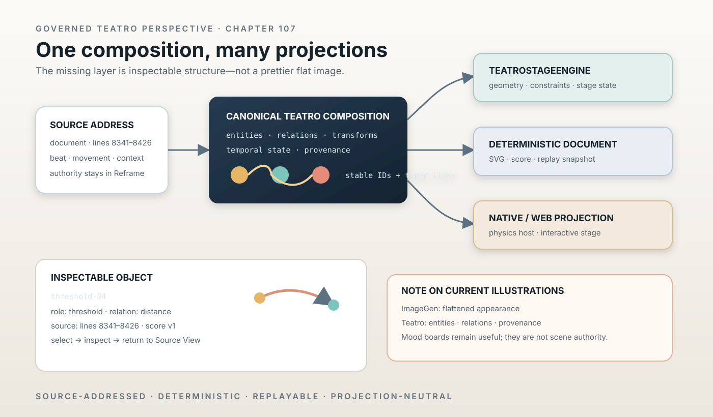

# Creating the Canonical Teatro Stage Composition Layer

> Chapter summary: Reframe's Semantic Scenographer needs a real Teatro stage composition boundary. This chapter governs the creation of the missing source-addressed scene model, its TeatroStageEngine adapter, deterministic projections, and the runtime evidence needed to replace the current placeholder grid.



*Principal illustration — a deterministic Teatro perspective on the missing composition layer. It is an architectural
projection, not a live stage capture, a generated image, or proof that the engine integration is complete.*

## Purpose

Chapter 100 established Semantic Scenographer as a source-grounded instrument for thinking with the work in space.
Chapter 101 established TeatroStageEngine as the stage authority. Chapter 106 established that one typed Teatro score
must be able to support live projection, SVG, replay, inspection, and later interpretation.

The local repositories now show the pieces clearly:

- Teatro provides rendering, Fountain parsing, storyboards, animation, MIDI2, and telemetry;
- LayoutKit provides a deterministic portable display-list scene;
- AnimationKit provides timelines and keyframes;
- Stage Native provides a physics-backed scene/runtime implementation;
- Teatro Stage Web provides a Three.js/Cannon projection and a backplane seam;
- the current Semantic Scenographer kit provides source addresses and a renderer seam.

The missing piece is the canonical composition layer that joins these parts without creating a second scene authority.

The governing distinction is:

```text
Reframe source address and admitted context
        ↓
Semantic scenographic proposal
        ↓
Canonical Teatro stage composition
        ↓
TeatroStageEngine state and geometry
        ├── Stage Native / physics
        ├── Teatro Stage Web / interactive projection
        ├── deterministic SVG / document projection
        └── replay and inspection
```

## A note on current illustrations

The existing chapter illustrations are not failures as editorial images. They successfully communicate mood,
sequence, or a conceptual boundary. Their failure is more specific: they are the wrong representation for the thing
we are now trying to govern.

Image generation produces a flattened visual answer. It does not provide, as a durable contract:

- stable object identity;
- typed relations between objects;
- exact source addresses;
- selectable provenance;
- deterministic geometry from a stored score;
- replayable state transitions;
- a distinction between canonical runtime facts and interpretation;
- a reverse path from a visual object to Source View, Lane View, MIDI2, or FountainStore.

That is why a generated illustration can look persuasive while still being unusable as a Semantic Scenographer
artifact. It shows an appearance, but it cannot be inspected as a composition.

The signature ImageGen illustrations in the preceding chapters must therefore retain their status as editorial or
design-reference projections. They must not be mistaken for Teatro scores, engine fixtures, live evidence, or
source-addressed scenography. This chapter changes the principal illustration practice for this architectural subject:
the illustration is itself a deterministic Teatro-style projection of declared objects and relations. ImageGen may
remain useful for mood boards or visual research, but it is downstream of—or outside—the canonical scene contract.

## The composition contract

The new layer must be headless, codable, versioned, and independent of any one renderer. Its output is a canonical
composition, not an SVG string and not a provider response.

```text
TeatroStageComposition {
    version
    stageIdentity
    sourceAddresses
    entities
    relations
    transforms
    temporalState
    projectionMetadata
    provenance
}
```

An entity has a stable identity, semantic role, source address, geometry or stage binding, visibility, and inspection
metadata. A relation is typed: trajectory, distance, containment, threshold, witness, boundary, or another admitted
scenographic relation. A transform is a proposal until the TeatroStageEngine accepts it as stage state. Every object
that can be rendered or selected retains its originating address.

The contract must support both 2D and 3D projections without making either projection authoritative. A normalized SVG
view, an isometric document, a native stage, and a future spatial display consume the same composition and may differ
only in projection and presentation.

## What must be created

### 1. A canonical source-addressed scene model

Create the smallest stable model that represents entities, relations, stage transforms, temporal state, provenance,
and projection version. It must be usable without a UI and must not contain manuscript text as a substitute for source
identity.

### 2. A TeatroStageEngine adapter

The adapter translates the canonical composition into the admitted TeatroStageEngine scene and state types. If the
engine lacks a required primitive, the gap is extended in the engine contract and implementation. Reframe must not
silently grow a private physics or scene engine inside the kit.

### 3. Projection adapters

Create deterministic adapters for:

- SVG and document output;
- Stage Native;
- Teatro Stage Web;
- accessibility and inspection metadata;
- replay and snapshot export.

The adapters may simplify geometry for their medium, but they may not invent semantic objects, collapse distinct
relations, or change source authority.

### 4. A semantic scenography compiler boundary

The AI-facing instrument returns a structured proposal in the composition contract. It does not emit raw SVG, Three.js
code, physics constants, or an image prompt as its primary result. A proposal can be revised, compared, persisted, and
rerendered without asking the model to reconstruct the scene from a picture.

### 5. Fixtures and reverse navigation

The fixture corpus must include figures, objects, fields, thresholds, trajectories, distance, void, and competing
variants. Each fixture must prove:

```text
source range → composition entity → rendered identity → inspector → source range
```

The same fixture must be renderable as SVG and loadable by the approved stage host. A selection must expose the same
identity through AX and return to the source address.

## Runtime and physics boundary

Stage Native and Teatro Stage Web already contain useful physics-oriented implementations. They are projections and
runtime consumers, not permission to let physics become literary meaning. Physics may resolve motion, constraints,
contacts, and state evolution after a composition has been admitted. It must not decide that a relation exists because
two bodies collided, or that a source claim exists because a body moved.

The canonical sequence is:

```text
source-grounded proposal
        ↓ admission
Teatro stage composition
        ↓ engine mapping
physics / animation state
        ↓ projection
SVG, native, web, replay, AX
```

If a stage engine is absent or a required engine primitive is only described in documentation, the acceptance state is
“composition contract established; engine integration pending.” A rectangular placeholder must not be presented as a
completed Teatro stage.

## Acceptance order

Implementation proceeds in this order:

1. inventory and pin the actual Teatro, Stage Native, Teatro Stage Web, LayoutKit, and AnimationKit types;
2. define the canonical composition schema and version it;
3. replace the Semantic Scenographer grid layout with a deterministic composition compiler;
4. add TeatroStageEngine mapping or explicitly record each missing engine primitive;
5. render the same fixture through SVG and one approved stage host;
6. prove source selection, provenance inspection, replay, and deterministic rerender;
7. connect MIDI2 runtime facts where the composition represents runtime state;
8. expose the result through the FCIS-KIT instrument contract and Reframe scenario acceptance.

The first release is not “an attractive scene.” It is a source-addressed composition that survives inspection,
revision, projection changes, and replay.

## Relationship to existing governance

This chapter extends [Chapter 100](100-semantic-scenographer.md), [Chapter 101](101-teatro-stage-engine-semantic-scenography.md),
and [Chapter 106](106-teatro-midi2-monitor-canonical-runtime-projection.md). It depends on [Chapter 87](87-midi2-monitor-is-the-live-event-mirror.md)
for runtime-event authority, [Chapter 104](104-midi2-event-time-jitter-and-asynchronous-completion-governance.md) for
event time and asynchronous completion, [Chapter 93](93-instrument-creation-is-a-governed-promotion-path.md) for
FCIS-KIT promotion, and [Chapter 08](08-validation-and-acceptance.md) for independent AX, window, Store, and replay
evidence.

## Governing sentence

The canonical Teatro stage composition is the inspectable bridge between Reframe's source-addressed spatial proposal
and Teatro's deterministic stage projections; it preserves identity, relation, provenance, and replay across SVG,
physics, native, web, and future renderers, while ImageGen remains an optional editorial projection rather than scene
authority.
