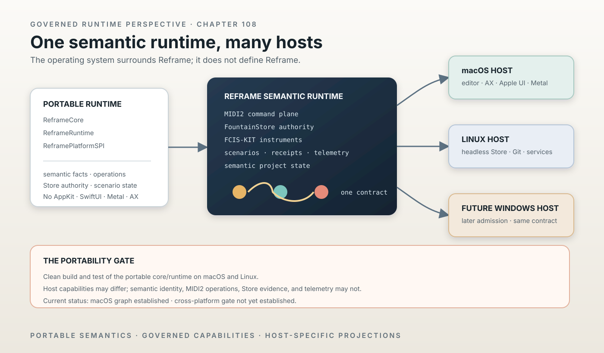

# Reframe Is a Swift-Native Cross-Platform Runtime

> Chapter summary: Reframe is governed as a portable Swift semantic runtime connected by the MIDI2 capability plane. macOS, Linux, and future platforms host and project that runtime; no operating-system application defines Reframe itself.



*Principal illustration — a deterministic Teatro-style architectural projection. The centre is the semantic runtime;
the surrounding host boxes are projections and services. The portability gate is shown as an acceptance condition,
not as completed evidence.*

## The decision

Reframe is no longer architected as a macOS application containing its capabilities. It is a Swift-native semantic
runtime whose capabilities participate through governed MIDI2 instruments. Operating systems provide hosts and
projections around that runtime.

```text
Reframe semantic/runtime core
        │
        ├── MIDI2 command plane
        ├── FountainStore
        ├── FCIS-KIT instruments
        ├── scenarios / receipts / telemetry
        └── semantic project state
                 │
          platform host boundary
          ├── macOS
          ├── Linux
          └── future Windows
```

macOS remains the primary rich writer-facing host. Linux becomes a first-class headless Reframe host, not merely
remote infrastructure. Windows may be admitted later without changing the semantic runtime contract.

This is an architectural constitution, not a claim that the current package has already reached this state.

## The portability boundary

The portable runtime must be divided from host and projection capabilities:

```text
ReframeCore
ReframeRuntime
ReframePlatformSPI
        │
        ├── ReframeMacHost       AppKit · SwiftUI · AX · Metal · WebKit · Keychain
        ├── ReframeLinuxHost     FountainStore · MIDI2 · services · headless operation
        └── ReframeWindowsHost   future admitted host
```

The names are architectural illustrations until the repository establishes them as products. The boundary is real
even before the names are.

`ReframeCore` and `ReframeRuntime` must not require AppKit, SwiftUI, Metal, Accessibility, WebKit, Foundation Models,
Keychain/Security, or other Apple-only frameworks. Host protocols and adapters own those dependencies. Portability
must not be achieved by scattering `#if os(...)` through semantic and runtime code; the dependency graph must make
the boundary visible.

The platform SPI is the narrow seam for services that cannot be portable by implementation: UI presentation,
accessibility, model execution, credential custody, graphics, file dialogs, and host lifecycle. A portable runtime may
ask an SPI for such a service, but it must remain executable, testable, and semantically meaningful when that service
is absent or replaced by a Linux implementation.

## Current implementation — inspected, not promoted

The live `apps/modernization-studio/Package.swift` currently declares:

```swift
platforms: [.macOS(.v14)]
```

Its target graph currently contains `ReframeCore`, `ReframeSharedRuntime`, `ReframeSharedUI`, and application targets.
`ReframeSharedRuntime` is rooted at `Sources/ReframeApp`, a tree that currently combines runtime code with SwiftUI and
AppKit-facing code. Its declared products include `FountainStudioEditorSwiftUI` and `FountainStudioEditorAppKit`.

The current source also shows platform-specific imports inside the presumed portable seams. Examples include:

- `Sources/ReframeCore/AppleLLMSessionPool.swift` and `ReframeAppleLLMClient.swift` using Foundation Models behind
  conditional compilation;
- `Sources/ReframeCore/ReframeClaimAudit.swift` and `ReframeProseScreenplayProjection.swift` importing
  NaturalLanguage;
- `Sources/ReframeCore/ReframeCredentialStore.swift` importing Security and carrying a direct Keychain seam; and
- `Sources/ReframeCore/ReframeImageModels.swift` importing CoreGraphics.

These are evidence-backed refactoring seams. Conditional compilation makes a file conditionally buildable; it does
not make the semantic core platform-neutral. The current package graph therefore does not yet establish the desired
portable boundary, Linux support, or Windows support.

The correct status is:

```text
macOS application graph       established
portable Reframe constitution governed here
clean macOS + Linux core gate not yet established
Windows host                  not admitted
```

## Runtime, host, and projection

The runtime owns semantic facts and governed capability execution:

- source and project identity;
- MIDI2 operations and correlated lifecycle;
- FountainStore authority and receipts;
- FCIS-KIT instrument admission and capability identity;
- scenario preparation, execution, evidence, and terminal proof;
- semantic project state, provenance, and telemetry.

The host owns the means by which a platform exposes that runtime:

- writer-facing editor and Copilot surface;
- Accessibility tree and input mediation;
- platform credential and privacy prompts;
- local process and service lifecycle;
- graphics, windows, display placement, and native rendering;
- platform-specific model or media frameworks.

The projection owns presentation, not meaning. Teatro follows the same rule: a portable semantic scene/stage contract
may be consumed by Metal, SVG, web, or a future GPU renderer, but no renderer becomes the stage or source authority.
Chapters 100, 101, 106, and 107 remain binding for this boundary.

## Distributed Reframe

Cross-platform does not mean reproducing the entire macOS application on every platform. A Reframe installation is the
set of admitted capabilities participating in one governed semantic system.

```text
Mac
editor / AX / Apple UI / Metal
        │
        │ MIDI2
        ▼
Linux
FountainStore / Git / publishing /
remote instruments / persistent services
```

An instrument may execute on the local Mac, on a Linux host, or on another admitted Reframe host. Its location is a
runtime fact carried by the capability contract, not a change in semantic identity. The same contract, permissions,
evidence lineage, telemetry, and project semantics remain in force.

Remote execution is not automatically trusted execution. Admission, consent, source scope, data movement, credential
custody, timing, failure, recovery, and durable receipt remain explicit. Chapter 81's MIDI2 command plane is the
common operational boundary; Chapter 71's software-peer topology remains a conformance topology; Chapter 95's
headless Linux authority remains the persistence boundary.

## First acceptance invariant

The first concrete portability gate is deliberately narrow:

> The portable Reframe core and runtime build and test from clean state on both macOS and Linux.

This is not currently true and must not be reported as true because a macOS build passes or because a target contains
`#if canImport(...)` guards.

Acceptance requires:

1. a target graph that identifies the portable products and their platform-neutral dependencies;
2. a clean macOS build and test of those products from the committed manifest and resolved revisions;
3. a clean Linux build and test of the same portable products from the committed manifest and resolved revisions;
4. no Apple-only import or product in the portable targets;
5. host adapters that compile only in their admitted platform targets;
6. identical MIDI2 operation, lifecycle, Store, scenario, provenance, and telemetry semantics across both hosts; and
7. explicit negative evidence for any capability intentionally unavailable on Linux.

The gate is a prerequisite for calling Reframe cross-platform. It does not require the rich macOS editor, AX surface,
Metal renderer, Foundation Models, or WebKit composer to exist on Linux.

## Refactoring rules

1. Semantic models, operation contracts, Store authority, scenario types, and runtime state move toward portable
   products first.
2. Platform services are expressed as protocols in `ReframePlatformSPI`; implementations live in host products.
3. A host adapter may be unavailable, degraded, or headless, but it may not silently alter semantic authority.
4. `#if os(...)` is permitted at a host boundary or narrow compatibility shim; it is not a portable-runtime design.
5. Every extracted target must have a clean build/test path and an explicit dependency-graph review.
6. A capability remains an FCIS-KIT/MIDI2 instrument when moved between hosts. Location does not create a second
   capability identity or command vocabulary.
7. A Linux host must be able to operate without AppKit, SwiftUI, Accessibility, Metal, WebKit, Foundation Models,
   Keychain, or a graphical session.
8. Windows remains a future host decision. No Windows support is implied by making the core portable.
9. The first migration slice must preserve the existing Reframe Store, scenario, receipt, telemetry, and peer
   evidence authorities while moving implementation behind the new boundary.

## Commercial surface

This decision changes Fountain Coach's reusable commercial surface from one macOS application toward a common runtime
capable of supporting:

- Reframe end-user products;
- persistent Linux deployments;
- FCIS-KIT instruments;
- hosted or institutional deployments; and
- additional Fountain Coach applications built over the same runtime.

This chapter makes no valuation, market-size, revenue, or investor claim. It governs only the architectural fact that
multiple products and deployment models may share one maintained runtime.

## Acceptance and release discipline

Portability is a release claim only after the first invariant and the relevant host evidence pass. The evidence must
identify the source revision, package lock/resolved revisions, portable targets, host targets, build commands, test
results, and any intentionally unavailable capabilities.

The following are separate claims and must not be conflated:

- the architecture permits a Linux host;
- the portable targets compile on Linux;
- a Linux host runs a selected capability;
- a capability executes remotely through MIDI2;
- a Store receipt proves the result; and
- a named cross-platform release is available.

Chapter 93 governs creation and promotion of the extracted instruments. Chapter 91 governs the FCIS-KIT capability
plane. Chapter 77 governs the Swift/MIDI2 scenario runtime. Chapter 92 governs public publication. None of those
chapters turns a candidate split or a successful local build into a released cross-platform runtime.

The public estate carries the corresponding projections: [Fountain Coach](https://fountain.coach/) is the estate
identity, [Governance](https://governance.fountain.coach/) is the authority for this chapter,
[MIDI2](https://midi2.fountain.coach/) is the machine-readable command-plane publication,
[Instruments](https://instruments.fountain.coach/) is the admitted capability catalog,
[Book](https://book.fountain.coach/) is the writer-facing reference, and
[Status](https://status.fountain.coach/) is the operational and legal context. These projections are linked
references, not alternate runtime or release authorities.

Chapter 109, [NaturalLanguage Measurement Is a MIDI2 Instrument](109-natural-language-measurement-is-a-midi2-instrument.md), applies this portability boundary to the first host-provided semantic measurement capability.

## Relationship to existing governance

This chapter extends Chapter 81, [The Universal MIDI2 Command Plane](81-universal-midi2-command-plane.md), by making
the command plane the cross-host operational boundary. It applies Chapter 77, [The Scenario Runtime Is Swift and
MIDI2-Native](77-swift-midi2-scenario-runtime.md), to portable runtime products and Chapter 71, [Reframe-to-Reframe
Software-Peer Acceptance](71-reframe-to-reframe-software-peer-acceptance.md), to host conformance. It depends on
Chapter 91, [The FCIS-KIT Instrument Store Is the Capability Plane](91-fcis-kit-instrument-store-is-the-capability-plane.md),
and Chapter 93, [Instrument Creation Is a Governed Promotion Path](93-instrument-creation-is-a-governed-promotion-path.md),
for capability identity and promotion. Chapter 95, [FountainStore Is the Headless Linux Persistence Authority](95-fountainstore-headless-linux-authority.md),
defines the Linux persistence role. Chapters 100, 101, 106, and 107 govern the Teatro and Semantic Scenographer
projection boundary. Chapter 08 governs the evidence required to distinguish current implementation, candidate
refactoring, acceptance, and release.

## Governing sentence

Reframe is a portable Swift semantic runtime connected by its governed MIDI2 capability plane; macOS, Linux, and future
platforms host and project that runtime, but no operating-system implementation defines Reframe itself.
