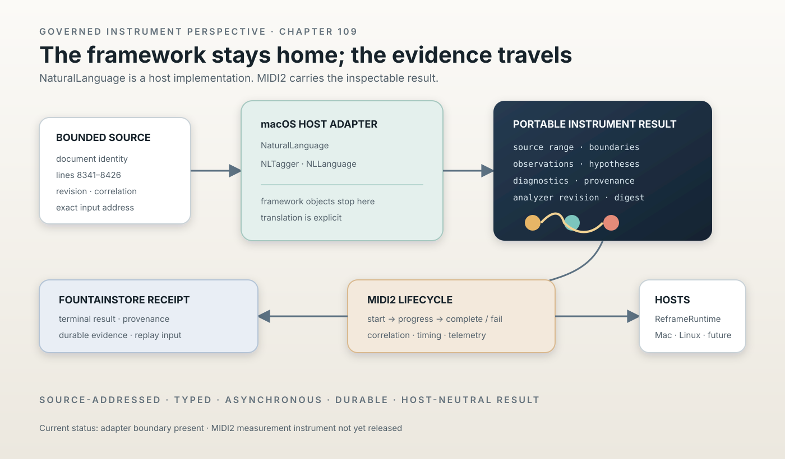

# NaturalLanguage Measurement Is a MIDI2 Instrument

> Chapter summary: macOS NaturalLanguage is an implementation resource, not a Reframe authority. Its source-addressed evidence crosses the governed MIDI2 plane as a typed instrument result, is persisted by FountainStore, and can be consumed by any admitted Reframe host.



*Principal illustration — a deterministic Teatro-style architecture projection. The framework remains inside the
macOS adapter; only the structured, source-addressed result crosses the portability boundary.*

## The decision

NaturalLanguage measurement is a capability of the Reframe semantic system, not a private call hidden inside a
macOS application. macOS may use Apple's `NaturalLanguage` framework to measure source material, but the result must
be expressed as a governed, source-addressed MIDI2 instrument operation.

```text
source identity + bounded range
              ↓
macOS NaturalLanguage adapter
              ↓
portable evidence result
              ↓
MIDI2 command / lifecycle / telemetry
              ↓
FountainStore receipt
              ↓
ReframeRuntime and admitted hosts
```

The framework is replaceable. The evidence contract is not.

## What the instrument does

The first instrument is deliberately a measurement instrument. It may report:

- UTF-16 source ranges and stable boundaries;
- paragraph, sentence, and word coordinates;
- observed names, lexical classes, and lemmas;
- language hypotheses and confidence values;
- quotation spans and other declared observations;
- analyzer revision and diagnostics; and
- the exact source identity and range measured.

It does not decide what the work means, promote an observation into a canonical fact, create a reading, or replace
the source. A tagger observation remains an observation. A confirmed identity remains a Gazetteer fact. A model
interpretation remains a later semantic operation.

## Instrument identity and operations

The capability is admitted under one stable FCIS-KIT identity, for example:

```text
reframe.semantic.measurement.instrument@1.0.0
```

Its operation vocabulary is small and typed:

```text
semantic.measure.start
semantic.measure.progress
semantic.measure.complete
semantic.measure.fail
semantic.measure.cancel
```

The exact identifier is established by the MIDI2/FCIS-KIT contract before release. These names are architectural
illustrations until the repository's IDL and generated registry establish them.

Every request carries a source document identity, bounded source range or whole-source declaration, operation
version, instrument version, correlation identity, idempotency identity, and requested analyzer profile. A response
must carry the same source identity, measured range, analyzer revision, result digest, and terminal classification.

## MIDI2 is the result boundary

MIDI2 is not being used as a decorative notification channel. It is the operation and lifecycle boundary:

```text
start → measuring → progress* → complete
                         ↘ fail
                         ↘ cancel
```

The stream must preserve correlation, ordering, asynchronous completion, cancellation, elapsed time, jitter, and
resource telemetry according to Chapters 81, 87, 103, and 104. A local function return is not an execution receipt.
A peer acknowledgement is not semantic completion. The terminal event and durable Store receipt establish what
happened.

The MIDI2 Monitor may project the live stream. It must show the actual instrument and stage, not a generic peer or a
handwritten “NaturalLanguage ready” message.

## Portable result contract

The result that leaves the host uses portable values only:

```text
MeasurementResult {
    sourceDocumentID
    sourceRevision
    measuredRange
    boundaries[]
    observations[]
    languageHypotheses[]
    diagnostics[]
    analyzerRevision
    resultDigest
    provenance
}
```

No `NLTagger`, `NLLanguage`, `NSRange`, framework object, credential, prompt, or host pointer crosses the instrument
boundary. A host may internally use those objects and translate them into this contract.

## Host adapters

The macOS implementation owns the Apple framework:

```text
ReframePlatformSPI
        │
        └── ReframeMacHost
              └── NaturalLanguage adapter
```

A future Linux implementation may use another linguistic engine, a compatible service, or an explicit unavailable
result. It may not silently claim Apple-equivalent analysis. Differences in analyzer revision, language support,
or confidence must remain visible in the result and telemetry.

This rule prevents `#if os(...)` from spreading through semantic/runtime code. Host code translates host facts into
the portable result; the runtime consumes the result without importing the framework.

## Authority separation

The authorities remain distinct:

| Authority | Establishes | Does not establish |
| --- | --- | --- |
| Source View | exact source text | linguistic meaning |
| NaturalLanguage adapter | host-local measurements | canonical identity or story truth |
| MIDI2 | operation and lifecycle | durable semantic history |
| FountainStore | persisted result and receipt | visual presentation |
| MIDI2 Monitor | live event projection | inferred completion |
| Reframe reasoning | interpretation and next operation | alteration of measured evidence |

The instrument may feed Storify Source Auto, Gazetteer candidates, claim audits, and Semantic Scenographer context.
Those consumers must retain the evidence's source address and analyzer provenance. None may rewrite the measurement as
if it were a source fact.

## Acceptance

The instrument is not accepted because a macOS call returns an array. Acceptance requires:

1. a registered FCIS-KIT identity and MIDI2 operation contract;
2. exact source identity and bounded-range preservation;
3. portable Codable/Sendable result values with no Apple framework objects;
4. correlated asynchronous lifecycle events, including failure and cancellation;
5. monotonic event-time and resource telemetry where claimed;
6. FountainStore persistence of the terminal result and provenance;
7. MIDI2 Monitor projection of the actual operation;
8. repeatable result digest for the same source, range, analyzer revision, and instrument version;
9. negative tests for missing, stale, replayed, and mismatched source identity; and
10. a host test proving macOS translation plus a portable-runtime test that never imports NaturalLanguage.

Only after these pass may the capability be called implemented, live-accepted, or released. The terms remain separate
under Chapters 08, 91, 93, and 108.

## Current implementation — inspected, not promoted

The repository currently contains NaturalLanguage-backed source linguistics, prose projection, claim audit, entity
ledger, and semantic measurement code in the Reframe application graph. `ReframePortable` now defines the first
host-neutral SPI/runtime boundary, and `ReframeMacHost` contains an adapter surface. The existing measurement path
has not yet been migrated to the MIDI2 instrument contract described here.

Therefore the current status is:

```text
portable SPI/runtime seam       implemented and focused-tested
macOS NaturalLanguage adapter   present as a host boundary
typed measurement instrument    not yet implemented
MIDI2 terminal evidence         not yet established for this instrument
Linux equivalent                not admitted
released capability             not claimed
```

This status is deliberate. The chapter governs the next implementation boundary; it does not turn the adapter or a
successful unit test into a released instrument.

## Relationship to existing governance

Chapter 86, [The Apple-Native Semantic Pipeline Is One MIDI2 Graph](86-apple-native-semantic-pipeline-is-one-midi2-graph.md),
places measurement before semantic interpretation. Chapter 81, [The Universal MIDI2 Command Plane](81-universal-midi2-command-plane.md),
governs the typed operation boundary. Chapter 87, [The MIDI2 Monitor Is the Live Event Mirror](87-midi2-monitor-is-the-live-event-mirror.md),
governs live projection. Chapter 91, [The FCIS-KIT Instrument Store Is the Capability Plane](91-fcis-kit-instrument-store-is-the-capability-plane.md),
and Chapter 93, [Instrument Creation Is a Governed Promotion Path](93-instrument-creation-is-a-governed-promotion-path.md),
govern identity, admission, and release. Chapters 103 and 104 govern the correlated event stream and asynchronous
event time. Chapter 108, [Reframe Is a Swift-Native Cross-Platform Runtime](108-reframe-is-a-swift-native-cross-platform-runtime.md),
governs the platform boundary this instrument crosses. Chapter 08 governs the evidence distinction between current
implementation, acceptance, and release.

The public estate remains linked through [Fountain Coach](https://fountain.coach/),
[Governance](https://governance.fountain.coach/), [MIDI2](https://midi2.fountain.coach/),
[Instruments](https://instruments.fountain.coach/), [Book](https://book.fountain.coach/), and
[Status](https://status.fountain.coach/). These are semantic publication edges, not evidence that this instrument
has been admitted or released.

## Governing sentence

NaturalLanguage may measure on a host, but only its source-addressed structured evidence crosses Reframe's governed
MIDI2 instrument boundary; FountainStore proves the durable result, and no host framework becomes semantic authority.
