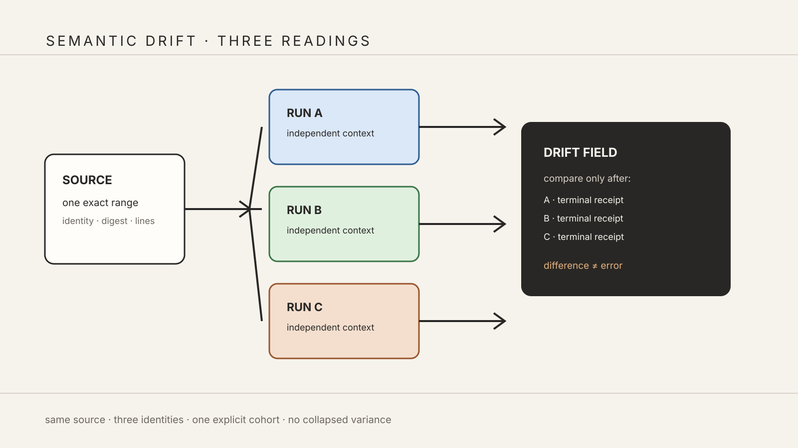

# Three-Run Semantic Drift Is a Governed Measurement Principle

> Chapter summary: A semantic drift claim requires exactly three independent concurrent readings of the same source-addressed material. The three results remain distinct, and drift is calculated only after all three have reached typed terminal receipts.



*Principal illustration — a deterministic Teatro-style architecture projection. It describes the governed three-run cohort and does not claim that the current runtime has already completed one.*

## The decision

Two readings can be compared. They cannot establish a semantic drift field.

Reframe therefore treats three concurrent, independently identified readings as the minimum governed cohort for semantic drift calculus. The number three is not a tuning preference or a convenient test fixture. It is the smallest cohort that can expose a center, a direction, and an outlying interpretation without collapsing difference into a binary disagreement.

The governing shape is:

```text
one exact source address
          │
          ├── run A ── terminal result A ─┐
          ├── run B ── terminal result B ─┼── drift calculus
          └── run C ── terminal result C ─┘
```

The calculus describes variation among readings. It does not decide which reading is true, and it does not rewrite the source.

## What “three concurrent runs” means

The cohort is one explicit semantic operation with three child executions. Each child receives the same admitted source document identity, bounded source range, source digest, and semantic context. Each child receives an independent execution identity and may have a distinct lane, model, analyzer revision, or isolated context when the scenario explicitly declares that variation.

Concurrency is an execution property, not a permission bypass. A single writer confirmation may authorize a declared three-run cohort only when the confirmation surface says that three readings will be started and names the cost and provider consequences. Three separate accidental confirmations are not a cohort.

The operation must preserve:

- one cohort identity;
- exactly three child execution identities;
- one source identity and range shared by all children;
- one MIDI2 correlation family with distinct child correlations;
- one durable Store receipt per child and one cohort receipt; and
- a clear terminal state for every child.

The existing one-shot confirmation rule remains in force. A repeated `/confirm` consumes no additional child slot. An ordinary duplicate `/storify` request is not silently promoted into a drift cohort.

## Drift is a result of difference, not a failure

The three readings may agree, partially overlap, or diverge. All three outcomes are meaningful:

```text
agreement       → a stable shared reading is visible
two-with-one    → a majority and an outlier are visible
three-way drift → no majority is promoted; the field stays plural
```

The drift result may include distances, shared and divergent source references, movement-set differences, uncertainty differences, and provenance differences. It must retain the underlying three results so the writer can inspect the basis of every derived value.

Drift must never be represented as a scalar confidence score alone. A number without the three source-addressed results would hide the very variation the instrument exists to reveal.

## Lifecycle and asynchronous completion

The cohort and all child runs travel through the governed MIDI2 lifecycle. MIDI2 sequence and correlation identify ordering; MIDI event time and jitter measure delivery; FountainStore persists the receipts. A heartbeat is evidence of observation, not completion.

The cohort reaches `succeeded` only when:

1. all three children have typed terminal results;
2. all three results carry the exact admitted source identity and range;
3. each child has a durable result receipt and provenance record;
4. the drift artifact records all three child identities and the comparison method; and
5. the parent cohort terminal event and Store receipt agree.

If one child fails, is canceled, or never reaches a terminal event, the cohort is incomplete. Reframe may preserve partial results for diagnosis, but it must not publish a complete drift calculation or silently substitute a fourth run.

No wall-clock watchdog, token budget, UI spinner, or transcript line can satisfy these predicates.

## Source authority and semantic boundaries

Source View remains the authority for the manuscript. NaturalLanguage, Storify, Codex, UncertaintyScoreKit, and any other admitted semantic instrument produce observations or interpretations addressed to that source. Teatro may project the three results as a spatial drift field, but its geometry is a projection of the retained results, not a new semantic authority.

The drift instrument may report that three readings differ. It may not convert that difference into a fact about the author, the manuscript, or the world without a separate governed act.

## Evidence and reproducibility

A reproducible cohort is defined by:

```text
source identity + source digest + source range
+ semantic context digest
+ cohort identity and child execution identities
+ lane/model/analyzer provenance
+ instrument version + calculus version
+ MIDI2 lifecycle trace + FountainStore receipts
```

Rerendering or recalculating from the stored three results must preserve the same cohort membership and derived values. A later rerun is a new cohort, never an overwrite of the earlier one.

## Acceptance contract

The first executable scenario for this principle must prove:

- one explicit writer-facing cohort request;
- exactly three child starts admitted concurrently;
- no duplicate child from repeated confirmation;
- distinct MIDI2 correlations and Store receipts for A, B, and C;
- all three results bound to the same source address;
- a parent drift receipt retaining all three results;
- terminal success only after the third child terminal event; and
- visible incomplete evidence when any child is interrupted.

The scenario must count child identities and terminal receipts from FountainStore and MIDI2, not infer them from conversation text or colored UI fields. A two-run comparison remains a valid separate capability, but it is not semantic drift calculus.

## Relationship to the existing constitution

This chapter extends [Chapter 73](73-reframe-scenario-development-cycle.md)'s scenario unit with a cohort-level terminal predicate and [Chapter 75](75-scenario-run-ownership-and-non-interference.md)'s ownership rule with explicit parallel child ownership. It applies [Chapter 102](102-semantic-inference-execution-session-and-latency-governance.md)'s execution-session boundary to three isolated semantic executions and [Chapter 104](104-midi2-event-time-jitter-and-asynchronous-completion-governance.md)'s MIDI2 event-time and asynchronous-completion rules.

[Chapter 103](103-fcis-kit-semantic-factory-and-wired-instrument-event-stream.md) governs the FCIS-KIT factory that may compose the cohort, while [Chapter 106](106-teatro-midi2-monitor-canonical-runtime-projection.md) governs the MIDI2-to-Teatro projection of its event stream. [Chapter 109](109-natural-language-measurement-is-a-midi2-instrument.md) defines one host-provided measurement instrument that may participate in a cohort; it does not define drift by itself.

## Governing sentence

Semantic drift is established only by one explicitly authorized cohort of exactly three concurrent, source-addressed and independently receipted readings; Reframe preserves their differences and calculates a drift field only after all three typed terminal results agree with their durable evidence.

