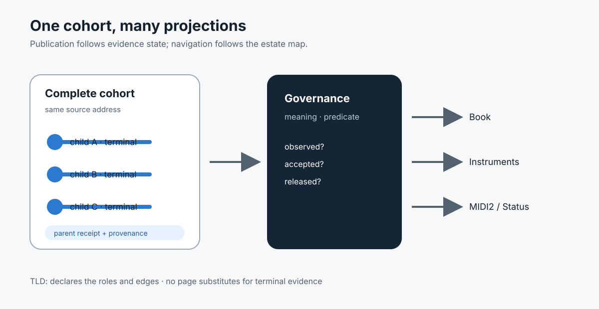

# Evidence Cohorts Are the Publication Units of the Fountain Coach Estate

> Chapter summary: The estate publishes governed evidence cohorts, not isolated screenshots, prose claims, or links. The TLD declares the publication map, Governance defines the meaning of evidence, and the Book projects only the sanitized human interpretation of a complete, source-addressed acceptance cohort.



*Principal illustration — a deterministic Teatro-style architecture projection. It defines the publication relationship; it is not live acceptance evidence.*

## The decision

The Fountain Coach estate must publish from governed evidence units rather than from pages assembled independently.

The publication unit is an evidence cohort: a bounded, source-addressed set of execution records whose acceptance predicate is explicit, whose terminal state is durable, and whose public projection can be sanitized without changing its meaning.

For a three-run semantic-drift measurement, the cohort contains the parent execution and exactly three independently identified child executions. A screenshot, a progress message, a single receipt, or a Book paragraph cannot stand in for that cohort.

The governing flow is:

```text
source + declared scenario
          │
          ▼
complete governed evidence cohort
          │
          ├── Governance: meaning and acceptance predicate
          ├── Book: human interpretation and evidence projection
          ├── Instruments: admitted capability contract
          ├── MIDI2: transport and event vocabulary
          └── Status: operational/public context
          │
          ▼
TLD estate map: where each projection belongs
```

The root domain is the estate map. It is not an additional evidence authority.

## Top-down publication and bottom-up proof

Publication is declared top-down and verified bottom-up.

The TLD declares the identity and role of each public domain. Governance declares what a claim means and what evidence is sufficient. A capability or scenario then produces its durable evidence. Each specialized domain projects only the part of that evidence appropriate to its role. The final deployment verifies the complete chain again.

```text
declare role       → fountain.coach
define rule        → governance.fountain.coach
produce evidence   → Reframe / MIDI2 / FountainStore
project meaning    → book.fountain.coach and siblings
verify deployment  → estate-wide acceptance
```

Top-down navigation must not be mistaken for top-down truth. Truth still comes from the governed runtime and durable receipts.

## Evidence cohort contract

Every published acceptance claim MUST identify:

- the scenario and capability identity;
- the source identity, bounded source range, and source digest where source material is involved;
- the cohort identity and all child execution identities;
- the declared acceptance predicate and terminal state;
- the relevant MIDI2 correlations and event-time boundary;
- the durable FountainStore receipt or sanitized receipt reference;
- the executable/source revision and instrument versions; and
- the public claim boundary: observed, designed, pending, or released.

The public projection may redact private paths, credentials, manuscript text, and operational identifiers. Redaction may reduce exposure; it may not remove the identity or state needed to understand what was proven.

For Chapter 110, publication eligibility requires all three child terminal results and the parent cohort receipt. A partial cohort may be published only as an explicitly incomplete diagnostic record. It may not be labelled semantic drift acceptance.

## Estate roles

| Domain | Publication responsibility | It must not become |
| --- | --- | --- |
| `fountain.coach` | identity, lineage, estate map, and publication roles | runtime or acceptance authority |
| `governance.fountain.coach` | reviewed rules, predicates, boundaries, and architectural decisions | proof that implementation has passed |
| `book.fountain.coach` | human-readable interpretation of governed scenarios and evidence | a second governance source or private Store mirror |
| `instruments.fountain.coach` | admitted FCIS-KIT/MIDI2 capability contracts and sanitized snapshots | unrestricted live-capability claims |
| `midi2.fountain.coach` | transport/schema vocabulary and machine-facing documentation | evidence of a particular execution |
| `status.fountain.coach` | operational, company, and public context | technical acceptance or semantic authority |

Every generated page must carry its domain role, publication state, canonical identity, estate navigation, and claim boundary. A sibling link proves discoverability only; it never proves the linked claim.

## The Book changes role under this principle

The Book is not updated whenever a governance chapter changes. It is updated when a sanitized human projection can be derived from an evidence cohort or when it is deliberately publishing a design/governance explanation labelled as such.

The Book publication manifest must distinguish at least:

```text
designed           → governance explains the intended behavior
executable         → the repository can prepare or run the scenario
live-accepted      → the complete acceptance cohort is evidenced
released           → a named release manifest includes the capability
```

For cohort-based capabilities, the manifest must retain the cohort cardinality, child identities, terminal predicate, evidence status, and source revision. A generic label such as “three-run evidence” is insufficient if the underlying record does not prove three admitted children.

The Book may explain Chapter 110 before its scenario is live-accepted, but it must say that the explanation is governance/design material and must not place the capability in the live-accepted or released allow-list.

## Cross-domain linking

Cross-links are semantic edges, not decorative navigation.

At minimum:

- the TLD links each domain with its declared role;
- Governance links to the Book’s human projection when one exists;
- the Book links to the governing chapter and the sanitized evidence record;
- Instruments links to the Book for interpretation and Governance for admission rules; and
- each projection identifies the source revision and publication state it represents.

If the target projection does not yet exist, the source may link to its domain landing page or state that the projection is pending. It must not invent a deep link or imply that a missing projection is accepted.

## No claim promotion by publication

Building a page, deploying a page, or linking a page does not promote a claim.

Promotion requires the corresponding evidence state:

```text
design document       ≠ executable scenario
executable scenario   ≠ live acceptance
live acceptance       ≠ named release
named release         ≠ unrestricted product promise
```

The same distinction applies to illustrations. A Teatro-style or image-generated illustration can explain structure and orientation, but it cannot satisfy an execution predicate or serve as a substitute for Store, MIDI2, AX, or window-ID evidence.

## Acceptance of the estate itself

An estate publication is complete only when:

1. the TLD map names the domain roles and all canonical hosts resolve over HTTPS;
2. the governing chapter and reading index are published from the reviewed governance source;
3. the Book manifest and human pages agree with the evidence cohort state;
4. every capability projection carries provenance and an honest claim boundary;
5. reciprocal links resolve and do not create authority loops;
6. generated pages pass metadata, accessibility, visual, compliance, and private-source scans; and
7. the deployed pages are verified at their canonical hosts against the reviewed commit and publication root.

The estate gate must fail if any projection says “live-accepted” or “released” while its required cohort, receipt, source revision, or release manifest is absent.

## Relationship to the existing constitution

This chapter extends [Chapter 92](92-fountain-coach-publication-estate.md)'s domain and template contract with an evidence-cohort publication unit. It applies [Chapter 07](07-agent-operating-guide.md) and [Chapter 08](08-validation-and-acceptance.md)'s evidence discipline to public projections, and [Chapter 68](68-the-reframe-e2e-scenario-is-the-publication-unit.md)'s scenario publication boundary to cohort-based capabilities.

[Chapter 104](104-midi2-event-time-jitter-and-asynchronous-completion-governance.md) governs event time and asynchronous terminal proof. [Chapter 110](110-three-run-semantic-drift-calculus.md) governs the three-child semantic-drift cohort. Neither chapter alone authorizes a Book or estate claim; this chapter governs the translation from their evidence into public projections.

## Governing sentence

The Fountain Coach estate publishes only source-addressed, terminally evidenced cohorts: the TLD declares where a projection belongs, Governance defines what it means, and the Book and sibling domains may explain it only at the state the evidence actually establishes.
