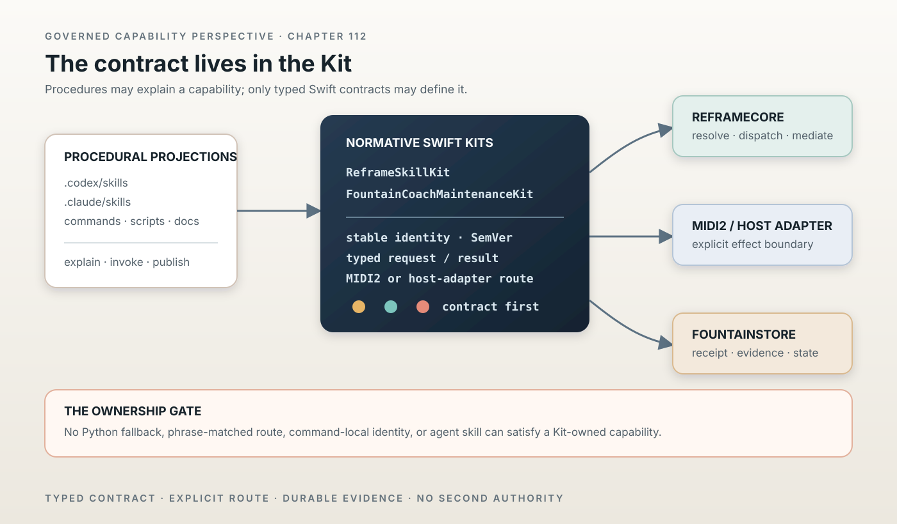

# Skill and Maintenance Capabilities Are Kit-Owned

> Chapter summary: Reframe skills and Fountain Coach maintenance operations are normative only when their typed contracts live in the corresponding Swift kit. Agent skills, UI commands, handwritten adapters, and scripts may explain or project a capability; they cannot define one.



*Principal illustration — a deterministic Teatro-style architecture projection. It shows the governed ownership boundary; it is not a runtime screenshot, live acceptance result, or proof that every named kit capability has already been implemented or released.*

## The decision

Every Reframe skill MUST be defined in `ReframeSkillKit`.

Every Fountain Coach maintenance operation MUST be defined in
`FountainCoachMaintenanceKit`.

The kits are the normative capability vocabulary. `ReframeCore` consumes and
dispatches those contracts; host adapters execute admitted effects through the
governed MIDI2, FountainStore, credential, filesystem, and publication
boundaries.

The `.codex/skills` and `.claude/skills` trees are procedural projections for
agents. They are not runtime authority and cannot satisfy this requirement.

## The mandatory place

The mandatory source of truth is:

```text
Reframe semantic skill       → kits/ReframeSkillKit
Fountain Coach maintenance   → kits/FountainCoachMaintenanceKit
runtime dispatch             → ReframeCore bridge
host effect                  → explicit Swift host adapter
```

The kit entry MUST include, at minimum:

* a stable identity and SemVer line;
* a typed request/result or dispatch contract;
* its authority and claim boundary;
* its explicit MIDI2 or Swift host-adapter route; and
* focused tests proving registry, encoding, and dispatch behavior.

No command parser, agent instruction, UI view, shell helper, or script may
invent a second identity or route for the same capability.

## The mandatory moment

Kit ownership is required at the first contract moment, before capability
implementation begins.

The following gate is mandatory:

```text
proposal
  ↓
typed kit contract + route
  ↓
ReframeCore/host adapter implementation
  ↓
focused tests and scenario evidence
  ↓
admission
  ↓
release/public projection
```

A capability MUST NOT be described as implemented, admitted, released, or
available to Reframe until the corresponding kit contract exists and the
consumer resolves it from that contract.

If a kit contract changes, the consumer, generated artifacts, focused tests,
scenario evidence, and release metadata MUST be reevaluated before promotion.

## What the kits own and what they do not

`ReframeSkillKit` owns semantic skill identities such as scenario authoring,
source reading, Storify, instrument creation, instrument inspection, and
projection composition. It maps them to explicit MIDI2 routes.

`FountainCoachMaintenanceKit` owns maintenance identities such as repository
inspection, contract validation, generated-artifact regeneration, evidence
audit, publication validation/preparation, and skill synchronization. It maps
them to Swift host adapters and never acquires effects itself.

Neither kit owns:

* AppKit, SwiftUI, Metal, WebKit, Accessibility, Keychain, or another host UI
  framework;
* provider credentials or secret values;
* repository or publication side effects;
* source or manuscript authority; or
* a Python runtime or Python-backed fallback.

The no-Python rule is a dependency rule for the kits and their governed
runtime path. Existing legacy tools elsewhere in the repository remain
unmigrated until a Swift replacement is adopted and proven; their existence
does not authorize a fallback from a kit-owned capability.

## Enforcement

The minimum repository gate is `Scripts/verify-swift-only-kits`. It MUST pass
for changes to either kit. Reframe integration tests MUST also prove that
`ReframeCore` resolves skills through `ReframeSkillKit` and maintenance through
`FountainCoachMaintenanceKit`.

Admission and release review MUST reject:

* a capability present only under `.codex/skills` or `.claude/skills`;
* a runtime route selected by phrase matching or an untyped script;
* a consumer-local duplicate of a kit identity;
* a claimed operation without a kit dispatch entry; or
* a Python-backed execution path presented as the Swift kit implementation.

## Relationship to the existing constitution

This chapter applies [Chapter 07](07-agent-operating-guide.md)'s authority
precedence to capability creation, [Chapter 63](63-fountain-maintenance-kit.md)'s
portable maintenance boundary, [Chapter 77](77-swift-midi2-scenario-runtime.md)'s
Swift/MIDI2 runtime rule, [Chapter 81](81-universal-midi2-command-plane.md)'s
command-plane contract, and [Chapter 91](91-fcis-kit-instrument-store-is-the-capability-plane.md)'s
FCIS-KIT admission model.

It complements [Chapter 93](93-instrument-creation-is-a-governed-promotion-path.md):
instrument creation remains a promotion path, while this chapter fixes where
the capability contract must exist before that path can begin.

## Governing sentence

Reframe skills and Fountain Coach maintenance operations become normative at
their first typed contract, and that contract MUST live in the corresponding
Swift kit before Reframe implementation, admission, release, or publication
may claim the capability.
