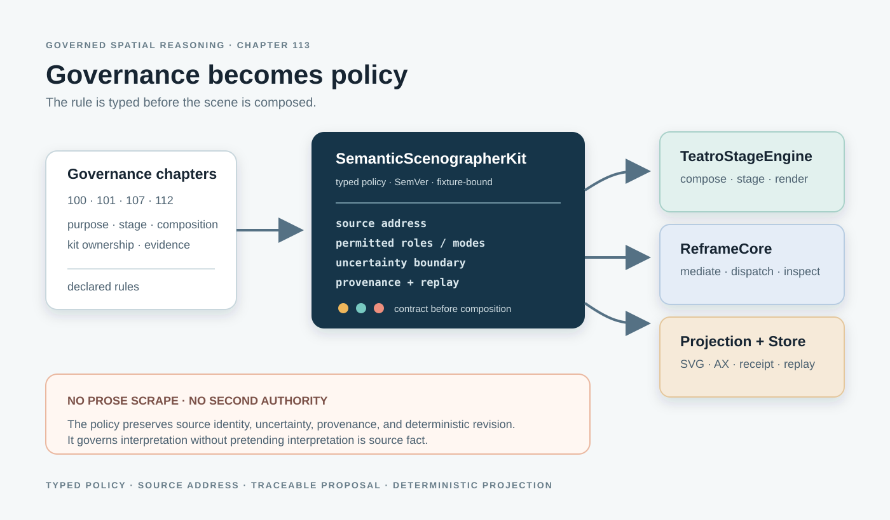

# Governance Becomes an Executable Scenographic Policy

> Chapter summary: The Semantic Scenographer becomes more capable when its governing rules are converted into a typed,
> versioned policy owned by `SemanticScenographerKit`. Reframe enforces the policy, TeatroStageEngine realizes the
> composition, and neither becomes a second source or uncertainty authority.



*Principal illustration — a deterministic Teatro-style vector projection of the policy boundary. It is an architectural
explanation, not a runtime screenshot, live acceptance result, or claim that the full engine integration is released.*

## The decision

Chapter 100 defines what the Semantic Scenographer is. Chapter 101 defines TeatroStageEngine as the stage boundary.
Chapter 107 governs creation of the canonical composition layer. Chapter 112 establishes that the capability contract
must live in a Swift kit.

This chapter governs the conversion between those decisions and an executable capability:

```text
governance chapters
        ↓
typed SemanticScenographerPolicy
        ↓
SemanticScenographerKit request/result
        ↓
TeatroStageEngine composition
        ↓
deterministic SVG, stage, animation, or inspection projection
```

Governance is therefore not scraped from prose at runtime, and it is not left as advice to a model. The policy is a
versioned, testable Kit object. A policy change is a contract change with explicit review, fixtures, and provenance.

## Why this raises quality

An unconstrained scenographic prompt can produce an attractive but weak answer: an object may have no source address,
a visual relation may be mistaken for a fact, uncertainty may disappear, and a flattened image may be impossible to
revise or inspect.

An executable policy makes quality conditions structural. Before composition, the Kit can require:

- an exact source document and range;
- the admitted beat, movement, lane, note, or composite address;
- declared scenographic roles and relations;
- an explicit interpretation boundary;
- a permitted Teatro mode and projection contract;
- provenance, instrument, policy, engine, and renderer versions;
- deterministic replay inputs and a typed terminal result.

The policy does not tell the AI what a passage means. It makes the conditions for a responsible spatial proposal
unavoidable and inspectable.

## The policy contract

`SemanticScenographerKit` owns one stable policy identity and its SemVer evolution. The first contract should express
the smallest useful set of constraints:

```text
SemanticScenographerPolicy {
    identity
    version
    permittedModes
    permittedRoles
    addressRequirement
    uncertaintyBoundary
    provenanceRequirement
    determinismRequirement
    revisionAndVariantRules
}
```

The policy may admit modes such as `stage-plan`, `relational-diagram`, `storyboard`, `temporal-score`, or
`memory-vector`. It may admit roles such as `figure`, `field`, `threshold`, `trajectory`, `void`, and `witness`.
These are declared compositional vocabulary, not hidden semantic findings.

The policy must reject or visibly mark a request when the source address is missing, when the requested role is not
admitted, when uncertainty would be silently converted into certainty, or when a renderer cannot preserve the required
identity and provenance.

## One authority chain

The conversion must preserve the architecture already established by Chapters 99–107:

| Boundary | Owns | Must not become |
| --- | --- | --- |
| Reading Navigation | the writer's semantic starting address | a spatial interpretation |
| Source View | exact Markdown and supported `.fountain` source | a generated scene |
| `UncertaintyScoreKit` | internal uncertainty state and addresses | a second writer-facing navigation system |
| `SemanticScenographerKit` | typed policy, request, proposal, and result | source or uncertainty authority |
| TeatroStageEngine | stage composition, geometry, state, and rendering mechanics | semantic interpretation |
| ReframeCore | mediation, dispatch, identity, and capability routing | an untyped prompt router |
| FountainStore | durable evidence, receipts, and replay inputs | a renderer |

The important new edge is between governance and the Kit: governance declares the rule; the Kit carries its executable
form. No downstream component may invent a competing version.

## The request and result

The writer remains in Copilot, but the writer-facing request is resolved into a typed instrument request rather than a
private prompt convention:

```text
SemanticScenographerRequest {
    sourceAddress
    admittedContext
    policyIdentity
    mode
    requestedRelations
    variantIdentity
}
```

The result must distinguish interpretation from realization:

```text
SemanticScenographerResult {
    proposalIdentity
    sourceAddress
    teatroComposition
    policyVersion
    engineVersion
    rendererVersion
    provenance
    terminalState
}
```

The AI proposes relations. The Teatro composition records those relations. TeatroStageEngine realizes stage state.
Rendering is deterministic from the stored composition and render parameters. A beautiful image without these joins
is an illustration, not an accepted scenographic result.

## Rendering quality is part of the contract

The policy governs not only what may be represented, but whether the representation can be read. For a canonical
Teatro-style diagram or chapter illustration:

- geometry and typography are authored in a scalable vector asset whenever the medium permits;
- text is sized for the actual responsive chapter canvas, with internal padding and explicit wrapping;
- outlined glyph paths are acceptable only when they remain legible at intrinsic and responsive display sizes;
- small labels are not used to carry essential meaning that the composition cannot support at readable scale;
- the social JPEG is derived from the canonical asset and may not become an independently composed fallback;
- canonical and social outputs are checked separately, because vector sharpness does not survive every raster delivery.

This is a quality invariant, not a cosmetic preference. If a reader cannot distinguish the labels, the semantic
relations have not been projected successfully.

## Variants and revision

Spatial reasoning has no requirement to produce one canonical visual answer. The Kit must support distinct variants
anchored to the same source address:

```text
same source address
    ├── variant A · compression
    ├── variant B · distance
    └── variant C · shared field
```

Each variant remains a proposal. Revising a threshold, trajectory, or field creates a new proposal identity and keeps
the prior score inspectable. It does not rewrite the source, close an unresolved question, or promote an interpretation
into evidence merely because it was rendered.

## Implementation status and boundary

The repository already contains a `FountainCoachSemanticScenographerKit` with source addresses, scenographic roles,
structured Teatro objects, and a deterministic SVG renderer seam. The current boundary is therefore concrete enough
to govern, but this chapter does not claim that every policy field, the full `TeatroStageEngine` package dependency,
all host adapters, or live acceptance are complete.

The next implementation must extend the existing Kit and Teatro contracts at their owned boundaries. It must not add
policy parsing to a UI, scrape governance pages during execution, introduce a second scene engine, or use Python as a
runtime fallback for a Kit-owned capability.

## Acceptance

The conversion is accepted only when a focused fixture proves that:

1. the same source address produces a typed policy-bound request;
2. missing or ambiguous addresses fail visibly;
3. the policy forbids unadmitted roles and silent uncertainty closure;
4. the proposal preserves source and uncertainty references on its objects;
5. the Teatro composition can be rendered by more than one admitted projection;
6. rerendering a stored composition is deterministic;
7. variants remain separate and revisable;
8. ReframeCore dispatches the Kit contract through its governed MIDI2 or host-adapter route;
9. FountainStore records the terminal result and provenance;
10. AX and the MIDI2 monitor expose the same stable identities used by the Kit;
11. the canonical vector projection and its social derivative pass responsive legibility, padding, wrapping, and
    clipping review independently.

Until these predicates have matching implementation and evidence, the policy remains a governed target rather than a
released capability.

## Relationship to existing governance

- [Semantic Scenographer](100-semantic-scenographer.md) defines the instrument's purpose and interpretive boundary.
- [TeatroStageEngine Is the Stage](101-teatro-stage-engine-semantic-scenography.md) defines the stage authority.
- [Semantic Inference Execution](102-semantic-inference-execution-session-and-latency-governance.md) defines the
  isolated execution session and terminal evidence.
- [FCIS-KIT Semantic Factory](103-fcis-kit-semantic-factory-and-wired-instrument-event-stream.md) defines the
  composed instrument lifecycle and correlated MIDI2 stream.
- [Teatro MIDI2 Monitor](106-teatro-midi2-monitor-canonical-runtime-projection.md) defines the runtime projection and
  replay boundary.
- [Canonical Teatro Stage Composition Layer](107-creating-the-canonical-teatro-stage-composition-layer.md) defines
  the composition-layer creation boundary.
- [Skill and Maintenance Capabilities Are Kit-Owned](112-skill-and-maintenance-capabilities-are-kit-owned.md)
  requires this policy's executable home to be the appropriate Swift Kit.

## Governing sentence

Governance for the Semantic Scenographer becomes operational only when its rules are represented by a versioned typed
policy in `SemanticScenographerKit`, enforced by ReframeCore, and realized by TeatroStageEngine without becoming a
second source or uncertainty authority.
