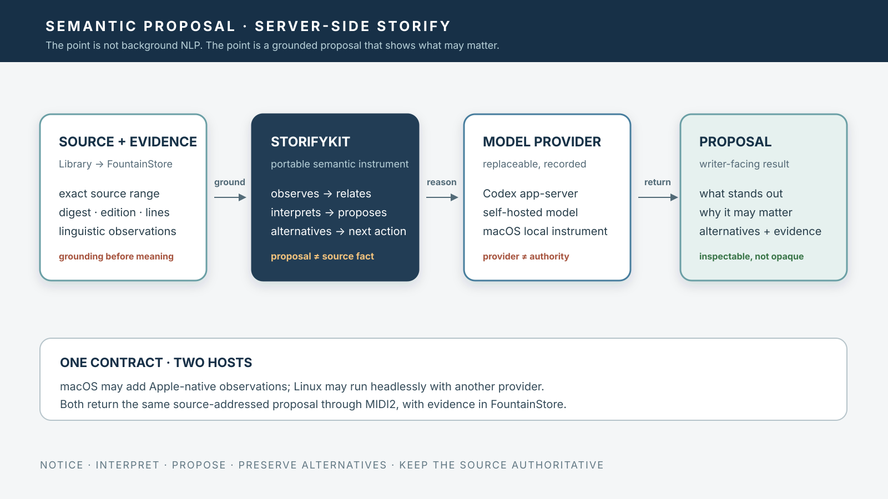

# Server-Side Semantic Proposals — Mac and Linux as One Reframe Runtime

> Chapter summary: Storify is a source-grounded semantic proposal instrument. It uses deterministic linguistic observations and model reasoning to identify what deserves attention in a passage, explain why, preserve alternatives, and return source-addressed proposals to the writer. Linux may execute the work headlessly; macOS may provide richer local observations and projections. Neither platform becomes the semantic authority.



*Principal illustration — a deterministic Teatro-style vector projection of the proposal boundary. It describes the governed architecture; it is not a runtime screenshot, a model result, or evidence that server-side Storify has already been released.*

## The decision

Storify Source Auto is not primarily a parser, summarizer, or background NLP service. Its purpose is to answer:

> What is worth noticing here, and what could the writer do with that observation?

A Storify result must therefore be a structured proposal, not an opaque paragraph of generated commentary. It may identify a movement, conflict, repeated image, changed relation, temporal or causal discontinuity, contradiction, unresolved question, cross-range correspondence, shift in narrative distance, or possible dramatic consequence.

The model may propose significance. It may not promote its proposal into source fact.

## The semantic proposal

Every proposal distinguishes four layers:

```text
source observation
      ↓
model interpretation
      ↓
writer-facing proposal
      ↓
optional next action
```

For example:

```text
Observation:
  The same object appears in lines 120–126 and 418–431.

Interpretation:
  Its role appears to change from evidence to memory.

Proposal:
  Consider treating the object as a returning pressure point.

Alternative:
  It may instead function as a deliberately unresolved coincidence.

Evidence:
  exact source ranges, source digest, operation revision
```

The proposal is valuable because it highlights a relation. The source ranges make that relation inspectable. The alternative prevents an attractive interpretation from becoming a hidden conclusion.

## What the model is responsible for

The model is responsible for semantic composition over grounded observations. It may:

- connect distant but related source ranges;
- distinguish explicit events from implied relations;
- propose thematic or dramatic movements;
- detect changes in voice, agency, time, or attention;
- identify unresolved questions;
- compare competing interpretations;
- suggest where the writer’s attention may be most productive;
- create alternative readings of the same material;
- transform a reading into a structured Teatro scenographic proposal; and
- recommend a next governed operation.

It must not merely repeat measurements already available from the parser. Linguistic tooling establishes possible structure; model reasoning decides what that structure may mean for the writer.

## The background instruments

Deterministic NLP remains important, but as evidence for reasoning rather than as the product shown to the writer. Background instruments may provide language and sentence boundaries, lexical and name observations, speech and paragraph boundaries, reference continuity, temporal markers, repeated terms and images, similarity relations, discourse signals, and ambiguity markers.

These observations enter the semantic model through typed, source-addressed packets. The writer should receive the resulting semantic proposal:

```text
what stands out
why it may matter
where it occurs
what remains uncertain
what alternative reading is possible
what could be explored next
```

## The server-side execution model

The semantic proposal instrument is portable:

```text
StorifyKit
  ├── source-addressed observations
  ├── semantic proposal contract
  ├── inference provider protocol
  ├── reconciliation
  ├── alternatives and uncertainty
  └── receipt and provenance model
```

Linux provides a headless execution host:

```text
Linux Reframe host
  ├── FountainStore source custody
  ├── deterministic linguistic instruments
  ├── model provider
  ├── asynchronous Storify sessions
  └── MIDI2 lifecycle and telemetry
```

macOS provides a rich writer-facing host:

```text
macOS Reframe host
  ├── Copilot
  ├── Source View
  ├── Reading Navigation
  ├── AX
  ├── Apple-native linguistic instruments where available
  └── proposal and projection surfaces
```

Both hosts consume and produce the same typed Storify contract. A macOS NaturalLanguage observation may enrich a proposal, but it must not create a second semantic authority unavailable to Linux.

Linux may use a Codex app-server provider, a self-hosted model, or another admitted provider. The provider is replaceable; the source-addressed proposal contract is not.

## The Library and FountainStore boundary

The Book Library remains the provider of the published work. FountainStore holds the admitted source, digest, versions, execution state, proposals, and receipts.

Storify reads only the admitted FountainStore resource or a verified named-range receipt. It does not reopen a floating web source or independently acquire a second manuscript.

```text
Book Library
  → published work and provenance

FountainStore
  → admitted source and durable evidence

Storify
  → grounded semantic proposal

Reframe
  → writer-facing interpretation and action

Teatro
  → optional spatial projection
```

This preserves the provider boundary of [Chapter 56](56-the-book-library-is-a-portable-source-provider.md), the defined-whole contract of [Chapter 85](85-storify-source-auto-reads-a-defined-whole.md), and the factory composition of [Chapter 103](103-fcis-kit-semantic-factory-and-wired-instrument-event-stream.md).

## Mac/Linux parity

Cross-platform parity does not mean identical internal tools. It means:

- the same source identity produces the same addressable input;
- the same request and result types are used;
- provider and instrument differences are disclosed;
- all observations retain provenance;
- a Linux result can be inspected on macOS;
- a macOS result can be compared with a Linux result; and
- no platform-specific observation silently becomes authoritative.

Provider or platform variation is itself evidence and may participate in [Chapter 110](110-three-run-semantic-drift-calculus.md)’s three-run semantic drift cohort.

## MIDI2 and asynchronous completion

MIDI2 carries the typed command, lifecycle, telemetry, and terminal references between the writer-facing host and the execution host. It does not become a second source store.

The host must not use a GUI watchdog, a missing progress line, or process liveness as completion. A Storify session completes only when its typed terminal event agrees with its durable FountainStore receipt, as governed by [Chapter 104](104-midi2-event-time-jitter-and-asynchronous-completion-governance.md).

## Acceptance

A server-side Storify implementation is accepted only when:

1. a published Library work is admitted into FountainStore;
2. semantic proposals cite exact source ranges;
3. observations, interpretations, and proposals remain distinguishable;
4. alternatives and unresolved questions are preserved;
5. the same execution is exposed through MIDI2, FountainStore, AX, and the writer-facing surface;
6. Linux and macOS use the same semantic contract;
7. model and provider identity and revision are recorded;
8. asynchronous completion is established by MIDI2 and durable Store receipts;
9. exactly three independent runs are used when Chapter 110 drift measurement is requested; and
10. no model proposal silently rewrites the source or becomes a fact.

The current repository may contain parts of this boundary without establishing the complete server-side capability. A Kit contract, a provider adapter, a local fixture, or a model response is not by itself live acceptance or a released cross-platform claim.

## Relationship to the existing constitution

Chapter 102 governs the execution session and latency boundary. Chapter 103 governs the semantic factory and its shared instrument event stream. Chapter 104 governs event time and asynchronous completion. Chapter 108 governs the portable Swift runtime boundary. Chapter 109 governs macOS NaturalLanguage as a MIDI2 instrument. Chapter 110 governs three-run semantic drift. Chapters 100–107 govern Teatro’s downstream scenographic role.

This chapter joins those decisions around one writer-facing objective: the system should not merely process text in the background; it should return a grounded, inspectable proposal that helps the writer see what the work is doing.

## Governing sentence

Storify is Reframe’s source-grounded semantic proposal instrument: deterministic language tools establish observations, models propose what may matter, FountainStore preserves the evidence, MIDI2 carries the execution, and macOS and Linux provide interchangeable hosts for one governed runtime.
