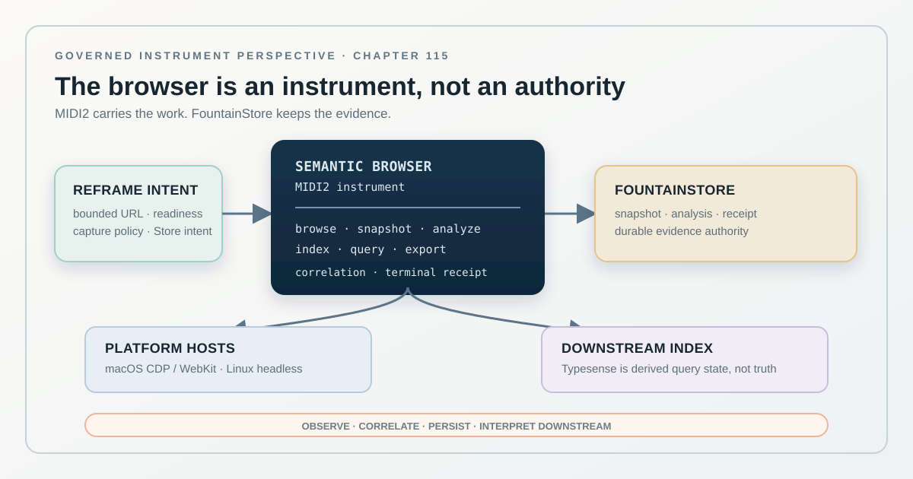

# Semantic Browser Is a Governed MIDI2 and FountainStore Instrument

> Chapter summary: Semantic Browser is Reframe's Swift browser and evidence instrument. It observes rendered web material, produces source-addressed snapshots and semantic proposals, and persists its lifecycle through FountainStore. MIDI2 is its command and event boundary; browser engines and indexing systems remain replaceable host adapters.



*Principal illustration — a deterministic Teatro-style vector projection of the instrument boundary. It is architectural design evidence, not a live browser snapshot or proof of release.*

The Semantic Browser is not a second semantic authority and not a publication server hidden behind a convenient API. It is a governed capability that lets Reframe inspect a rendered web surface, preserve what was observed, and pass the observation into the same semantic system that governs manuscript and library work.

It therefore joins the existing [Universal MIDI2 Command Plane](81-universal-midi2-command-plane.md), [FountainStore authority](95-fountainstore-headless-linux-authority.md), [Swift-native runtime boundary](108-reframe-is-a-swift-native-cross-platform-runtime.md), and [server-side semantic proposal contract](114-server-side-semantic-proposals-mac-and-linux-one-runtime.md).

## The decision

Semantic Browser is an FCIS-KIT instrument for browser-backed observation and semantic dissection. Reframe addresses it through the governed MIDI2 plane. The instrument reports asynchronous lifecycle and terminal events; its FountainStore adapter persists the corresponding request, snapshot, analysis, provenance, and receipt evidence.

```text
Reframe intent
      ↓
MIDI2 Semantic Browser instrument
      ├── browse / snapshot
      ├── analyze / dissect
      ├── index / query
      └── export artifact
      ↓
FountainStore adapter
      ├── request and correlation
      ├── rendered snapshot
      ├── semantic analysis
      ├── source/network provenance
      └── terminal receipt
```

The browser observes a page. It does not make the page true, and it does not make an analysis true merely because an index returned it.

## Instrument identity and boundary

The capability MUST have one stable instrument identity, version, owning Kit, and MIDI2 contract. The current repository named `SemanticBrowser` is the implementation candidate; the released FCIS identity and SemVer line remain to be established through the [governed instrument promotion path](93-instrument-creation-is-a-governed-promotion-path.md).

Its bounded responsibilities are:

- navigate or receive a bounded URL or local preview address;
- wait according to an explicit readiness policy;
- capture rendered HTML, rendered text, response metadata, and permitted network evidence;
- dissect the captured material into typed blocks, entities, claims, relations, and tables where supported;
- preserve character or block spans that point into the captured material;
- optionally write derived query objects to an admitted index; and
- export inspectable artifacts with provenance.

It MUST NOT own manuscript authority, governance doctrine, Reframe project state, credentials, publication policy, or the decision that a semantic proposal is accepted by the writer.

## Deep MIDI2 integration

MIDI2 is not a thin notification wrapper around a hidden HTTP service. It is the instrument's command, lifecycle, ordering, correlation, and completion boundary, following [MIDI2 event-time governance](104-midi2-event-time-jitter-and-asynchronous-completion-governance.md).

The instrument MUST expose typed operations for the bounded capabilities it actually implements. A representative vocabulary is:

```text
semantic-browser.snapshot
semantic-browser.browse
semantic-browser.analyze
semantic-browser.index
semantic-browser.query
semantic-browser.export
```

These names are Fountain Coach instrument extensions carried by the universal MIDI2 contract; they are not claimed as MIDI Association standard operations. The exact fields, roles, lifecycle, and terminal predicates come from the versioned MIDI2 IDL and its generated projections.

Every operation MUST carry or resolve:

- operation identity and instrument version;
- one execution and correlation identity;
- source URL or bounded local route;
- explicit wait/readiness policy;
- permission and network-capture policy;
- Store intent and evidence scope;
- progress, refusal, cancellation, timeout, and failure states; and
- a terminal event that names the durable receipt or the reason no receipt exists.

The operation may execute locally on macOS, headlessly on Linux, or on another admitted Reframe host. The MIDI2 contract remains the same. Host location is a deployment fact, not a second command vocabulary.

## FountainStore adapter

FountainStore is the durable authority for the instrument's lifecycle and evidence. The Semantic Browser package MUST use the released [FountainStore session boundary](91-fcis-kit-instrument-store-is-the-capability-plane.md) through an explicit adapter. It must not invent leases, scan Store directories, or reconstruct receipts in shell code.

The adapter persists, at minimum:

```text
request
  → execution / correlation
  → browser snapshot
  → network and DOM evidence
  → semantic analysis
  → optional index effect
  → terminal receipt
```

The snapshot and analysis are separate records. A Typesense document, cache entry, or exported Markdown file is a derived projection and cannot replace the Store record. If browsing succeeds but analysis fails, the snapshot remains inspectable and the failure remains terminal and correlated. If indexing fails, the browser observation remains distinct from the failed index effect.

FountainStore evidence MUST include the source URL, final URL when it changes, fetch time, HTTP status and content type where observed, source or response digest where available, browser/engine identity, Semantic Browser version, operation identity, and the policy governing captured network bodies. Private headers, credentials, and disallowed response bodies MUST NOT enter public publication.

## Browser engines and platform boundary

The portable Semantic Browser contract MUST NOT require AppKit, SwiftUI, WebKit, Accessibility, Metal, or another Apple-only framework. Browser engines are adapters:

```text
SemanticBrowser contract
        │
        ├── macOS CDP/WebKit adapter
        ├── Linux headless-browser adapter
        └── future admitted engine
```

The current local repository is an implementation candidate, not evidence that this boundary is complete. Its package currently declares macOS 14, contains CDP and URL-fetch paths, and depends on SwiftNIO and Typesense. Those facts are refactoring seams to be made explicit, not reasons to spread platform conditionals through the semantic model.

The browser engine produces an observation. ReframeCore performs grounded mediation over the observation and the live Store state. A model may interpret the captured material under a governed operation, but it may not silently promote an interpretation into a source fact.

## Indexing is downstream

Typesense or another search index may accelerate queries over derived pages, segments, entities, and tables. It is not the semantic authority, the browser authority, or the FountainStore authority.

Indexing therefore has its own MIDI2 operation and Store effect. The adapter records whether an index write was attempted, accepted, rejected, or unavailable. Query results retain their derived status and point back to the Store-owned page or analysis identity where possible.

An index outage MUST NOT erase or rewrite a valid browser snapshot. A stale index MUST be observable as stale rather than silently treated as current evidence.

## Reframe publication and preview

The [Kit-owned publication boundary](112-skill-and-maintenance-capabilities-are-kit-owned.md) may use Semantic Browser as an independent observer of a generated local or public route. This creates evidence about what a browser rendered; it does not make Semantic Browser the publisher.

The publication path is:

```text
reviewed source
      ↓
generated publication projection
      ↓
Semantic Browser snapshot
      ↓
MIDI2 lifecycle + FountainStore receipt
      ↓
AX / visual / route verification
```

The browser observation, site generator, AX/VRT witness, deployment verifier, and publication authority remain distinct evidence classes. A successful snapshot cannot substitute for an AX acceptance run or an HTTPS deployment check.

## Scenario-first implementation

The first implementation scenario MUST exercise one bounded route and prove:

1. the request is admitted with an explicit URL, readiness policy, capture policy, Store intent, and correlation;
2. the MIDI2 instrument emits ordered start, progress, and terminal events;
3. FountainStore preserves the snapshot and the terminal receipt;
4. analysis can be run as a separate correlated operation over the stored snapshot;
5. an index failure does not destroy browser or analysis evidence;
6. cancellation, timeout, refusal, malformed URL, and replay are terminal and inspectable; and
7. the same contract can be hosted locally without treating a macOS-only engine as Linux evidence.

The implementation may begin with a deterministic local preview route. That proves the contract and lifecycle only. It does not prove public-web coverage, Linux parity, provider authorization, or production deployment.

## Acceptance and release

The instrument is not live-accepted because its Swift types compile or because its HTTP surface responds. Acceptance requires the evidence ladder from [Chapter 08](08-validation-and-acceptance.md) and the lifecycle from [Chapter 93](93-instrument-creation-is-a-governed-promotion-path.md): source revision, dependency revisions, named scenario, MIDI2 trace, Store receipt, terminal predicate, and the applicable browser/AX/visual witness.

The current local repository has uncommitted changes and a `0.0.1` tag; its declared YAML description of a newer API is not a released SemVer artifact. Reframe MUST consume a clean, tagged, reproducible Semantic Browser release rather than a dirty checkout or unpublished path dependency.

The following claims remain separate:

```text
package builds and tests       implementation
MIDI2 lifecycle + Store proof  scenario-tested instrument
browser acceptance             browser witness
macOS/Linux parity             cross-host acceptance
public route verification      publication/deployment witness
```

No row may be inferred from another.

## Governing sentence

Semantic Browser is Reframe's governed Swift browser instrument: MIDI2 carries its commands, lifecycle, correlation, and completion; FountainStore preserves its observations and receipts; platform adapters provide browser engines and indexes; and semantic interpretation remains downstream, inspectable, and unable to replace the source or the authority of the governed system.
