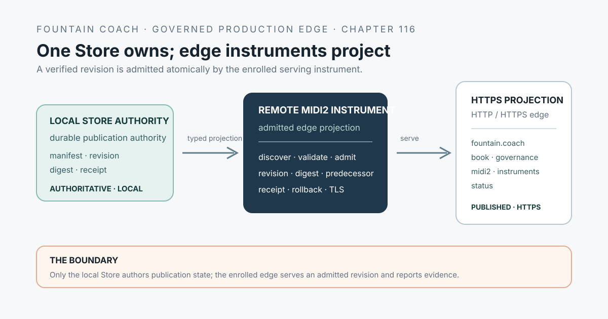

# 116 — FountainStore-Owned Estate Edge and ACME Promotion

> Chapter summary: The Fountain Coach estate is served from Store-owned publication state. Reframe edits a local candidate, a governed sync promotes it to the secondary Store, and FountainStore's native HTTP edge serves the admitted domains. ACME, TLS, and external DNS remain explicit production operations with their own credentials, evidence, and rollback.



*Principal illustration — a deterministic vector architecture projection. It is not a live deployment screenshot and does not claim that every estate domain, certificate, or route has already been promoted.*

The [Fountain Coach Publication Estate](92-fountain-coach-publication-estate.md) defines one identity expressed through specialized domains. This chapter defines the missing operational seam: how those domains become a browsable local, staging, or published projection without introducing a second web authority.

## The decision

FountainStore is the estate's publication-state authority and native serving edge. Reframe's local Store is the writer's editable realm. A secondary Store holds the admitted staging or published projection. The HTTP server serves a route snapshot derived from the Store-owned estate manifest.

```text
Reframe local Store
        ↓ typed sync / receipt
secondary FountainStore
        ↓ atomic route snapshot
FountainStore HTTP edge
        ├── fountain.coach
        ├── book.fountain.coach
        ├── governance.fountain.coach
        ├── midi2.fountain.coach
        ├── instruments.fountain.coach
        └── status.fountain.coach
```

The local mirror and the remote site therefore share one publication graph and one semantic contract. They differ in declared environment state and authority, not in the meaning of their pages.

## Store-owned publication manifest

Every admitted domain is represented by a typed manifest record. The record names the host, publication role, route root or Store projection, template revision, content digest, environment, and promotion state. A route is not admitted because a server happens to have a directory with that name.

The manifest MUST preserve:

1. the canonical domain and its declared role from Chapter 92;
2. the local, staging, or published environment;
3. the source projection and template identity;
4. the content and asset digests;
5. the Store receipt and source revision that established the projection;
6. the route and certificate identities where applicable; and
7. the rollback predecessor.

The route registry is a Store projection. A checked-in JSON file may bootstrap a development server, but it is not the durable authority and must not silently diverge from the Store.

## One estate, three environments

The same estate graph may be projected in three environments:

| Environment | Meaning | Authority |
| --- | --- | --- |
| `local` | editable candidate and writer-facing preview | local Reframe Store |
| `staging` | reviewable candidate prepared for promotion | secondary FountainStore staging state |
| `published` | public projection served for the canonical host | secondary FountainStore published state |

Every environment MUST expose its state to the machine-readable surface and, where it is visible to a writer, to AX and the rendered page. A local page may retain the canonical public URL as provenance, but it must visibly identify itself as local and pre-published. Local state must never be represented as public publication merely because its routes resemble the public routes.

## Promotion and synchronization

The promotion path is a typed, receipt-producing operation:

```text
candidate
  → validate estate manifest and shared template contract
  → freeze projection digest
  → synchronize to secondary Store
  → verify Store receipt and route snapshot
  → promote staging to published
  → activate certificate and edge route
  → verify HTTPS and semantic estate graph
```

The sync is not a blind filesystem copy. It MUST be idempotent, preserve the source revision and digest, reject a conflicting route identity, and retain the prior published snapshot for rollback. A failed validation, incomplete artifact, missing certificate, or failed HTTPS check leaves the current published snapshot unchanged.

### Bounded route publication

A publication request that names one chapter, page, or route is a bounded route publication. The publisher MUST
identify that unit by its canonical host and normalized path prefix, transfer only the selected route files, and merge
the resulting route patch into the current remote manifest atomically. It MUST NOT turn a bounded request into a
whole-estate transfer. Whole-estate synchronization is a separate, explicit intent.

Before mutation, the publisher MUST establish that the selected route exists in the current local Store snapshot, the
authenticated remote Store is ready, the named SecretStore credential is available to one admitted publication
process, and the destination has enough capacity to accept and promote the patch. A credential prompt belongs to that
single process; spawning retries or overlapping publication clients is not recovery.

The bounded operation is complete only when one correlated receipt establishes all of the following:

1. the remote Store accepted the route patch;
2. typed remote manifest read-back contains the selected host and path;
3. typed selected-path read-back matches the frozen local content digest; and
4. the canonical public HTTPS route returns that same digest.

Process completion, an HTTP success alone, or a remote manifest without selected-path read-back cannot satisfy this
proof. If a preflight or proof condition fails, the operation stops at that named seam; it does not fall back to a
filesystem copy, a generic HTTP upload, a site generator, or an edge-server reconfiguration.

The operation enters Reframe through the governed MIDI2 plane described in [Chapter 81](81-universal-midi2-command-plane.md), emits asynchronous lifecycle events under [Chapter 104](104-midi2-event-time-jitter-and-asynchronous-completion-governance.md), and persists its receipt through the Store boundary described in [Chapter 91](91-fcis-kit-instrument-store-is-the-capability-plane.md). It is therefore an instrument operation, not a shell convention.

## FountainStore as the native edge

The FountainStore HTTP server may serve static publication roots, Store-backed data, and other admitted routes through one native edge. Host-aware routing selects the manifest record; it must not infer authority from the request path alone. The edge MUST reject an unknown or unadmitted host rather than falling through to an arbitrary root.

The edge reloads only a validated, immutable route snapshot. A new manifest becomes visible as one atomic change. Existing requests complete against their original snapshot, while new requests see the newly promoted snapshot. This keeps browsing coherent while a projection changes.

The edge is not the publication authority by itself. FountainStore state, manifest validation, promotion receipt, and the applicable deployment witness establish what is served. The HTTP response is a projection of that state.

## ACME, TLS, and external DNS

ACME is a separate but connected production operation. [Chapter 96](96-swiftacmekit-is-a-provider-neutral-certificate-automation-boundary.md) owns the provider-neutral certificate lifecycle; [Chapter 94](94-credentialed-infrastructure-operations-and-provider-adapters.md) owns credential custody and provider-specific authorization.

The estate publisher MUST:

- request or renew certificates only for manifest-admitted domains;
- keep ACME account material and provider credentials in SecretStore-backed adapters;
- record challenge, certificate, route, and digest evidence without publishing secrets;
- activate TLS only after certificate identity matches the promoted host set;
- keep the previous certificate and route snapshot available for rollback; and
- distinguish certificate readiness from public DNS readiness.

External DNS is not silently changed by Store synchronization. A DNS mutation is a separately authorized operation against the selected provider, with an exact target, receipt, and rollback or reversal evidence. Where DNS-01 is used, the challenge mutation remains within that explicit boundary. Where HTTP-01 or TLS-ALPN-01 is used, FountainStore must own the required public edge ports for the challenge period. Removing Caddy does not remove these requirements; it transfers the edge responsibility to FountainStore.

## Local browsing and semantic equivalence

The local mirror is accepted as equivalent only when the Semantic Browser can traverse the same estate graph and observe the same page identities, headings, links, metadata, template semantics, and accessibility landmarks as the corresponding published projection. Its environment banner, Store receipt, and local source provenance are additional state—not a replacement semantic model.

The local browser may use a loopback origin when system DNS is intentionally untouched. In that case the DNS instrument records the intended estate host and environment, while the projection makes the difference explicit. A machine-wide resolver change is never a prerequisite for local editing and must not be used as an implicit mirror mechanism.

## Acceptance and release boundary

This chapter governs the target integration. It does not claim that the complete estate router, Store-backed manifest, ACME promotion, or all six public domains are already implemented.

Acceptance requires, at minimum:

1. a local Store candidate with a complete manifest and digest;
2. a secondary Store sync with a correlated MIDI2 lifecycle and terminal receipt;
3. an atomic route snapshot that serves every admitted domain in the scenario;
4. a new route added without changing server code;
5. rejection of an unknown host and a conflicting route;
6. staging-to-published promotion with retained rollback state;
7. certificate identity and TLS evidence for the promoted host set;
8. external DNS evidence where a public route is claimed; and
9. Semantic Browser, AX, visual, and FountainStore witnesses that agree about the same environment and source revision.

The following claims remain separate:

```text
manifest validates              route contract
Store sync completes             durable estate projection
HTTP edge responds               serving witness
ACME certificate is valid        TLS witness
DNS points to the edge           public routing witness
semantic graph matches           browser/AX equivalence witness
```

No one row proves another.

## Rules

1. FountainStore MUST own the durable estate publication manifest and the immutable route snapshot used by its native edge.
2. Reframe local editing MUST remain distinct from secondary Store staging and published authority.
3. Host-aware routing MUST select only an admitted manifest record and MUST reject unknown or conflicting hosts.
4. Store synchronization and promotion MUST be typed, idempotent, correlated, receipt-producing, and rollback-capable.
5. ACME, TLS activation, and external DNS mutation MUST remain explicit operations with SecretStore custody and independent evidence.
6. A local mirror MUST preserve the remote estate's semantic graph while visibly declaring its local/pre-published state.
7. A bootstrap route file MAY configure development, but it MUST NOT become a second authority or replace Store state.
8. FountainStore edge readiness, certificate readiness, DNS readiness, and semantic-browser equivalence MUST be reported as separate acceptance claims.
9. A chapter, page, or route publication MUST use a host-and-path-scoped Store patch; whole-estate synchronization requires explicit whole-estate intent.
10. Route publication MUST preflight source, remote readiness, credential custody, capacity, and single-process ownership, then prove remote write, typed read-back, public HTTPS, and matching digest before reporting completion.

## Governing sentence

The Fountain Coach estate is a Store-owned publication projection: Reframe edits locally, a governed secondary Store promotes immutable route state, and FountainStore serves admitted domains with ACME, TLS, and DNS remaining explicit, evidenced, and reversible operations.
