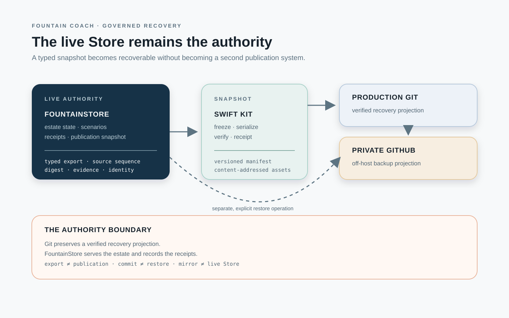

# 117 — FountainStore Snapshot Export and Git Recovery Projection

> Chapter summary: FountainStore remains the live estate authority. A typed Swift export creates a reconstructible snapshot of governed estate state; a production-side Git repository and a private GitHub mirror preserve that snapshot for recovery, inspection, and restoration without becoming a second publication authority.



*Principal illustration — a deterministic vector architecture projection. It describes the custody boundary; it is not a live backup receipt, a successful restore, or proof that the export instrument has been implemented.*

Chapter [116](116-fountainstore-owned-estate-edge-and-acme-promotion.md) establishes FountainStore as the estate's publication-state authority and native serving edge. This chapter defines how that state is made recoverable without confusing a backup projection with the Store that currently serves the estate.

## The decision

FountainStore is the authoritative live record of the estate. Its admitted scenario records, publication manifest, source and template identities, attachment references, receipts, provenance, and lifecycle state are not replaced by Git.

The estate MUST provide a typed, deterministic snapshot/export operation. That operation produces a versioned recovery projection which is committed to a repository on the production host and mirrored to a private GitHub repository. The repositories preserve an inspectable reconstruction path; FountainStore continues to own live reads, publication promotion, and runtime state.

```text
live FountainStore
  │ typed snapshot / export receipt
  ▼
production recovery repository
  │ verified commit / bundle
  ▼
private GitHub backup

FountainStore ───────────────► native publication edge
        │
        └────────────────────► restore into a new Store
```

This is a custody chain, not a bidirectional runtime loop. A Git backup must never be read automatically as a competing Store, and a Git commit must never be mistaken for publication, scenario execution, or a successful restore.

## What the snapshot contains

The export is a semantic projection of Store state, not a copy of its private storage format. Its manifest MUST identify:

1. the source Store identity, schema/version, and export time;
2. the exact estate corpus and selected document identities;
3. scenario contracts, confirmations, checked projections, and cohort membership;
4. attachment identities, content digests, media types, and permitted asset payloads;
5. lifecycle receipts, MIDI2 correlations, provenance, source revisions, and claim boundaries;
6. the publication manifest, route snapshot identity, template and asset digests; and
7. the export Kit, runtime, and format versions required for verification or restore.

Private credentials, Keychain or SecretStore material, private headers, unrestricted transcripts, undeclared network bodies, raw database files, and ephemeral process paths MUST NOT enter the recovery projection.

Where an attachment is retained, its content-addressed asset and its metadata must remain joined by digest. Where policy permits only a reference, the export must preserve the reference and state that the payload is not included. A manifest that silently drops an attachment is invalid.

## The three authorities

| Surface | Authority | What it proves |
| --- | --- | --- |
| Live FountainStore | estate runtime authority | current records, state, receipts, and publication snapshot |
| Production recovery Git | host-local recovery projection | a verified, versioned export available for local restore |
| Private GitHub mirror | off-host backup projection | an independently retained copy of the verified export history |

The production repository is not a hidden working tree for the edge. The native FountainStore edge loads only the admitted Store publication snapshot described by Chapter 116. Git becomes operationally relevant only through an explicit export, verification, mirror, or restore operation.

## Export and mirror protocol

The operation is a governed FCIS-KIT capability exposed through Reframe's MIDI2 command plane. It MUST be idempotent, correlated, receipt-producing, and safe to retry.

```text
select Store identity and estate scope
  → freeze a consistent Store snapshot
  → serialize the typed recovery format
  → verify manifest, digests, and completeness
  → commit to the production recovery repository
  → verify commit/object identity
  → mirror the exact commit to private GitHub
  → persist export and mirror receipts in FountainStore
```

The export MUST fail closed when the Store snapshot is inconsistent, the scope is ambiguous, an asset digest is missing, the destination ref has changed unexpectedly, or the remote mirror cannot be verified. A successful local commit is not permission to overwrite an unrelated remote branch.

The operation records the source Store sequence, export digest, repository identity, expected and resulting refs, object digests, mirror result, Kit versions, and terminal outcome. It does not report a backup merely because files were written or a Git command returned zero.

## Restore is a separate operation

Recovery is deliberately not an automatic import loop.

```text
verified Git snapshot
  → inspect manifest and compatibility
  → create or select an empty target Store
  → restore typed records and permitted assets
  → verify identities, digests, sequences, and receipts
  → admit the target Store explicitly
  → compare publication and scenario state
```

The target Store receives a new identity unless the Store API explicitly governs identity continuity. The restore receipt binds the source export, target Store, restored document count, asset count, skipped references, schema migration, and verification result. The recovered Store is not considered publication-ready until Chapter 116's manifest and route acceptance gates pass again.

Restore MUST NOT silently promote a backup, rewrite the current production snapshot, or re-run scenario side effects. Replaying an operation is a separately authorized action with its own idempotency key and evidence.

## Scenario permanence

Scenario authoring is part of the estate's durable semantic record. A confirmed scenario cohort MUST therefore survive beyond the Reframe process that authored it.

The durable chain for the current proposal is:

```text
Copilot attachment and authoring turns
  → confirmed typed scenario contracts
  → estate FountainStore scenario corpus
  → snapshot/export manifest
  → production recovery Git commit
  → private GitHub mirror
```

The chat transcript alone is insufficient. A proposal becomes recoverable as a scenario only after its typed contract, confirmation identity, source/attachment lineage, and checked YAML/JSON projection are persisted by the governed Store operation. A Git projection may preserve and restore that record; it may not manufacture confirmation after the fact.

## Acceptance boundary

This chapter governs the target custody architecture. It does not claim that the export, production repository, GitHub mirror, or restore instrument is already live.

Acceptance requires:

1. a fixture containing scenario records, attachment metadata, receipts, and publication state;
2. one typed export with a stable manifest and digest;
3. a verified production-side Git commit whose tree matches the export digest;
4. a verified private GitHub mirror of that exact commit or immutable bundle;
5. FountainStore receipts correlating the export and mirror operations;
6. a destructive-free restore into a newly identified Store;
7. identity, digest, scenario, attachment, and receipt reconciliation after restore; and
8. separate evidence that a restored Store can pass the publication and semantic-browser gates.

These claims remain separate:

```text
Store snapshot is consistent       export evidence
Git commit is verified              local recovery evidence
GitHub mirror is verified           off-host backup evidence
restore reconciles                  recovery evidence
publication edge serves             serving evidence
semantic browser agrees             projection/equivalence evidence
```

## Rules

1. FountainStore MUST remain the live estate and publication authority.
2. Snapshot/export MUST use a typed Swift Kit boundary and a versioned semantic format; raw Store internals are not the backup contract.
3. Production Git and private GitHub MUST be treated as recovery projections, never as competing runtime or publication authorities.
4. Scenario contracts, confirmations, attachments, receipts, provenance, and digests MUST remain joined or explicitly marked as referenced-but-not-included.
5. Export, commit, mirror, and restore MUST be idempotent, correlated, receipt-producing, and independently verifiable.
6. Restore MUST target an explicitly selected Store and MUST NOT silently promote, mutate production, or replay effects.
7. Credentials and private material MUST remain in SecretStore-backed adapters and outside exports, commits, receipts, and telemetry.
8. A backup claim MUST name the source Store, export digest, repository commit or bundle identity, mirror result, and verification state.

## Governing sentence

FountainStore is the live authority; a typed Swift snapshot makes its governed estate state reconstructible, production Git preserves a verified recovery projection, and private GitHub mirroring provides off-host custody without becoming a second publication or Store authority.
