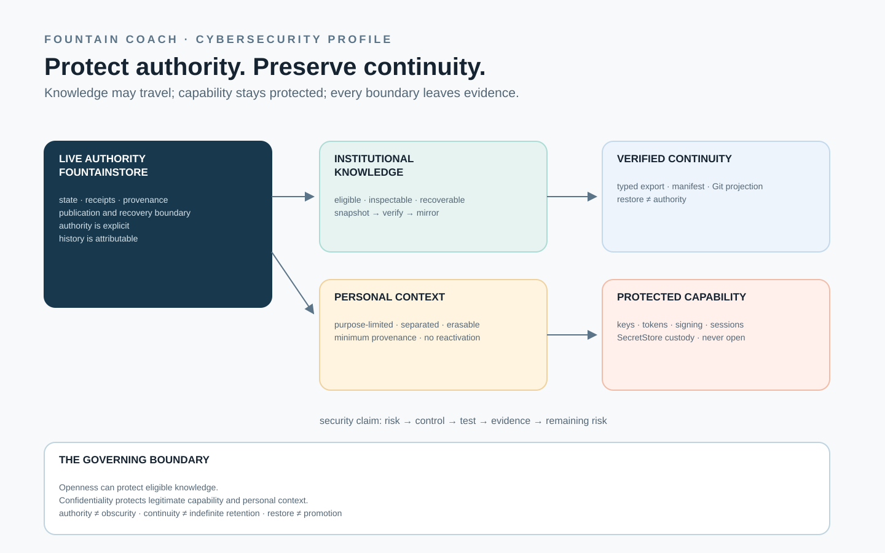

# 118 — European Cybersecurity Profile: Authority, Continuity, and Recoverability

> Chapter summary: Fountain Coach adopts a European risk-based cybersecurity profile for its runtime, instruments,
> FountainStore, publication estate, and products with digital elements. The profile protects authority and
> continuity rather than relying on obscurity, keeps legitimate secrets separate from eligible institutional
> knowledge, and makes the recovery boundary explicit without claiming legal compliance or certification.



*Principal illustration — a deterministic vector governance projection. It explains the profile's boundaries; it is
not a security audit, conformity assessment, live recovery receipt, or proof that every control has been implemented.*

This chapter is the non-destructive governance conversion of the supplied *Proposal — European Cybersecurity Profile
for Fountain Coach*. It retains the proposal's requirements and adds them to the existing architecture rather than
creating a parallel security subsystem. It provides the security basis for [Chapter 117](117-fountainstore-snapshot-export-and-git-recovery-projection.md)
and is read with the publication boundary in [Chapter 44](44-publication-and-source-policy.md), the Store authority
in [Chapter 95](95-fountainstore-headless-linux-authority.md), and the estate contract in [Chapter 116](116-fountainstore-owned-estate-edge-and-acme-promotion.md).

## Status and scope

This is an adopted engineering profile expressed as governance. It is not a legal applicability assessment and does
not declare compliance with NIS2, the Cyber Resilience Act, the Cybersecurity Act, the GDPR, or any other European or
national instrument. Technical adoption of a risk-based model does not itself establish that a law applies, that a
product is in scope, or that a certification has been obtained.

The profile applies to Fountain Coach systems, the Reframe runtime, FCIS-KIT instruments, FountainStore, the
publication and recovery estate, and products with digital elements. It governs the properties those systems must be
designed to make observable, the distinction between knowledge and capability, and the evidence required before an
implementation or release claim is made.

## The decision

Fountain Coach SHALL adopt a European risk-based cybersecurity model. Cybersecurity SHALL NOT be defined primarily as
secrecy, perimeter defence, or prevention of external inspection. The architecture SHALL instead protect, according to
the risks associated with a particular system or class of information:

- availability;
- authenticity;
- integrity;
- confidentiality;
- recoverability;
- provenance;
- accountability; and
- continuity.

Openness MAY itself be a cybersecurity control where public inspection, independent replication, deterministic
reconstruction, or distributed custody improves availability, authenticity, or integrity without violating a
legitimate confidentiality requirement.

Security SHALL therefore be derived from explicit authority, controlled capabilities, verifiable state, and
recoverable evidence rather than from obscurity of institutional knowledge.

## European basis

The profile is informed by the European cybersecurity principles represented by:

- Directive (EU) 2022/2555 — NIS2;
- Regulation (EU) 2024/2847 — the Cyber Resilience Act;
- Regulation (EU) 2019/881 — the Cybersecurity Act; and
- applicable European data-protection, product-security, and sector-specific obligations.

The model is concerned with risk management for the availability, authenticity, integrity, and confidentiality of
stored, transmitted, and processed data and services. Its engineering concerns include incident handling, business
continuity, backup and disaster recovery, supply-chain security, vulnerability handling, security assessment,
cryptographic policy, access control, and asset management.

The Cyber Resilience Act supplies a corresponding product-security model for products with digital elements: security
must be designed in, maintained according to risk, and supported by vulnerability-management processes. The European
Cybersecurity Act supplies a risk-proportionate assurance vocabulary of basic, substantial, and high. Those labels may
be used internally as engineering descriptions; they MUST NOT be presented as EU certification.

The legal dates, applicability, classification, reporting duty, and conformity route for a particular product remain
questions for a competent legal or conformity-assessment review. This chapter records the engineering basis only.

## Security objective

The security objective is institutional continuity under failure, compromise, and succession:

1. authority is bounded;
2. state is attributable;
3. history can be independently verified;
4. confidentiality is preserved where legitimate;
5. compromise is observable; and
6. institutional state survives the loss or corruption of machines, services, accounts, or operators.

For Fountain Coach this means, for example, that:

- FountainStore remains identifiable as the live authority;
- a publication route can be related to its manifest, source revision, and promotion receipt;
- a recovery projection can be checked without becoming a second live Store;
- a credential failure cannot silently become a successful publication claim; and
- a future authorized maintainer can discover how state, evidence, and permitted recovery are related.

## Three data classes

The estate SHALL distinguish three data classes rather than treating everything observed by a system as either public
or secret.

### Institutional knowledge

Institutional knowledge includes governance and technical specifications, semantic objects, schemas, source and
provenance records, dependency and version records, recovery manifests, public evidence, selected Store state, and
documentation needed to understand or reconstruct the system.

Eligible institutional knowledge SHOULD be open, reproducible, attributable, inspectable, and recoverable. It is not
public merely because it exists in a Store; eligibility is decided by classification, purpose, rights, and risk.

### Personal contextual data

Personal contextual data is distinct from institutional knowledge. It includes personal circumstances, preferences,
private correspondence, user-provided context, private working material, and contextual observations that may be
processed by an agent or instrument.

Personal context does not become institutional knowledge merely because it was observed, indexed, embedded,
referenced, summarized, cached, placed in model context, or used as evidence. Its use must have a defined purpose,
scope, authority, and retention period.

Where personal context influences an agent decision, publication, security conclusion, or institutional record, the
system MUST preserve minimum provenance sufficient to review that influence without disclosing the context itself.

### Authority-bearing capability

Authority-bearing capability includes keys, passwords, credentials, tokens, signing material, authenticated sessions,
and secret transport material. It is not institutional knowledge and MUST NOT be included in open recovery material.

Capability custody remains in the appropriate SecretStore-backed host adapter. A receipt may identify that a
credentialed operation was authorized and may record its terminal result; it must not contain the credential.

The boundary is therefore:

```text
institutional knowledge  → eligible for governed inspection and recovery
personal context         → purpose-limited, separated, and erasable
authority capability     → protected custody, never open recovery
```

## Confidentiality is explicit, not assumed

Information is excluded from an open projection only for an explicit reason. Possible reasons include personal-data
law, professional confidentiality, contract, intellectual property, security sensitivity, privilege, correspondence,
user expectation, or an identified operational risk.

Every exclusion MUST record its reason and scope. Encryption is valuable but is not a substitute for provenance,
integrity, access control, recovery, vulnerability handling, or transparency. A system is not secure merely because
its archive is encrypted, and an archive is not eligible merely because it is readable by its owner.

## Purpose limitation, contextual separation, and erasure

Information collected for one purpose MUST NOT be silently reused for another purpose. A recovery, publication,
security, or model context must not inherit a personal context merely because the systems can technically copy it.

The system SHALL support deletion or irreversible de-association of personal context where required, subject to a
documented legal or operational exception. Continuity is not indefinite personal retention. A durable institution can
forget ineligible context while preserving the fact that an omission or erasure occurred.

Snapshot, mirroring, Git history, restore, and downstream projections MUST preserve this boundary. A personal datum
does not become permanently eligible because it reached FountainStore, a snapshot, or a repository. A restore MUST NOT
reactivate context that is no longer eligible for the stated purpose.

## Open archive security

Durable, non-secret, eligible state SHOULD support inspection, replication, mirroring, verification, attribution,
comparison, and reconstruction. Publication, recovery, execution, and authority transitions remain separate
operations.

No single runtime, host, provider, account, or operator may silently rewrite or destroy the recoverable institutional
history. This extends [Chapter 117](117-fountainstore-snapshot-export-and-git-recovery-projection.md): FountainStore
is the live authority; a typed snapshot is a semantic recovery projection; production Git and the private off-host
mirror preserve that projection; neither becomes a second Store or publication edge.

The recovery chain is:

```text
authoritative FountainStore
  → consistent typed snapshot
  → classified export boundary
  → semantic recovery projection
  → manifest and content verification
  → Git history
  → independent mirror
  → recovery evidence
```

The export MUST exclude secrets and ineligible personal context, identify permitted omissions, retain content and
provenance relationships, and fail closed for unknown classifications or unverifiable content.

## Restore is not authority

Restoration is non-destructive by default and is separate from promotion. A verified snapshot is first restored into a
new or explicitly selected recovery Store. The target is then checked for compatibility, identity, integrity, semantic
equivalence, publication safety, and authority eligibility.

Restore MUST NOT:

- replay external side effects;
- republish content;
- overwrite the live Store;
- restore credentials or grant permissions;
- bypass validation; or
- reactivate ineligible personal context.

Historical operations return as evidence and state, not as automatically executable effects. Promotion to a live
authority is a new, explicitly authorized operation with its own receipt and rollback evidence.

## Security through evidence

Every security claim should follow the same chain:

```text
risk → requirement → control → implementation → test → evidence → assurance claim → remaining risk
```

The claim must be machine-readable where practical and must preserve the distinction between what is designed, what is
implemented, what was tested, and what has been released. Internal assurance labels MAY be `basic`, `substantial`, or
`high` when their evidence basis is stated. They do not constitute external assurance or formal EU certification.

## Vulnerability handling

Fountain Coach SHALL maintain a vulnerability process that can receive, triage, classify, remediate, test, release,
update, disclose, and record security defects. It must account for affected versions, dependencies, downstream
impact, mitigations, and evidence of closure.

Security defects are lifecycle events, not private notes that disappear after a patch. A release claim must identify
the relevant version boundary and the evidence that the defect was addressed or that a remaining risk was accepted.

## Supply chain and provider independence

Dependencies and providers are part of the security boundary. For each material dependency or provider, the system
should be able to state its version, origin, trust basis, capability, necessity, loss mode, and compromise impact.

The architecture SHOULD prefer open protocols, inspectable formats, deterministic exports, and replaceable providers.
Provider independence does not mean pretending that all providers are interchangeable; it means that a provider's
credential, outage, or policy change cannot silently redefine Fountain Coach's semantic authority or recovery path.

## Incident and recovery readiness

The recovery model must address compromise, operator error, software defect, hardware loss, provider outage, account
loss, network failure, corruption, upgrade failure, and personnel succession. Describing recovery is insufficient;
recovery exercises must produce evidence.

The exercise should prove that a permitted Store projection can be reconstructed, its identities and receipts
reconciled, its ineligible material remains excluded, and no historical side effect is executed merely because it was
present in the recovered state.

## Machine-readable continuity

Governance and recovery materials SHALL be structured so that an authorized future human or agent can determine:

- what exists;
- which authority owns it;
- what history led to it;
- what is executable;
- what evidence exists;
- where secrets are held without revealing them;
- what can be reconstructed;
- what is unavailable or intentionally omitted; and
- which procedure is required before promotion.

When personal context has influenced an institutional conclusion, its context provenance must remain reviewable at the
minimum necessary level. The record must not disclose private content merely to prove that a boundary was respected.

## Required amendment to Chapter 117

Chapter 117 SHALL be implemented and assessed with this profile. In particular, it must demonstrate:

1. FountainStore as the sole live Store authority;
2. Git as a typed recovery projection;
3. exclusion of secrets from the export;
4. classification and risk as the basis for confidentiality;
5. eligible non-secret knowledge as inspectable where appropriate;
6. openness as a possible security control;
7. independent verification of content and provenance;
8. provider independence;
9. restore without automatic authority or side effects; and
10. retained evidence for each transition.

The properties being mapped are availability, authenticity, integrity, confidentiality, recoverability, provenance,
accountability, and continuity. Personal-data controls additionally map purpose limitation, contextual separation,
erasure, and minimum context provenance.

## Acceptance criteria

The profile is not satisfied by prose alone. A governed implementation must be able to produce evidence for:

- **Authority:** Git cannot be read as a competing live Store or publication edge.
- **Secret separation:** credentials and signing material are absent from exports, commits, receipts, and telemetry.
- **Classification:** institutional knowledge, personal context, and authority capability have distinct decisions.
- **Integrity:** modified or incomplete content fails verification.
- **Provenance:** source Store, sequence, export, manifest, object, and receipt identities remain joined.
- **Availability:** a permitted projection can be independently recovered after loss of the original Store.
- **Provider independence:** recovery does not depend on one provider's unavailable service or private format.
- **Safe restoration:** recovery targets an explicitly selected Store and cannot silently promote or replay effects.
- **Testability:** negative cases are exercised, including unknown classification, schema incompatibility, missing
  content, changed identity, and attempted overwrite.
- **Evidence:** every claim names its source, implementation, test, evidence state, and remaining risk.

Where a fixture includes personal context, additional evidence must prove:

- ineligible context is blocked;
- cross-purpose reuse is blocked;
- erasure survives a new snapshot;
- omission or tombstone is represented in the manifest; and
- minimum context provenance is retained without exposing the content.

## Implementation doctrine

The profile is implemented by extending existing Swift Kits, MIDI2 contracts, FountainStore APIs, host adapters, and
publication gates. It does not call for a separate European subsystem, a proprietary parallel archive, a duplicate
Store, a cryptography reflex without a threat model, or abstraction inflation.

Each change should answer, in order:

1. What observable security property is required?
2. Which existing authority already owns the boundary?
3. What is the smallest typed change needed?
4. Which negative and positive tests prove it?
5. Which durable evidence supports the claim?

The Chapter 117 implementation kernel is the narrow end-to-end proof:

```text
authorized Store fixture
  → deterministic permitted snapshot
  → ordinary verified Git repository
  → loss of original Store
  → clean reconstruction
  → verified import into a new Store
  → semantic equivalence without authority promotion
```

Illustrative typed responsibilities are `FountainStoreSnapshotExporter`, `SnapshotManifest`, `SnapshotVerifier`, and
`SnapshotImporter`. Their final names remain subject to the live Swift repository and Kit contracts. Unknown
classification fails closed; missing or modified content fails; incompatible schemas fail safely; overwrite is not
implicit; and restored history remains evidence rather than execution.

## Definition of done

This chapter's decisive DoD is a repeatable, evidence-backed demonstration that an authorized FountainStore fixture can
be exported into a permitted, verifiable recovery projection, reconstructed after loss, and reconciled into a new
Store without restoring secrets, reactivating ineligible context, mutating operational authority, or executing
historical effects.

The public governance projection may explain this DoD before it is met. It MUST label the implementation, acceptance,
release, and remaining-risk states honestly. No illustration, page build, Git commit, or successful HTTP response can
substitute for the evidence cohort.

## Governing principle

> Fountain Coach cybersecurity protects authority rather than obscurity: legitimate secrets remain secret, while
> eligible institutional knowledge is made sufficiently open, attributable, verifiable, and recoverable that
> compromise of one system cannot silently redefine or erase the institutional truth. The resulting architecture is
> intended to provide not merely backup after failure, but continuity of institutional evidence under failure,
> compromise, and succession.

This is complemented by the data-governance principle that institutional knowledge should survive loss, compromise,
and succession, while personal context is retained only as long, as broadly, and for as much purpose as permitted.
Continuity and minimization are complementary duties.
