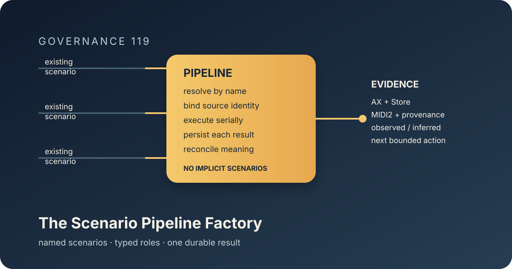

# 119 — The Scenario Pipeline Factory

> Chapter summary: Reframe composes existing named scenarios into reusable, serial pipelines. A pipeline definition
> is a durable plan with explicit stage roles, dependencies, evidence, and boundaries; it is not a second scenario
> authoring system and it never turns a design contract into executable behavior by assertion.



*Principal illustration — a deterministic vector governance projection. It explains the factory's shape; it is not a
live execution receipt, an acceptance result, or proof that every pipeline stage has an executor.*

## The decision

Reframe SHALL provide one governed pipeline model for composing existing named scenarios. A pipeline SHALL be named,
versioned, source-addressed, ordered, and durably persisted. Its stages SHALL retain the identity and claim boundary
of the scenarios they reference.

Pipeline creation is composition. It is not scenario authoring, scenario compilation, source mutation, publication,
or acceptance. A pipeline MAY arrange scenarios into a new reasoning sequence, but it MUST NOT alter their declared
meaning or silently promote their coverage.

```text
existing named scenarios
        │ resolve by human-readable identity
        ▼
pipeline definition
        │ typed order + dependencies + source identity
        ▼
serial stage execution
        │ each stage consumes the prior durable result
        ▼
one Store-backed evidence ledger
```

## Pipeline definition

Every definition MUST contain:

1. a human-readable name and semantic version;
2. the source or proposal identity from which its scenario references were resolved;
3. an ordered list of existing scenario names;
4. the capability or Swift executor responsible for each stage;
5. the inputs and durable outputs of each stage;
6. the terminal predicates and evidence authorities for each stage; and
7. the claim boundary of the complete pipeline.

The scenario name is the writer-facing address. Internal IDs, filenames, and implementation symbols MAY accompany it
for resolution and provenance, but MUST NOT replace the readable name in the command or result.

A definition with an unknown scenario, duplicate stage, ambiguous source identity, missing order, or missing executor
is rejected before persistence. Creation either stores one complete definition or stores nothing.

## Lifecycle

The writer-facing maintenance surface is deliberately small:

```text
/maintenance pipeline create
/maintenance pipeline inspect <name>
/maintenance pipeline run <name>
/maintenance pipeline resume <name>
```

`create` resolves and persists a definition. `inspect` reads the definition and current ledger without executing it.
`run` executes the stages serially from the first unresolved stage. `resume` continues from the last durable success
after a governed failure. These operations are distinct and MUST retain their own receipts.

Pipeline creation does not require a person to supervise every stage. A human approval is required only when a stage
crosses its own governed authority boundary, such as destructive mutation, paid-provider use, publication, or release.
Routine validation, evidence collection, and continuation are the pipeline's responsibility.

## Stage roles

Actors do not become useful merely by appearing in a contract. Each stage MUST bind its actors to a job:

| Stage role | Job | Completion evidence |
| --- | --- | --- |
| resolver | locate the named scenario and source identity | unambiguous scenario binding |
| executor | perform the scenario's admitted operation | typed terminal event |
| witness | observe the independent surface | AX/window/VRT evidence where required |
| ledger | persist the result and provenance | FountainStore receipt |
| reconciler | compare intention, observation, and claim boundary | explicit observed/inferred/not-established result |

The pipeline may implement several roles in one Swift adapter, but it MUST preserve the distinctions in its evidence.
No stage may report success because an earlier actor was present, a process started, or a file was written.

## Seriality and continuity

Stages execute in declared order. Stage `n+1` may start only after stage `n` has emitted its durable terminal result.
The next stage receives the persisted result, not a reconstructed copy of the preceding stage's transient memory.

The ledger records `pending`, `running`, `succeeded`, and `failed` state, with one pipeline identity and one source
identity. A failure preserves the failed stage and its evidence. Resume begins at the last stage that durably
succeeded; it does not replay successful side effects unless the scenario explicitly declares replay as safe and
idempotent.

## Evidence and claim boundaries

Pipeline completion means that every declared stage reached its own terminal predicate and the complete evidence set
was reconciled. It does not mean that the estate was published, released, or redesigned successfully unless those
claims are explicitly declared and independently evidenced.

The pipeline result MUST present, for humans and machine readers:

- motivation and intended journey;
- the stage currently reached and why it is next;
- observed results and their authorities;
- inferred conclusions, labelled as inference;
- unresolved or not-established claims;
- the next bounded action; and
- the source, pipeline, scenario, Store, and executor identities.

The result is a reading of the work, not a compiler transcript. Technical events support the explanation; they do not
replace it.

## Kit and runtime ownership

`FountainCoachMaintenanceKit` owns the typed maintenance operations, pipeline definition, validation, state machine,
and evidence boundary. `ReframeSkillKit` owns the Reframe skill identities. Reframe provides the Swift host adapters
and routes them through the MIDI2 instrument contract. FountainStore owns durable definitions, stage results, and
receipts. Agent procedures may explain how to operate the system but are not runtime authority.

No Python, Node, shell launcher, guessed HTTP route, or filesystem convention may serve as the pipeline executor when
the declared Swift kit and host adapter are available.

## Governing rules

1. Compose existing named scenarios; never create an implicit scenario as a side effect of `pipeline create`.
2. Resolve every name and source identity before persistence.
3. Keep creation, inspection, execution, resume, publication, and release as separate operations.
4. Execute serially and continue automatically across ordinary stages.
5. Persist every transition and consume prior-stage results from FountainStore.
6. Stop only at a typed failure or an explicitly governed human authority boundary.
7. Preserve each scenario's claim boundary; pipeline composition cannot strengthen evidence.
8. Report motivation, observation, critique, learning, and next action in human-facing language.

## Governing sentence

Reframe shall turn existing named scenarios into one durable, serial, evidence-bearing reasoning sequence without
inventing scenarios, laundering technical completion into human meaning, or making the writer supervise the machine.
