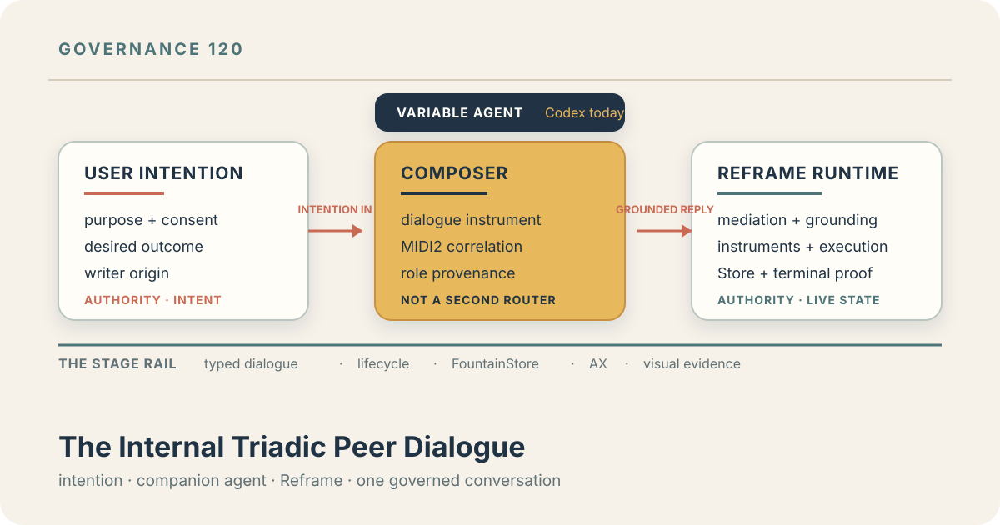
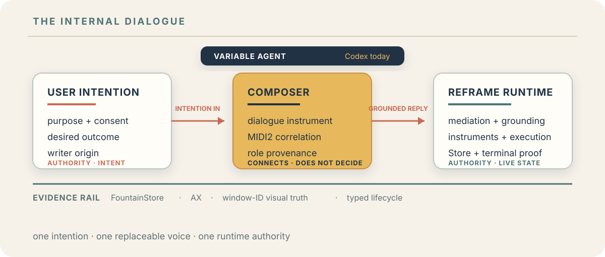

# 120 — The Internal Triadic Peer Dialogue

> Chapter summary: Reframe's internal Composer dialogue has three distinct participants: the user's intention,
> a replaceable companion agent, and Reframe as the semantic and runtime host. MIDI2 carries their typed exchange;
> the Composer connects them; Copilot remains the writer-facing surface. Personification makes the dialogue legible,
> but it never merges authority or turns an agent reply into evidence.



*Principal illustration — a deterministic vector governance projection. It makes the internal dialogue roles
visible; it is not a live peer receipt, a model transcript, or proof that a runtime binding has been accepted.*

## The decision

Reframe SHALL model its writer-facing reasoning as an internal triadic peer dialogue. The three participants are
distinct even when they appear in one Copilot conversation:

1. **User intention** originates the purpose, desired outcome, and authorization boundary.
2. **The companion agent** reasons over grounded state and frames the next question or action. Codex is the current
   agent implementation, not a permanent role identity.
3. **Reframe** mediates the request, resolves its commands and MIDI2 instruments, executes permitted work, and owns
   semantic and runtime state.

The Composer is the internal dialogue instrument between these roles. It is not a second command router, a compiler,
or an authority that can promote a conversational answer into a completed operation.

## The arrangement

The stage is intentionally simple: intention enters from the writer, the companion agent gives it a reasoned voice,
and Reframe grounds the exchange in the live estate. MIDI2 is the typed channel; FountainStore, AX, and the runtime
remain their respective evidence authorities.



*Stage projection — a deterministic vector diagram. The arrows describe the dialogue contract, not an observed run or
an assertion that each role is a separate process.*

This is a logical internal role arrangement. It does not claim that the user's intention is a separate process, that
the Composer is hardware, or that every participant is a separately released MIDI endpoint. Chapter 70 governs an
external MIDI2 peer; Chapter 71 governs two Reframe processes. This chapter governs the internal dialogue contract
inside one Reframe-hosted Copilot experience.

## What each role does

| Participant | Job | Authority | Writer-visible expression |
| --- | --- | --- | --- |
| User intention peer | State what should be understood, changed, or decided | purpose, consent, and desired outcome | `You` / writer-originated intention |
| Companion agent peer | Interpret grounded state, explain options, ask focused questions, and propose the next bounded move | reasoned proposal only; never live-state authority | `Codex` today, or another admitted agent name |
| Reframe runtime peer | Mediate, resolve, execute, persist, and report typed state | commands, MIDI2 instruments, lifecycle, and Store evidence | `Reframe` answer or operation result |
| Composer instrument | Carry the correlated dialogue between the roles | transport and correlation only | one Copilot conversation with speaker provenance |

The names are semantic labels supplied by the participant binding. They are not prompt decoration and must not be
hard-coded into the operation's meaning. A different admitted agent may occupy the companion role without changing
the user-intention or Reframe authorities.

## How Copilot presents the dialogue

Copilot remains the writer-facing surface because it accompanies the writer's intention into grounded work. Its
conversation may present the three voices as:

```text
You:     Refactor the estate as a readable journey.
Codex:   I will inspect the existing scenario composition and ask Reframe what is currently executable.
Reframe: The named pipeline resolves to these instruments; this stage is the next admitted operation.
Codex:   Given that result, the next bounded change is ...
```

The visible speaker label is provenance, not a claim of authority. The internal MIDI2 exchange may be hidden behind
the Copilot surface, but the role, correlation, lifecycle state, and terminal result must remain available to the
accessibility and evidence surfaces. “Copilot” therefore still describes the writer-facing relationship; it does not
mean that one model is the whole architecture.

## Role binding without hard-coded personification

At admission, the Composer receives a typed participant binding containing the role, readable name, peer identity,
and declared dialogue traits. The agent peer may be backed by the Codex server or another admitted host adapter. The
runtime must not infer roles from transcript phrases, silently rename a participant, or bake “You are Codex” and “You
are Reframe” into an unchangeable protocol.

The binding is durable for the dialogue correlation and is inspectable with the operation. Replacing the companion
agent changes the participant binding and its provenance; it does not change the meaning of the user's intention or
grant the agent Reframe's execution authority.

## The governed exchange

The normal reasoning sequence is:

```text
intention admitted
        → companion agent frames the question
        → Reframe grounds it in live commands and instruments
        → Reframe answers or asks for a bounded clarification
        → companion agent reacts to that answer
        → user confirms, revises, or stops
        → an authorized operation runs through the same boundary
```

The companion agent may ask Reframe to inspect, explain, compose, run, or propose. It may not bypass Reframe's
mediation with AX text injection, guessed HTTP routes, shell launchers, or an untyped side channel. A request to mutate
the estate remains a governed operation with its own lifecycle, authority boundary, and terminal predicate.

## Why the triad improves reasoning

The arrangement prevents three common confusions:

- a proposal is not mistaken for live state;
- a runtime result is not mistaken for the user's intention; and
- a personified reply is not mistaken for durable evidence.

It also makes short dialogue useful. Reframe supplies the current command and instrument facts; the companion agent
can immediately react to those facts; the writer can see why the next action follows. Motivation, observation,
critique, learning, and next action remain a human-facing reasoning sequence rather than a compiler transcript.

## Evidence and claim boundaries

MIDI2 carries the typed dialogue and operation correlation. FountainStore persists the intention reference, participant
binding, request, response, lifecycle, and terminal receipt. AX establishes what the writer-facing Copilot surface
exposed. CoreGraphics window-ID capture establishes visual truth when a live display claim is made. Runtime logs are
telemetry, not behavioral authority.

A successful Composer exchange proves that the dialogue was admitted and answered. It does not by itself prove that
an estate mutation occurred, that a scenario was executed, or that a publication was deployed. Those claims require
the same operation-specific evidence required when the request is made directly through Reframe.

## Governing rules

1. Preserve user intention as a distinct participant and the authority for purpose and consent.
2. Treat the companion agent as replaceable; Codex is the current implementation, not a hard-coded protocol identity.
3. Keep Reframe authoritative for mediation, live command resolution, instrument execution, and runtime state.
4. Treat the Composer as a dialogue instrument, not a second command router or compiler.
5. Bind readable names, roles, identities, and traits through typed participant metadata, not transcript heuristics.
6. Carry dialogue and operation correlation over the governed MIDI2 boundary.
7. Preserve speaker provenance in Copilot and in FountainStore evidence.
8. Require operation-specific lifecycle and terminal evidence before making a behavioral claim.
9. Keep Copilot as the writer-facing surface while preserving the triadic architecture beneath it.
10. Do not use personification, model output, AX text injection, HTTP, Python, Node, or shell shortcuts as a substitute
    for the Reframe Swift/MIDI2 boundary.

## Governing sentence

Copilot is the writer-facing surface of a triadic internal peer dialogue: user intention originates, a replaceable
companion agent reasons, Reframe grounds and executes, Composer connects them, and evidence keeps their authorities
distinct.
