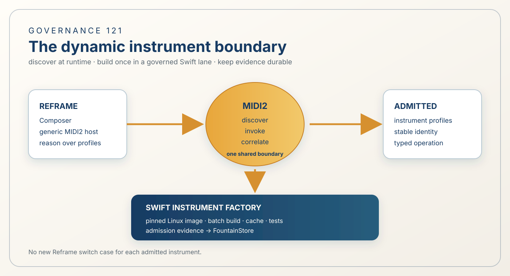

# 121 — The Dynamic MIDI2 Instrument Factory

> Chapter summary: Reframe discovers and uses admitted MIDI2 instruments through a generic host boundary. A Swift
> Instrument Factory creates new instruments in a governed build environment; it does not turn every new instrument
> into a compiled switch case in Reframe.



*Principal illustration — a deterministic vector governance projection. It explains the intended boundary; it is not
a build receipt, an admission result, or proof that the dynamic registry is already complete.*

## The decision

Reframe SHALL host one generic MIDI2 instrument boundary. New admitted instruments SHALL be discoverable by their
typed MIDI2 profiles and invocable through the shared operation contract. Reframe MUST NOT require a new compiled
per-instrument dispatch switch merely because the estate gains another instrument.

The Instrument Factory SHALL be a separate FountainCoachMaintenanceKit-owned MIDI2 instrument. It SHALL create,
validate, build, test, admit, and record instruments in batches. The factory is a creation and promotion boundary; it
is not a second runtime, a hidden compiler invocation, or an authority that can self-admit its output.

```text
human intent
    │
    ▼
Reframe Composer ── MIDI2 discovery/invocation ──► admitted instrument profiles
    │                                                  │
    │                                                  └── generic Reframe dispatch
    │
    └── Instrument Factory request ──► pinned Swift build image
                                         │
                                         └── artifact + tests + admission evidence
```

## Runtime use without Reframe recompilation

An admitted instrument publishes a stable identity, version, operation, inputs, outputs, lifecycle, terminal
predicates, evidence authorities, and claim boundary through its MIDI2 profile. Reframe's Composer reasons over that
discovered profile and invokes the shared operation boundary. The instrument's implementation remains on its host;
Reframe does not import its source or learn a private command vocabulary.

This means a new instrument can be used without rebuilding Reframe when all of the following are already true:

1. the generic MIDI2 endpoint/device host is present;
2. the instrument profile is admitted and discoverable;
3. the operation conforms to the repository MIDI2 IDL;
4. the Composer can reason over its declared traits and current state; and
5. FountainStore, lifecycle, telemetry, and terminal evidence use the shared contracts.

This is runtime composability, not compiler magic. A genuinely new Swift implementation still needs compilation and
promotion somewhere. It simply does not require a new Reframe switch case after the generic boundary exists.

## The factory instrument

The factory has one stable identity and one batch-oriented operation. Its request names one or more instrument
intents, source identities, contract revisions, and desired dependencies. It returns a durable plan before execution
and a per-instrument evidence record after execution.

The factory SHALL:

- resolve each intent to a named instrument contract or report a missing requirement;
- calculate content identities for contracts, dependencies, and generated artifacts;
- reuse unchanged generated output and compiled artifacts from its local cache;
- execute independent validation and build jobs in parallel;
- compile shared Swift products once per compatible toolchain image;
- run focused tests for changed instruments and one consolidated acceptance matrix;
- require explicit admission and release decisions at their own authority boundaries; and
- persist failures, partial results, provenance, and resumable state in FountainStore.

The factory MAY optimize unchanged work. It MUST NOT use a cache hit to imply that a changed contract, changed
implementation, missing evidence, or failed admission has passed.

## Swift and Linux build boundary

The factory core SHALL be portable Swift and SHALL run on macOS and Linux. The high-volume build lane SHOULD run on a
pinned Linux image containing the exact Swift toolchain and portable dependencies. The image identity, source
revision, package resolution, compiler version, artifact digests, tests, and admission result belong in the receipt.

The portable core MUST NOT import AppKit, SwiftUI, Accessibility, CoreGraphics, Metal, WebKit, Foundation Models,
Keychain, or assume a graphical session. macOS host adapters retain responsibility for Reframe's writer-facing AX,
window-ID, and visual acceptance. A Linux build lane can create and run headless instruments without becoming a
second semantic authority.

No Node, npm, GitHub Actions, GitHub API, hosted runner, or network-only service may be required for factory
execution, generation, validation, build, admission, or release. Git hosting, if used for source transport, is not a
runtime dependency and cannot be required by the factory's correctness path.

## MIDI2 and Store boundaries

MIDI2 carries discovery, operation requests, lifecycle events, correlation, and compact result references. It MUST NOT
be treated as an arbitrary binary-artifact channel. Large artifacts are addressed by digest through the governed
artifact/Store boundary.

FountainStore remains authoritative for factory plans, cache identities, build receipts, lifecycle transitions,
terminal evidence, admission, release provenance, and resumable failures. Reframe's AX and CoreGraphics witnesses
remain authoritative only for the writer-facing and visual claims they can observe.

The factory is not allowed to write directly into Reframe's private runtime state. A remote result becomes usable when
its MIDI2 profile is admitted and its Store receipt establishes the artifact and contract identity. Reframe may then
discover and invoke the instrument through its generic host boundary.

## Completion and claim boundaries

The factory's human-facing result SHALL explain:

- what instrument intent was requested and why;
- which existing profile was selected, or what requirement was missing;
- what work was reused and what work was performed;
- which tests and terminal predicates were observed;
- which conclusions are inferred rather than directly evidenced;
- which instruments were admitted, refused, or left incomplete; and
- what the next bounded action is.

“Built” does not mean “admitted.” “Admitted” does not mean “released.” “Available over MIDI2” does not mean “the
writer-facing GUI was accepted.” Each claim carries its own Store, MIDI2, AX, or build artifact evidence.

## Migration from the compiled switch

The existing per-instrument switch is a migration seam, not the target architecture. The migration SHALL proceed in
this order:

1. define the generic MIDI2 discovery and invocation contract;
2. expose the current instruments through that contract while preserving their identities and evidence;
3. add registry resolution, compatibility checks, and missing-instrument requests;
4. move instrument-specific dispatch behind host adapters or admitted MIDI2 profiles;
5. prove that a newly admitted instrument can be discovered and invoked without changing Reframe source; and
6. remove each obsolete switch branch only after negative search, focused tests, and live Store/MIDI2 evidence show
   that no consumer depends on it.

The migration MUST preserve the existing operation semantics. It MUST NOT replace a known operation with a generic
“run anything” escape hatch, infer an instrument from a filename, or make a chat proposal executable by assertion.

## Governing rules

1. Reframe hosts a generic MIDI2 instrument boundary; it does not grow a new per-instrument switch for every factory
   output.
2. The Instrument Factory is a governed FountainCoachMaintenanceKit instrument with durable plans, evidence, and
   explicit admission/release boundaries.
3. Runtime use of an admitted conforming instrument does not require recompiling Reframe.
4. New Swift implementations still require a compiler, but compilation belongs to the factory build lane, preferably
   a pinned portable Linux image for headless work.
5. MIDI2 carries discovery, commands, lifecycle, and result references; FountainStore carries durable artifacts and
   proof.
6. No Node, npm, GitHub service, hosted CI, or network-only dependency may be required for factory correctness.
7. Cache reuse may remove unchanged work, never changed-work validation or evidence.
8. A missing profile becomes a typed missing-instrument request; the factory never silently substitutes behavior.
9. macOS AX and visual acceptance remain host-specific witnesses and do not define portable semantic authority.
10. The factory reports observed, inferred, and not-established results separately and never upgrades one claim into
    another.

## Governing sentence

Reframe remains stable while the estate grows: the Composer discovers admitted MIDI2 instruments through one generic
boundary, and a portable Swift Instrument Factory creates and promotes new instruments with evidence rather than
turning every new capability into another Reframe switch.
