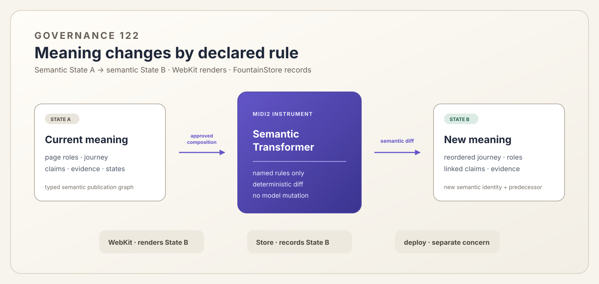

# 122 — The Governed Semantic Transformation Instrument

> Chapter summary: A semantic transformer is a MIDI2 instrument that applies an explicit, deterministic scenario
> change to the meaning of a publication estate. It does not render pages, move files, write servers, or deploy.



*Principal illustration — a deterministic vector governance projection. It explains the authority boundary; it is not
a runtime result, mutation receipt, or claim that the transformer has been implemented.*

## The decision

The semantic transformer SHALL be a separate, named MIDI2 instrument. It SHALL transform only the semantic publication
model: the meanings, relationships, roles, states, and explicitly supplied editorial assignments that make an estate
understandable to a human reader and a machine reader.

It SHALL receive an approved, ordered composition of existing named scenarios and a typed State A. It SHALL return a
typed State B and a semantic diff. The same State A, scenario composition, instrument version, templates, and approved
assets SHALL produce the same State B and content identity.

```text
State A: semantic publication graph
          + approved scenario rules
          + supplied editorial assignments
                     │
                     ▼
     fountaincoach.semantic-transformer@version
                     │
                     ▼
State B: semantic publication graph + semantic diff
```

## What is transformed

The instrument may change:

- a page's declared role in the estate;
- the intended order of the visitor journey;
- relationships between domains, claims, and evidence cohorts;
- publication-state meaning and its visible explanation;
- domain descriptions and shared semantic vocabulary;
- explicitly approved text, image assignments, captions, and alternative text.

It may not invent facts, silently rewrite a source, strengthen a claim, or infer approval from a visual result. A
scenario that describes an intention is not by itself an instruction to alter the estate. The transformation rule
must identify the semantic field it changes and the boundary it preserves.

## What it does not do

The semantic transformer does not own:

- MIDI transport, peer discovery, or Composer mediation;
- WebKit loading, DOM painting, or screenshot capture;
- HTML serving, URL routing, filesystem copying, or deployment;
- FountainStore selection, persistence, or remote promotion;
- model-provider choice or freeform editorial invention.

Those are separate instruments or host responsibilities. WebKit renders the semantic State B. FountainStore records
the admitted state and its predecessor. A publication/deployment instrument makes that recorded state available at a
host. None of those boundaries changes the meaning of State B.

## The MIDI2-CI contract

The instrument advertises its stable identity, version, supported scenario-operation vocabulary, input and output
schemas, deterministic renderer/materialization dependencies, evidence authorities, and claim boundary through MIDI-CI
discovery and Property Exchange. Its operation request names the State A identity and the scenario composition; it does
not carry an unbounded prompt as an implicit mutation program.

Reframe's Composer mediates the writer's intention and resolves existing named scenarios. The Composer may ask for a
preview. It may not declare a semantic transformation successful. The instrument returns a preview or committed result
only through the typed MIDI2 lifecycle, with correlation, failure, and terminal evidence.

## Preview, approval, and commit

Every mutation follows one visible sequence:

1. read State A from its declared authority;
2. resolve and validate the existing named scenario composition;
3. calculate State B without writing the estate;
4. show the human-facing semantic diff;
5. obtain the required approval;
6. persist State B with State A as predecessor;
7. hand the persisted state to the renderer and publication boundary.

The preview is not a mutation. A WebKit DOM change that is not serialized and persisted is only an ephemeral view.
Conversely, a Store write without a semantic diff is not an acceptable transformation record.

## Determinism and models

Model calls may interpret a writer's open intention, ask for clarification, or select among existing scenario
contracts. They do not write State B. Once the scenario composition and semantic rules are resolved, the transformer
executes typed operations without a model call. Changed rules, templates, source identities, or supplied assets change
the result identity and require a new preview and evidence.

## Governing rules

1. The semantic transformer is a MIDI2 instrument, not a WebKit feature or a deployment script.
2. Its input and output are semantic publication states, not server paths or screenshots.
3. It applies explicit scenario rules and supplied editorial assignments only.
4. It returns a deterministic State B and semantic diff for a fixed, fully identified input.
5. WebKit renders State B but does not decide or persist its meaning.
6. FountainStore records State B, its predecessor, source identity, scenario composition, and terminal evidence.
7. A model may propose or mediate; it may not directly mutate the publication state.
8. Preview, approval, commit, rendering, and deployment remain visibly distinct claims.

## Current boundary

This chapter defines the missing semantic authority boundary. The repository currently contains scenario contracts,
MIDI2 peer discovery, publication snapshot plumbing, WebKit projection, and FountainStore synchronization, but it does
not yet contain this operation-bearing semantic transformer. No site mutation is claimed until the instrument is
implemented, admitted, and independently accepted.

## Governing sentence

The semantic transformer changes what the estate means from State A to State B through a deterministic MIDI2 instrument;
WebKit shows that meaning, and FountainStore records it, but neither rendering nor logistics may invent the change.
