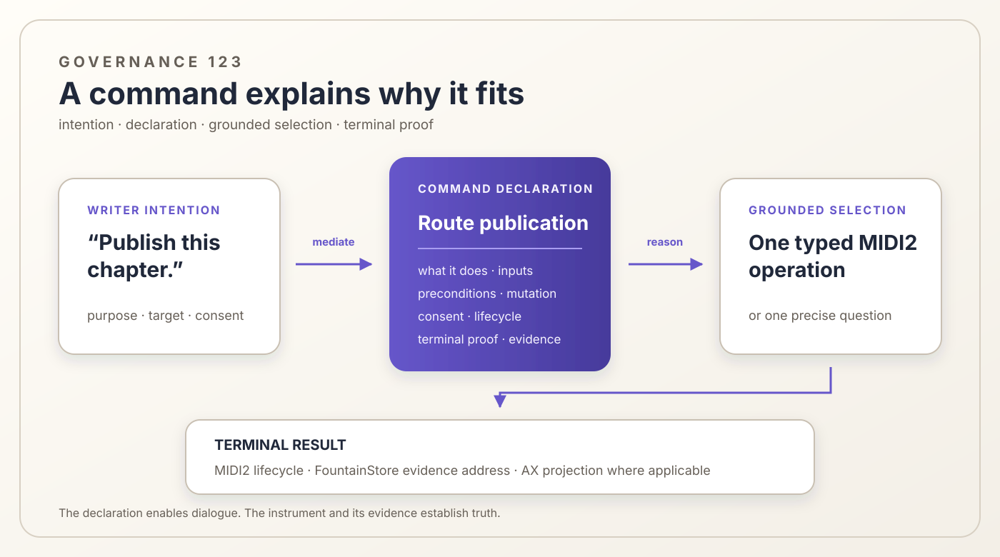

# 123 — Commands Must Be Legible to Reasoning

> Chapter summary: Every Reframe command publishes a reasoning-facing semantic declaration through the MIDI2
> instrument boundary. The declaration enables grounded selection and dialogue; the MIDI2 IDL remains the sole
> operational contract.

*Principal illustration — a deterministic governance projection. It explains how command declarations support
reasoning and dialogue; it is not a command-catalog response, operation receipt, or live acceptance record.*

## The decision

Every command Reframe exposes SHALL carry a reasoning-facing semantic declaration. A command name and one-line label
are not enough. The declaration must let a companion agent compare the writer's intention with what the command
actually does, explain that comparison in dialogue, identify missing information, and predict what evidence would
establish completion.

The declaration is a discoverable projection of the existing MIDI2 instrument and operation contract. It does not
create an OpenAPI, a second command router, or a prose authority beside the MIDI2 IDL. Operational identity, arguments,
lifecycle, and result types remain governed by the IDL and live instrument state.

\`\`\`text
writer intention
      │
      ▼
Composer mediation
      │
      ▼
reason over live command declarations + live Reframe/FountainStore state
      │
      ├── no grounded fit ──► ask one precise question or report the missing command
      │
      └── grounded fit ─────► invoke one existing typed MIDI2 operation
                                      │
                                      ▼
                           terminal result + evidence address
\`\`\`

## Why names and terse help fail

A short name helps a human remember a command after learning it. It does not tell a reasoning peer enough to select
that command safely. “Sync”, “run”, “publish”, or “materialize” can each hide different authorities, targets,
preconditions, mutations, confirmations, and terminal meanings.

When those facts are absent, an agent has only bad options: choose from memory, infer effects from wording, search
implementation details, try commands until one advances, or ask the writer to babysit the run. None is grounded
reasoning. The defect belongs to the command declaration, not to the writer's phrasing.

## The declaration standard

Every discoverable command declaration SHALL provide:

1. **Stable semantic identity** — the command name, owning MIDI2 instrument, operation identity, and contract version.
2. **Invocation grammar** — the exact usage, named inputs, required and optional values, and value meanings.
3. **Short description** — one sentence supporting rapid catalogue scanning.
4. **Long semantic description** — what intention the command satisfies, what it deliberately does not satisfy, and
   the human-facing outcome it is designed to produce.
5. **Preconditions and availability** — the live state required before invocation, current availability, and a typed
   reason when unavailable.
6. **Effect and mutation boundary** — the authoritative State A it reads, the State B it may establish, the systems it
   may mutate, and the boundaries it cannot cross.
7. **Authorization and cost** — confirmation, role, consent, credential, provider, or spend conditions that may pause
   execution.
8. **Lifecycle and turn ownership** — admitted, awaiting-confirmation, running, blocked, canceled, failed, and
   succeeded states, including which peer may speak or act next.
9. **Terminal predicates** — the facts that must become true before success may be claimed.
10. **Evidence addresses** — the FountainStore records, result identities, MIDI2 terminal events, and applicable AX
    projections by which those predicates can be checked.

The short description supports discovery. The long description supports semantic comparison. The remaining fields
support safe execution and proof. None may promise an effect the owning instrument cannot establish.

## One declaration, several projections

The same declaration has several audiences without becoming several contracts:

- /commands presents readable names, usage, descriptions, availability, and relevant live state;
- MIDI-CI Property Exchange exposes instrument identity, profiles, operation vocabulary, and declaration properties to
  software peers;
- Composer receives the semantically relevant declaration subset for the current intention;
- Copilot presents the human-facing explanation, clarification, confirmation, progress, and result; and
- generated reasoning orientation may index the declarations but may not override their live state.

These projections must share stable identities and meanings. A button, slash command, natural-language request,
scenario actor, and remote peer may differ in presentation, but they cannot teach different effects for the same
operation.

## The governed reasoning sequence

For an operational dialogue, the companion agent SHALL:

1. establish peer identities through MIDI-CI before Composer traffic begins;
2. obtain the current command surface once from Reframe;
3. restrict attention to declarations semantically relevant to the writer's stated outcome;
4. compare intention, required inputs, preconditions, effect, authorization, and terminal predicates;
5. explain the selected fit, or ask one precise question when no unique safe fit exists;
6. invoke one existing command through Composer mediation;
7. respect MIDI2 lifecycle and turn signals rather than speaking over a running or awaiting-confirmation operation;
8. follow the terminal event to its declared evidence addresses; and
9. report only the result those artifacts establish.

The agent does not select by lexical similarity, command order, numeric score, historical familiarity, or private code
search. It does not invent a missing field, broaden an effect, or silently substitute a neighboring operation.

## Dialogue is part of the operation

A useful declaration lets Composer turn uncertainty into a small, truthful exchange:

\`\`\`text
Writer: Publish this chapter.

Codex: The route-scoped publication command matches that outcome.
       It will update one declared route, requires the remote Store credential,
       and completes only after remote read-back and public digest verification.
       Shall Reframe proceed?

Reframe: Awaiting writer confirmation.
\`\`\`

This is not decorative conversation. The explanation identifies the selected operation, mutation boundary,
authorization gate, and completion proof before execution. If the declaration cannot support that explanation, the
command is not ready for reasoning-facing use.

## OpenAPI is only an analogy

An OpenAPI document can make an HTTP operation inspectable, which is why its combination of names, descriptions,
inputs, and outcomes is a useful analogy. Reframe does not adopt OpenAPI for its command plane. HTTP routes are not the
operational authority, and a generated HTTP schema cannot replace MIDI-CI discovery, the MIDI2 IDL, FountainStore
state, or instrument-owned terminal evidence.

The applicable pattern is **self-describing operations**, not an additional protocol.

## Validation and drift

A declaration is executable governance and must be checked against its owner. Validation SHALL fail when:

- a command has no owning instrument or typed operation;
- usage names an input the operation does not accept, or omits a required input;
- the description promises an effect outside the mutation boundary;
- availability disagrees with live preconditions;
- confirmation, credential, cost, or provider gates are hidden;
- success lacks terminal predicates or evidence addresses;
- two projections give the same operation different meanings; or
- a retired operation remains visible as available.

The command catalogue is therefore generated or validated from the admitted instrument registry and live state. A
hand-maintained list may explain, but it cannot become a stale inventory authority.

## Governing rules

1. Every Reframe command publishes a reasoning-facing semantic declaration.
2. The MIDI2 IDL and live instrument state remain operational authority; the declaration is their semantic projection.
3. A declaration includes identity, usage, short and long descriptions, inputs, preconditions, availability, effects,
   authorization, lifecycle, terminal predicates, and evidence addresses.
4. Codex and other companion agents obtain the live command surface before operational selection.
5. Selection is a semantic comparison with writer intention and live state, never a phrase match or remembered recipe.
6. Composer asks when the declaration or live state cannot establish one safe fit.
7. One selected command enters one typed MIDI2 operation path and retains one correlated lifecycle.
8. Turn ownership is signaled through MIDI2 lifecycle; dialogue must not race execution or confirmation.
9. Acknowledgement and completion are distinct; terminal evidence establishes the result.
10. OpenAPI, private code search, transcript matching, and trial-and-error invocation are not command authority.

## Current boundary

Reframe already exposes command names, usage, descriptions, availability, MIDI2 identities, lifecycle events, and
FountainStore results across several surfaces. Those facts are not yet governed as one complete declaration standard,
and not every command necessarily supplies every field above. This chapter defines the convergence target; it does not
claim that the current catalogue has passed a declaration audit.

## Governing sentence

A Reframe command must explain itself well enough for a companion agent to reason with the writer before acting, while
the MIDI2 instrument contract and terminal evidence remain the authority for what the command can make true.
