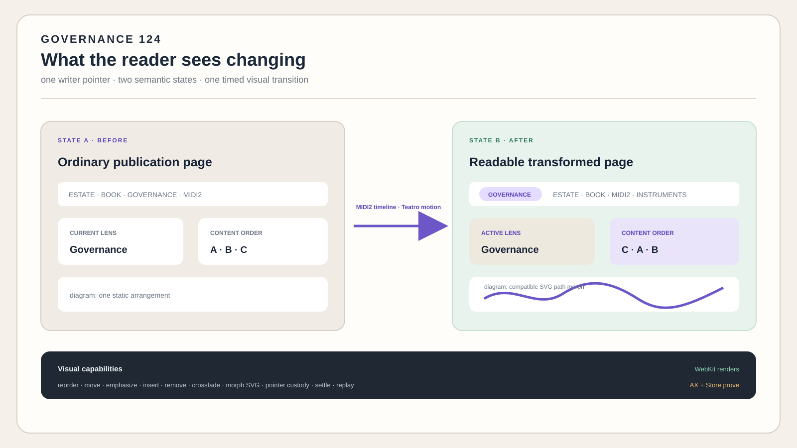

# 124 — MIDI2-Timed WebKit Transitions

> Chapter summary: This chapter specifies how an identified semantic State A becomes an identified semantic State B
> through discoverable MIDI2 slots, a correlated timeline, a Teatro transition plan, and WebKit rendering. WebKit
> remains the full web platform; Teatro coordinates motion; MIDI2 carries identity, timing, and lifecycle; AX and
> FountainStore establish independent proof.



*Principal illustration — deterministic vector governance projection. It explains the protocol boundary; it is not a
runtime trace, animation receipt, accessibility result, or live-acceptance claim.*

## What this chapter is—and is not

This is a governance chapter. It defines the contract that an implementation must satisfy; it does not contain the
implementation, run the animation, or turn an illustration into evidence.

The implementation belongs to an existing Teatro scenario. Its live result belongs to the acceptance record: MIDI2
discovery and timeline, Teatro plan, WebKit surface, AX state, window-ID capture, and FountainStore receipt.

The chapter may describe those obligations precisely, but it must never claim that an obligation is fulfilled merely
because the rule, mock, or source code exists.

## Normative transition contract

### State transition record

A conforming request contains `sourceStateIdentity`, `targetStateIdentity`, `semanticDiffIdentity`,
`sourceRevision`, transformer identity and version, scenario composition identity, participating slot declarations,
timeline identity, and claim boundary. State identities refer to semantic publication records, never to screenshots,
server directories, or uncommitted DOM. State B SHALL carry an explicit `publishable` Boolean. `publishable: true`
means that the state satisfies the semantic transform's declared publication eligibility; it does not authorize
publication, replace the remote Store receipt, or assert that the state has been published. A missing field in a
legacy State A decodes as `false`.

The diff classifies each affected address as unchanged, moved, inserted, removed, reflowed, emphasized,
de-emphasized, content-replaced, or relation-changed. Unchanged addresses and their content identities remain stable.
A renderer may not create a semantic change that the transformer did not return.

### Shared visual pointer custody

The rendered pointer is one writer-originated visual instrument. It is not a Codex cursor, a second dialogue
channel, or a semantic mutation by itself. When the writer points at a DOM region and adds a comment, WebKit emits a
typed visual anchor containing the route, stable DOM/AX address, semantic role, visible text digest, source revision,
State identity, viewport observation, and the writer's comment. A transient screen coordinate may assist selection,
but it is never the durable identity of the addressed content.

The Composer admits that anchor into the existing triadic dialogue and hands its custody to the named participant by
MIDI2. The writer remains the origin peer; the active character may receive, inspect, speak about, and return the
pointer; Codex may reason over the received anchor; and Reframe remains the mediation and runtime authority. No peer
may claim to have pointed when the writer originated the event, and no peer may silently turn a pointer comment into
a semantic change.

Pointer custody is a correlated MIDI2 lifecycle, not an unrecorded UI gesture:

```text
writer points → anchor admitted → Composer hands custody to character
  → character/Codex responds → writer confirms, revises, or stops
```

The trail persists the origin peer, recipient and custody handoff, anchor identity, comment, correlation and sequence,
monotonic timestamp, response, and terminal outcome. A changed route, State identity, source revision, or DOM/AX
digest makes the anchor stale; Reframe must reject it or request a new selection rather than guessing a replacement.
AX exposes the same selected address and custody state so keyboard and assistive-technology users receive the same
meaning as a mouse user. A pointer event without its matching Composer/MIDI2 and Store records is visual observation,
not triadic dialogue evidence.

### Slot and instrument contract

A visual slot is an address such as `estate.navigation`, `domain.lens`, `publication.meta`,
`chapter.content`, or `evidence.footer`. A slot is a MIDI2 instrument only if it is independently discoverable,
addressable, and able to declare operations and terminal predicates. Internal fragments do not receive invented
instrument identities.

An instrument-backed slot publishes through MIDI-CI Property Exchange its identity, role, source address, supported
properties, transition operations, timing and cancellation behavior, reduced-motion behavior, lifecycle, evidence
addresses, and claim boundary. An operation outside that declaration is rejected.

### Event and timeline contract

The transition uses the repository MIDI2 IDL envelope. Its semantic lifecycle is:

```text
transition.admitted → transition.armed → slot.prepare → slot.start
  → slot.progress → transition.settled
```

Cancellation, interruption, and failure are separate terminal outcomes. Every event carries the operation
correlation, sequence identity, source revision, slot identity when applicable, and its timeline or monotonic-time
observation. Events from another correlation cannot affect the run.

The timeline defines a monotonic clock, start and settlement boundaries, ordered events, slot offsets, cancellation
boundary, duration telemetry, and replay identity. Receivers may buffer future events and schedule locally. They must
preserve correlation and sequence when packets arrive late. Transport arrival jitter, schedule deviation, Teatro plan
time, WebKit frame time, and persistence completion are measured separately. A heartbeat or frame callback is not
completion.

### Teatro transition plan

Teatro consumes the admitted diff and timeline and returns a typed plan containing source and target addresses,
correspondence, geometry, property tracks, easing, duration, dependency ordering, interruptibility, reduced-motion
alternative, fallback settling operation, and plan identity.

Allowed correspondence types are `preserve`, `move`, `enter`, `exit`, `emphasize`, `deemphasize`,
`morph-svg`, `expand`, `collapse`, and `replace-crossfade`. Teatro rejects incomplete correspondence; it
never infers correspondence from visual proximity or text similarity.

### WebKit application contract

WebKit applies the plan through ordinary DOM, CSS, SVG, and Web Animations APIs. CSS transitions handle supported
style and geometry changes; Web Animations handles explicit timelines and cancellation; SVG handles compatible vector
transforms and paths; optional view-transition features require feature detection. WebKit owns layout, cascade,
typography, links, forms, focus, selection, responsive behavior, and the accessibility tree.

If an optional animation feature is unavailable, the adapter settles on semantically equivalent State B immediately
or with a simpler supported transition. Content without correspondence is replaced or crossfaded, never presented
as a character-level semantic morph.

### Accessibility and interruption

The surface exposes lifecycle, active slot, settled State B, named controls, keyboard actions, and reduced-motion
state. Reduced motion changes interpolation only; it does not change semantic order, slot identity, lifecycle, or
proof. A canceled run records incomplete state and never emits State B success. A failed required dependency is not
repaired by silently skipping the affected semantic change.

Resume requires a durable token whose correlation, source revision, state identities, slot declarations, and timeline
still match. Stale or mismatched replay is rejected.

### Determinism and acceptance

For fixed State A, transformation rule, State B, slot declarations, Teatro plan version, WebKit capability profile,
timeline, and source revision, the settled semantic State B and diff are identical. Pixel rasterization and frame
timing may vary by platform; semantic structure and stable addresses may not.

Acceptance requires one correlated run to prove MIDI-CI discovery, state binding, MIDI2 sequence, Teatro correspondence,
accessible WebKit State B, reduced-motion equivalence, cancellation/failure distinction, late-event handling,
deterministic replay, AX lifecycle and controls, matching FountainStore receipt, and window-ID/VRT agreement.
Screenshots alone never prove behavior.

### Failure and security boundaries

Slot declarations and events are untrusted until identity, operation, correlation, and state identities validate. The
transition instrument cannot publish, deploy, authorize infrastructure, write credentials, or promote `PROPOSED` to
`ACCEPTED`. No prompt, private manuscript content, credential, or secret belongs in a public timeline or receipt.

Visual anchors are similarly untrusted until their source peer, route, State identity, DOM/AX address, source revision,
and correlation validate. Pointer custody does not grant execution authority. A comment may inform the next governed
operation, but a semantic transformation still requires its own declared intent, command/instrument resolution,
confirmation, and terminal proof.

## Normative rules

1. WebKit is the full web-spec renderer.
2. The transformer decides meaning before motion, and State B carries an explicit `publishable` Boolean.
3. MIDI-CI discovers identity and capability; MIDI2 carries order, schedule, correlation, and lifecycle.
4. Teatro plans motion but is neither browser nor semantic authority.
5. Only independently addressable slots receive MIDI2 instrument identities.
6. Correspondence is declared or rejected, never guessed.
7. Timing jitter is measured separately from semantic correctness.
8. Reduced motion and unavailable browser features preserve semantic State B.
9. AX proves inspectable UI state; FountainStore proves durable behavior.
10. Smooth motion never strengthens a publication, acceptance, release, or runtime claim.
11. Cancellation, failure, interruption, and settlement remain distinct.
12. Fixed identified inputs and timeline replay to the same semantic State B.
13. There is one writer-originated pointer; custody and every response travel through the correlated Composer/MIDI2
    dialogue trail.
14. A stale or unproven visual anchor is rejected or reselected; it is never repaired by coordinate, text, or visual
    proximity guessing.

## Specification status

This chapter defines the complete governed contract and acceptance target. It does not claim that the slot instruments,
transition-plan compiler, WebKit adapter, lifecycle executor, or live acceptance matrix are implemented.

## The decision

The Fountain Coach publication surface SHALL preserve full WebKit semantics and capabilities. Teatro SHALL provide a
typed visual transition plan for a semantic change, while MIDI2 SHALL provide discoverable slot identity, operation
vocabulary, correlation, ordering, and scheduled lifecycle events.

No layer may silently become the authority of another:

```text
State A
  │
  ├── semantic diff ───────────────► what changes
  ├── MIDI-CI slot discovery ──────► who can change it
  └── MIDI2 timeline ──────────────► when it changes
                                      │
                                      ▼
                             Teatro transition plan
                                      │
                                      ▼
                              WebKit renders State B
```

WebKit remains the renderer for HTML, CSS, SVG, text, links, forms, responsive layout, and accessibility. Teatro
does not reimplement the web platform. It coordinates a visual projection over the browser surface.

## The complete transition

A transition is a bounded projection of two identified semantic states:

1. read State A from its declared authority;
2. calculate State B and the semantic diff through the governed transformer;
3. discover the participating MIDI2 slots through MIDI-CI;
4. validate each slot's declared transition operations;
5. schedule correlated MIDI2 events on one monotonic timeline;
6. let Teatro resolve those events into a transition plan;
7. apply the plan through WebKit's DOM, CSS, SVG, and animation APIs;
8. settle on State B and expose the same result through AX and FountainStore.

The animation is not the semantic operation. It is a visible rendering of an already declared operation.

## What a slot is

A slot is a stable semantic/rendering address such as `estate.navigation`, `domain.lens`, or
`publication.meta`. A slot MAY be exposed as a MIDI2 instrument when it is independently discoverable,
addressable, and capable of declaring its own operations. A purely internal visual fragment remains a Teatro slot and
does not receive a fabricated instrument identity.

Every instrument-backed slot SHALL declare:

- stable MIDI2 identity and version;
- semantic role and source address;
- supported properties and transition operations;
- accepted State A and State B shapes;
- timeline, cancellation, and reduced-motion behavior;
- lifecycle and terminal predicates; and
- evidence addresses.

MIDI-CI answers “who are you and what can you do?” It does not decide which transition is meaningful. The semantic
transformer and the current publication state provide that context.

## Visual capabilities

The transition contract MAY express:

- movement and reordering of navigation, cards, and sections;
- insertion and removal with preserved surrounding geometry;
- emphasis, focus, visibility, and active-lens changes;
- crossfades where State A and State B have no geometric correspondence;
- SVG path, line, arrow, and shape morphing;
- expansion and collapse of semantic detail;
- route and scroll transitions;
- evidence-state progression;
- synchronized changes across header, navigation, content, metadata, and footer; and
- deterministic replay, pause, resume, cancellation, and reduced-motion presentation.

A text passage without a reliable correspondence is replaced or crossfaded. It is not presented as a character-level
semantic morph. Visual smoothness may never imply that a claim became accepted, released, or true.

## WebKit is the full web surface

The WebKit adapter SHALL use the browser platform for:

- HTML parsing and document semantics;
- CSS cascade, layout, media queries, and typography;
- SVG rendering and animation;
- links, forms, focus, selection, and input;
- responsive behavior;
- accessibility tree exposure; and
- browser-native metadata and document behavior.

The adapter MAY use CSS transitions, the Web Animations API, SVG animation, geometry-preserving movement, and supported
view-transition features. It SHALL feature-detect optional browser APIs and retain a semantically equivalent settled
State B when an animation feature is unavailable.

A visual transition must not hide or replace the accessible State B. During motion, the AX surface SHALL expose the
current lifecycle and the available terminal state; after settlement it SHALL expose State B and its stable semantic
addresses.

## MIDI2 timing

MIDI2 is the schedule and coordination plane, not a promise of physically zero jitter. The transition SHALL retain one
correlation identity, sequence order, and monotonic timing basis from discovery through settlement.

The timeline SHALL distinguish:

- semantic admission;
- transition armed;
- slot changes;
- render progress;
- cancellation or interruption; and
- settled State B.

Transport jitter, frame timing, and semantic correctness are separate evidence dimensions. A heartbeat or a frame
callback is not a terminal result. A terminal event plus the matching Store record is required before success is claimed.

The local renderer may buffer a bounded transition plan against its monotonic clock. A late, duplicate, or out-of-order
event is recorded and handled according to the MIDI2 lifecycle contract; it does not rewrite State B or invent a new
meaning.

## Proof and claim boundary

The transition instrument does not publish, deploy, or persist semantic truth. The authorities remain:

```text
semantic transformer → State B and semantic diff
MIDI-CI/MIDI2         → slot identity, operations, order, timing
Teatro                → visual transition plan
WebKit                → rendered web surface
AX                    → interaction and semantic UI truth
FountainStore         → durable lifecycle and terminal evidence
```

A live acceptance record SHALL bind the source revision, State A identity, State B identity, transformer and Teatro
versions, MIDI2 correlation, slot declarations, timeline, WebKit surface, AX witness, and Store receipt. A screenshot
alone proves only visual appearance.

## Governing rules

1. WebKit remains the full web-spec renderer and semantic UI surface.
2. Teatro plans and coordinates visual motion; it does not replace WebKit or decide semantic meaning.
3. The semantic transformer declares State A, State B, and the semantic diff before animation begins.
4. A slot receives a MIDI2 instrument identity only when it is independently addressable and declares capabilities.
5. MIDI-CI discovers identity and capability; it does not authorize an undeclared effect.
6. MIDI2 correlation, sequence, and monotonic timing govern the transition schedule.
7. Animation failure, unavailable browser features, or reduced-motion mode must still produce an inspectable State B.
8. AX and FountainStore remain independent authorities for UI truth and durable behavioral proof.
9. A smooth transition never strengthens a publication, acceptance, release, or runtime claim.
10. The same identified inputs and timeline must replay to the same settled semantic State B.

## Current boundary

This chapter governs the proposed MIDI2-timed WebKit transition boundary and its visual capability vocabulary. The
existing semantic transformer and Teatro components provide related seams, but this chapter does not claim that every
HTML template, slot facade, timeline executor, or live WebKit transition is implemented or accepted.

## Governing sentence

The semantic transformer decides what changes, MIDI2 decides who and when, Teatro plans the motion, WebKit renders the
web, and AX plus FountainStore prove what actually settled.
