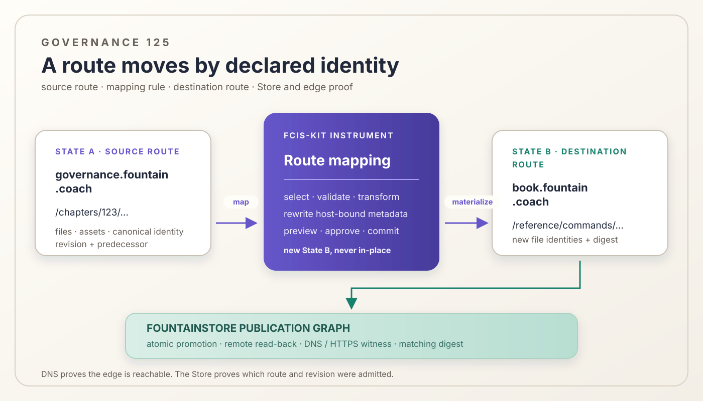

# 125 — The Store Publication Graph — Domain Mapping and Atomic Route Promotion

> Chapter summary: The Store publication graph is the durable model that joins domains, routes, files, assets,
> revisions, and evidence. A governed route transformation may move one route to another domain, but DNS and HTTPS
> remain edge witnesses rather than content authority.



*Principal illustration — a deterministic vector governance projection. It explains route transformation and
publication proof; it is not a live Store receipt, DNS result, or claim that cross-domain movement is already
implemented.*

## The decision

The Fountain Coach estate is not a pile of directories that happen to answer at different hostnames. It is a typed
publication graph held by FountainStore. The graph connects a public domain to its declared role, a route to its
selected files and dependencies, a revision to its predecessor, and a public response to the digest of the Store
record that produced it.

The graph makes a route move expressible without making the edge authoritative:

```text
source route in State A
  governance.fountain.coach /chapters/123/...
          │
          ▼
  declared route mapping
  source identity → destination identity
          │
          ▼
destination route in State B
  book.fountain.coach /reference/commands/...
          │
          ├── Store revision + predecessor
          ├── selected files + content digests
          └── DNS / HTTPS serving witness
```

A route-level transformation is therefore a semantic State A → State B operation followed by Store publication. It is
not a filesystem move, a Caddy rule, a DNS rewrite, or an instruction to copy the whole estate.

## What the graph contains

The graph has a small number of durable identities:

1. **Domain** — a canonical hostname and its declared publication role.
2. **Route** — a normalized path prefix owned by one domain.
3. **File** — an immutable Store record identified by revision, host, and path, carrying its content type and digest.
4. **Dependency** — a render-time relation from a selected HTML route to a same-site stylesheet, script, image, font,
   poster, or other declared resource. Navigation to another page is not a file dependency of the current route.
5. **Revision** — a complete content identity with a predecessor and source/template provenance.
6. **Evidence** — the typed receipts, lifecycle events, read-backs, AX observations, and public serving checks that
   establish what happened.

The graph is content-addressed and revisioned. A route transformation never changes the identity of State A in place;
it creates State B with an explicit predecessor. This is what makes preview, comparison, rollback, and replay possible.

## Route mapping is a governed transformation

A route mapping request names both sides:

```text
source:
  host: governance.fountain.coach
  path-prefix: chapters/123-commands-must-be-legible-to-reasoning

destination:
  host: book.fountain.coach
  path-prefix: reference/commands
```

The mapping is valid only when the destination domain is already admitted for its publication role and the destination
path is unambiguous. The operation selects the source bundle from the current Store snapshot, applies the explicit
mapping, and produces a new bundle whose every file carries the destination host and normalized destination path.

The transformer must also inspect host-bound content. Canonical URLs, Open Graph and Twitter URLs, JSON-LD URLs, same-site
resource references, alternate links, and route metadata must either be rewritten deterministically or be reported as a
human-resolvable conflict. A byte-identical file with stale canonical metadata is not a successful domain move.

The mapping does not silently delete the source route. “Publish the destination” and “retire or redirect the source”
are different operations with different evidence. The writer must choose the latter explicitly.

## Three authorities, one connected result

The route transformation crosses three cooperating boundaries:

| Boundary | Owns | Does not own |
| --- | --- | --- |
| Semantic transformer | State A, State B, mapping rule, semantic diff, metadata rewrite decision | DNS, TLS, serving, credentials, deployment |
| FountainStore publication graph | domain/route/file identities, revision, predecessor, selected dependencies, receipts, atomic promotion | meaning invented from a response, certificate issuance, external DNS mutation |
| Edge and infrastructure adapters | DNS, certificate, TLS, host admission, HTTP serving witness | page meaning, Store revision, semantic approval |

The boundaries are connected by typed identities and digests. They do not merge their authority. A DNS record pointing to
the server does not prove that the desired Store route was promoted. An HTTP 200 does not prove that the bytes belong to
the intended revision. A Store receipt does not prove that public DNS points to the edge. Each claim needs its own
witness.

## The server-side instrument

The route transformer is a server-side Swift FCIS-KIT instrument because it needs the same contract on macOS and on the
headless deployment host. Its MIDI2 facade exposes identity, version, input/output schemas, supported mapping
operations, lifecycle, cancellation, evidence addresses, and claim boundary through MIDI-CI and Property Exchange.

The instrument's bounded operation is conceptually:

```text
route.mapping.preview
  read State A from FountainStore
  select one declared source bundle
  validate destination domain and path
  calculate State B and semantic diff
  return preview without mutation

route.mapping.commit
  require the matching approved preview
  materialize the destination bundle in a new revision
  persist predecessor and route-index evidence
  hand the result to estate.publication.sync
```

The names above describe the required instrument boundary; they do not claim that these operations are already present
in the current runtime. Until the instrument is admitted and accepted, the existing same-host route publisher remains
the only established route operation.

## Preview, promotion, and rollback

The human-facing sequence is finite and visible:

1. resolve the source and destination identities from the live Store graph;
2. validate that both domains and route prefixes are admitted and non-conflicting;
3. calculate the transformed State B and show the route/file/metadata diff;
4. obtain explicit approval for the mapping and for any source-route retirement;
5. persist State B, its predecessor, mapping identity, and transformed content digests;
6. publish only the selected destination route through the native Store-to-Store patch;
7. verify typed remote read-back, public DNS/HTTPS, and matching content digest; and
8. retain State A as the rollback predecessor until its retirement is separately accepted.

A failed destination patch, missing certificate, stale DNS, digest mismatch, or conflicting route leaves the previous
published snapshot current. There is no partial “best effort” estate.

## What “under the estate domains” means

Bringing scattered online pages under the estate domains means reconciling them with the graph, not merely giving them a
new URL. For each page, the maintainer must be able to answer:

- which domain role owns it;
- which route prefix addresses it;
- which Store revision and predecessor produced it;
- which files and render-time dependencies belong to the route;
- which canonical and cross-domain links are intentional;
- which DNS, TLS, and edge configuration admits the domain; and
- which receipt proves the public response matches the Store digest.

An old page that returns 200 but has no matching current Store record is an uncorrelated public projection. It may be
reachable, but it is not yet part of the governed estate.

## Acceptance and claim boundary

This chapter defines the route-mapping contract. It does not claim that the cross-domain transformer, destination-host
rewriter, DNS adapter, or multi-domain promotion matrix is implemented.

Acceptance of one mapping requires one correlated proof containing:

1. source and destination route identities;
2. approved mapping and semantic diff identities;
3. new State B revision and predecessor;
4. typed selected-file read-back with destination host/path and matching digests;
5. atomic remote Store promotion;
6. DNS and HTTPS witness for the destination domain; and
7. a public response whose content digest matches the promoted Store record.

The proof must distinguish observed, inferred, and not-established claims. A reachable route, a valid certificate, or a
successful process exit alone is insufficient.

## Rules

1. FountainStore owns the durable publication graph and immutable route snapshots.
2. A route move creates State B with an explicit State A predecessor; it never mutates State A in place.
3. Route mappings name source and destination domain/path identities explicitly.
4. Destination files receive new typed identities; stale host-bound metadata is rejected or deterministically rewritten.
5. Navigation links are not silently treated as render-time dependencies of a bounded route.
6. Publishing a destination and retiring the source are separate, explicitly authorized operations.
7. The semantic transformer owns meaning and mapping rules; the Store owns durable publication state; edge adapters own
   DNS, TLS, and serving witnesses.
8. Cross-domain publication transfers only the selected route bundle and its declared render-time dependencies.
9. Failed validation or promotion leaves the previous published snapshot current.
10. No claim of estate membership is made without Store identity, remote read-back, and public digest evidence.

## Governing sentence

The Store publication graph turns domain movement into a reversible, evidenced State A → State B transformation: the
transformer decides the mapping, FountainStore records and promotes it, and DNS/HTTPS prove only that the public edge
serves the admitted result.
