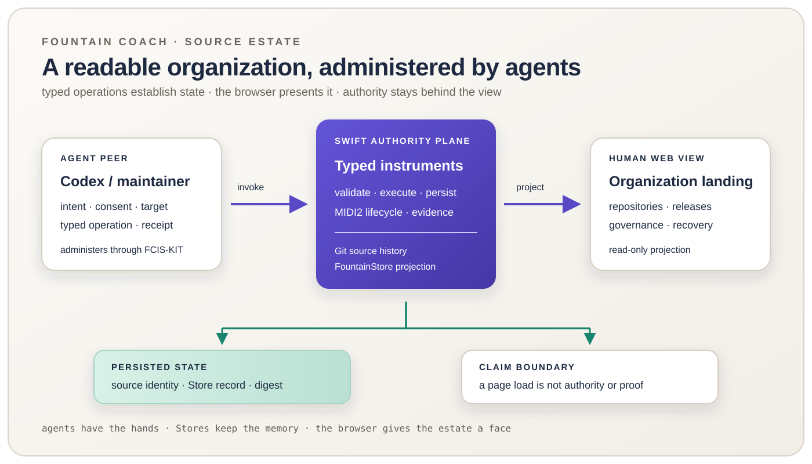

# 126 — The Fountain Coach Organization Web Projection

> Chapter summary: Fountain Coach needs a human-facing organization projection, not a GitHub clone. Agents administer
> the estate through typed Swift and FCIS-KIT instruments; Git preserves source history; FountainStore preserves the
> governed organization and publication projection; and the browser presents that state without becoming its authority.



*Principal illustration — a deterministic vector governance projection. It describes the intended authority and
browser boundary; it is not a live repository listing, Store receipt, deployment result, or claim that the source host
has already been implemented.*

The Fountain Coach organization should be visible as a coherent place on the web: a name, a set of repositories,
release lines, governance documents, recovery state, and links between them. The writer should not have to infer that
coherence from a collection of unrelated server paths. At the same time, the browser must not become the place where
an agent invents, mutates, or silently approves that state.

## The decision

The organization landing page is a read-oriented projection of two authorities that remain distinct:

```text
agent intention
      ↓ typed FCIS-KIT / Swift operation
source host + FountainStore authorities
      ↓ validated projection
human-facing organization web view
```

The page explains what exists and how it is related. It does not grant access, create a repository, promote a release,
or declare a backup complete merely because a route rendered successfully.

This is deliberately smaller than GitHub. The initial product is an organization view that lets a human understand the
estate while Codex and other admitted agents perform administration through the governed operation plane. Repository
mechanics remain available through the declared source transport; the browser projection need not reproduce every
social or administrative feature of a large hosting platform before it becomes useful.

## The four boundaries

| Boundary | Owns | Does not own |
| --- | --- | --- |
| Agent and FCIS-KIT instruments | requested operations, authorization, lifecycle, receipts, and terminal proof | browser wording, source history, or unapproved mutations |
| Git source host | repository objects, refs, revisions, tags, and clone/push transport | FountainStore publication state or human approval |
| FountainStore | organization projection, publication graph, release evidence, recovery references, and durable operation records | Git object storage or meaning inferred from an HTTP response |
| Web view | readable organization, repository, release, governance, and recovery projections | credentials, authority, mutation, or proof from appearance alone |

The organization view may join these records by stable identities and digests. It must not flatten them into a single
ambiguous “server status.” A repository revision, a Store publication receipt, and a browser response answer different
questions and remain separately inspectable.

## What the human sees

The landing page should answer four questions immediately:

1. **What is this?** — Fountain Coach, its purpose, and the source/publication boundary.
2. **What is here?** — repositories and governed public projections, each with a stable identity and state.
3. **What changed?** — current release or revision, predecessor, and the evidence that makes the statement checkable.
4. **What can I follow?** — links to source, governance, Book, MIDI2, instruments, status, and recovery policy.

An individual repository page may show its current revision, release tags, source files, declared dependencies, and
recovery status. A release page may show its source revision, artifact digest, publication state, and predecessor. A
governance page may explain the rule that binds an operation. Each page must state whether its content is a local,
staging, or published projection.

The view should not display an inventory by hand when the system has a generated registry or Store-backed catalog. A
maintainer-facing catalog can be generated from the admitted repository and instrument records; the page then states
the record identity and last projection revision rather than pretending prose is the inventory authority.

## What the agent does

Codex is an agent peer, not the browser and not FountainStore. When an agent needs to change the organization, it uses
the admitted typed operation for that action. The operation resolves the live command or instrument surface, validates
its target and authority, records its correlation, and returns a terminal receipt that the projection can later show.

Examples of bounded operations include:

```text
source.repository.admit
source.repository.release
organization.projection.refresh
recovery.projection.export
recovery.restore.verify
```

These names describe the required operation classes, not a claim that every operation already exists in the current
runtime. A command or instrument is not established merely because a page lists its name. The admitted registry,
typed implementation, and terminal evidence must agree before the operation is presented as executable.

The agent path is therefore:

```text
intent
  → resolve existing typed instrument
  → validate target, consent, and authority
  → execute once with correlation
  → persist receipt and evidence
  → refresh the web projection
```

The browser is downstream of this sequence. It may show “ready,” “in progress,” “published,” “recovery verified,” or
“not established,” but it must not manufacture those states from a successful page load.

## Storage and persistence

The organization has three kinds of durable material:

1. **Git objects** preserve source history and transportable repository state.
2. **FountainStore records** preserve the typed organization projection, publication state, release lineage, operation
   receipts, and recovery references.
3. **Recovery storage** preserves encrypted, digest-addressed projections and restore material under a separate
   custody boundary.

The browser reads a validated projection assembled from these authorities. It does not read a working-copy directory and
does not treat a missing page as evidence that the underlying repository or Store record is absent. The projection must
retain the identity and source of every important claim so a maintainer can follow it back to the owning record.

The self-hosted recovery volume is useful capacity, but a second disk on the same host is not by itself independent
disaster-recovery custody. Independent custody, encrypted key handling, and fresh restore evidence remain explicit
gates under Chapter 117 and Chapter 118.

## The web view is not an administration console

A web view may eventually offer affordances such as “request release” or “inspect recovery.” Those affordances are
projections of admitted operations, not a new command language. If a mutation control is exposed, it must identify the
same instrument operation, consent boundary, target, lifecycle, and terminal result that the agent path uses.

The first organization projection should therefore be read-only. This gives the writer a stable visual source of truth
without making browser state a competing authority. Agent administration can evolve independently, and the human view
can remain stable while the underlying instruments gain capability.

## Swift server, browser client

The web-facing host is a Swift projection service governed by the FountainStore and FCIS-KIT boundaries. It may render
HTML directly or serve a compiled browser client. TypeScript is allowed as presentation source only when it is compiled
before deployment; a Node runtime, package registry, or JavaScript service is not part of the production authority.

The browser client owns layout, navigation, progressive enhancement, and accessible labels. It does not own identity,
permissions, release state, digests, or mutation decisions. A page can be cached for reading, but its freshness and
publication state must remain visible.

This division keeps the system useful on a desktop, iPad, or ordinary browser while retaining the same native Swift
operation model on the deployment host. The browser is the face of the organization; the instruments and Stores are its
memory and hands.

## Acceptance boundary

This chapter is a governance contract and design projection. It does not claim that the Swift source host, organization
catalog, browser routes, agent instruments, DNS, or public deployment are implemented.

The first implementation slice is accepted only when one selected repository can be shown through a real local
organization projection with:

1. a stable organization and repository identity;
2. a revision and content digest read from the source authority;
3. a matching FountainStore projection record;
4. a visible distinction between local, staging, and published state;
5. a browser-accessible source/release/governance link path; and
6. an independently readable terminal receipt for the projection refresh.

A screenshot, HTTP 200, rendered card, or successful process exit alone cannot satisfy this proof. The implementation
must join source, Store, agent, and browser evidence without collapsing their authority.

## Rules

1. The organization web view is a human-facing projection, not a source, Store, or authorization authority.
2. Agents administer through typed Swift/FCIS-KIT operations; browser text and JavaScript are never the operational authority.
3. Git owns source objects and transport; FountainStore owns governed organization and publication projections; recovery
   storage owns neither live publication nor source meaning.
4. Repository, release, publication, and recovery claims must retain stable identities, provenance, digests, and state.
5. The initial organization projection is read-only; any future mutation control must invoke the same admitted operation
   plane as Codex.
6. TypeScript may be compiled into browser assets, but Node and a package registry must not become production runtime dependencies.
7. A generated catalog or Store record must be preferred over a manually maintained inventory; stale inventory is a defect.
8. A browser response, screenshot, or cached page cannot establish a source, Store, release, or recovery claim by itself.
9. Same-host storage separation is not independent recovery custody; encryption, key custody, and fresh restore remain
   separately evidenced.
10. Unknown, stale, or uncorrelated organization state must be shown as not established, not silently filled from memory.

## Governing sentence

The Fountain Coach organization is administered by typed agents and persisted by Git, FountainStore, and governed recovery
storage; the browser is the readable face of that state, never its authority.
