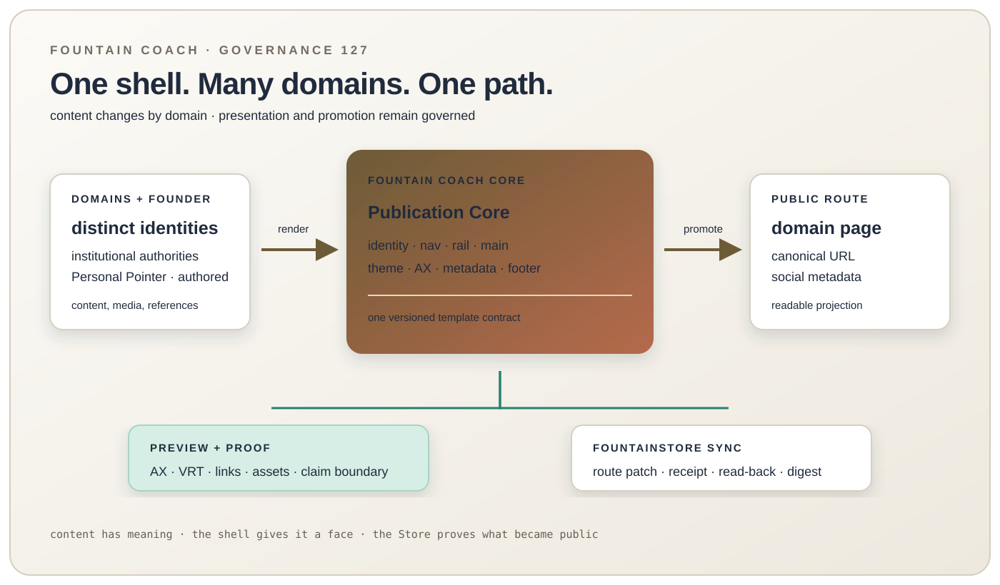

# 127 — The Estate Template Is the Publishing Path

> Chapter summary: Fountain Coach publishing follows a CMS-shaped path: typed content enters a domain collection,
> one institutional Fountain Coach Publication Core renders it, and the native FountainStore publication operation
> promotes the selected route. Personal Pointer remains the founder publication and design provenance of that core;
> institutional domains vary in meaning and records without becoming Personal Pointer projections.



*Principal illustration — a Teatro-style design projection. It describes the governed template path; it is not a live
Store receipt, a deployment result, or evidence that every domain has already been transformed.*

## The decision

### Closed migration-window rule

When the canonical renderer already exists in its owning FountainStore repository but has not yet reached the
consumer's named package release, the maintainer may open one recorded migration window. During that window the
owner repository is tested and released first; a consumer may inspect the local source only to diagnose the missing
API. It may not vendor, fork, or execute a second renderer, claim live acceptance, or retain a path dependency.

The window closes only after the renderer is present in a named FountainStore release, the consumer pins that release,
dependency coherence passes, and searches find no override. Once closed, the ordinary single-authority rules below
apply without exception. This rule records the migration that moved the Chapter 127 renderer into its released owner;
it does not create an ongoing development fallback.

The Fountain Coach estate adopts one reusable publishing template. It is the web equivalent of a classical CMS theme:
the content model supplies records, the template supplies the presentation contract, the route renderer joins them,
and the publication adapter promotes the result.

```text
domain content record
  → canonical route identity
  → Fountain Coach Publication Core + domain content renderer
  → metadata / accessibility / asset checks
  → local preview and AX/VRT proof
  → route-scoped FountainStore publication
  → typed remote read-back
```

The shell is not copied into every domain as a new design. It is one versioned contract consumed by each domain
projection. A domain may change its title, role, sidebar entries, content blocks, language, and density. It may not
remove the estate identity, navigation, theme control, accessibility surface, provenance, legal footer, or publication
state.

## Amendment — institutional core and founder projection

The first Chapter 127 candidate was extracted from the Personal Pointer design and called the shared template the
“Personal Pointer shell.” That name correctly recorded design provenance but incorrectly collapsed two identities.
Personal Pointer is Benedikt Eickhoff's authored publication. Fountain Coach is the institutional estate whose TLD
names the identity and whose specialized domains own separate public questions under Chapter 92.

The extracted shared authority is therefore named **Fountain Coach Publication Core**. It retains the reviewed shell
grammar first proven by Personal Pointer—typography, spacing, navigation behavior, theme controls, responsive frame,
metadata slots, accessibility semantics, and provenance treatment—without transferring Personal Pointer's authorial
identity into Book, Governance, MIDI2, Instruments, Status, or another institutional projection.

```text
Fountain Coach Publication Core
  ├── institutional domain projection
  │     └── domain-owned content, authority, evidence notation, and local navigation
  └── founder publication projection
        └── Personal Pointer: authored blog identity and its own content semantics
```

Personal Pointer is connected to the estate by a typed founder-publication edge. It is not an institutional authority
parallel to Governance, MIDI2, or Status, and a link to it establishes no runtime, release, evidence, legal, or
admission claim. Its local content grammar currently distinguishes a **Memory Vector**, an image collection, from a
**Teatro Score**, one resulting image paired with authored Fountain text at a semantic post URL. Those are Personal
Pointer content templates, not mandatory estate-wide content types.

This amendment changes governance vocabulary and ownership. It does not by itself rename implementation symbols,
rewrite scenario contracts, migrate Store records, publish the Personal Pointer route, or reconcile Book scenario
status. Each of those effects requires a subsequent bounded scenario and its own authority-specific evidence.

## The CMS-shaped layers

| Layer | Owns | Must not own |
| --- | --- | --- |
| Content record | domain meaning, body, media, dates, references, status | shell structure or publication authority |
| Route manifest | canonical host, path, page identity, predecessor, source record | guessed availability or deployment state |
| Fountain Coach Publication Core | institutional mark, header, estate navigation, theme/icon control, sidebar frame, main frame, footer, metadata slots | domain claims, founder authorship, Store writes, credentials |
| Domain renderer | content blocks placed into the shell's named regions | an alternate shell or a second route map |
| Founder publication projection | Personal Pointer authorship, blog navigation, Memory Vector collections, Teatro Score posts | institutional authority, scenario status, runtime or release evidence |
| Preview and acceptance | local rendering, AX semantics, VRT evidence, link/asset checks | production proof |
| FountainStore adapter | authenticated route-scoped promotion and typed read-back | browser layout or an unreviewed whole-estate dump |

## The shell contract

Every public route renders these regions in the same order:

1. **Identity header** — Fountain Coach mark, publication role, canonical estate navigation, theme control, and icon-only
   navigation control.
2. **Domain rail** — the domain's reading index or collection navigation, exposed as an accessible navigation landmark.
3. **Main frame** — breadcrumbs, publication state, domain-owned content, and semantic headings.
4. **Content primitives** — the domain may use articles, galleries, score plates, tables, or reading pages, provided
   each has stable identity, alt text, and a claim boundary.
5. **Legal and provenance footer** — sibling publications, legal notices, privacy, accessibility, copyright, compliance,
   and source/provenance links.

The open-hand spring is the estate mark. The Publication Core supports light, dark, and system themes. The icon-only
control is a presentation mode, not a second information architecture: accessible names remain available when labels
are hidden.

An institutional route identifies Fountain Coach first and its local authority second. A Personal Pointer route
identifies Benedikt Eickhoff and Personal Pointer first, while retaining a legible founder relationship to Fountain
Coach. Shared composition does not erase this difference in speaking subject.

## Route identity is the join key

The route manifest is the CMS-like binding between a domain record and its public URL. It declares the host, normalized
path, content identity, shell revision, source revision, and publication state. The browser must not infer a route from
a folder name, a DNS response, or a missing page.

The same manifest drives:

- the shell navigation link;
- the canonical, Open Graph, Twitter, and JSON-LD metadata;
- the local preview route;
- the route-scoped Store operation; and
- the remote read-back assertion.

Thus a domain move is a manifest change plus a new route projection, not a file copy. The predecessor and digest remain
visible so a reader can follow continuity.

## One publication path

The publication operation is always `estate.publication.sync`: explicit local FountainStore source, authenticated
remote FountainStore destination, canonical host, normalized path prefix, and typed receipt. The shell renderer is
upstream of that operation; the web server is downstream of the remote Store projection.

For one page, the operation transfers one selected route. Whole-estate synchronization requires explicit whole-estate
intent. A static-directory copy, site generator deployment, Caddy copy, generic HTTP wrapper, or browser upload is not
an equivalent path.

## Acceptance boundary

Chapter 127 is implemented for a domain only when its local source has:

1. one canonical shell revision and route manifest;
2. the five shell regions and required metadata;
3. domain content rendered without an iframe or alternate authority;
4. AX proof for landmarks, controls, labels, and navigation state;
5. VRT proof at desktop light, mobile closed/open, and declared dark state;
6. every shell link landing on its declared route; and
7. route-scoped FountainStore receipt, typed read-back, public HTTPS, and matching digest for publication.

Missing content roots, unresolved routes, or an unavailable Copilot destination remain `not established`. They are not
filled with placeholder pages and are not silently redirected.

## Rules

1. The Fountain Coach Publication Core is the single institutional estate-template authority; Personal Pointer is its
   founder publication projection and recorded design provenance, not the institutional identity.
2. Domain content is injected into named shell regions; it does not redefine the shell.
3. The route manifest is the join key for navigation, metadata, preview, and publication.
4. Preview proves rendering; AX proves operability; VRT proves visual legibility; Store read-back proves publication.
5. Publication is route-scoped by default through native `estate.publication.sync`.
6. No iframe, static copy, guessed route, or second publication authority may satisfy this contract.
7. Unknown or unavailable state remains visible as `not established`.
8. Institutional domain projections MUST identify Fountain Coach and their local authority; they MUST NOT present
   themselves as Personal Pointer publications.
9. Personal Pointer MAY use Memory Vector and Teatro Score semantics, but those templates MUST NOT be treated as
   estate-wide evidence or authority types merely because they share the Publication Core.
10. Moving an identity between institutional domain, founder publication, and content template is a manifest and
    governance change with scenario proof; visual similarity or a shared shell cannot perform that move implicitly.

## Governing sentence

Fountain Coach has one institutional Publication Core and one Store-backed publishing path; institutional domains
contribute distinct authority, Personal Pointer contributes founder authorship and design provenance, and only
preview, acceptance, and typed promotion establish what is actually public.
