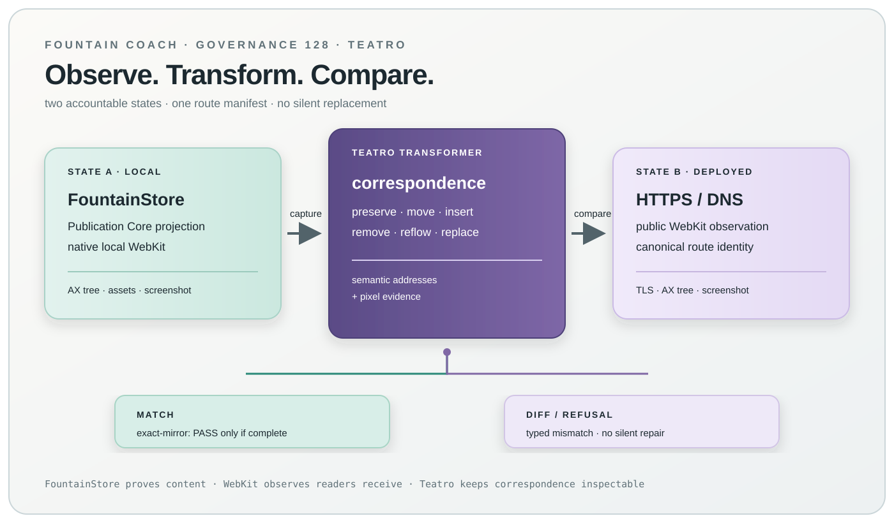

# 128 — The Deployed Estate Is a Read-Only WebKit Mirror Authority

> Chapter summary: the Remote Estate WebKit Mirror observes the currently deployed HTTPS/DNS estate and compares it
> route by route with an explicit local FountainStore projection. It is an observation and diff instrument, never a
> second publication authority.

*Teatro-style governance projection — it illustrates the State A/State B correspondence and claim boundary; it is not
runtime, Store, AX, VRT, or deployment evidence.*

## The decision

FountainStore remains the content, provenance, and publication authority. The deployed estate is a separate visual
observation authority: DNS resolution, TLS, HTTP response, WebKit DOM/CSS/assets, accessibility tree, and settled
pixels are observed facts about what a public reader can receive now. A local mirror is a derived projection from an
explicit Store and Chapter 127 Publication Core; it must never serve remote files or infer content from a hostname.

`State A (explicit local Store) → Publication Core renderer → local WebKit`
`State B (declared deployed HTTPS/DNS routes) → remote WebKit observation`
`both → deterministic semantic/image transformer → typed diff`

## Contract

A request declares the exact route manifest, local Store identity, canonical HTTPS URLs, source and shell revisions,
capture profiles, and comparison policy. The instrument records DNS/TLS/HTTP provenance, final URLs, response and
asset statuses, browser capability, viewport, AX tree, stable semantic addresses, and screenshot digests for every
route in both states. Credentials, private headers, and response bodies not covered by the capture policy never enter
public evidence.

The transformer compares stable route identities, metadata, landmarks, navigation, content primitives, links, media
alt text, computed layout facts, and image pixels. It returns changed, missing, extra, moved, and preserved addresses
plus image-diff evidence. Text similarity, host aliases, route counts, or a screenshot alone cannot establish equality.

## Reframe and FCIS boundary

The capability is a governed FCIS-Kit instrument with one stable identity and a typed MIDI2 operation. Reframe mediates
intent, permissions, Store selection, and refusal; the instrument reports observations and lifecycle only. The native
WebKit adapter owns browser execution. Semantic Browser exposes State A, State B, transformer, and diff through AX;
FountainStore persists the request, observations, transformer result, and terminal receipt; CoreGraphics window-ID
captures establish the rendered Reframe surface. A remote failure, unauthorized route, DNS/TLS error, broken required
asset, stale Store identity, or incomplete capture fails closed.

The instrument is read-only. It does not publish, mutate DNS/TLS, write the remote Store, promote a route, or silently
repair a mismatch. Autonomous correction is limited to producing a new local projection or a typed remediation proposal
that remains unexecuted until a separately governed operation is selected.

## Exact-mirror acceptance

`exact-mirror: PASS` is permitted only when every declared route is captured in both states and all required route
identity, canonical metadata, accessibility landmarks, links, assets, semantic addresses, and visual comparisons are
equal under the declared browser capability and viewport profiles. Unknown, unavailable, or not-established values
remain visible and make the exact claim fail. The terminal receipt must bind the same run correlation, PID, Store,
executable, source revision, WebKit profile, route manifest, and evidence digests.

Acceptance requires focused unit and negative tests, deterministic replay, MIDI2 lifecycle and readiness evidence,
Store read-back, AX inspection, CoreGraphics window-ID evidence, and independent desktop/mobile VRT. Remote public
availability is a separate deployment claim and is never inferred from a local mirror pass.

## Rules

1. FountainStore and its typed publication receipt remain content and publication authority.
2. Deployed HTTPS/DNS plus native WebKit is a read-only visual observation authority.
3. State A and State B require explicit route identities; hostname or filesystem discovery is not a route manifest.
4. The transformer compares semantic structure and pixels; counts and screenshots alone are insufficient.
5. Every route, asset, metadata field, and required AX landmark is captured or the run fails closed.
6. Reframe, MIDI2, FountainStore, AX, CoreGraphics, and VRT retain separate evidence roles.
7. No publication, DNS/TLS mutation, remote Store write, iframe, static copy, or generic HTTP mirror can satisfy this contract.
8. A mismatch produces a typed diff and optional remediation proposal; it never silently edits authority.
9. Exact equality is a terminal claim only with a complete correlated receipt; otherwise report the concrete failed seam.
10. Personal Pointer remains the founder publication defined by Chapter 127; its presence in the route manifest does not
   turn it into an institutional domain or erase its authored content semantics.

## Governing sentence

The deployed estate may be observed but never impersonated: FountainStore owns what is published, WebKit records what
readers receive, and only a complete route-by-route semantic and visual diff can establish an exact local mirror.
