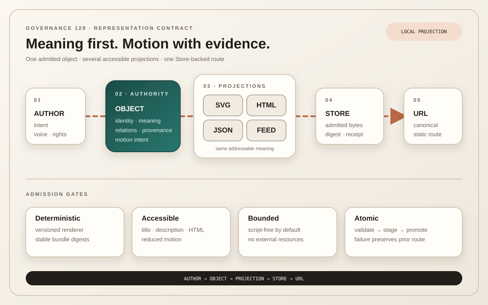

# 129 — Native Animated SVG Is a Governed Publication Projection

> Chapter summary: a native animated SVG may be the principal visual projection of an explicitly admitted
> publication object. Meaning remains addressable outside motion, the published route remains a complete static
> bundle, and FountainStore remains publication authority.



*Principal illustration — a self-contained, script-free SVG governance projection. Its restrained motion describes
flow; the same sequence remains present when motion is reduced or unavailable. It is not renderer, Store, AX, VRT,
or deployment evidence.*

## The decision

Native animated SVG is admitted as a first-class publication representation, not as raw authoring syntax, a site
generator, or a second semantic authority. A route that chooses this representation declares one publication object
whose identity, content, relationships, accessibility semantics, provenance, and revision are complete before visual
projection begins.

```text
AUTHOR → OBJECT → PROJECTIONS → STORE → URL
```

The projection set may contain `composition.svg`, accessible `index.html`, `publication.json`, and feed or social
variants. The route is published only as a complete direct-static bundle. Browsers render admitted bytes; they do not
fetch source records, compile Markdown, reconstruct a shell, or decide what the object means.

## Object, projection, and route

The publication object owns semantic identity: title, author, canonical route, chronology, sections, figures,
relations, links, alternative text, motion intent, and provenance. SVG owns one deterministic visual arrangement of
that meaning. HTML owns document landmarks, reading order, navigation, fallback prose, and the estate shell. JSON and
feeds provide machine-readable and syndication projections without becoming browser hydration inputs.

For current Chapter 127 routes, the checked-in static bundle remains the admitted publication payload. The object is
upstream authority only for a route that explicitly declares this representation class and renderer version. That
declaration does not install a runtime generator and does not retroactively reinterpret existing routes.

## Motion communicates, never conceals

Motion may communicate state, relation, sequence, continuity, transition, or emphasis. Decorative movement must stay
subordinate to reading. Essential content, order, status, or navigation must never exist only while an animation
runs. A settled frame, semantic description, and document reading order must communicate the same claim.

Every animated projection must honor `prefers-reduced-motion`. Reduced motion removes repetition and travel while
preserving the final state and all relationships. Pausing animation must not remove access to content or controls.

## Native SVG capability policy

SVG is executable web content and therefore has an explicit capability boundary. The default admitted profile is
self-contained declarative SVG and CSS: no script, remote font, external image, embedded document, network request,
or event-driven mutation. Broader capabilities require a named policy, security review, sanitization evidence, and a
route-specific reason; they are never inherited from a file extension.

Every projection provides a useful `<title>` and `<desc>`, stable semantic addresses for meaningful regions, sufficient
contrast, non-color-only distinctions, and typography that stays inside its shapes at supported viewports. Interactive
links and controls, when present, remain keyboard reachable and are repeated in the HTML reading surface.

## Determinism and revision

A future `SVGPublicationKit` may implement the authoring-time projection as a narrowly scoped Swift instrument. Its
input is a versioned publication object and declared style/motion policy; its output is a deterministic bundle with
content digests. It does not own persistence, routes, HTTP, DNS, certificates, editorial admission, or promotion.

Renderer identity and version are part of provenance. A renderer revision never silently changes an admitted route.
Re-rendering creates a new candidate, a visible diff, and a new admission decision.

## Atomic admission

The bounded publication transaction is:

```text
construct object
  → validate semantics, assets, security, accessibility, and reduced motion
  → render deterministic candidate bundle
  → inspect HTML + SVG in light, dark, desktop, and mobile contexts
  → admit exact bundle digests
  → stage in the explicit local FountainStore
  → promote the selected route through estate.publication.sync
  → verify typed read-back and public HTTPS separately
```

A failed validation leaves the previous admitted route intact. Partial bundles, missing alternatives, unknown assets,
unbounded script, and renderer drift fail closed. Git may preserve source and recovery history; it does not replace the
Store receipt or authorize publication.

## Blogging and estate use

Personal Pointer is the initial reference identity because its blogging model already treats posts as chronological,
addressable publication objects. The representation is estate-capable: Memory Vector may use it for image-collection
relations and Teatro Score may pair a resulting image with Fountain text. Each identity keeps its own semantics,
canonical URL, navigation, and claim boundary under the shared Fountain Coach Publication Core.

“Instant publication” means the bounded transaction is efficient and repeatable. It never means generation equals
admission, that an agent may self-publish, or that a whole estate may be promoted when one route was requested.

## Acceptance boundary

This chapter governs a representation contract. It does not claim that `SVGPublicationKit`, its MIDI2 operation, or a
public animated-SVG route has been implemented. Local presentation of this chapter proves only that this checked-in
static chapter and illustration can be served and inspected through the declared preview.

Implementation acceptance requires a typed Kit contract, fixture publication objects, deterministic replay, negative
security and accessibility cases, Store receipts, AX parity, desktop/mobile VRT, reduced-motion inspection, exact
route read-back, and separately authorized public publication evidence.

## Rules

1. The admitted publication object owns meaning; SVG is one deterministic projection of it.
2. The promoted artifact is a complete direct-static route bundle; no runtime generator or hydration step is allowed.
3. FountainStore and its typed receipt remain publication authority.
4. Motion must communicate a declared relation or state and must never carry essential meaning alone.
5. Reduced motion, settled-frame meaning, HTML reading order, and machine-readable metadata are mandatory peers.
6. The default SVG profile is self-contained and script-free; expanded capabilities require explicit admission.
7. Renderer identity, version, input identity, output digests, and diffs belong to provenance.
8. Validation and promotion are atomic and route-bounded; failure preserves the previous admitted route.
9. Personal Pointer, Memory Vector, Teatro Score, and institutional domains retain distinct semantic identities.
10. A local preview is presentation evidence only; public state requires Store sync, typed read-back, and HTTPS proof.

## Governing sentence

Author the meaning once, project it accessibly and deterministically, admit the complete static bundle to
FountainStore, and let motion reveal relationships without becoming the only place truth can be read.
