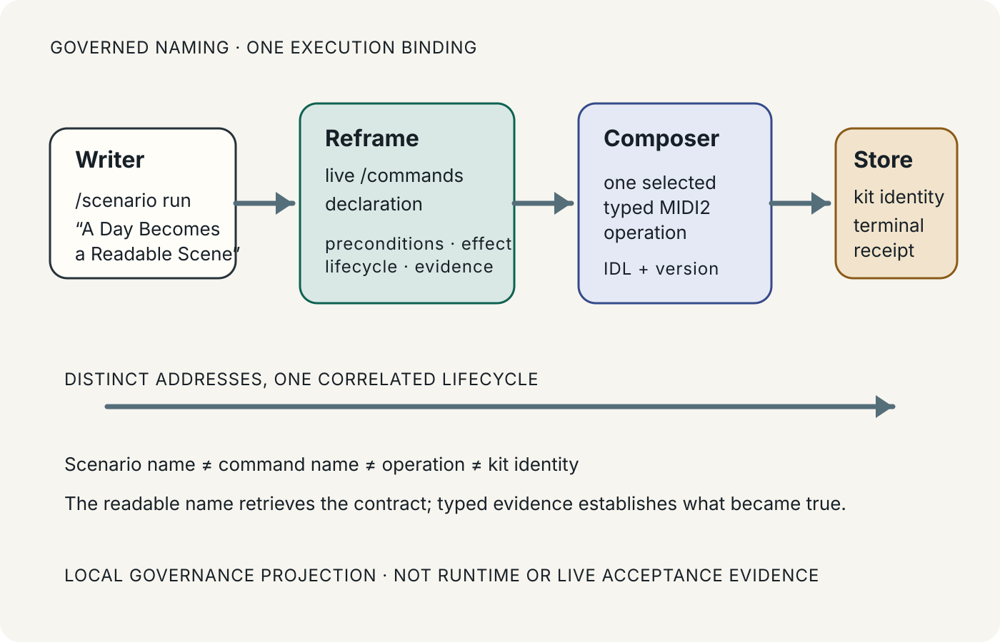

# 130 — Human–Machine Scenario Naming Is a Governed Identity Boundary

> Chapter summary: a readable scenario name is the writer's address to a governed contract. It resolves through
> Reframe's live command declaration to one typed MIDI2 operation and one admitted FCIS-KIT identity, while each
> layer keeps its own stable identity, preconditions, and evidence.



*Principal illustration — a deterministic, self-contained governance projection. It explains identity resolution; it is
not a command-catalog response, MIDI2 terminal event, Store receipt, or live acceptance evidence.*

## The decision

Human-readable naming is part of the command contract, not decoration. A writer addresses a scenario by its stable
name; Reframe resolves that name against its live command surface and state; Composer sends one admitted typed
operation; the owning FCIS-KIT instrument and FountainStore produce the terminal evidence. No layer may silently replace
the identity owned by another layer.

```text
writer intention
      │  /scenario run <name>
      ▼
named scenario contract
      │  live /commands declaration
      ▼
one typed MIDI2 operation
      │  admitted FCIS identity + version
      ▼
terminal lifecycle + FountainStore receipt
```

The mapping is one-to-one at execution time: one selected command enters one typed operation path and one correlated
lifecycle. It is not a claim that the strings are interchangeable. A readable scenario name, a command name, an
operation identity, and an instrument identity are distinct addresses that must be recorded together.

## The identity chain

Every executable scenario publishes this identity chain:

1. **Scenario name** — a stable, human-facing name used in `/scenario run <name>` and in result explanations.
2. **Scenario identity** — the durable scenario ID and source/provenance identity used to retrieve the exact contract.
3. **Command declaration** — Reframe's live usage, semantic description, preconditions, mutation boundary,
   authorization, lifecycle, terminal predicates, and evidence addresses.
4. **MIDI2 operation** — the IDL-governed topic/operation and version that carries the request and terminal envelope.
5. **FCIS-KIT identity** — the owning Swift instrument namespace and SemVer line, with its typed request/result or
   dispatch contract and declared claim boundary.
6. **Store evidence** — the persisted admission, lifecycle, and terminal receipt that establishes what happened.

The readable name is the retrieval address, never a substitute for the durable identity. An internal ID is useful for
provenance, never a reason for selection. A kit identity is an implementation boundary, never writer-facing prose.

## Preconditions before resolution

Reframe MUST establish these facts before it sends the operation:

- the scenario name resolves to exactly one current contract in the live Store;
- the command declaration is present in the current `/commands` surface and semantically fits the intention;
- the declaration's required inputs, authorization, confirmation, cost, and mutation boundary are visible;
- the owning FCIS-KIT instrument and operation version are admitted in the running build;
- the scenario's typed prerequisites and terminal predicates are executable in the selected Store;
- the Swift `ReframeLaunchReadiness` record is valid for the bound PID, executable, Store, source revision, and
  distinct MIDI2 ports; and
- the result can be correlated to its Store receipt and terminal MIDI2 envelope.

If any precondition is missing, stale, ambiguous, or unavailable, resolution stops with a typed explanation. Reframe
does not try a neighboring command, infer an operation from a familiar word, or accept process output as readiness.

## Human expression and machine expression

The writer-facing grammar is deliberately small:

```text
/scenario run <stable scenario name>
```

The machine-facing message is the repository's MIDI2 IDL envelope. It carries the resolved scenario identity, the
operation identity and version, typed arguments, correlation/idempotency identity, and the lifecycle transition. The
command declaration explains the meaning; the IDL and live instrument state govern the bytes and behavior.

Composer mediates between the two. It may ask one precise question when the declaration or live state cannot establish
a unique fit. It may not create an alias that changes meaning, route directly to a host adapter, or collapse the
scenario name into the kit identity.

## Lifecycle and terminal truth

The name is resolved before execution, not after it. The operation then retains one correlation through admitted,
awaiting-confirmation, running, blocked, canceled, failed, and succeeded states. Acknowledgement is not completion.
Success requires the declared terminal predicates, a terminal MIDI2 event, and the matching persisted Store receipt.

The public explanation attaches each claim to its evidence address: scenario/contract identity for what was requested,
the command declaration for why it was selected, the MIDI2 envelope for what was sent, and the Store receipt for what
became durable. If an address cannot be opened, the claim is **not established**.

## Naming rules

1. Use a stable, human-readable scenario name as the writer-facing retrieval address.
2. Keep scenario, command, operation, and FCIS-KIT identities distinct and record their binding explicitly.
3. Resolve against the live `/commands` declaration before selecting an operation.
4. Send exactly one selected command through Composer into one typed MIDI2 operation path.
5. Reject ambiguous, stale, unavailable, or unadmitted bindings before transport admission.
6. Make preconditions, authorization, mutation boundary, lifecycle, terminal predicates, and evidence visible in the
   declaration.
7. Let FountainStore and the terminal MIDI2 envelope establish completion; names and screenshots do not.
8. Keep aliases compatibility-only and semantically identical; an alias never becomes a second capability.
9. Do not publish internal IDs, private Store paths, or credentials as human-facing naming evidence.
10. Do not claim a new command or instrument merely because a name appears in prose, a scenario proposal, or a
    historical screenshot.

## Acceptance boundary

This chapter governs naming and identity binding. It does not claim that every existing command has a complete
declaration, that a new instrument has been released, or that a scenario has been live-accepted. Those claims require
the scenario's own typed proof, MIDI2 readiness, AX/window evidence where applicable, and Store read-back. The chapter
and its local illustration are publication-source artifacts; a local preview proves presentation only.

## Interlinks

Chapter [91 — The FCIS-KIT Instrument Store Is the Capability Plane](/chapters/91-fcis-kit-instrument-store-is-the-capability-plane/)
defines the capability ownership boundary. Chapter [112 — Skill and Maintenance Capabilities Are Kit-Owned](/chapters/112-skill-and-maintenance-capabilities-are-kit-owned/)
requires the typed contract to live in Swift kits. Chapter [123 — Commands Must Be Legible to Reasoning](/chapters/123-commands-must-be-legible-to-reasoning/)
defines the declaration fields and Composer sequence. Chapter [73 — The Reframe Scenario Development Cycle](/chapters/73-reframe-scenario-development-cycle/)
governs scenario-first identity and proof. Chapter [129 — Native Animated SVG Is a Governed Publication Projection](/chapters/129-native-animated-svg-governed-publication-projection/)
governs the illustration's direct-static publication boundary.

## Governing sentence

A human name retrieves a scenario, a live declaration explains its fit, Composer sends one typed MIDI2 operation, and
the owning kit plus FountainStore establish the result without collapsing distinct identities into one opaque label.

