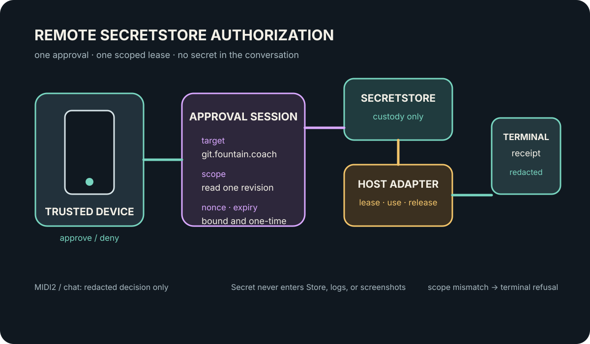

# 131 — Remote SecretStore Authorization and Approval Sessions

> Chapter summary: protected work is authorized by a short-lived, typed approval session. The person approves the
> operation from an available trusted device; a native host adapter obtains the credential from SecretStore and
> releases it only to the bounded transport. Chat, MIDI2, Store receipts, logs, and screenshots never carry the
> secret.



*Principal illustration — a deterministic architecture projection. It is not a credential, approval receipt, Keychain
prompt, provider response, or live acceptance evidence.*

## The decision

Secret custody and user approval are separate authorities. SecretStore owns the credential. The approval session owns
the person's decision about one operation, target, scope, and time window. A native host adapter joins the two for one
bounded request and returns a redacted terminal result.

```text
operation request
      │ target · scope · nonce · expiry · SecretStore reference
      ▼
approval session ───────► trusted device approval
      │                         │ approved / denied / expired
      ▼                         ▼
native host adapter ◄──── short-lived credential lease
      │
      ▼
typed terminal receipt (no secret)
```

This is one reusable MaintenanceKit boundary. Git, estate publication, DNS, remote installation, recovery, and
provider operations consume the same session contract; none invents a credential prompt or a second secret path.

## Custody, approval, and transport

The request carries an opaque `SecretStoreReference`, never a token or password. It names the operation's exact
target and scope, a one-time nonce or idempotency key, an expiry, and the correlation identity. Reframe may expose
those redacted facts through its MIDI2 and AX surfaces so a person can understand what is being authorized.

The trusted device approves or refuses the request. A phone or tablet is an approval surface, not a remote Keychain
reader and not a place to paste a production secret into chat. The approval response is a signed or otherwise
authenticated decision bound to the nonce, target, scope, and expiry. A stale, replayed, broadened, or mismatched
decision is refused before transport admission.

The host-side SecretStore provider resolves the reference in the custody domain appropriate to the target. That may be
the local macOS Keychain, a Linux Secret Service implementation, or an authenticated remote SecretStore/host agent.
The provider releases the credential only inside the admitted native adapter closure and only for the lease lifetime.
The adapter cannot persist, echo, or forward the credential to another peer.

## Local and remote policy

Remote work MUST prefer a remote SecretStore or host-agent custody path when one is available. A local Keychain prompt
is not a valid substitute for an unavailable remote approval path: it may be used only when the local host and its
approval mechanism are explicitly part of the selected session. If no eligible provider is available, the operation
ends immediately with a typed `authorization-required`, `credential-unavailable`, or `approval-expired` result. It
does not hang while waiting for a person to reach another computer.

The same contract works on macOS and Linux. Platform providers implement custody and user-presence details; the
MaintenanceKit owns the session state machine, redaction, anti-replay checks, lease lifetime, and evidence shape.

## Lifecycle and evidence

Every session has one lifecycle:

```text
requested → awaiting-approval → approved → credential-leased → executing → succeeded
                         └────── denied / expired / unavailable / replayed / canceled / failed
```

The terminal receipt records the operation, target, scope, reference identity, nonce/correlation, provider class,
approval state, lease outcome, and terminal result. It may include a non-reversible credential fingerprint for
correlation, but never the credential, Keychain account value, or secret-store payload. MIDI2 lifecycle events and
FountainStore evidence carry the same redacted identity. Logs and screenshots are telemetry or visual evidence only.

The approval session is not completion. A successful authorization proves only that a bounded adapter may attempt its
operation. The operation's own Store receipt, remote read-back, AX evidence, or deployment proof remains necessary for
its separate DoD.

## Required failure behavior

The session MUST refuse:

1. a missing or malformed reference;
2. a target or scope that differs from the approved request;
3. a reused nonce or idempotency key;
4. an expired request, approval, or lease;
5. an unavailable provider or missing credential;
6. an approval from an untrusted or unbound device; and
7. a request that attempts to place secret material into chat, MIDI2, Store, logs, or evidence.

Each refusal is terminal, typed, redacted, and correlated. No provider-specific fallback may silently widen scope or
switch to a local prompt.

## Integration rule

Existing host adapters such as Git and estate synchronization must depend on the shared authorization-session
protocol, not instantiate `KeychainStore` directly. The adapter receives a scoped lease through the MaintenanceKit,
performs its operation, and releases the lease. The user-facing command remains semantic and scenario-bound; the
approval instrument does not become a second command grammar.

## Acceptance boundary

This chapter governs the reusable authorization boundary. It does not claim that a phone approval client, remote
SecretStore broker, passkey flow, or any provider operation is implemented or live-accepted. Implementation requires
platform-provider fixtures, replay/expiry/target-mismatch negatives, redaction checks, MIDI2 and Store terminal
receipts, macOS and Linux provider tests, and one end-to-end remote approval witness. A local Keychain prompt alone is
not evidence of remote approval support.

## Interlinks

Chapter [20 — On-Device First, and the Writer's Key](/chapters/20-on-device-first-and-the-writers-key/) governs
credential custody and explicit spending decisions. Chapter [62 — The Reframe Maintenance Control Plane](/chapters/62-reframe-maintenance-control-plane/)
defines authenticated maintenance operations and receipts. Chapter [63 — FountainMaintenanceKit — Portable Swift
Maintenance Contract](/chapters/63-fountain-maintenance-kit/) defines the reusable Swift kit boundary. Chapter [89 —
The Codex Auth Instrument Is the Copilot Login Surface](/chapters/89-codex-auth-instrument-is-the-copilot-login-surface/)
governs authenticated Copilot interaction. Chapter [94 — Credentialed Infrastructure Operations and Provider
Adapters](/chapters/94-credentialed-infrastructure-operations-and-provider-adapters/) defines provider-neutral
authorization and SecretStore references. Chapter [97 — Provider-Neutral Host Bootstrap and Enrollment](/chapters/97-provider-neutral-host-bootstrap-and-enrollment/)
defines host-agent custody and enrollment.

## Governing sentence

Approve the exact operation on the device at hand; let the native host adapter obtain a short-lived SecretStore lease;
and leave the secret outside every conversation, MIDI2 message, Store receipt, log, and screenshot.
