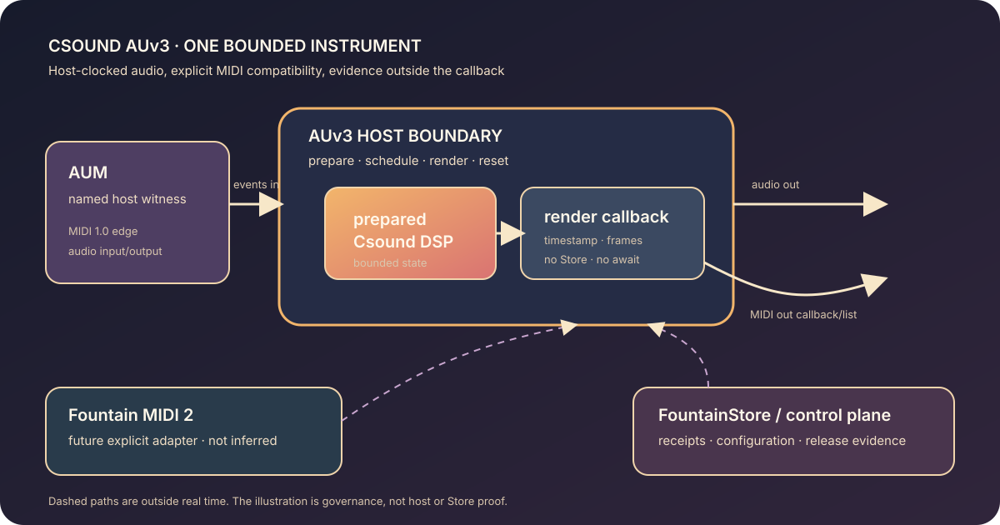

# 133 — Csound AUv3 Is a Fountain Instrument Boundary

> Chapter summary: Csound may become the DSP core of a Fountain Coach AUv3 instrument, with AUM as the first
> named MIDI 1.0 host edge and a later MIDI 2.0 seam. The host owns the render clock; Csound is prepared before
> real-time rendering; Reframe and FountainStore remain outside the audio callback.



*Principal illustration — a deterministic, self-contained governance projection. It describes the proposed
execution and evidence boundaries; it is not an AUv3 bundle, AUM discovery proof, audio measurement, MIDI2
terminal event, Store receipt, or licensing clearance.*

## The decision

Csound is admitted as an instrument engine, not as a UI, a script runner, or a second command system. The first
bounded platform target is an Apple AUv3 extension hosted by AUM on iPadOS. AUM is a named demonstration host and
MIDI 1.0 compatibility edge; it is not the authority for the Fountain instrument contract and it does not imply
MIDI 2.0 support.

```text
AUM MIDI 1 edge → AUv3 event/render boundary → prepared Csound DSP → AUM audio output
                                      ↘ MIDI output callback/list → host destination
Fountain MIDI 2 seam → explicit adapter → AUv3 contract (future, separately accepted)
```

The AU package owns the portable contract: identity, lifecycle, parameters, event vocabulary, timing policy,
failure states, and version. A companion app may own enrollment, configuration, presets, diagnostics, and network
or Store work. None of those tasks may enter the real-time render path.

## Current repository truth

The current repositories establish useful parts, but not this instrument:

1. `swift-csound` HEAD `324d9ed` provides an actor-based `SPManager`, an optional Csound C-API backend, and an
   expected Csound 7.0.0-beta.9 Apple XCFramework layout. Its README describes an AUv3 adapter as future work;
   HEAD contains no AUAudioUnit extension or render-safe Csound adapter.
2. `Teatro` HEAD `2da76dc` contains `CsoundSampler`, but it drives `csoundPerformKsmps` from detached asynchronous
   work and selects device output. That is a useful experiment, not an AUv3 `internalRenderBlock` implementation.
3. `midi2` HEAD `73f21fc` contains a separate MIDI2/AUv3 bridge sample and `MIDIEventList` path. It does not embed
   Csound or prove AUM interoperability.
4. AudioTalk has MIDI/audio transport material but no current Csound AUv3 instrument. FountainKit explicitly treats
   the older Teatro Csound path as deprecated and keeps it optional. FountainStore remains persistence authority,
   not an audio engine.
5. The integration repository already contains the portable AudioUnit contract slice from Chapter 132. That
   contract is a prerequisite seam, not evidence that an Apple extension, Csound render path, or AUM session exists.

These observations deliberately separate source presence from implementation, implementation from host acceptance,
and host acceptance from release.

## Apple’s boundary is the host’s boundary

Apple’s [`AUAudioUnit`](https://developer.apple.com/documentation/audiotoolbox/auaudiounit) contract supplies the
extension lifecycle, render block, MIDI scheduling blocks, MIDI protocol properties, and resource allocation
hooks. The host obtains and caches the render block before entering real time; the subclass supplies the
[`AUInternalRenderBlock`](https://developer.apple.com/documentation/audiotoolbox/auinternalrenderblock) and its
frame/timestamp semantics. The [`renderBlock`](https://developer.apple.com/documentation/audiotoolbox/auaudiounit/renderblock)
is therefore the host-clocked boundary, not an invitation to run an actor or compile Csound in the callback.

Apple exposes both legacy MIDI event routes and MIDI Event List routes: `scheduleMIDIEventBlock` and
`midiOutputEventBlock` on one side, and `scheduleMIDIEventListBlock` and `midiOutputEventListBlock` on the other.
The latter may carry Universal MIDI Packets when the negotiated host/device protocol permits it. The existence of
these APIs does not establish that AUM negotiates or preserves MIDI 2.0; that is a host-specific acceptance fact.
The legacy [`AUMIDIOutputCallback`](https://developer.apple.com/documentation/audiotoolbox/aumidioutputcallback)
remains a MIDI 1.0 packet-list edge. Protocol selection, timestamp preservation, and conversion loss must be
recorded rather than inferred from a successful connection.

## The render-safe Csound seam

The future adapter has a narrow shape:

```text
prepare(configuration, csd, sample-rate, max-frames)  [non-real-time]
  → compile/load and allocate bounded state              [non-real-time]
  → schedule timestamped input events                    [real-time-safe queue]
  → render(frame-count, buffers, event-list)              [host callback]
  → publish bounded output MIDI events                    [host callback]
  → reset/deallocate                                      [lifecycle boundary]
```

Preparation owns Csound creation, option selection, orchestra/score compilation, sample loading, channel mapping,
and allocation. The render callback may consume preallocated state and timestamped events, advance already-prepared
Csound state, and write the supplied audio buffers. It may not `await`, lock on an unbounded resource, allocate,
compile, read files, touch the network, write FountainStore, invoke a model, or ask the host to discover a route.
Actor isolation is appropriate for preparation and control-plane ownership; it is not a license to call an actor
from the render callback.

Parameters are control-plane inputs and must have declared ranges, units, automation behavior, and persistence.
Note, controller, pitch-bend, pressure, program, and SysEx handling are event inputs with explicit timestamp and
frame-offset rules. Csound output MIDI must use the host-provided callback or event-list contract and must state
what happens when a host offers no output route or when a bounded queue is full.

## MIDI 1.0 first, MIDI 2.0 later

AUM’s MIDI 1.0 edge is intentionally honest: channel voice messages, controllers, note identity, SysEx policy,
timestamp precision, channel/group mapping, unsupported messages, and backpressure are all part of the compatibility
profile. A MIDI 1.0 event is not silently upgraded into a MIDI 2.0 capability claim.

The later Fountain seam is a separate adapter and acceptance unit. It may expose the instrument through the MIDI2
IDL, Function Block identity, and declared UMP/event-time contract, while preserving the AUv3 package as the Apple
host boundary. Conversion is a projection with a named loss policy, not a new semantic authority. Reframe can
reason about the instrument and FountainStore can retain receipts, but neither belongs in the render loop.

## Lifecycle, failure, and licensing

The extension must fail closed at each boundary. Invalid Csound source, missing binary slices, incompatible sample
rate or frame capacity, unsupported event, unavailable output, queue overflow, reset, interruption, and deallocation
need typed states visible to the host-facing contract. A failed preparation must not leave a half-live renderer or
pretend that a MIDI 2.0 route exists.

`swift-csound` HEAD includes LGPL licensing material and documents an expected Csound 7.0.0-beta.9 XCFramework,
but the exact release artifact, linkage mode, source/offer obligations, notices, and App Store distribution review
remain release work. The project must verify the selected Csound release and artifact provenance against the
[Csound licensing page](https://csound.com/docs/licensing.html), preserve notices in the app/extension distribution,
and obtain an explicit legal/release decision for the selected packaging. This chapter makes no legal conclusion and
does not claim App Store clearance.

## Acceptance boundary

This chapter is a design and implementation-gap record. It becomes an accepted instrument only when one bounded
evidence cohort proves all of the following:

- the exact Csound source and Apple XCFramework slices are reproducibly identified, licensed, and linked into a
  signed iPadOS AUv3 extension and its companion app;
- the extension is discoverable by AUM, loads a deterministic `.csd`, allocates resources, renders audio, resets,
  and deallocates without callback violations;
- AUM MIDI 1.0 note/controller/timing cases produce the expected audio, and Csound MIDI output reaches a named host
  destination with measured timestamp/frame behavior;
- negative cases cover malformed source, unsupported events, interruption, queue pressure, missing output, and
  failed preparation without a hidden downgrade;
- static and runtime real-time checks show no actor hop, allocation, blocking I/O, Store/network/model access, or
  compilation in the callback, under normal and stress frame sizes;
- the portable AU contract, MIDI2 adapter (if included), terminal lifecycle, FountainStore receipt, and host witness
  are correlated by identity and revision; and
- AX, visual, replay, and release evidence are produced by the native procedures. A local preview or this
  illustration is never substituted for those facts.

Until then, the status is `DESIGNED — NOT HOST-ACCEPTED`; the smallest implementation delta is a native Apple AUv3
extension around a render-safe Csound adapter, followed by the named AUM witness and only then the MIDI2 adapter.

## Rules

1. Csound is an instrument engine behind an AUv3 boundary; it is not a Reframe UI or command authority.
2. AUM is the first named host witness and MIDI 1.0 edge; AUM does not establish MIDI 2.0 support.
3. The host owns render timing; Csound is compiled, loaded, and allocated before real-time rendering.
4. The render callback is bounded: no actor hop, await, allocation, blocking I/O, Store, network, model, or compile.
5. Every MIDI conversion declares identity, timestamp/frame behavior, precision loss, unsupported input, and pressure.
6. The AU package owns the portable contract; companion configuration and Store work remain outside the callback.
7. Missing artifacts, invalid source, unsupported events, and unavailable routes fail closed with typed outcomes.
8. MIDI2 is a separately admitted adapter and never an inference from AUM connectivity.
9. Csound artifact provenance and LGPL/App Store obligations require release evidence; this chapter is not clearance.
10. No host demo, illustration, or local preview upgrades a designed boundary into an accepted or released instrument.

## Governing sentence

Prepare Csound before the host calls real time, let AUM witness only the declared MIDI 1.0 edge, and admit the
MIDI2 seam only when its typed adapter, timing, failure, Store, and release evidence stand on their own.
