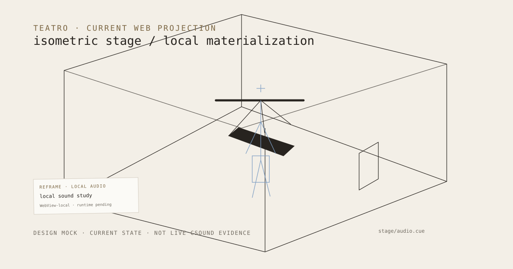

# 137 — Teatro Web Is Reframe's Governed Materialization Surface

> Chapter summary: Teatro Web is the current browser materialization of Reframe's stage vocabulary. It projects
> governed scene intent into an isometric WebView, while Linux/ReframeCore remains semantic authority and the user's
> device remains the audio-rendering boundary.



*Principal illustration — current Teatro Web design projection, observed in the LAN preview. It records the present
stage geometry and interaction vocabulary; it is not live Csound playback, MIDI2 terminal evidence, a Store receipt,
or a completed Reframe Web acceptance run.*

## The decision

Teatro Web is Reframe's browser-facing materialization surface. It is a client, not a second Reframe runtime. Its
scene is an inspectable projection of governed intent: an isometric room, a suspended rig, a rest-pose trace, and a
small local-audio annotation. The present implementation is a design and integration slice, not a claim that every
native Reframe surface has reached browser parity.

```text
source-addressed intent → ReframeCore / FountainStore → typed MIDI2 projection → Teatro WebView
                                                                      ↘ local audio boundary
```

## What is current

The current web surface is built in TypeScript/React with the Teatro stage engine and Three.js. It animates the
stage locally and exposes an accessible control layer. Audio intent is sent through the existing `stage/audio.cue`
boundary; the browser adapter deliberately refuses playback until a real Csound WebAssembly or AudioWorklet runtime
is admitted. The visible stage therefore establishes current design continuity, not audible Csound acceptance.

The visual language is intentionally sparse: warm paper, charcoal line, muted estate accent, and one small note-like
attachment for local audio. System feedback is transient and belongs to the estate information control; it is not a
permanent dashboard or interface mock.

## Rules

1. Teatro Web is a first-class Reframe projection, never semantic or Store authority.
2. ReframeCore, FountainStore, scenarios, leases, receipts, and typed MIDI2 remain authoritative outside the WebView.
3. The web client consumes generated contracts and must not invent a browser-only command language.
4. The Teatro scene contract names objects, relations, camera, animation, audio intent, and provenance explicitly.
5. The browser renders interactive stage motion locally; it does not stream every audio sample from the authority.
6. Csound WebAssembly or AudioWorklet must be prepared outside the render callback and receive only bounded events.
7. A missing browser Csound runtime is a typed blocked state, never a synthesized substitute or silent success.
8. Web, iPad, and macOS may use different renderers while preserving scene identity, event semantics, timing policy,
   and failure states.
9. The deterministic scene projection may produce a landscape SVG/PNG estate illustration, but that asset remains a
   publication projection joined to this semantic route.
10. WebView parity, audio output, MIDI2 delivery, accessibility, animation, and static export require separate
    acceptance evidence.

## Governing sentence

Teatro gives Reframe a web face without moving its meaning: the runtime governs the scene, the WebView materializes it,
and the user's device remains the place where interactive sound may eventually be heard.
