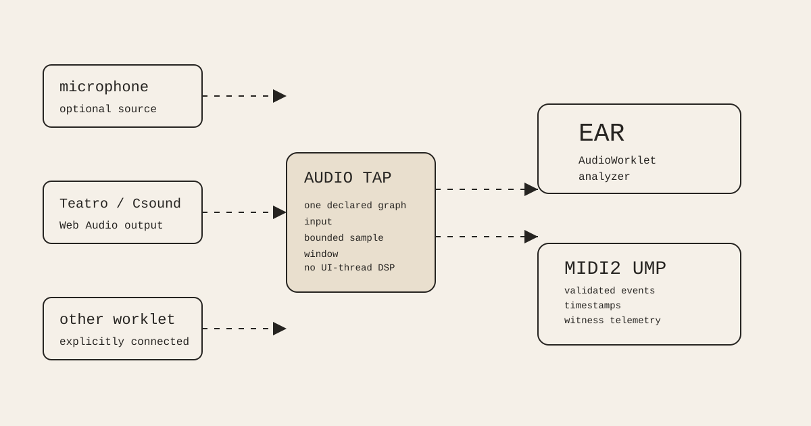

# 138 — Ear Is the Web Audio Graph's MIDI2 Listening Boundary

> Chapter summary: Ear listens to explicitly connected Web Audio, not only to a microphone. It observes the outputs
> of Teatro, Csound/WebAssembly, media sources, and other AudioWorklets inside the browser graph, then emits
> source-addressed, timestamped MIDI2 UMP without becoming a second audio or semantic authority.



*Principal illustration — a deterministic architecture projection. It describes the governed browser boundary; it is
not proof of browser MIDI2 interoperability, physical audibility, microphone permission, or a completed Ear runtime.*

## The decision

Ear is a listening instrument for the Web Audio graph. A microphone is one possible source, alongside Csound or
WebAssembly output, Teatro's mix, media elements, audio buffers, and the output of another `AudioWorkletNode`.
Every source Ear observes must be explicitly connected to an Ear input or analysis tap. Ear cannot discover or
inspect unrelated AudioWorklets merely because they exist in the same page.

```text
microphone ───────┐
Teatro/Csound ────┼──► explicit Web Audio tap ─► Ear AudioWorklet ─► MIDI2 UMP output
other worklet ────┘                                  │
                                                     └──► MIDI2 witness telemetry
```

The graph carries audio samples; the MIDI2 boundary carries detected events, measurements, timing, and lifecycle
state. Ear does not replace the existing `midi2.js` UMP model, decoder, validator, scheduler, or protocol authority.

## What Ear observes

Ear may measure energy, onset, pitch, modulation, turbulence, and other declared features from each connected input.
The first implementation must make its analysis window, hop, timestamp origin, confidence, and source identity
explicit. A silence result is a result. No connected input is an unavailable state. An unsupported detector is a typed
unsupported result, never a guessed note.

The output is MIDI2 UMP through the existing MIDI2 encoder and validation path. Where the declared detector supports
it, note, group, channel, 32-bit velocity, pitch, per-note expression, and event timestamps remain intact. Audio
measurements and detector status use the existing MIDI2 telemetry boundary; Ear must not introduce a parallel JSON
transport or silently reduce MIDI2 values to MIDI 1.0.

## Browser and graph boundary

The browser owns device permission, graph construction, AudioContext state, and the local audio callback. Ear owns
bounded analysis and event emission within its worklet boundary. The UI may request connection, start, mute, or stop,
but it does not analyze sample buffers or call timing-sensitive DSP directly.

AudioWorklet and Web MIDI are secure-context capabilities. A user gesture may be required to resume an AudioContext
or request input permission. Web MIDI availability is not universal, and a browser that cannot expose the required
MIDI2 output must report that capability as unavailable rather than claim delivery. A Web Audio graph can still be
analyzed locally when no MIDI output device is available.

## Rules

1. Ear is a Web Audio graph observer, not a microphone-only product.
2. Only explicitly connected graph inputs are observable; unrelated AudioWorklets remain outside Ear's authority.
3. Audio analysis runs in `AudioWorkletProcessor` code or an explicitly admitted equivalent worklet boundary, never in
   the UI thread's render or event handler.
4. Ear consumes and emits the existing MIDI2 UMP representation and public `midi2.js` APIs.
5. MIDI2 group, channel, note, full-resolution values, per-note data, and timestamps are preserved where the detector
   and declared output mapping support them; loss or unsupported mapping is typed and visible.
6. Measurements, emitted events, queue pressure, dropped windows, and lifecycle transitions remain observable
   through the existing MIDI2 telemetry contract.
7. Ear never presents a GUI state, analyser value, or queued event as proof that a person heard sound.
8. The Web Audio source graph, MIDI2 event graph, and semantic Reframe authority remain separate but correlated;
   Ear does not become a second Store, command, or scene authority.
9. Initialization, permission, connection, running, unavailable, interrupted, backpressure, error, and shutdown are
   typed states with deterministic cleanup of nodes, ports, timers, and queues.
10. Browser MIDI2 delivery, physical output, and device interoperability require independent acceptance evidence.

## Acceptance boundary

Ear is governed before it is implemented. Its executable scenario must prove, with a deterministic mock graph and a
real browser witness where available:

1. a connected non-microphone AudioWorklet source reaches Ear;
2. a microphone may reach the same boundary without being required;
3. the analyzer emits validated MIDI2 UMP with timestamp and declared source identity;
4. same-window events are ordered deterministically and backpressure is reported;
5. an unavailable MIDI2 output is reported without converting to MIDI 1.0;
6. measurements and lifecycle state are correlated through the existing MIDI2 telemetry path; and
7. shutdown releases every connected node, MessagePort, timer, and retained event buffer.

This chapter establishes the contract only. It does not claim that the runtime, browser output, microphone path,
physical speakers, iPad, Linux host, or public release already satisfy it.

## Governing sentence

Ear gives the Web Audio graph a MIDI2 listening boundary: connect the sound explicitly, analyze it off the UI thread,
emit what the graph can justify, and let acceptance—not a visible meter—say what was actually heard or delivered.
