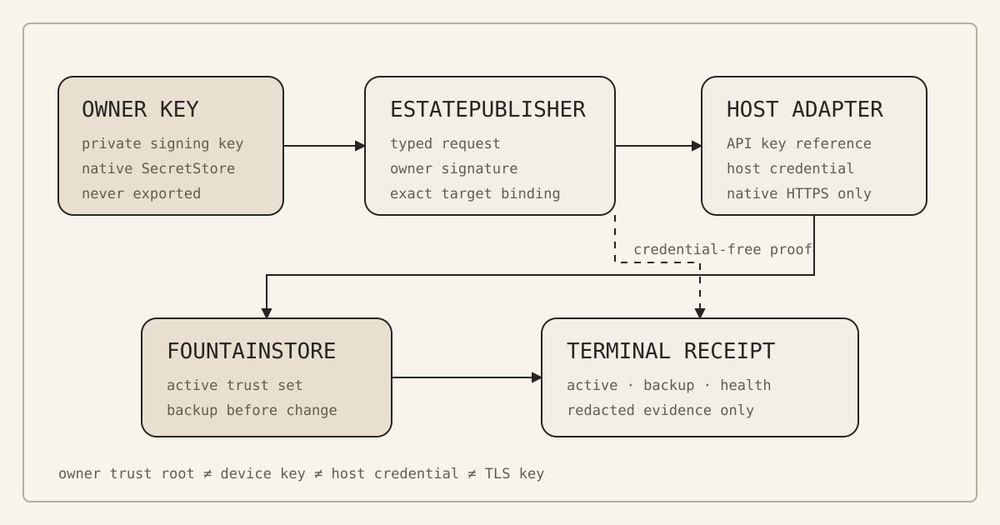

# 139 — Owner Trust Root, SecretStore Custody, and Recovery

> Chapter summary: Fountain Coach separates owner authorization, device enrollment, host credentials, and estate
> publication. Private keys remain in native SecretStore custody; EstatePublisher carries typed, signed requests;
> FountainStore is the remote authority. A lost owner root is a bounded recovery condition, not permission to bypass
> the trust model.



*Principal illustration — the deployed authority boundary. It shows custody and evidence flow; it is not a private-key
export, a successful trust rotation, or proof that the current owner root is recoverable.*

## The decision

The security model uses an owner trust root to authorize maintenance operations. The root is a Curve25519 signing
key pair. Its public key is configured on the production FountainStore; its private key is held by an owner-controlled
SecretStore. The name `owner-primary` is only a stable key identifier. It does not identify a person, device, or key
holder by itself.

EstatePublisher is the native maintenance client. It prepares typed requests, obtains owner authorization from the
local SecretStore, and hands approved work to the named FountainStore host adapter. FountainStore remains the remote
authority for enrollment, publication, release activation, and trust configuration. The public estate is a projection
of Store state, never a security authority.

## The custody model

The system has four distinct kinds of sensitive authority:

- The owner trust-root private key signs owner-authorized enrollment and trust-rotation decisions. It is not sent to
  FountainStore, MIDI2, Reframe, a browser, or an estate route.
- A device private key identifies one EstatePublisher installation. It is created and retained in the local
  SecretStore; the enrollment request contains only its public key.
- The FountainStore API key authenticates the Store edge. The host-agent credential authorizes the named host
  operation. Both are resolved by the native host adapter from SecretStore references and are excluded from typed
  requests and receipts.
- TLS private keys terminate the configured public HTTPS routes. They are host-owned certificate material and are
  separate from the owner trust root.

No one of these credentials substitutes for another. Possession of root access to a Linux host does not prove
possession of the owner signing key. Possession of a device key does not authorize trust-root rotation. A TLS key does
not authorize maintenance.

## The maintenance boundary

The normal flow is:

```text
owner SecretStore
        │ private signature
        ▼
EstatePublisher ── typed request + public evidence ──► FountainStore host adapter
        │                                                   │
        │                                                   ├── backup / apply
        │                                                   ├── service restart
        │                                                   ├── HTTPS health
        │                                                   └── redacted terminal receipt
        ▼
local proof and operator-visible status
```

EstatePublisher does not accept arbitrary shell commands, caller-supplied credential headers, copied private keys, or
generic HTTP deployment instructions. The FountainStore rotation route is fixed by the native adapter. Its request is
bound to the exact target, host identity, trust-set digest, current owner identity, approval interval, and idempotency
key.

## Owner trust-root rotation

Rotation is additive and owner-signed. A valid rotation retains the current trusted owner, adds the explicitly named
replacement keys, creates a pre-rotation backup, applies the complete trust set atomically, restarts the named service,
and verifies the configured HTTPS health route. Replay, target mismatch, host-identity mismatch, expired approval,
missing SecretStore credentials, and an invalid current-owner signature are terminal failures.

The terminal receipt must prove the requested owner IDs, active state, backup creation, service restart, and HTTPS
health. A successful HTTP response without that typed receipt is not activation evidence. A public key or fingerprint
is identification evidence only; it is not proof that the corresponding private key is available or that the server
accepts it.

## Enrollment and publication

Device enrollment follows a separate boundary. EstatePublisher creates a device key locally, emits a public request,
and signs the enrollment binding with the owner key. The approval host accepts the signed request only when the owner
public key matches the configured trust root and the nonce, target, and expiry are valid. The resulting receipt is
redacted and correlated; it does not become a transferable maintenance lease.

Estate publication is also separate from trust rotation. The authorized publication operation is
`estate.publication.sync`: an explicit local FountainStore is synchronized to an authenticated remote FountainStore,
then the selected route, typed manifest, public HTTPS, and matching digest are read back. EstatePublisher is the only
admissible publication client for the declared estate hosts.

## Recovery is not rotation

If the owner private key is lost, the existing additive rotation contract cannot be satisfied. A newly generated key is
not active merely because it is safely stored, and changing the server configuration by root access would bypass the
owner authorization invariant.

The deployed system therefore fails closed in this condition. It currently has no break-glass owner-recovery
operation, recovery token, quorum rule, or independent emergency authority. This is deliberate: inventing one at the
moment of key loss would create an undocumented second trust root.

The next security feature must be a separately governed recovery operation. It must define its recovery authority,
one-time or replay-protected evidence, exact target and service binding, backup and rollback behavior, key-set
replacement rules, service restart, HTTPS health, and a redacted terminal receipt. Until that operation is admitted and
accepted, recovery remains a documented blocker rather than an implicit administrative action.

## Rules

1. `owner-primary` is an identifier, not an identity claim.
2. Private keys remain in native Keychain or SecretStore custody and are never serialized into requests, receipts,
   MIDI2 messages, browser state, or public estate content.
3. Public keys and fingerprints may identify custody candidates, but never establish private-key possession alone.
4. Device enrollment, owner authorization, host credentials, TLS termination, and estate publication remain distinct
   authorities.
5. Every trust-root rotation is signed by the currently active owner root and is bound to one exact target and host.
6. Rotation is idempotent, backup-protected, restart-verified, health-verified, and rejected on replay.
7. EstatePublisher uses the native FountainStore adapter; SSH mutation, copied binaries, static-directory transfer,
   and generic HTTP wrappers are not equivalent operations.
8. Root access may inspect service state and SecretStore availability, but it does not manufacture an owner signature.
9. A generated replacement key is staged until the typed server receipt proves activation.
10. A lost owner key requires an explicitly governed recovery operation; it never authorizes an undocumented bypass.
11. Public documentation reports fingerprints, identifiers, and proof state only; it never publishes secret values.
12. Security acceptance distinguishes key custody, authorization, server activation, publication, and public HTTPS
   read-back. One does not imply the others.

## Current evidence boundary

The current deployment proves that Hetzner FountainStore has a configured owner trust root, a native encrypted
SecretStore, a host-agent credential boundary, and a typed owner-trust rotation endpoint. The local Mac has a separate
owner key in Keychain and a newly staged replacement key. The Mac key does not match the active Hetzner root, so no
rotation or recovery claim may be made from those keys alone.

This chapter intentionally does not publish public-key bytes, private-key material, API keys, host credentials,
keystore passwords, or TLS private keys. It documents the security contract and its present proof boundary; it does
not claim that the missing recovery operation has been implemented.

## Related governance boundaries

This chapter is the current security-model synthesis, not a replacement for the existing boundaries: [Chapter 94 —
Credentialed Infrastructure Operations and Provider Adapters](94-credentialed-infrastructure-operations-and-provider-adapters.md)
defines provider-neutral authorization; [Chapter 118 — European Cybersecurity Profile](118-european-cybersecurity-profile.md)
defines continuity and recovery evidence; [Chapter 131 — Remote SecretStore Authorization and Approval
Sessions](131-remote-secretstore-authorization-and-approval-sessions.md) defines short-lived approval sessions; and
[Chapter 134 — EstatePublisher Is the Publication Authority](134-estatepublisher-publication-authority.md) defines the
native publication client. Chapter 139 binds those existing contracts to the currently observed owner-root and
recovery evidence boundary.

## Definition of done

This chapter is complete when the publication pipeline can show, without secret disclosure:

1. the owner trust root is identified by key ID and public fingerprint;
2. each authority class resolves to its declared SecretStore or host-owned custody boundary;
3. EstatePublisher emits only typed, target-bound, owner-signed requests;
4. FountainStore accepts only a valid current-owner signature and returns a correlated terminal receipt;
5. rotation proves backup, activation, restart, HTTPS health, and replay protection;
6. enrollment, publication, release activation, and trust rotation remain separately evidenced; and
7. any lost-root condition stops at the missing recovery contract rather than mutating trust state silently.

The chapter governs the deployed model. It does not turn the currently staged Mac key into the production owner root,
and it does not claim recovery until a separate recovery scenario passes its own acceptance proof.
