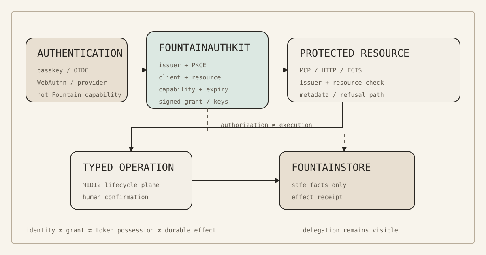

# 142 — FountainAuthKit: Fountain Coach Is Its Own Governed OAuth/OIDC Authority

> Governance chapter: 142. This chapter proposes the Fountain.coach-owned authorization and identity boundary. It does not
> claim that a production authorization server is deployed, externally security-reviewed, accepted for public use, or
> that `auth.fountain.coach` is currently live.



*Principal illustration — a deterministic vector governance projection. It explains the authority boundaries; it is not
*a token, key, login, security review, live issuer, or protected-resource acceptance receipt.*

## Purpose

Fountain Coach already governs capabilities, credentials, deployment, durable evidence, and instrument promotion as separate authorities.

What remains missing is the authority that can say:

> this subject authenticated here, this client is known here, this capability was granted here, for this resource, for this duration, under this human decision

without handing that decision to Apple, Google, OpenAI, GitHub, a cloud provider, an MCP implementation, or an individual instrument.

The missing boundary is not another login screen. It is a Fountain.coach-owned authorization authority.

## The decision

Fountain Coach SHALL be able to operate its own standards-compatible OAuth authorization server and OpenID Connect
identity provider through a reusable Swift-native FCIS-KIT package named **FountainAuthKit**. A possible deployed issuer
identity is `https://auth.fountain.coach`; the corresponding governed FCIS capability identity is
`fountain-coach.authorization`.

FountainAuthKit is the authorization boundary, not another login screen. A deployed authorization service is one
admitted use of the package. Reframe, FountainStore, EstatePublisher, remote MCP servers, native applications, and
future instruments may consume the authority without becoming its issuer.

The architectural distinction is:

```text
authentication → authorization → capability execution → evidence
```

Authentication establishes who or what participated in an authentication ceremony. Authorization establishes what
that authenticated principal granted to a particular client, for a particular resource, for a bounded duration. The
resource executes or refuses the typed operation. FountainStore records the governed lifecycle and durable effect.
None of those facts may be inferred from another.

The authority flow is:

```text
human / authorized principal
  → authentication ceremony
  → FountainAuthKit authorization decision
  → signed, bounded grant
  → FCIS-KIT / MCP / HTTP protected resource
  → typed operation
  → FountainStore evidence
```

## Fountain.coach authority is not Fountain.coach passwords

FountainAuthKit may authenticate a principal through admitted mechanisms including platform passkeys, hardware-backed
credentials, WebAuthn-compatible authenticators, device-bound keys, an external OpenID Connect provider, Apple or
another admitted provider, an owner-controlled enrollment credential, or another separately governed mechanism.

An upstream provider may establish an authentication fact. It does not automatically become the authority over Fountain
capabilities. The downstream decision remains Fountain.coach-owned:

```text
authenticated principal ≠ authorized Fountain.coach capability
```

A successful Apple, Google, OpenAI, GitHub, or other provider login therefore does not itself authorize
`estate.publish`, `fountainstore.write`, `instrument.release`, `deployment.apply`, `organization.admin`, or any
equivalent capability. Those grants belong to Fountain.coach authority.

## FountainAuthKit is an FCIS-KIT boundary

FountainAuthKit obeys the ordinary FCIS-KIT promotion model:

```text
scenario → implementation → build → execution → evidence → admission → reuse
```

Its security significance requires stronger evidence; it does not exempt the package from the capability-plane
architecture. The Kit MUST declare:

- stable package identity, semantic version, and implementation provenance;
- supported protocol profile and cryptographic algorithms;
- issuer identity and public metadata surfaces;
- authorization operations and authentication adapters;
- client-registration model and client classes;
- token types, lifetimes, revocation, and expiry semantics;
- supported scopes and protected-resource binding;
- key rotation, compromise response, and recovery semantics;
- persistence, network, and TLS assumptions;
- refusal states, scenarios, and evidence authorities; and
- release and admission state.

A Swift package that can mint a JWT is not an authorization server. A server that responds to `/token` is not an
admitted Fountain.coach authority. A successful MCP connection is not authorization evidence.

## Protocol authority and interoperability

FountainAuthKit SHALL implement published interoperable protocol contracts rather than inventing a Fountain-specific
login protocol. The initial profile SHOULD include, where applicable:

- OAuth authorization and OpenID Connect identity;
- Authorization Code with PKCE;
- Authorization Server Metadata;
- Protected Resource Metadata;
- JWKS publication; and
- resource-bound access tokens with explicit expiry and revocation semantics.

The authorization server publishes machine-readable discovery metadata. A protected resource publishes its own
protected-resource metadata where the selected profile requires it. The relationship is discoverable rather than
hard-coded:

```text
protected resource
  → /.well-known/oauth-protected-resource
  → Fountain authorization issuer
  → /.well-known/oauth-authorization-server
  → authorization and token endpoints
```

OAuth/OIDC interoperability is an obligation. It is not the source of Fountain governance.

OAuth Authorization Server Metadata is standardized by RFC 8414, OAuth Protected Resource Metadata by RFC 9728, and current OAuth security practice by RFC 9700. These references establish interoperability and security practice; they do not transfer Fountain governance to the standards bodies or to an upstream provider.

## MCP is a consumer of authority

MCP SHALL NOT become Fountain Coach’s identity database, authorization policy authority, SecretStore, or token issuer
merely because a protected capability is exposed over MCP. The governed relationship is:

```text
FountainAuthKit
  → bounded authority
  → MCP protected resource
  → FCIS capability
```

An MCP server may expose tools, resources, long-running tasks, instrument discovery, Store-backed operations, or another
admitted interface. Its protected operations validate the authority appropriate to the resource before dispatch. MCP
transports or exposes governed capability; it does not define who owns that capability.

## One grant, one intended resource

An access token MUST be bounded to the resource for which it was granted. A credential issued for
`https://store.fountain.coach` must not silently authorize `https://estate.fountain.coach`,
`https://git.fountain.coach`, or an unrelated MCP service.

Where resource indicators are used, the authorization request identifies the intended resource and the resulting token
is restricted accordingly. The normal Fountain grant is therefore:

```text
subject + client + resource + capability + duration + authorization event
```

It is never merely “logged in, therefore trusted everywhere.” OAuth scopes SHOULD correspond to governed capability
boundaries wherever practical. Examples such as `fountainstore.read`, `estate.inspect`, `estate.publish.preview`,
`instrument.discover`, and `release.inspect` are vocabulary proposals, not declarations that those exact scopes
currently exist. A scope is not valid merely because a route exists.

Each capability scope MUST resolve to a declared operation, owning authority, intended resource, human-readable
meaning, data and mutation boundary, acceptance status, and required evidence. Broad grants such as `admin`, `all`, or
`root` SHOULD be rejected unless a separately governed use case proves why a narrower model is impossible.

## Human authority remains above token possession

Possession of a valid access token establishes that the named authorization server issued the represented grant. It does
not mean that every consequential operation covered by the token must execute without further mediation.

Reframe or another host MAY require an additional explicit human decision for publication, release, credential rotation,
infrastructure mutation, destructive Store operations, authority delegation, or another high-consequence transition.

```text
token permits ≠ host must execute
```

The host still mediates intention. The instrument executes its bounded capability. The authorization server establishes
the grant. FountainStore establishes what became durable.

## Machine and agent authority

FountainAuthKit may issue authority to non-human clients including Reframe, an FCIS-KIT host, EstatePublisher, a build
service, an MCP client, a deployment worker, an enrolled device, or another admitted agent process.

Machine identity MUST NOT be confused with human identity. A machine grant preserves the authority chain through which it
arose:

```text
owner authorization → enrolled Reframe instance → bounded EstatePublisher execution
```

It must not be flattened into “EstatePublisher is owner.” An agent may exercise granted authority; it does not become
the originating authority merely because it possesses the credential.

## Tokens, keys, and durable evidence

An access token is a cryptographically protected execution credential, not a governance document. It SHOULD contain only
the claims necessary for the relying resource to evaluate the grant. It MUST NOT become a portable copy of private user
profiles, manuscript material, prompts, provider credentials, organization internals, unnecessary personal information,
FountainStore records, or policy prose.

Policy belongs in governed source and runtime policy. Evidence belongs in FountainStore. Secrets belong in their custody boundary. The token carries only the bounded authorization facts required for its job.

Authorization signing keys are crown-jewel operational material. Private signing keys MUST NOT appear in Git, FCIS-KIT
release archives, prompts, MCP payloads, MIDI2 messages, FountainStore public receipts, AX, screenshots, logs, or public
governance projections. FountainAuthKit exposes only the public verification material required by relying parties, such
as an admitted JWKS surface.

The implementation MUST define the complete key lifecycle:

```text
generate → activate → publish public key → sign → rotate → retire → revoke / compromise response → recover
```

Key rotation SHALL preserve enough overlap and provenance for valid in-flight credentials to be evaluated according to policy without making retired private material available again. The implementation’s key-storage mechanism is a deployment decision and must be independently declared.

FountainStore records safe authorization facts where durable evidence is required: issuer, authorization-event identity,
governed subject reference, client, resource, requested and granted capability, authorization time, expiry,
authentication mechanism class, policy/version identity, outcome, revocation state, session correlation, and terminal
receipt. It MUST NOT persist raw access tokens, refresh tokens, passwords, private keys, authorization codes, or
equivalent bearer credentials merely for observability.

The evidence relationship is:

```text
authorization request → decision → bounded grant metadata
  → protected-resource execution → terminal receipt
```

This establishes both what authority was granted and what operation occurred without storing the credential that enabled
it.

## Client classes and native applications

FountainAuthKit distinguishes at least public native clients, confidential server clients, known first-party Fountain
applications, MCP clients, enrolled devices, external third-party clients, and unrecognized clients. Each class MUST
have an explicit registration or metadata-verification rule. Registration itself does not grant capability.

The current MCP specification favors Client ID Metadata Documents for new integrations while retaining Dynamic Client Registration for compatibility during its transition. FountainAuthKit MAY support the mechanism required by admitted MCP clients, but registration itself SHALL NOT grant capability. Client identity answers “which client is asking?” Authorization still answers “what may this client do?”

Reframe and other Apple-platform clients are public OAuth clients unless evidence establishes another class. They MUST NOT
rely on an embedded client secret as proof of application identity. Native flows SHOULD use system authorization context,
authorization code, PKCE, exact redirect handling, and a resource-bound grant according to the admitted profile.

Shipping Reframe therefore does not ship the keys to Fountain.coach authority.

## HTTP, MCP, and MIDI2 remain separate contracts

OAuth/OIDC defines the authorization and identity protocol boundary. MIDI2 defines Fountain Coach’s typed operational
command and lifecycle plane. Neither replaces the other:

```text
OAuth authorization → resource-bound credential
  → FCIS host accepts authorized session
  → typed MIDI2 operation
  → instrument lifecycle
  → FountainStore receipt
```

HTTP may transport protocol messages, MCP may expose a remote capability, MIDI2 may carry the Fountain operation, and
FountainStore may persist evidence. These are composable boundaries, not competing vocabularies.

## Relationship to existing governance

[Chapter 89](/chapters/89-codex-auth-instrument-is-the-copilot-login-surface/) governs the Codex authentication instrument and external-provider authentication. This chapter governs the
opposite authority direction: a client requests Fountain.coach authority, Fountain.coach decides, and a Fountain.coach protected resource
validates the bounded grant. An upstream provider token MUST NOT simply be forwarded and treated as a Fountain.coach capability
grant.

[Chapter 90](/chapters/90-independent-security-review-is-a-separate-acceptance-boundary/) governs the separate
independent-security-review boundary. [Chapter 91](/chapters/91-fcis-kit-instrument-store-is-the-capability-plane/) governs
FCIS-KIT as the capability plane. [Chapter 93](/chapters/93-instrument-creation-is-a-governed-promotion-path/) governs
scenario-first instrument promotion. [Chapter 94](/chapters/94-credentialed-infrastructure-operations-and-provider-adapters/)
governs external-provider credentials and infrastructure authority. [Chapter 95](/chapters/95-fountainstore-headless-linux-authority/)
governs server-side FountainStore authority. [Chapter 97](/chapters/97-provider-neutral-host-bootstrap-and-enrollment/) governs
trusted-host enrollment. [Chapter 118](/chapters/118-european-cybersecurity-profile/) governs authenticity, integrity,
confidentiality, recoverability, provenance, accountability, availability, and continuity.

This chapter joins those authorities; it does not replace them.

## European regulatory applicability and compliance boundary

This chapter defines a technical authorization boundary; it does not certify Fountain.coach, FountainAuthKit, or a
future protected resource as compliant with European Union or Member State law. The regulatory result depends on the
deployed service, the data processed, the clients and resources admitted, the entity's role and size, and the
jurisdictions reached.

The minimum applicability review is:

- [GDPR](https://eur-lex.europa.eu/eli/reg/2016/679/ojv): identify controller and processor roles, lawful bases,
  purpose limitation, data minimization, retention, data-subject rights, transfers, security, breach response, and a
  data-protection impact assessment where the processing risk requires one.
- [ePrivacy Directive](https://eur-lex.europa.eu/eli/dir/2002/58/oj?locale=en): assess cookies, device storage,
  session identifiers, tracking, and electronic communications separately from GDPR.
- [NIS2](https://eur-lex.europa.eu/legal-content/EN/TXT/?uri=CELEX:32022L2555) and its German implementation:
  determine whether Fountain.coach or a service operator is an essential or important entity, a relevant
  digital-infrastructure or provider category, or outside scope; do not infer this from OAuth alone.
- [eIDAS](https://eur-lex.europa.eu/eli/reg/2014/910/2024-05-20/eng): assess separately if the service uses a
  notified electronic-identification scheme or provides regulated trust services. Ordinary OAuth/OIDC issuance is not
  by itself an eIDAS trust service.
- [AI Act](https://eur-lex.europa.eu/legal-content/EN/ALL/?uri=CELEX%3A32024R1689),
  [DSA](https://eur-lex.europa.eu/eli/reg/2022/2065/oj), and
  [EAA](https://eur-lex.europa.eu/eli/dir/2019/882/oj/eng): assess only against the deployed functions and service
  category, including whether AI makes or supports decisions about people, whether the service is an intermediary or
  hosting service, and whether a listed accessible product or service is offered.
- German and other Member State law: record the applicable national implementation, supervisory authority,
  contractual terms, and consumer or e-commerce obligations for each target market.

Before any claim of public or security-reviewed production, the compliance evidence must include a dated applicability
register with official sources and an owner, controller/processor and subprocessor map, privacy notice and
retention/rights design, transfer assessment, incident and breach process, DPIA decision where applicable,
accessibility evidence, security review, and qualified legal review. `requires_review` is a publication blocker;
“not applicable” requires a written rationale.

This chapter therefore records **regulatory applicability not yet established**. Its acceptance predicates are
engineering evidence, not a legal certification, and the absence of a production issuer means no current
Fountain.coach authentication service is being represented as compliant.

## Relationship to infrastructure authorization

FountainAuthKit does not supersede SecretStore, provider IAM, Hetzner authorization, AWS roles, deployment credentials, or equivalent external authorities. Fountain authorization may permit an admitted Fountain operation which subsequently requires provider authorization to act on external infrastructure:

```text
estate.deploy
    ↓
EstatePublisher admitted operation
    ↓
provider-specific infrastructure authority
    ↓
deployment
    ↓
receipt
```

A Fountain access token is not a Hetzner token. A Hetzner token is not a Fountain authorization decision. Chapter 94’s provider-neutral credential boundary remains authoritative for those external credentials.

## Relationship to FCIS-KIT

This proposal extends Chapters 91 and 93 rather than creating a privileged security subsystem outside them. FountainAuthKit may itself expose bounded instruments such as `authorization.discover`, `authorization.begin`, `authorization.status`, `authorization.revoke`, and `session.inspect`, provided those names become part of the governed IDL rather than remaining prose.

The authorization service itself MUST remain independently addressable by standards-compatible clients. An external OAuth client cannot be required to understand MIDI2 merely to perform OAuth. FCIS-KIT governs the owned capability and its Fountain integration; the public OAuth/OIDC surface governs standards interoperability. There is one implementation authority with multiple projections, not two competing implementations.

## Scenario-first acceptance

The first implementation SHALL be driven by bounded executable scenarios. Acceptance must establish, at minimum:

1. Authorization-server metadata resolves from the declared issuer.
2. The published issuer exactly matches the authority used during token validation.
3. A native public client completes authorization using PKCE.
4. An incorrect redirect URI fails closed.
5. An authorization code cannot be replayed.
6. An expired token is refused.
7. A token issued for Resource A is refused by Resource B.
8. A token missing the required capability is refused.
9. An unrecognized or invalid client follows its declared refusal path.
10. Key rotation preserves explicitly permitted in-flight validity and refuses signatures outside the admitted key history.
11. Revocation or invalidation produces the declared result.
12. Protected-resource metadata identifies the intended authorization authority.
13. An admitted MCP protected resource discovers or validates Fountain.coach authority according to the supported MCP profile.
14. FountainStore contains the safe authorization/effect lineage without containing bearer credentials.
15. Logs, AX, screenshots, MIDI2 events, Store records, and public evidence contain no secrets.
16. Network loss, Store loss, clock skew, malformed metadata, invalid signatures, and issuer mismatch fail closed.
17. Replaying an execution request cannot silently recreate human authorization.
18. A successful authentication without sufficient Fountain authorization is refused.
19. A valid Fountain.coach token without separately required high-consequence human confirmation does not bypass host policy.
20. The exact release under test is identifiable by source revision, SemVer, dependency resolution, artifact digest, and signing evidence.

The scenario runner establishes these predicates; it does not grant production status.

## Security acceptance and recovery are separate

The states remain distinct:

```text
implemented → locally tested → integration accepted
  → owner-controlled operational production
  → independently security-reviewed → public/reusable release
```

A successful login does not establish cryptographic correctness. A passing unit suite does not establish resistance to
protocol attacks. A successful MCP interaction does not establish issuer safety. Independent review does not replace
product acceptance.

Before FountainAuthKit is described publicly as independently security-reviewed, an independent review SHOULD examine redirect handling, PKCE, authorization-code binding, issuer confusion, audience/resource confusion, client impersonation, token replay, refresh-token behavior if supported, key generation and rotation, algorithm confusion, JWKS handling, clock and expiry behavior, metadata poisoning, authorization downgrade, scope escalation, MCP authorization boundaries, session fixation, CSRF, open redirects, token leakage through URLs/logs/telemetry/Store/UI, recovery after signing-key compromise, and administrative authority escalation.

The implemented profile SHALL follow current OAuth security best current practice rather than preserving obsolete flows merely because an older OAuth implementation supports them. RFC 9700 is the current OAuth Security BCP.

Recovery is part of authority. The release MUST define what happens when a signing key is lost or compromised, the
authorization database or FountainStore is unavailable, the deployed host is lost, DNS or TLS changes fail, the issuer
hostname migrates, a client credential is compromised, an enrolled device is lost, or an operator must revoke all
outstanding authority.

Recovery MUST distinguish restoring service from restoring trust. A backup that restores bytes does not automatically
restore confidence in keys that may have been compromised.

## Public projection and stop conditions

The public estate MAY publish issuer identity, supported protocol profile, public metadata, public JWKS, documentation,
supported client classes, sanitized capability vocabulary, package/release identity, admission state, security-review
status, interoperability evidence, and governance links.

It MUST NOT publish bearer or refresh tokens, authorization codes, private signing keys, private client credentials,
personal authorization histories, private subject identifiers, SecretStore contents, private FountainStore records, or
unsupported live-acceptance claims. The public site is a projection of authority; it is not the authority.

A plausible topology is:

```text
auth.fountain.coach
    FountainAuthKit authorization server
    OAuth/OIDC discovery
    authorization endpoint
    token endpoint
    public JWKS

Protected resources remain independent:
    store.fountain.coach
    estate.fountain.coach
    instruments.fountain.coach
    other admitted MCP / HTTP resources
```

Each protected resource declares and validates its own authorization relationship. The shared issuer provides coherence; it does not flatten those resources into one security domain.

## Implementation boundary

The first implementation SHOULD remain small: issuer, metadata, key custody, authorization code + PKCE, resource-bound access token, protected-resource validation, revocation/expiry, FountainStore evidence, and one real FCIS/MCP protected resource.

Identity breadth must not outrun authority correctness. Social identity federation, many third-party clients, broad organization administration, complex delegated authority, cross-domain SSO convenience, token exchange, marketplace identity, billing identity, and public developer registration are later concerns.

Stop rather than issue, accept, promote, or publish when issuer identity is ambiguous; TLS identity is not established; private signing-key custody is undefined; embedded native-app client secrets are proposed as trust; authorization and authentication are collapsed; tokens are accepted without issuer validation; a resource accepts tokens not explicitly intended for it; redirect validation is permissive or wildcard-based without a governed exception; PKCE is missing from a supported public-client authorization-code flow; bearer credentials appear in logs, Store evidence, AX, prompts, MIDI2 events, or public artifacts; a client can escalate its requested capability without an authorization decision; an MCP server treats connection success as sufficient authorization; a model or agent can grant itself authority; a valid token bypasses a separately required human decision; signing-key compromise has no revocation/recovery procedure; the implementation cannot identify which released build issued or accepted a credential; live-provider behavior is claimed from fixtures; independent security review is claimed from internal tests; or the public estate would expose private authorization material.

## Governing sentence

**Fountain Coach may issue its own authority without inventing its own authentication protocol: FountainAuthKit is the
Swift-native FCIS-KIT authorization boundary, OAuth/OIDC provides interoperable discovery and grants, MCP and other
protected resources consume narrowly resource-bound capability, Reframe preserves human mediation, FountainStore proves
the durable authorization and effect lineage, and neither an authenticated identity, a valid token, an agent, nor a
protocol connection may silently become the authority it was never granted.**
