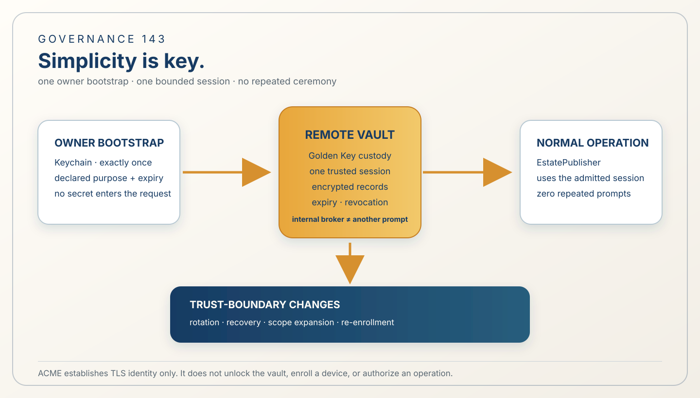

# 143 — Simplicity Is Key: One Bootstrap, One Trusted Session

> Governance chapter: 143. This chapter records a security-governance correction after the Golden Key path became
> over-ceremonial. It does not claim that a remote vault, one-time bootstrap, or zero-prompt runtime session is
> implemented, live-accepted, or publicly deployed.



*Principal illustration — a deterministic governance projection. It explains the intended authority shape; it is not a
vault receipt, Keychain authorization, remote deployment, ACME certificate, or live acceptance evidence.*

## The governing principle

**Simplicity is key. Key is security.**

Security must be understandable enough to operate correctly. The owner should authorize the trust boundary once for a
bounded purpose and period; the system should then use the resulting trusted session without repeatedly asking for the
same secret or layering new approval authorities around the operation.

Simplicity does not mean removing encryption, target binding, expiry, revocation, least privilege, or evidence. Each
control must have one owner, one visible purpose, and one place in the execution path.

## The problem this chapter addresses

The security material grew a ceremony stack: local Keychain access, SecretStore, a Golden Key vault, a broker, approval
sessions, host admission, FountainAuthKit grants, signed release evidence, and repeated terminal proofs. Several are
legitimate boundaries in isolation. They were nevertheless treated as if every normal operation needed every boundary
and another human approval.

That produced four failures:

1. the owner could be asked to unlock the same local Keychain repeatedly;
2. bootstrap custody and normal operation were not clearly separated;
3. internal broker mechanics were presented as a second user-facing approval system; and
4. ACME was considered for a role it cannot perform: ACME establishes TLS certificate authority for a domain, not
   owner trust, device enrollment, vault unlock, or operation authorization.

Security must not depend on the operator enduring ceremony.

## The decision

The security path has two phases:

```text
one-time owner bootstrap
  → remote vault is created or enrolled
  → bounded trusted device/session is established
  → native operation uses that session
  → expiry or revocation ends the session
  → explicit re-bootstrap is required
```

During bootstrap, the local Keychain may be used exactly once to release the owner key or bootstrap credential. The
remote vault then becomes the runtime custody boundary. Keychain is bootstrap custody, not a recurring publication
interface.

Normal operation must not ask for the Keychain password again and must not add a phone approval, OAuth grant, broker
approval, or other human prompt merely because another credential record is needed within the already authorized
scope. Internal components may enforce the session, but they must not create additional user-facing authority
decisions.

Rotation, recovery, scope expansion, and re-enrollment are separate trust transitions. They may require a new explicit
owner decision because they change the trust boundary; ordinary repeated use does not.

## Authority ownership

Each concern has one authority:

| Concern | Sole authority | Not implied by |
| --- | --- | --- |
| Owner decision | owner-controlled bootstrap or rotation action | possession of a token or host access |
| Runtime secret custody | enrolled remote Golden Key Vault | local Keychain availability |
| Device/session identity | enrolled device and bounded session | TLS certificate or ACME account |
| Operation execution | EstatePublisher native typed adapter | a credential by itself |
| Durable effect and read-back | FountainStore | an HTTP response or screenshot |
| Public TLS identity | ACME/host certificate boundary | owner authorization or vault unlock |

FountainAuthKit remains an application authorization boundary where the application requires one. It must not be
inserted into Golden Key bootstrap as a second login unless the requested operation actually crosses its authority
boundary. ACME remains a certificate-automation boundary; it cannot issue an owner key or approve an EstatePublisher
operation.

## Human-facing contract

The human sees one clear state:

- **Bootstrap required** — one owner authorization creates or enrolls the remote vault and establishes the bounded
  session.
- **Ready** — normal operations use the existing session without another password or approval prompt.
- **Expired or revoked** — operation stops and asks for one explicit re-bootstrap or recovery action.

The system must never respond to an unavailable secret with a password retry loop, a silent local fallback, or an
unexplained request to approve the same operation again.

## Rules

1. One bootstrap authorization establishes one named vault/session for one declared purpose, target class, and time
   window.
2. A normal operation within that scope produces zero additional Keychain prompts and zero additional human approval
   prompts.
3. The remote vault, not the local Keychain, is runtime custody after bootstrap.
4. Internal brokers are implementation mechanisms, not additional human authorities or command grammars.
5. The Golden Key and all secret values remain outside CLI arguments, environment variables, requests, MIDI2 messages,
   Store records, logs, screenshots, and public estate projections.
6. Encryption, authenticated metadata, target binding, expiry, revocation, replay protection, and least privilege
   remain mandatory. Simplicity removes duplicated ceremony, not these protections.
7. A trust-boundary change—rotation, recovery, scope expansion, or new-device enrollment—requires a new explicit
   owner decision and a new bounded proof.
8. ACME may establish TLS identity only. It is never a substitute for owner trust, device enrollment, vault custody,
   or operation authorization.
9. A missing, expired, or revoked session is a single typed refusal. The system must not invent a second authorization
   path to keep going.
10. Completion requires the native operation receipt and the operation's own read-back proof. Security ceremony is not
    effect evidence.

## Acceptance boundary

This chapter is accepted only when a future implementation proves through the existing native Swift and FountainStore
paths:

1. one bootstrap action creates or enrolls the remote vault;
2. the local Keychain is accessed once during that bootstrap;
3. a bounded normal operation completes with no second Keychain or human approval prompt;
4. the operation is rejected after expiry or revocation without a fallback prompt loop;
5. rotation, recovery, and scope expansion require explicit new owner action;
6. no secret value crosses a serialized or public evidence boundary; and
7. the terminal operation receipt and remote read-back prove the actual effect.

Until those predicates are proven, this chapter remains a governance contract. Existing claims of remote vault
deployment, one-time bootstrap, or zero-prompt operation remain unestablished.

## Relationship to existing chapters

Chapter 131 defines approval and lease custody; this chapter limits its human-facing use to bootstrap and genuine trust
transitions rather than every ordinary operation. Chapter 139 defines owner trust-root custody and recovery; this
chapter makes the owner decision a one-time bootstrap event for the normal session. Chapters 140 and 141 retain
EstatePublisher and device admission as typed boundaries without adding repeated prompts. Chapter 142 remains the
FountainAuthKit authorization boundary but must not be stacked into Golden Key bootstrap when its authority is not
required.

Chapters 94, 96, and 97 remain relevant for provider credentials, TLS certificates, and host bootstrap. None may add a
recurring prompt to an already established Golden Key session.

This chapter does not authorize implementation, remote mutation, production release, or public publication. Those are
separate acceptance events.

## Governing sentence

**Authorize the trust boundary once, keep the key in its one proper custody place, use one bounded session for the
declared work, and stop cleanly when that session ends; every extra prompt or authority must justify a changed trust
boundary.**
