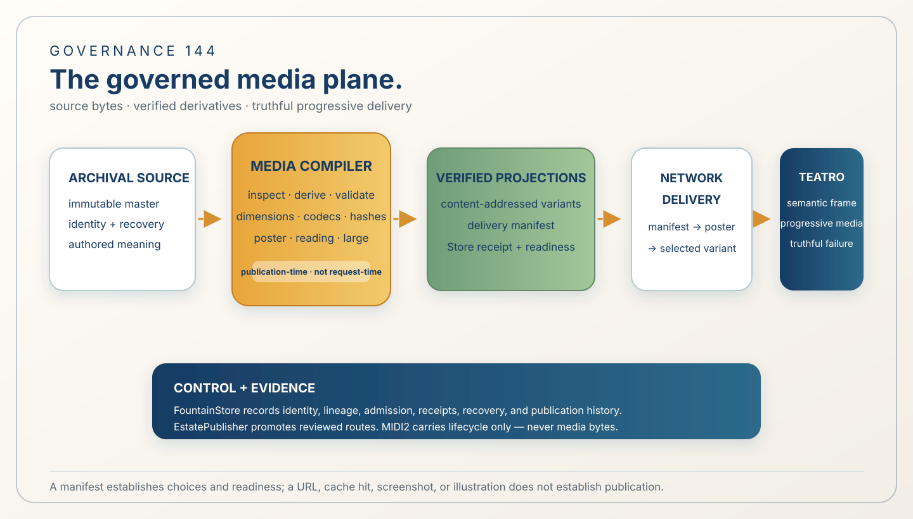

# 144 — Fountain Media Service Is the Governed Media Plane

> Governance chapter: 144. This chapter proposes the bounded media plane between authored media and its web, native,
> iPad, Reframe, Teatro, audio, and Book projections. It does not claim that a media compiler, remote delivery edge,
> codec adapter, or public media route is implemented or live-accepted.



*Principal illustration — a deterministic governance projection. It distinguishes authored bytes, derived bytes,
control and evidence, and delivered projections; it is not a media receipt, network trace, codec proof, MIDI2 payload,
or publication acceptance evidence.*

## The decision

Fountain Media Service is the governed media plane between authored source media and every projection that needs to
inspect, deliver, decode, or present that media. It makes large or slow media a first-class governed object instead
of leaving dimensions, codecs, hashes, posters, readiness, cache behavior, and failure states to whichever client
happens to request the file.

```text
human author → Codex / Reframe proposal → local FountainStore artifact
  → Fountain Media Service compilation → EstatePublisher promotion
  → remote media route → Teatro / Reframe / public pointer
```

The Media Service owns the compilation and delivery contract. FountainStore remains the durable authority for
identities, artifacts, derivation lineage, admission decisions, leases, receipts, recovery, and publication history.
EstatePublisher remains the sole public promotion client. This is one authority chain, not a new media-owned Store or
a second publisher.

## Why this boundary exists

Media failure is not only a compression problem. A valid authored asset may still produce a poor experience when the
first byte is slow, the network is interrupted, decoding is expensive, the wrong dimension is selected, a cache is
stale, or the client cannot tell whether an asset is pending, unavailable, revoked, or published.

The governed plane therefore establishes identity and readiness before a projection asks for a large payload. The
reader can receive text, semantic frame, labels, and a small poster immediately; a selected reading-size variant and
then an optional large image, animation, or video can arrive progressively. A failure remains visible and semantic.
It is never silently replaced by an unverified original or an invented placeholder.

## Authority ownership

| Concern | Sole authority | Not implied by |
| --- | --- | --- |
| Authorial meaning and source identity | human author, Reframe, and the local FountainStore artifact | a filename, media hash, or generated caption |
| Media inspection and derivative compilation | Fountain Media Service through a named Swift host adapter | a browser request or request-time transcoder |
| Durable identity, lineage, admission, and receipts | FountainStore | an object URL, cache hit, or HTTP 200 |
| Public route promotion | EstatePublisher and `estate.publication.sync` | a local file or media service response |
| Resource-scoped authorization | FountainAuthKit where the protected resource requires it | possession of a media URL |
| Web materialization | Teatro Web as a Reframe projection client | a second semantic runtime |
| Media lifecycle events | the declared MIDI2 instrument boundary | media bytes carried in MIDI2 |

Chapter 66's admitted-derivative/Image Publication boundary remains the source contract for image media. Chapter 116's
Store-owned estate edge remains the publication contract. Chapter 137's Teatro boundary remains the web projection
contract. The Media Service composes these boundaries; it does not absorb them.

## The media lifecycle

Every admitted media object moves through an explicit lifecycle:

```text
received → quarantined → inspected → derived → validated → admitted
  → published → served → cached → retired
```

The archival master is immutable and recoverable. Derivatives are reproducible, content-addressed artifacts. A
derivative is not served as a public choice until its source identity, dimensions, media type, codec, hash, recipe,
and admission state agree with the Store record. Missing or invalid derivatives fail closed.

The lifecycle must distinguish at least `pending`, `unavailable`, `revoked`, and `published`. A cache is disposable
delivery state and never becomes authority. An interrupted transfer may resume or retry within its declared policy,
but it cannot turn partial bytes into a valid artifact.

## Delivery contract

The first network response is a small, typed delivery manifest. It tells a client what is ready and what may be
requested; it does not contain credentials or private Store records.

```json
{
  "mediaIdentity": "media:source-work/scene-04/image-17",
  "archivalMaster": { "digest": "sha256:…", "state": "admitted" },
  "variants": [
    { "role": "poster", "width": 640, "mediaType": "image/webp", "digest": "sha256:…", "state": "published" },
    { "role": "reading-size", "width": 1600, "mediaType": "image/avif", "digest": "sha256:…", "state": "published" },
    { "role": "large", "width": 3200, "mediaType": "image/avif", "digest": "sha256:…", "state": "pending" }
  ],
  "manifestDigest": "sha256:…",
  "sourceIdentity": "source-work:scene-04",
  "publicationState": "published"
}
```

The delivery order is:

```text
manifest → text and semantic frame → small poster
  → selected reading-size image → optional large image/video
```

Teatro and other clients must present the semantic frame and poster without waiting for the largest payload. After
transfer and decode, the selected variant becomes available. A pending, unavailable, or revoked state is exposed both
visually and through accessibility semantics. No client may infer readiness from a URL's existence.

## Compilation, not request-time improvisation

The default path is publication-time compilation. Swift owns orchestration, typed state, manifests, authentication,
delivery decisions, and evidence. A named image adapter may use libvips or an equivalent admitted tool; a named audio
or video adapter may use FFmpeg or an equivalent admitted tool. The system must not reimplement codecs or transcode
critical media on an end-user request merely because a derivative was not prepared.

The compiler records source identity, recipe, dimensions, codec, content hash, and tool/version provenance. It emits
content-addressed immutable artifacts and a manifest candidate. FountainStore admits that candidate and records the
receipt; EstatePublisher later promotes the selected route. No compiler output alone is a publication claim.

## MIDI2 carries lifecycle, never media bytes

Media bytes stay on the governed media delivery path. MIDI2 may carry typed lifecycle and readiness events so Reframe,
Teatro, and host adapters can coordinate without moving the payload through the backplane. The following vocabulary
is proposed and remains unestablished until it is admitted to the canonical IDL and a named instrument:

```text
media.prepare
media.poster.ready
media.variant.ready
media.prefetch
media.decode.ready
media.failed
media.publish
```

Each event would need correlation, source revision, media identity, manifest digest, and terminal Store evidence. A
string in this chapter does not create an IDL operation.

## Security and failure rules

1. The archival master is immutable, recoverable, and never overwritten by a derivative.
2. A derivative is served only after its source, recipe, digest, dimensions, codec, and admission state validate.
3. Credentials never appear in URLs, manifests, logs, screenshots, MIDI2 messages, or public evidence.
4. Private media uses FountainAuthKit's resource-scoped grants where that resource boundary is required; it does not
   become a second media compiler, Store, or publication authority.
5. Delivery distinguishes pending, unavailable, revoked, published, and expired states; it never silently falls back
   to an unverified object.
6. Interrupted transfers and decode failures produce typed, recoverable failure state rather than false readiness.
7. A publication claim binds the route to the source identity, governance revision, manifest digest, and Store receipt.
8. A cache may accelerate delivery but may not admit, publish, revoke, or rewrite durable state.
9. EstatePublisher is the only public promotion path; a media service, CDN, copied directory, or direct HTTP writer
   cannot bypass the Store-to-Store contract.
10. The illustration and this proposal are not runtime, network, security, or publication proof.

## Acceptance boundary

This chapter becomes implementation-accepted only when one bounded native scenario proves, with correlated Store
evidence:

1. an authored source is recovered by identity and admitted into a local Store;
2. the compiler produces reproducible poster, reading-size, and optional large variants with matching hashes,
   dimensions, media types, recipes, and provenance;
3. the manifest is available before the large payload, and the poster is available before the full selected variant;
4. slow, interrupted, repeated, and cached requests produce the declared readiness and failure states;
5. Reframe and Teatro consume the same manifest and expose unavailable/revoked state truthfully through their
   semantic surfaces;
6. the admitted lifecycle is carried through a named MIDI2 instrument without media bytes on MIDI2;
7. EstatePublisher alone promotes the selected route, and the remote Store read-back, public HTTPS proof, and digest
   agree; and
8. web, macOS, and iPad clients preserve the same identity, variant semantics, and failure contract.

Until those predicates are proven, this chapter records a governance boundary and implementation plan. It does not
claim a live Fountain Media Service, codec toolchain, cache, remote media route, or public deployment.

## Relationship to existing chapters

Chapter 66 supplies the admitted image publication contract. Chapter 92 supplies the estate role and shared
publication shell. Chapters 116 and 125 supply Store-owned route authority, atomic promotion, and read-back. Chapter
129 governs native SVG as a publication projection. Chapters 136–138 separate web/native/headless runtime behavior,
Teatro materialization, and the Web Audio/MIDI2 listening boundary. Chapter 142 supplies resource-scoped application
authorization where protected media requires it. None of those chapters authorizes media bytes in MIDI2 or a second
publication system.

## Governing sentence

**Fountain Media Service prepares truthful, content-addressed media choices for every projection; FountainStore keeps
their durable identity and evidence, EstatePublisher promotes them, and no client or transport is allowed to invent
readiness, meaning, or authority.**
