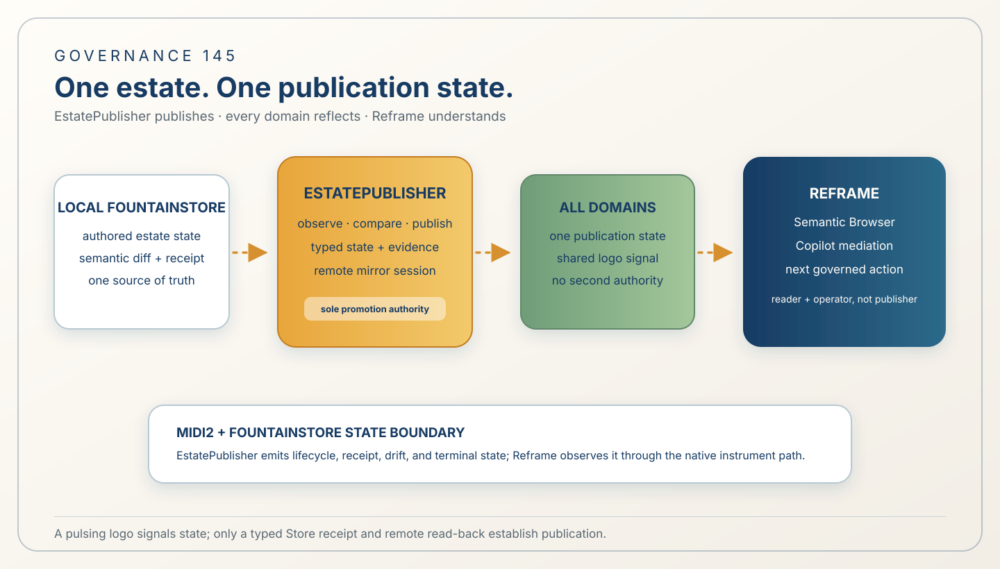
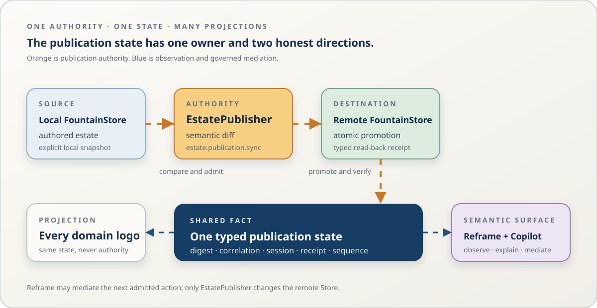

# 145 — One Estate, One Publication State: EstatePublisher and Reframe as a Governed Semantic Browser

> Governance chapter: 145. This chapter joins the estate-wide publication state to Reframe's Semantic Browser and
> Copilot. It defines the target authority and observation path; it does not claim that live Copilot awareness,
> EstatePublisher replacement of every Reframe publication caller, or public deployment is already implemented.



*Principal illustration — a deterministic governance projection. It explains the intended authority and state flow; it
is not a publication receipt, live Copilot trace, MIDI2 terminal event, or remote read-back witness.*

## The decision

Fountain Coach has one estate-wide publication state. EstatePublisher is the sole authority that compares the local
FountainStore estate with the remote FountainStore and promotes the admitted semantic diff. Every public subdomain
projects that same state through the shared estate identity. Reframe's Semantic Browser and Copilot observe the state,
explain it, and mediate the next governed action; they do not become a second publisher.



*Flow diagram — orange arrows are the only publication direction; blue dashed arrows are observation and governed
mediation. The diagram is explanatory projection, not a publication receipt or live runtime trace.*

This is the missing connective tissue between Chapter 92's connected estate, Chapter 115's governed Semantic Browser,
Chapter 143's bounded session, and Chapter 144's EstatePublisher-owned media plane.

## The estate-wide signal

The publication signal belongs to the estate, not to `status.fountain.coach` and not only to the TLD. Every admitted
host uses the shared template contract and exposes the same publication state through its logo and accessibility
semantics:

| State | Logo projection | Copilot meaning |
| --- | --- | --- |
| `not-established` / `waiting` | quiet or red pulse | no publication receipt is established yet |
| `drift-detected` | red pulse | local and remote semantic state differ |
| `publishing` | red pulse | EstatePublisher is applying the admitted diff |
| `failed` / `revoked` | red pulse with failure semantics | publication stopped; inspect the bounded refusal |
| `synchronized` | green settle, then normal rest state | local and remote read-back match |

The logo is a projection of typed state, not a source of truth. Color or motion alone is never evidence of publication.
The accessible name, state value, fixed report, Store receipt, and remote read-back carry the semantic claim.

## Reframe returns as the semantic surface

Reframe remains the Copilot's situated runtime and the estate's semantic browser. When the owner selects the estate
signal, Reframe receives the current EstatePublisher state through its native Semantic Browser/MIDI2/FountainStore
boundary. The Copilot can then say what is happening, what evidence exists, what is missing, and which bounded action is
available.

The Copilot must not infer state from a red logo, a URL, a screenshot, or an HTTP 200. It reads the typed publication
state and its correlated Store evidence. A missing record is reported as “no publication receipt found,” not as proof
that no publisher exists. If the state is `publishing`, the Copilot observes and explains; it does not start a second
publisher. If the state is `drift-detected`, it may offer the existing governed EstatePublisher command. If the session
is expired or revoked, Chapter 143's single refusal and re-bootstrap boundary applies.

## Reframe's publication branch is replaced at the authority seam

Reframe's existing publication-facing intent path must resolve to the native EstatePublisher operation:

```text
writer / Codex intention
  → Reframe intent mediation
  → Composer MIDI2 request
  → EstatePublisher / estate.publication.sync
  → local-to-remote Store read-back
  → typed publication state
  → Semantic Browser + Copilot + every estate logo
```

This replaces duplicate publication execution in Reframe. It does not bypass Reframe's mediation, identity, consent,
Store evidence, or acceptance boundaries. Reframe is the reader and operator of the publication system; EstatePublisher
is the publication system.

## One observation path, no page-side polling

The public estate remains direct-static. A page may project a materialized state and animate its logo, but it must not
invent a browser-side HTTP polling protocol or make another subdomain the runtime authority. Reframe observes current
state through the native instrument path. Public pages remain readable when Reframe is not running, and the fixed
health/report route remains a read-only projection rather than a command surface.

The state identity includes the estate scope, source and template revisions, local and remote Store identities, semantic
diff digest, correlation ID, session boundary, sequence, and terminal receipt. The logo, report, and Copilot must refer
to that same identity when they describe one event.

## Authority ownership

| Concern | Sole authority | Not implied by |
| --- | --- | --- |
| authored estate | writer's checked-in `estate/` and local FountainStore candidate | a rendered page |
| semantic diff and promotion | EstatePublisher `estate.publication.sync` | Reframe intent or a URL |
| durable state and receipts | FountainStore | logo color, cache, or HTTP status |
| estate-wide visual signal | shared estate template projection | Status domain alone |
| state observation and explanation | Reframe Semantic Browser and Copilot | a screenshot or guessed DOM state |
| next action | Reframe mediation invoking the admitted EstatePublisher operation | direct page JavaScript |

Status continues to own company, transparency, operational, and legal context. It may link to publication evidence, but
it must not impersonate the publication authority or become the only place where estate publication state is visible.

## Acceptance boundary

This chapter is a governance contract until the following proof exists:

1. all manifest-declared hosts expose the same typed publication-state projection and accessible logo semantics;
2. a native EstatePublisher state change is persisted with one correlation and receipt identity;
3. Reframe's Semantic Browser observes that state through native MIDI2/FountainStore paths;
4. Copilot explains `waiting`, `drift-detected`, `publishing`, `synchronized`, and refusal states from persisted facts;
5. a Reframe publication intention invokes EstatePublisher exactly once and does not execute a parallel publisher;
6. expiry or revocation produces one bounded refusal without a prompt loop; and
7. local/remote read-back proves the effect before synchronized state is shown as established.

Until then, the chapter, illustration, logo animation, and local estate route are design/publication projections, not
proof that the runtime bridge exists.

## Rules

1. EstatePublisher is the sole estate publication authority for every declared host.
2. Publication state is estate-wide and must not be owned exclusively by Status or any single domain.
3. Every host projects the same typed state identity through its shared logo and accessible semantics.
4. Reframe observes and explains publication state through native Semantic Browser, MIDI2, and FountainStore paths.
5. Reframe may mediate an admitted EstatePublisher operation but must not publish through a duplicate implementation.
6. Public direct-static pages must not poll another host or infer publication from visual, URL, cache, or HTTP evidence.
7. A logo transition is a projection only; synchronized state requires the native receipt and remote read-back.
8. Expired or revoked Chapter-143 sessions produce one typed refusal and never a repeated authorization ceremony.
9. The Copilot must distinguish observed facts, inferred explanations, and unestablished claims.
10. This chapter's implementation remains incomplete until its native Store, MIDI2, Copilot, and estate acceptance proof
    is recorded.

## Governing sentence

**EstatePublisher publishes one estate state; every domain reflects it; Reframe understands it and mediates the next
governed action, while no logo, page, or Copilot utterance becomes publication authority.**
