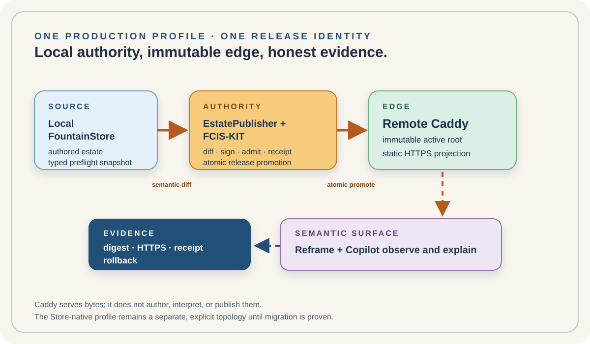

# 146 — Local FountainStore, Remote Caddy: The Production Static Estate

> Governance chapter: 146. This chapter establishes a named production profile for the Fountain Coach static estate.
> It does not claim that the Caddy capability, migration, or remote release is already implemented.

*Principal illustration — a deterministic authority projection. It explains the intended release path; it is not a
publication receipt, a Caddy health witness, a TLS proof, or a live remote read-back.*

## The production decision

The production estate serves static routes from remote Caddy. The writer does not publish by making the remote
FountainStore answer every public page request.

The local, explicit FountainStore remains the authoring and preflight authority. EstatePublisher is the sole publication
authority. Its FCIS-KIT-owned operation compares the admitted local Store state, builds a deterministic immutable static
release, signs and records its manifest, transfers it to the remote host, atomically promotes one release root, and
reads the public route back through HTTPS. Caddy serves the active release as a read-only projection.

## Profile crosswalk

This is a production-profile amendment, not a deletion of earlier governance.

| Existing chapter | Perspective under this profile |
| --- | --- |
| 91, 93, 112 | FCIS-KIT ownership and mechanical constraints remain normative. Caddy administration must become a named kit capability; no host adapter or shell fallback becomes authority. |
| 92 | The connected estate remains one semantic domain. Its domains now project one admitted release rather than independently publishing. |
| 94, 96–97 | Provider-neutral infrastructure, DNS, TLS, and host enrollment remain separate witnessed capabilities. |
| 115 | Reframe remains a governed Semantic Browser and observer, not a static deployer. |
| 116 | The Store-native edge remains a separate existing profile. Chapter 146 uses local Store authority plus remote Caddy and substitutes release-root/HTTPS read-back for remote Store read-back. |
| 117–118 | Snapshot, recovery, continuity, and risk evidence still apply; the Caddy release is not a second Store. |
| 125, 127–129 | Typed route mapping, estate templates, read-only mirror semantics, and deterministic static bundles carry forward. |
| 130–131, 139–143 | Stable scenario identity, one bounded credential session, owner trust, joining-machine admission, rotation, and recovery govern release promotion. |
| 134–138, 145 | EstatePublisher remains the publication authority; Reframe, Web, Native, Headless, Teatro, and Ear remain projections. The publication state reports the Caddy release digest and receipt for this profile. |
| 144 | Media compilation remains separate; Caddy serves only admitted static derivatives. |

The two explicit profiles are:

1. **Store-native:** local FountainStore → remote FountainStore → native Store edge, governed by Chapter 116.
2. **Static production:** local FountainStore → EstatePublisher/FCIS-KIT → immutable remote Caddy release, governed by
   this chapter.

## Rules and proof

The local Store is the authoring and semantic-diff source. EstatePublisher and FCIS-KIT own admission and promotion.
Caddy serves immutable bytes and has no semantic authority. Every release has a manifest, digest, correlation,
authorization-session identity, previous-release pointer, atomic activation, HTTPS/TLS/DNS verification, and rollback
receipt. A screenshot, HTTP 200, logo, or running Caddy process is not publication proof.

The profile is established only when one native scenario proves local admission; deterministic release bytes; kit-owned
authorization; atomic Caddy promotion; configuration and public read-back; matching digest; failure rollback; and
Reframe observation without a second publisher. Until then, Caddy implementation and Store retirement are separate
bounded phases, and the Store-native profile must not be silently removed.

## Governing sentence

**The local FountainStore authors; EstatePublisher and FCIS-KIT admit and promote one immutable release; remote Caddy
serves it; Reframe explains it; no edge, adapter, or page becomes a second authority.**
