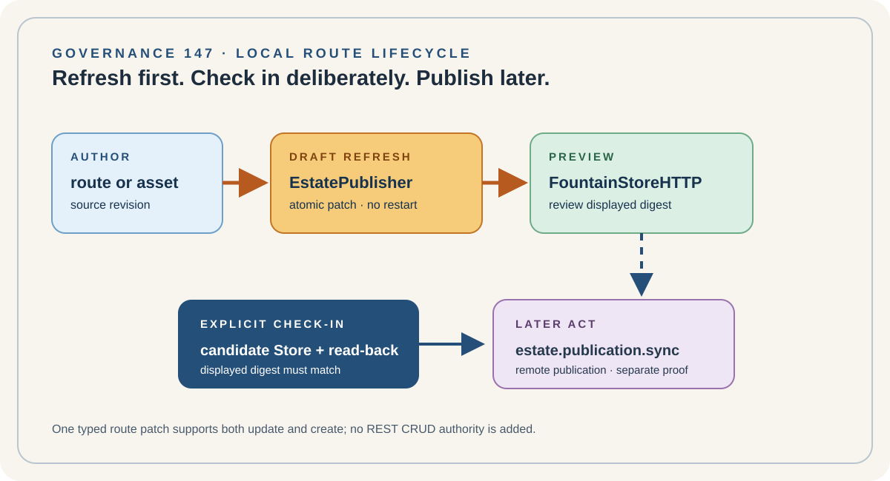

# 147 — Local Route Materialization: EstatePublisher Preview Before Check-In

> Governance chapter: 147. This chapter governs the existing local EstatePublisher draft lifecycle. It names no new
> CRUD or REST authority: the existing typed preview operations are the contract.



*Principal illustration — a deterministic local-preview projection. It is not a Store receipt, live route response, or
publication proof.*

## The decision

New estate content is handled locally by EstatePublisher in two bounded operations:

1. `estate.preview.draft-refresh` materializes the selected host/path projection into the disposable preview Store and
   applies one atomic route patch to the already-running native FountainStoreHTTPServer. It does not restart the server,
   check in the durable candidate, or publish remotely.
2. `estate.preview.draft-check-in` requires the displayed draft digest, rejects drift, and writes that selected route
   into the explicit local FountainStore candidate. It does not publish remotely.

These operations already exist in the native EstatePublisher command catalog and reuse the existing route materializer,
route-patch endpoint, Store session, preview lease, and typed receipts. We must not add a parallel
`estate.route.create/update/delete` REST or OpenAPI surface.

```text
authored route or asset
        │
        ▼
EstatePublisher draft-refresh ──► disposable preview Store
        │                                  │
        │                                  ▼
        └──────────────────────────► running FountainStoreHTTP
                                           │ human review
                                           ▼
                              explicit draft-check-in
                                           │
                                           ▼
                              durable local Store candidate
                                           │
                                           ▼
                              later publication operation
```

## Create versus update

The route patch is the single local write primitive. If the normalized host/path identity already exists, the patch
replaces that route's admitted files. If it does not exist, the native Store route-patch operation creates the new route
record. In both cases the caller supplies the explicit source root, host, normalized path prefix, revision, template
revision, and route snapshot digest. The route patch result returns the selected route and content digest.

The preview operation is not a general database API. FountainStoreHTTP exposes the native read projection and its
bounded EstatePublisher route-patch seam; it is not an authoring client, public REST resource, or semantic authority.

## Authority and evidence

| Concern | Authority | Evidence |
| --- | --- | --- |
| route source | checked-in estate projection | source revision and source root |
| draft materialization | EstatePublisher native preview executor | route-patch receipt and content digest |
| live local display | lease-bound FountainStoreHTTPServer | preview lease, server PID, Store path, route digest |
| durable local acceptance | explicit draft check-in | candidate Store receipt and matching displayed digest |
| remote publication | later `estate.publication.sync` | separate publication receipt and read-back |

The browser may review the draft, but it cannot check it in. A screenshot, HTTP 200, or changed file alone does not
establish local acceptance. The displayed digest must be correlated with the explicit check-in request.

## Existing contract, not invented exposure

The current strict EstatePublisher inventory declares both operations as wired:

- `estate.preview.draft-refresh`: native preview Store, atomic route patch, server restart not required;
- `estate.preview.draft-check-in`: explicit writer signal, displayed-draft digest, candidate Store read-back.

Their scenario declarations, `EstatePublisherPreviewRefreshExecutor`, `EstatePublisherPreviewCheckInExecutor`,
`EstatePublicationMaterializer`, `EstatePublicationRoutePatch`, and `FountainStoreSessionAuthority` are the existing
implementation seam. The chapter records that seam; it does not duplicate or rename it.

## Acceptance boundary

This contract is established for a route only when one proof shows:

1. draft refresh changes the selected route on the existing native preview lease;
2. the FountainStoreHTTPServer PID and lease remain unchanged;
3. no durable candidate Store or remote publication changes before check-in;
4. the displayed digest is accepted exactly once by draft check-in;
5. candidate Store read-back matches the route and digest; and
6. later remote publication remains a separate explicit operation.

## Rules

1. EstatePublisher owns local route materialization; FountainStoreHTTP is a read projection with one bounded native
   route-patch seam.
2. `estate.preview.draft-refresh` is disposable and non-publishing.
3. `estate.preview.draft-check-in` is the only explicit local candidate write in this lifecycle.
4. Existing route identity means update; absent route identity means create through the same typed patch primitive.
5. No generic REST, OpenAPI, shell watcher, filesystem copy, or parallel CRUD authority may be introduced.
6. The preview server must not restart merely because a selected draft route changed.
7. Remote publication requires a later explicit `estate.publication.sync` operation.
8. The operation names and evidence remain governed by the native CLI catalog and FCIS-KIT contract.

## Governing sentence

**EstatePublisher writes or creates one local route through the existing typed preview patch, FountainStoreHTTP shows it,
the writer explicitly checks it in, and remote publication remains a separate act.**
