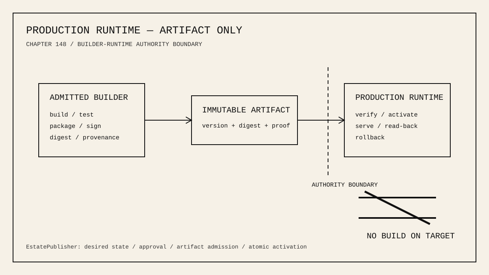

# 148 — Production Runtime Nodes Are Artifact-Only

> Governance chapter: 148. Production machines execute admitted releases; they do not construct them. Build-on-production is forbidden.



*Principal illustration — the builder/runtime separation. It is an architectural rule, not a live deployment receipt.*

## The decision

A production runtime node MUST NOT run source compilation, package resolution, dependency checkout, linking, or release assembly as part of deployment. EstatePublisher admits only a prebuilt, tested, immutable, digest-bound artifact across the production boundary.

```text
source + exact dependencies
          │
          ▼
admitted builder / staging instrument
 build · test · package · sign · digest
          │
          ▼
EstatePublisher approved desired state
          │ immutable artifact
          ▼
production joining machine
 verify · activate atomically · read back
          │ failure
          └────────────► previous release remains active
```

## Why this is a system boundary

The production Hetzner node demonstrated the difference directly. With only its runtime workload it serves the estate quickly. During remote Swift compilation the same one-vCPU, approximately 2 GiB node experienced CPU contention, cache eviction, I/O pressure, repeated system memory-pressure events, and an OOM kill of `swift-frontend`. The resulting latency variance and outage risk were created by mixing builder and runtime roles.

The conclusion is architectural rather than incidental: production serving capacity must never be consumed to construct the candidate that may replace the serving process.

## Normative invariants

1. Production release promotion MUST NOT invoke `swift build`, `swift package`, compiler, linker, package resolution, or dependency checkout.
2. The builder is a separately admitted machine or instrument: developer Mac, Ubuntu staging/builder, or another explicitly governed builder.
3. The promoted unit is an immutable artifact identified by artifact version, source revision, digest, and provenance.
4. The production joining machine verifies the artifact before activation and does not infer trust from transfer success.
5. Activation is atomic. The previous accepted release remains available until health and public read-back succeed.
6. Build caches and source worktrees are not production prerequisites.
7. Adding production CPU or memory does not legalize remote builds. Scaling runtime capacity and building releases remain separate responsibilities.

## Authority map

| Concern | Authority | Production role |
| --- | --- | --- |
| source and dependency graph | Git + exact resolved dependency state | none |
| build/test/package | admitted builder or staging instrument | none |
| release authorization | EstatePublisher + owner/trusted-device approval | verify authorization |
| artifact admission | digest/signature/provenance contract | verify received bytes |
| activation | production joining-machine capability | atomic switch |
| acceptance | typed health + public read-back receipt | serve and witness |

## Relationship to EstatePublisher

EstatePublisher remains the publication authority. Its production release executor must fail closed if only a source-build-on-target path is available. Legacy source-build adapter code may remain temporarily for migration or history, but it is not an admissible production path. The executable production path transfers a prebuilt artifact to the joined production machine and requests verification and activation.

## Relationship to joining machines

Chapter 141 remains controlling: every joining machine is a governed MIDI2 instrument. This chapter narrows the production instrument's capability set. A production instrument may admit, verify, activate, inspect, roll back, and report a release. It must not silently acquire the role of compiler or CI worker.

## Capacity rule

Sizing a production runtime is based on serving, persistence, media, and bounded maintenance workload. Build capacity is sized separately on the builder/staging plane. Scaling production does not legalize build-on-production; it only adds runtime capacity.

## Acceptance

The decision is pinned at four layers: governance, EstatePublisher runtime policy, CLI/documentation, and tests. A future regression that attempts build-on-production must be rejected before a remote compiler can start.

## Governing sentence

**Builders construct and prove immutable artifacts; production runtime nodes verify, activate, serve, and roll back them — they never compile the release they are meant to serve.**
