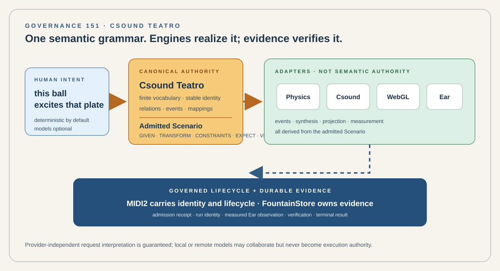

# 151 — Csound Teatro: Speaking Sound in Space

> Governance chapter: Csound Teatro is the governed semantic grammar that lets humans and machines describe, inspect, admit, execute, and verify relationships among canonical Teatro entities, physics, Csound, WebGL, Ear, MIDI2, and Scenario execution without making any renderer, engine, or model the source of semantic truth.

*Principal illustration — a deterministic governance projection of the Csound Teatro contract. It is not a live stage capture, an acoustic measurement, or evidence of a public release.*

## Status

Governance proposal grounded in the accepted initial Ball/Plate/Ear fixture.

This chapter extends Chapters 92, 101, 107, 122, 133, 136, 137, 138, 141, 149, and 150.

It does not replace Csound, TeatroStageEngine, WebGL, physics, Ear, MIDI2, FountainStore, Scenario Runner, FCIS-KIT, EstatePublisher, or any model runtime.

It governs the semantic contract joining them.

## The decision

Fountain Coach SHALL treat **Csound Teatro** as a versioned, finite, machine-readable semantic grammar and deterministic Scenario layer.

The canonical authority is the semantic relation model and admitted Scenario, not generated Csound source, a WebGL scene graph, a physics world, an audio graph, a visual patch, a model response, a MIDI transport, or an agent conversation.
The stable chain is:

    human intention
        ↓
    Csound Teatro grammar
        ↓
    canonical semantic model
        ↓
    Scenario contract
        ↓
    capability validation
        ↓
    admission
        ↓
    engine adapters
        ├── physics
        ├── Csound
        ├── WebGL
        ├── Ear
        └── MIDI2
        ↓
    runtime consequence
        ↓
    observation
        ↓
    verification + FountainStore evidence

Every downstream engine is replaceable only to the extent that it preserves this contract.

## 1. One grammar, not a new engine
Csound Teatro describes relations such as:

    WHEN collision(Ball.01, Plate.01)
        Ball.01 EXCITES Plate.01

    Ball.01.velocity 0..7 m/s
        MAPS_TO
    Plate.01.excitation 0..1 normalized

    Ear.01 LISTENS_TO Plate.01

The grammar does not render the Ball, simulate the collision, synthesize the Plate, or decide whether Ear heard an onset.

It states the admitted semantic relationship.

Physics, Csound, WebGL, and Ear realize or observe that relationship through typed adapters.

## 2. Canonical entities and stable identities

The grammar SHALL preserve stable identities for entities, properties, ports, events, relations, mappings, observations, traces, and Scenarios.

Initial entity kinds are BODY, INSTRUMENT, EAR, and FIELD.

Properties and ports SHALL be typed. Numeric properties and ports SHALL declare their units where units are required.

A relation may reference only declared identities and, where applicable, declared ports.

Aliases or natural-language deixis such as “this ball” and “that plate” SHALL resolve through an authoritative selection before an executable Scenario exists.

## 3. The finite predicate registry

Grammar version 0.1 owns one finite predicate vocabulary:

    PRODUCES
    RECEIVES
    EXCITES
    CONTROLS
    MODULATES
    MAPS_TO
    TRIGGERS
    FOLLOWS
    CONTAINS
    OBSERVES
    LISTENS_TO
    AFFECTS
    ABOVE
    BELOW
    NEAR
    INSIDE
    OUTSIDE
    TOUCHING
    MOVING_TOWARD
    MOVING_AWAY

Unknown predicates fail validation. A predicate's subject and object kinds are governed by the versioned native registry.

A predicate MAY impose additional port requirements. EXCITES, for example, requires a declared numeric excitation input on the target.

Adding vocabulary is a grammar-version change, not an adapter-side extension.

## 4. Mappings are explicit contracts

A mapping SHALL name one declared source property, one declared target port, source and target domains, units, transfer policy, clamp policy, interpolation policy, and update mode.

For grammar version 0.1, the accepted Ball/Plate fixture uses:

    source: Ball.01.velocity
    domain: 0..7 m/s
    target: Plate.01.excitation
    range: 0..1 normalized
    transfer: linear
    clamp: true
    interpolation: linear
    updateMode: event

No model or engine adapter may silently invent these values.

## 5. Events and conditions are explicit

A conditional semantic relation SHALL name its event and participants.

The initial fixture admits collision(Ball.01, Plate.01).

Physics is authoritative for the collision event. Physics does not infer EXCITES; the Scenario already states that relationship.

Likewise, WebGL may visualize the event but does not create its semantic meaning.

## 6. Csound is an engine unless explicitly modeled as an instrument

Csound is a sound engine.

A particular governed Csound-backed runtime entity MAY be represented as an INSTRUMENT when its identity, capability, ports, admission, and evidence are declared.

The semantic layer SHALL bind to those declared ports. Generated Csound source or opcodes remain implementation detail beneath the canonical semantic contract.

The canonical Scenario must be reconstructable without treating generated Csound text as the source of truth.

## 7. WebGL is projection, not semantic authority

WebGL projects canonical entities, spatial state, relation edges, and event state.

Picking or selection SHALL resolve back to canonical identity.

No semantic relation may exist only in renderer state.

A hidden Three.js object, scene-graph edge, shader parameter, or visual proximity is not a semantic fact merely because it is rendered.

## 8. Ear is an observing instrument

Ear participates as a governed observing instrument and data producer.
An Ear observation SHALL identify the observing entity, declared observation capability, source being observed, timestamp or timing evidence, measurement provenance, and the assertion it is evaluating.

A Boolean passed flag is not acoustic evidence by itself.

The verifier SHALL calculate success from the recorded measurement and declared assertion.

## 9. Scenario is the executable boundary

Executable Csound Teatro work SHALL be represented as a Scenario with explicit GIVEN, TRANSFORM, CONSTRAINTS, EXPECT, VERIFY, grammar version, schema version, and bounded mutation scope.

Execution is refused when identities, properties, ports, capabilities, units, mappings, constraints, or verification criteria are unresolved.

A model response, UI gesture, engine patch, or transport packet is never a substitute for Scenario admission.

## 10. Admission occurs before effects

The native runtime SHALL validate and admit the exact Scenario before physics, Csound, or other governed effects execute.

The admission receipt SHALL bind run identity, Scenario identity, input identity, canonical starting state, and grammar/schema versions.

Execution under the same run identity SHALL reference that admission. Changed same-run input SHALL fail closed.

## 11. Execution planning remains inspectable
An admitted Scenario SHALL compile to an inspectable plan naming, where applicable, canonical mutations, physics bindings, Csound bindings, MIDI2 operations, WebGL projection consequences, Ear observations, and verification steps.

The plan is derived from the admitted Scenario. It is not an alternate semantic source.

## 12. Evidence is Store-owned; MIDI2 carries governed lifecycle

Large evidence belongs in FountainStore.

MIDI2 carries typed lifecycle, identity, correlation, operation data, and digest-bound references rather than unbounded evidence blobs.

The instrument-plane rule of Chapter 150 applies: transport is replaceable; operation identity and semantics are not.

The same Csound Teatro operation may move over any admitted MIDI2 transport without changing its semantic contract.

## 13. Human grammar and machine serialization are one meaning

The same semantic relation SHALL be inspectable as a concise human sentence, canonical textual grammar, machine serialization, a visual Teatro relation, an implementation/execution plan, and replay/evidence.

Round-trip conversion SHALL preserve relation identity, condition, mapping policy, constraints, and verification meaning.

A beginner should not need Csound opcode vocabulary to understand the relation.

## 14. Human requests are provider-independent
The guaranteed Csound Teatro path SHALL work with zero network inference, zero API key, and zero provider credits.

The built-in deterministic interpreter may resolve a supported human request only through the originating request, authoritative selected identities, discovered capabilities, and the admitted canonical Scenario contract.

Unsupported language SHALL be refused rather than guessed.

On-device Apple models, Linux-local models, Codex, OpenAI, or other providers MAY assist with fuzzy language interpretation.

They are optional collaboration adapters. They do not become semantic authority, execution authority, or a Definition-of-Done prerequisite.

## 15. The initial accepted fixture

The first governed fixture is:

    entities:
      Ball.01
      Plate.01
      Ear.01

    WHEN collision(Ball.01, Plate.01)
        Ball.01 EXCITES Plate.01

    Ball.01.velocity 0..7 m/s
        MAPS_TO
    Plate.01.excitation 0..1 normalized
    Ear.01 LISTENS_TO Plate.01

The accepted fixture proves, within its bounded claim:

    provider-independent human request
    → canonical Scenario
    → native pre-effect admission
    → physics collision
    → declared mapping
    → Csound-backed excitation
    → Ear measurement
    → native verification
    → FountainStore evidence
    → terminal MIDI2 lifecycle

It does not establish universal grammar coverage, human hearing, arbitrary natural-language understanding, every Csound topology, or public release.

## 16. Teaching sequence

The public teaching surface SHALL explain Csound Teatro in this order:

1. **Things** — identify canonical entities.
2. **Properties** — inspect typed values and units.
3. **Relations** — connect entities with admitted predicates.
4. **Events** — state when a relation applies.
5. **Mappings** — map one declared value domain to another.
6. **Space** — project canonical state without making geometry semantic authority.
7. **Ear** — attach an observing instrument and measurable assertion.
8. **Scenario** — collect the contract into an executable, inspectable unit.
9. **Model collaboration** — optionally interpret fuzzy language while preserving local deterministic authority.
10. **Implementation inspection** — follow the Scenario into physics, Csound, WebGL, MIDI2, Store, and evidence.

The teaching surface SHALL use the same canonical vocabulary and schema as runtime validation.

It SHALL NOT fork a simplified private grammar.

## 17. Publication boundary

Governance defines the normative contract.

The Book teaches the contract.

teatro.fountain.coach may provide the interactive spatial projection.

Instrument and MIDI2 surfaces expose capability and lifecycle facts.

Scenario and Store evidence establish what actually ran.

EstatePublisher alone promotes reviewed static publication routes.

A published chapter or teaching page is documentation, not runtime admission and not release evidence.

## Governing rules

1. Csound Teatro's canonical semantic model is the source of semantic truth.
2. Physics, Csound, WebGL, Ear, MIDI2, and model runtimes are adapters or observers with explicit boundaries.
3. Grammar vocabulary is finite and versioned.
4. Unknown identities, predicates, ports, units, mappings, or verification criteria fail before effects.
5. Mappings carry explicit domains, units, transfer, clamp, interpolation, and update policy.
6. Ear verification requires recorded measurement evidence; a Boolean claim is insufficient.
7. Admission precedes governed effects and binds exact run/Scenario/input identity.
8. Store owns durable evidence; MIDI2 carries typed lifecycle and digest-bound references.
9. Human-readable and machine-readable forms preserve the same semantic identity.
10. Provider models are optional collaborators; the guaranteed path remains local and provider-independent.
11. Publication teaches the accepted boundary without strengthening it.

## Governing sentence

**Csound Teatro lets humans and machines speak sound in space through one versioned semantic grammar: the Scenario decides the relationship, engines realize it, Ear measures it, FountainStore remembers it, and no renderer, transport, or model is allowed to become the truth.**
