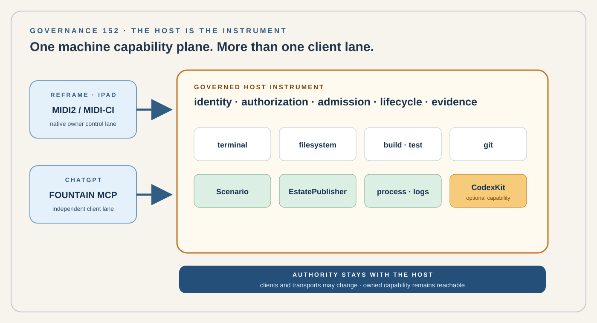

# 152 — The Host Is the Instrument

> Governance chapter: a Fountain Coach machine owns its terminal, filesystem, process, build, source-control, Scenario, publication, and optional agent capabilities. Codex, ChatGPT, Reframe, MCP, MIDI2 transports, and remote-control vendors may address those capabilities, but none of them is the machine's authority or a prerequisite for using capabilities the owner already possesses.

*Principal illustration — the host is the authority boundary. Reframe and ChatGPT reach the same governed host capability plane through admitted interfaces; CodexKit is one optional capability behind that boundary, not the gate in front of it.*

## Status

Accepted governance with implementation proceeding in bounded slices.

The durable EstatePublisher execution slice is live-accepted through production. FountainStore is the durable job authority, MIDI2 is the wake/lifecycle plane, and production recovery has been proven without blind effect replay.

Host Capability Slice B implements the first general typed host operations: `host.describe`, `git.status`, `git.diff`, `swift.build`, and `swift.test.bounded`. These operations use Store-backed idempotency, typed results/evidence, bounded inputs, restart recovery, and the existing Fountain Host MIDI2 lifecycle.

Host Scenario Capability Slice C additionally accepts `scenario.run` as a typed read-only host capability. It reuses the native EstatePublisher scenario catalog and semantic-admission implementation, persists its result in the same FountainStore capability-job ledger, and is invoked through the same MIDI2 wake/lifecycle plane. Publication and release mutation remain outside this capability.

This chapter extends Chapters 81, 88, 91, 94, 119, 123, 134, 135, 140, 141, 142, 143, 145, 147, 149, 150, and 151.

It does not replace CodexKit, Reframe, EstatePublisher, FountainAuthKit, FountainStore, Scenario Runner, MIDI-CI, MIDI2, MCP, SSH, or any particular transport.

It clarifies which object owns machine capability:

**the admitted host is the instrument; external agents and services are clients or adapters.**

## The decision

Every admitted Fountain Coach development or runtime machine SHALL be represented as a governed host instrument.

The host instrument owns the capabilities that physically and logically exist on that machine, including terminal execution, filesystem access, process lifecycle, source control, Swift/Xcode build, tests, Scenario execution, EstatePublisher preflight and publication, service inspection, logs, artifact production, and CodexKit where present.

No external model provider, agent product, relay vendor, application subscription, or remote-control service becomes the authority for those capabilities merely because it provides one convenient access lane.

The stable relationship is:

    admitted client
        ↓
    authenticated relationship
        ↓
    governed host instrument
        ↓
    capability admission
        ↓
    local machine capability
        ↓
    typed result + evidence

The host remains the same host when the client or transport changes.

## 1. Machine capability is not Codex capability

Compilation is not a Codex feature. Git is not a Codex feature. The terminal is not a Codex feature. EstatePublisher is not a Codex feature.

A Swift compiler, Xcode installation, repository checkout, shell, filesystem, running service, local model, Scenario Runner, or publication tool remains available when Codex is unavailable.

CodexKit MAY expose agent-assisted operations as a governed host capability. It SHALL NOT become the mandatory parent boundary through which unrelated machine capabilities must pass.

The architectural distinction is one host with terminal, filesystem, process, git, build, test, Scenario, publication, and CodexKit capabilities — not Codex above everything else.

## 2. The host is a governed MIDI2 instrument

Chapter 141 already establishes that each joining machine is a governed MIDI2 instrument. This chapter makes the consequence explicit.

A host instrument SHALL have a stable identity, discoverable capability facts, authorization requirements, operation identities, lifecycle state, bounded effects, and evidence obligations.

MIDI-CI and the FCIS-KIT instrument model MAY expose the host's capabilities to admitted peers. A host capability is not authorized merely because it is discoverable. Discovery answers what exists. Admission answers what this peer may invoke.

## 3. Capability vocabulary is explicit

The host SHALL expose finite typed operations rather than one unbounded promise of remote control.

The initial capability families include host description, filesystem read/write, process start/status/stop, terminal execution, git status/diff/commit/push, Swift/Xcode build, bounded tests, Scenario execution, estate preflight/preview/publication, service status, log reads, and optional Codex invocation.

An implementation MAY expose a smaller admitted set.

A capability SHALL declare its inputs, authority requirement, mutation scope, timeout/lifecycle behavior, result type, and evidence policy. Unknown operations fail closed.

## 4. Terminal access is a capability, not the architecture

A shell is useful because it is universal and composable. It is also broad.

General terminal execution MAY therefore exist as an owner-authorized host capability, but higher-level operations SHOULD use typed capabilities where a stable contract exists.

A typed Swift build operation is preferable to teaching every client how to construct an arbitrary shell command for the same build. A typed estate preflight operation is preferable to treating EstatePublisher as an accidental shell incantation.

The terminal remains the escape hatch and development surface. It does not erase typed governance.

## 5. Reframe on iPad is a valid host client

Reframe SHALL be permitted to address admitted host capabilities directly.

Reframe does not need to impersonate a desktop, embed a general remote terminal UI, or route every machine request through Codex.

On a trusted WLAN or other admitted network, Reframe MAY discover the host instrument, establish its governed relationship, inspect capabilities, invoke typed operations, and receive lifecycle and evidence.

This provides a native iPad machine-control lane for repository inspection, compilation, bounded tests, Scenario execution, service inspection, estate preflight, and staging publication.

CodexKit remains available when reasoning or code-agent work is wanted. It is optional for operations that do not require it.

## 6. ChatGPT may use the same host through MCP

A Fountain Coach MCP service MAY expose the same governed host capability plane to ChatGPT.

MCP is an interface to the host instrument, not a second machine authority.

The MCP implementation SHALL translate tool calls into the same capability identities, authorization checks, lifecycle, and evidence used by other admitted clients. It SHALL NOT create a parallel unrestricted execution universe that bypasses host governance.

## 7. MCP and MIDI2 are complementary boundaries

Chapter 150 establishes that the MIDI2 instrument plane is transport-neutral. MCP does not invalidate that decision.

MCP may be the application-facing protocol by which ChatGPT invokes a Fountain capability. MIDI2/MIDI-CI may remain the peer-facing instrument relationship by which hosts and Reframe discover, identify, negotiate, and operate capabilities.

The same host capability may therefore be reached through ChatGPT → MCP → Host or Reframe → MIDI2/MIDI-CI → Host, while preserving operation identity and authority.

## 8. No paid relay is architectural authority

A commercial relay or remote desktop product MAY be used as a convenience adapter.

Its subscription, quota, outage, product policy, or discontinuation SHALL NOT determine whether the owner can address the capabilities of an owned and admitted host.

The estate SHALL be capable of operating an owner-controlled remote host service without requiring a third-party command relay.

This rule does not prohibit external infrastructure. It prohibits accidental constitutional dependence on it.

## 9. Owner-controlled connectivity

A private host behind NAT or a WLAN SHALL NOT be made publicly open merely to satisfy remote tool access.

Remote access MAY use an owner-controlled tunnel, authenticated reverse connection, VPN, admitted relay, or another governed transport.

The connectivity layer SHALL prove which host initiated or accepted the relationship, which identity authenticated, which capabilities are exposed, how the relationship is revoked, and how replay and stale sessions are rejected.

Connectivity never grants capability authority by itself.

## 10. FountainAuthKit owns authentication policy

Host access SHALL use Fountain Coach's admitted identity and authorization boundary where that boundary applies.

ChatGPT authentication, Codex authentication, GitHub authentication, an MCP vendor account, or a relay account MAY establish facts needed by an adapter. They SHALL NOT silently become the root authority for the host.

The host SHALL distinguish authenticated external client, authorized Fountain relationship, admitted host capability, and authorized operation instance.

## 11. Least capability, not least usefulness

A host instrument SHALL expose enough power to perform real development and publication work.

Security SHALL NOT be implemented by reducing the host to a decorative read-only status endpoint.

Instead, authority is bounded per capability, repository, path, process, environment, target, and operation. Filesystem write may be repository-scoped; git push may be branch- and remote-scoped; Xcode build may be project-scoped; estate publication may distinguish staging from production; broad terminal use may remain owner-only.

The objective is governed power, not powerless safety theatre.

## 12. Staging and production remain different authorities

Direct host access does not weaken EstatePublisher.

A client may invoke estate preflight or staging publication only through EstatePublisher's existing publication authority.

Production promotion SHALL continue to require its own admitted authority, evidence, artifact identity, and target policy.

Being able to call a terminal does not mean a terminal command may bypass the governed publication boundary.

## 13. Scenario remains the deterministic work boundary

Where an operation expresses a repeatable development or system change, Scenario SHOULD remain the preferred executable contract.

A human may ask Reframe or ChatGPT to perform work. The client may interpret that request. The durable executable boundary remains the admitted Scenario when the operation belongs to Scenario-governed work.

This allows the same operation to be invoked from Reframe, ChatGPT, CodexKit, local CLI, or automated acceptance without changing its meaning.

## 14. Evidence survives client changes

Every governed host operation SHALL produce enough structured evidence to answer which host ran it, which client relationship requested it, which capability ran, with which bounded inputs, under which source revision where relevant, what lifecycle occurred, what terminal result was produced, and what durable artifacts or Store evidence resulted.

A transcript in a particular chat product is not sufficient execution evidence. The evidence belongs to the Fountain system, not to the client that happened to initiate the work.

## 15. Client failure must not strand the machine

Loss of one client lane SHALL NOT make the machine operationally unreachable through all other admitted lanes.

If ChatGPT is unavailable, Reframe or local access may remain. If Codex is unavailable, build, git, Scenario, EstatePublisher, and terminal capabilities remain. If a commercial relay quota is exhausted, an owner-controlled lane remains. If Reframe is unavailable, a local CLI or another admitted client may remain.

This is graceful capability continuity, not duplicated authority.

## 16. The first required implementation

The first implementation SHOULD expose an owner-controlled Fountain Host Instrument on the development Mac and Ubuntu staging host.

The minimum useful capability set is host description, filesystem read/write, terminal execution, process lifecycle, git status/diff, Swift build, Scenario execution, estate preflight, and staging publication.

The same host SHOULD be addressable from Reframe on iPad through the admitted Fountain instrument plane and from ChatGPT through a Fountain-owned MCP interface.

Codex invocation is additive. It is not required for acceptance of the non-Codex lane.

## 17. First acceptance scenario

The first acceptance Scenario SHALL prove one bounded operation without Codex and without a third-party remote-command relay.

    GIVEN
      Reframe on iPad
      one admitted Mac host instrument
      one admitted Ubuntu staging host
      one repository and source revision
      EstatePublisher installed

    WHEN
      Reframe requests estate preflight on the Mac
      and requests staging publication to Ubuntu

    THEN
      the host authenticates and admits the operations
      EstatePublisher performs the semantic preflight
      the bounded staging publication completes
      the staged route is read back from Ubuntu
      lifecycle and evidence are durable
      Codex is not invoked
      no commercial remote-command relay is required

A companion acceptance MAY invoke host description or Swift build from ChatGPT through the Fountain MCP interface and prove equivalent capability identity and evidence.

## 18. Current implementation boundary and nonclaims

The Fountain Host durable execution service is implemented and live-accepted for EstatePublisher through staging and production. Host Capability Slice B additionally establishes Store-backed typed execution for `host.describe`, `git.status`, `git.diff`, `swift.build`, and `swift.test.bounded`, including MIDI2 wake/lifecycle and restart-safe replay for these bounded operations. Scenario capability Slice C adds the bounded native `scenario.run` contract. Host Observability Slice D adds read-only `filesystem.read`, `process.status`, `service.status`, and `log.read` on the same durable Store/MIDI2 boundary. Atomic Filesystem Mutation Slice E adds `filesystem.write.atomic` as a compare-and-swap write with exact prior-digest admission, atomic replacement, read-back verification, and restart reconciliation without blind replay. Managed Process Lifecycle Slice F adds `process.start.managed` and `process.stop.managed` with Store-backed intent/receipt identity, no-shell execution, start reconciliation, PID-reuse protection, graceful stop, and absent-process reconciliation. Reframe Host Client Slice G adds a true client ingress: ReframeCore-owned code can submit bounded `host.describe` over Network MIDI2, FountainHost persists the canonical Store job, and the Reframe-owned client receives correlated STARTED and terminal lifecycle without direct Store access. Managed Service Lifecycle Slice H adds `service.start.managed` and `service.stop.managed` for explicit native service targets, with durable intent, observe-before-effect reconciliation, typed native start/stop, bounded terminal-state read-back, and no service-definition mutation. Fountain Host MCP Adapter Slice J adds a Fountain-owned MCP stdio client adapter exposing only read-only `fountain_host_describe`; it translates MCP JSON-RPC into the same `HOST_CAPABILITY_SUBMIT` Network MIDI2 ingress, has no direct Store access, and is live-accepted with matching MCP lifecycle and independent FountainStore evidence. Authenticated Streamable HTTP MCP Slice K adds a verification-only FountainAuth protected-resource boundary, RFC 9728-style metadata, bounded Host/Origin-checked `POST /mcp`, and live Bearer-authorized `fountain_host_describe` dispatch through the same MCP→MIDI2→FountainHost→FountainStore path. OAuth Transport Slice L adds dynamic public-client registration, authorization-code + PKCE S256, exact MCP resource binding, and a Fountain-owned authorization-server boundary. OAuth Service Slice M operationalizes that issuer as a distinct loopback-bound service with encrypted SecretStore signing-key custody, a separate SecretStore owner-presence credential, public Ed25519 JWKS projection, and independent systemd templates for the issuer and protected MCP resource; its focused custody/JWKS tests and local daemon metadata/JWKS acceptance pass without exposing private signing material.

Slice N has begun the human OAuth journey locally: `/oauth/authorize` now renders a human-readable consent surface naming the requesting client, exact resource, and requested capability, with explicit approve/deny redirects through the same Fountain owner-authentication boundary; focused browser/machine OAuth acceptance passes. The chapter does not yet claim public DNS/TLS activation of `auth.fountain.coach` or `mcp.fountain.coach`, a production-quality owner authentication ceremony, an ordinary Fountain browser client with login/session/logout behavior, an actual ChatGPT product/plugin OAuth connection, arbitrary terminal execution, or completed physical iPad device/UI acceptance. Slice N remains open until the complete public human Fountain OAuth journey is accepted; public daemon reachability alone is insufficient. Broader Reframe UI/AX scenario acceptance and CodexKit host-operation coverage remain subsequent work.

It does not make ChatGPT, Codex, MCP, MIDI2, SSH, VPN, or any tunnel mandatory. It does not merge staging and production authority. It does not authorize public unauthenticated terminal access.

It establishes the authority boundary that implementations must satisfy.

## Governing rules

1. The admitted host owns machine capabilities.
2. CodexKit is an optional host capability, not the parent authority of the machine.
3. Reframe may address the host directly.
4. ChatGPT may address the same host capability plane through a Fountain-owned MCP interface.
5. MCP, MIDI2, tunnels, and relay products are interfaces or transports; they do not grant authority.
6. Host operations use finite typed capability identities where stable contracts exist.
7. Broad terminal access remains owner-governed and does not bypass higher-level publication or Scenario authority.
8. FountainAuthKit and host admission remain distinct from third-party login state.
9. Staging and production remain separately governed.
10. Operation evidence belongs to the Fountain system and survives client/provider changes.
11. Loss of Codex, ChatGPT, Reframe, or a relay vendor SHALL NOT constitutionally strand access to an owned host.
12. The first accepted implementation must prove a useful non-Codex, non-commercial-relay machine-control lane.

## Governing sentence

**The host is the instrument: terminal, filesystem, build, Scenario, publication, and Codex are capabilities of an admitted machine, and no model, client, transport, subscription, or relay is allowed to stand between the owner and the governed capabilities of that machine.**

