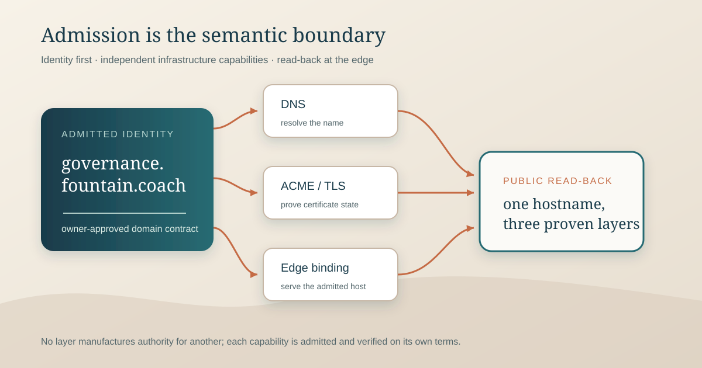

# 153 — Domain Admission and Edge Binding Are Separate Governed Capabilities

> Governance chapter: 153. This chapter establishes the missing authority boundary between estate domain identity,
> certificate automation, DNS, and the runtime edge that serves a hostname. It does not claim that every current
> hostname has already been migrated to this model or that public `auth.fountain.coach` / `mcp.fountain.coach`
> are already live.



*Principal illustration — the admitted hostname is the semantic identity. DNS, ACME, and edge binding remain separate governed capabilities that converge only in public read-back; none of their side effects may manufacture authority for another layer.*

## The problem

The estate already has governance for adjacent concerns:

- Chapter 92 defines the Fountain Coach publication estate.
- Chapter 94 governs infrastructure authorization and provider adapters.
- Chapter 96 governs provider-neutral ACME certificate automation.
- Chapter 116 governs the Store-native estate edge and ACME promotion.
- Chapter 125 governs domain/route mapping in the Store publication graph.
- Chapter 146 governs the static Caddy production profile.
- Chapter 152 governs the Fountain Host capability plane.

But no chapter currently answers two more primitive questions:

1. **When is a hostname itself admitted as a Fountain Coach domain identity?**
2. **Which runtime edge is authorized to answer for that hostname?**

Without those boundaries, certificate code is tempted to decide host admission, and edge configuration is tempted to
decide domain identity. That is exactly the ambiguity now visible in `EstatePublisherPublicACMEHostAdapter`.

The current adapter hard-codes a small domain list, owns certificate paths, mutates the production TLS-route registry,
restarts the serving runtime, and performs HTTPS read-back in one operation. Those concerns must be separated before
additional services such as `auth.fountain.coach` and `mcp.fountain.coach` are admitted.

## The decision

Fountain Coach SHALL treat **domain admission** and **edge binding** as separate governed capabilities.

```text
estate/domain intent
        ↓
domain admission
        ↓
admitted hostname identity
        ├── DNS binding
        ├── certificate lifecycle
        └── edge binding
                ↓
          runtime listener
                ↓
          HTTPS read-back
```

A hostname is not admitted because:

- DNS happens to resolve;
- a certificate was successfully issued;
- Caddy or FountainStoreHTTP has a matching route;
- a directory exists on a server;
- an HTTP request returns 200;
- an ACME adapter contains the hostname in a Swift array.

Likewise, an edge is not authorized to serve a hostname merely because it can bind port 443.

## Capability 1 — domain admission

The canonical capability identity is:

```text
estate.domain.admit
```

Domain admission establishes that a hostname is an intentional member of the Fountain Coach estate or an explicitly
governed service namespace.

An admission record SHALL contain at least:

- canonical hostname;
- declared role;
- owning service or publication surface;
- environment;
- public/private exposure class;
- required protocol class;
- certificate requirement;
- DNS requirement;
- intended edge profile;
- source governance chapter;
- authorization identity;
- idempotency key;
- predecessor or retirement state where applicable;
- terminal admission receipt.

Example roles include:

```text
static-estate
authorization-server
protected-resource
store-service
instrument-service
media-service
approval-service
preview-only
internal-service
```

The role is semantic authority. It is not inferred from hostname spelling.

For example:

```text
auth.fountain.coach
  role = authorization-server

mcp.fountain.coach
  role = protected-resource
```

Those identities become legal inputs to downstream DNS, ACME, and edge operations only after domain admission succeeds.

## Capability 2 — edge binding

The canonical capability identity is:

```text
estate.edge.bind
```

Edge binding connects one already-admitted hostname to one already-admitted runtime edge.

The binding SHALL name:

- admitted hostname identity;
- target host identity;
- edge implementation;
- listener/protocol;
- upstream service identity where applicable;
- certificate identity;
- route or upstream binding;
- health/read-back path;
- rollback predecessor;
- activation correlation;
- terminal receipt.

Examples of edge implementations include:

```text
FountainStoreHTTP native edge
Caddy static edge
Caddy reverse proxy
future Swift-native edge
local preview edge
```

The edge implementation is a projection choice. It does not own the domain identity.

## Domain admission is not DNS

DNS is an infrastructure witness.

A DNS adapter may create or update records only for an already-admitted hostname and only under an explicit infrastructure
operation governed by Chapter 94.

DNS proves:

```text
hostname → network target
```

DNS does not prove:

```text
hostname is admitted
hostname is authorized for a service
certificate is valid
edge binding is active
application semantics are correct
```

## Domain admission is not certificate issuance

Chapter 96 remains authoritative for ACME.

SwiftACMEKit receives an already-admitted certificate request:

```text
admitted hostname
  + admitted ACME directory/account
  + admitted challenge method
  + admitted custody target
  → certificate lifecycle
```

ACME SHALL NOT maintain its own application-specific hostname allowlist.

The certificate capability MAY refuse a request because the requested hostname lacks a valid domain-admission receipt.
That refusal is correct. The certificate layer SHALL NOT decide to admit the hostname itself.

Certificate issuance establishes only the certificate lifecycle result:

```text
identifier validated
certificate issued / renewed / rotated / revoked
certificate custody established
```

It does not activate an edge.

## Certificate custody is not edge binding

A certificate and private key may exist before any public runtime is changed.

The certificate operation SHALL NOT implicitly:

- edit Caddy configuration;
- edit FountainStoreHTTP host routing;
- restart or reload an application service;
- create DNS;
- publish application content;
- bind a hostname to an upstream service.

Those are separate operations.

A renewal that changes no domain identity or edge topology should normally require no topology mutation at all. The
selected edge may reload or atomically adopt renewed certificate material through its own bounded certificate-refresh
operation, but that effect belongs to edge lifecycle, not to ACME issuance semantics.

## Edge binding profiles

Each binding declares one profile.

### Native FountainStoreHTTP edge

```text
admitted domain
  → certificate identity
  → FountainStoreHTTP host binding
  → Store/publication or service handler
```

This profile is appropriate where FountainStoreHTTP itself owns the serving contract.

### Static Caddy edge

```text
admitted domain
  → certificate identity
  → immutable active release root
  → Caddy static serving
```

Chapter 146 remains authoritative for static production releases.

### Reverse-proxy service edge

```text
admitted domain
  → certificate identity
  → public TLS edge
  → fixed loopback/upstream service
```

This profile is appropriate for services such as:

```text
auth.fountain.coach → FountainHostMCPOAuthHTTP
mcp.fountain.coach  → FountainHostMCPHTTP
```

The upstream service remains separately governed. The edge does not acquire authorization-server or MCP authority merely
because it forwards HTTP.

## FountainStore publication graph relationship

Chapter 125 already requires that a destination domain be admitted before route mapping. Chapter 153 defines the missing
admission operation that Chapter 125 assumes.

The relationship becomes:

```text
estate.domain.admit
        ↓
Store publication graph may reference domain
        ↓
route mapping / publication
        ↓
estate.edge.bind
        ↓
DNS / TLS / HTTPS witnesses
```

For non-static services, the same domain admission record may exist without a Store publication route. Domain identity
therefore belongs to the estate control plane, not exclusively to the static publication graph.

## Authority separation

| Concern | Authority |
| --- | --- |
| hostname exists as an admitted Fountain identity | domain admission |
| provider DNS mutation | Chapter 94 provider adapter |
| certificate lifecycle | Chapter 96 / SwiftACMEKit |
| certificate secret custody | SecretStore / host custody boundary |
| runtime serving target | edge binding |
| static publication meaning and bytes | EstatePublisher + FountainStore publication state |
| service runtime capability | owning service / FCIS-KIT boundary |
| public reachability witness | DNS + TLS + HTTPS read-back |

No row inherits authority from another.

## Required state machines

Domain admission SHALL have explicit states such as:

```text
proposed
→ validated
→ admitted
→ suspended
→ retired
```

Edge binding SHALL have explicit states such as:

```text
planned
→ prerequisites-valid
→ staged
→ active
→ failed
→ rolled-back
→ retired
```

A failed edge binding SHALL NOT revoke the domain identity. A retired edge SHALL NOT silently retire the domain. A
certificate failure SHALL NOT erase either.

## Exact prerequisites for edge activation

Before `estate.edge.bind` may activate a public HTTPS hostname, all of the following SHALL be established:

1. domain admission receipt exists and is current;
2. target host is admitted;
3. DNS target is declared or already verified;
4. certificate identity matches the exact hostname;
5. certificate custody is available to the selected edge without exposing private material;
6. owning runtime service is installed and healthy;
7. requested edge profile is allowed for the domain role;
8. listener/upstream binding is exact and bounded;
9. predecessor configuration is recoverable;
10. activation authorization is current.

If any prerequisite is absent, stop before public mutation.

## Activation and rollback

Edge activation SHALL be atomic from the point of view of the public hostname.

The operation MUST:

- prepare candidate configuration separately from active configuration;
- validate syntax and references;
- verify certificate identity;
- verify upstream health where applicable;
- activate or reload through the edge's native lifecycle;
- perform HTTPS read-back using the public hostname;
- persist the terminal receipt;
- preserve a rollback predecessor.

Rollback restores the previous edge binding. It does not reissue certificates, delete DNS, or erase domain admission.

## Dynamic service hostnames

Service hostnames such as `auth.fountain.coach` and `mcp.fountain.coach` are first-class estate identities even though
they are not static publication roots.

This avoids the false assumption that every Fountain hostname must correspond to a checked-in static site.

A dynamic service hostname SHALL declare:

- role;
- owning service;
- protocol;
- health/discovery surface;
- edge profile;
- authorization requirements;
- whether browser access is expected;
- whether the root path has a human-readable representation.

For Slice N:

```text
auth.fountain.coach
  role = authorization-server
  edge = reverse-proxy service edge
  upstream = FountainHostMCPOAuthHTTP
  browser = yes

mcp.fountain.coach
  role = protected-resource
  edge = reverse-proxy service edge
  upstream = FountainHostMCPHTTP
  browser = metadata only / machine-first
```

## Domain retirement

Retirement is explicit and ordered.

A normal retirement sequence is:

```text
stop new publication/service admission
→ remove or replace edge binding
→ verify no public dependency
→ retire DNS
→ revoke/retire certificate as policy requires
→ mark domain retired
```

Certificate expiry or DNS deletion alone SHALL NOT constitute domain retirement.

## Evidence

A complete live domain-service proof may contain:

- domain-admission receipt;
- infrastructure authorization receipt;
- DNS read-back;
- certificate issuance/renewal receipt;
- certificate SAN/fingerprint witness;
- edge-binding receipt;
- upstream health witness;
- HTTPS hostname read-back;
- application-level protocol read-back;
- rollback evidence;
- correlated FountainStore evidence where durable recording is required.

Private keys, bearer tokens, provider credentials, session secrets, and equivalent secret material never belong in the
receipt.

## Migration of the current ACME adapter

`EstatePublisherPublicACMEHostAdapter` is legacy composite behavior under this chapter.

Its existing behavior combines:

```text
domain allowlisting
+ certificate issuance
+ certificate custody assumptions
+ FountainStore TLS-route mutation
+ service restart
+ HTTPS read-back
```

The migration SHALL separate those concerns without breaking already accepted production hosts.

The migration order is:

1. introduce domain-admission records for the currently hard-coded hosts;
2. introduce typed edge-binding records for their current serving profile;
3. make ACME consume domain admission instead of owning a hostname allowlist;
4. move edge-route mutation and runtime reload into the edge-binding capability;
5. preserve existing certificate custody and live routes during migration;
6. prove renewal no longer implies unrelated route mutation;
7. only then admit additional domains such as `auth.fountain.coach` and `mcp.fountain.coach`.

Do not begin by deleting the old adapter. First make its hidden decisions explicit as typed governed state.

## First acceptance scenario

The first Chapter 153 scenario SHALL use one existing hostname before introducing a new one.

```text
GIVEN
  one currently live admitted Fountain hostname
  its current DNS
  its current certificate
  its current serving edge

WHEN
  the hidden legacy state is reconstructed
  as a domain-admission record
  and an edge-binding record

THEN
  no DNS changes
  no certificate reissue
  no public route changes
  no service outage
  the current HTTPS response remains unchanged
  and the new records exactly describe the live state
```

A second scenario may then admit `auth.fountain.coach` and `mcp.fountain.coach` through the newly separated
capabilities.

## Nonclaims

This chapter does not select a universal public edge implementation.

It does not require Caddy, FountainStoreHTTP, or any other single server.

It does not claim that DNS APIs, ACME renewal, or reverse-proxy deployment are already generalized.

It does not authorize an arbitrary hostname merely because it ends in `.fountain.coach`.

It does not weaken Chapter 96 certificate custody or Chapter 94 infrastructure authorization.

## Governing rules

1. A hostname becomes a Fountain identity only through domain admission.
2. DNS resolution is an infrastructure witness, not domain admission.
3. ACME consumes admitted identifiers; it does not decide which Fountain domains exist.
4. Certificate custody and certificate lifecycle do not imply edge activation.
5. Edge binding connects one admitted domain to one admitted runtime target.
6. Static publication and dynamic services may use different edge profiles under the same domain-admission model.
7. Every public edge activation is exact, typed, evidenced, and rollback-capable.
8. Renewal must not silently mutate unrelated routing or publication state.
9. Domain retirement, DNS removal, certificate revocation, and edge retirement are separate transitions.
10. Existing composite adapters must be decomposed by first reconstructing their hidden state, not by deleting working production behavior.

## Governing sentence

**A Fountain hostname is admitted before it is resolved, certified, or served: domain admission establishes the identity,
SwiftACMEKit establishes certificate lifecycle, provider adapters establish DNS, edge binding establishes which runtime
may answer, and no successful side effect is allowed to manufacture authority for another layer.**
