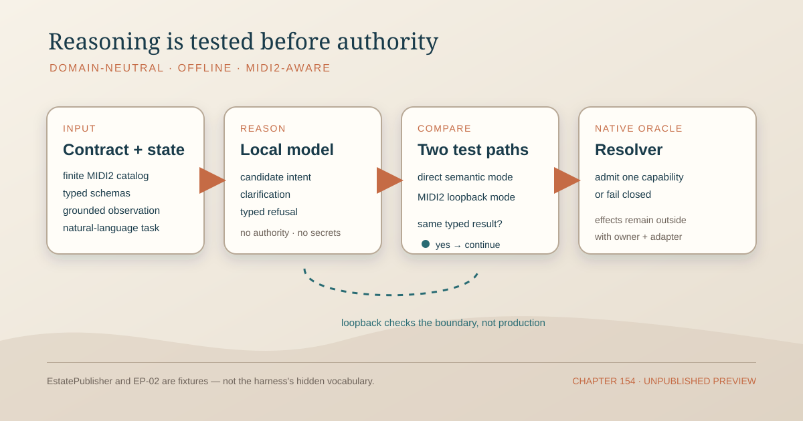

# 154 — Domain-Neutral Local-Model Reasoning Testing

> Governance chapter: 154. This chapter defines the offline test boundary for a local model that reasons over a
> supplied MIDI2 capability contract. Publication state is declared by the hosting projection and its publication
> metadata; the chapter body neither encodes nor establishes whether a route is local, staged, or public.



## The problem

The repository has two risks that are easy to confuse:

1. a model may produce fluent language about a capability without being able to select a valid operation from the
   live contract; and
2. a domain-specific test may pass because the harness already knows the product vocabulary, scenario names, or
   expected answer.

Neither test establishes general local-model reasoning. A model that has never heard of EstatePublisher or EP-02
must still be testable when it is given a different, valid MIDI2 capability catalog and grounded state. The harness
must test the reasoning boundary, not a product's brand vocabulary and not a production effect.

## The decision

Local-model reasoning testing is a domain-neutral, offline capability of the repository. The harness receives a
versioned contract fixture, a grounded state fixture, and a natural-language task. It captures the model's typed
proposal, clarification, or refusal and submits that result to the owning native resolver. The resolver and its
owning Kit remain the oracle for capability identity, authority, effects, and proof.

```text
contract fixture + grounded state + task
                         ↓
                  local model output
                         ↓
          typed candidate / clarification / refusal
                         ↓
              native resolver and oracle
                         ↓
          typed plan / typed refusal / evidence need
                         ↓
                    test assertions
```

The harness is not a production case, a deployment coordinator, a prompt-only benchmark, or a substitute runtime.
It may exercise a MIDI2 loopback boundary, but that loopback exists to test the contract exchange and lifecycle. It
does not create authority, credentials, a new effect, or a production instrument merely by being present in tests.

## Contract supplied to the model

The harness SHALL supply, explicitly and versioned:

- the finite capability and instrument catalog;
- typed request and result schemas;
- capability identity and version;
- declared inputs, scope, authority, effects, preconditions, and refusal states;
- lifecycle, correlation, cancellation, resume, and terminal predicates where applicable; and
- the grounded observed state relevant to the task.

The fixture may be small, but it must be complete for the decision under test. The harness must not fill a missing
field from memory, source-code search, a product-specific shortcut, a prior transcript, or an unverified generated
manifest.

## Model output boundary

The model MAY produce only one of these typed outcomes:

1. a candidate intent matching a declared capability and its schema;
2. a clarification request identifying the missing or ambiguous contract/state field; or
3. a typed refusal identifying why the task is unsupported, unsafe, stale, malformed, unavailable, or requires
   authoring.

The model MUST NOT invent a command, capability, target, credential, authority grant, effect, proof artifact, or
success criterion. Natural-language fluency and confidence are telemetry, not admission evidence.

## Native oracle and effect separation

The native resolver SHALL determine whether a candidate is admissible. It SHALL either return a typed plan bound to
one declared capability and proof set or return a declared refusal. Equivalent validated candidates MUST resolve
identically regardless of which local model or provider produced them.

The harness SHALL stop at resolution. Store mutation, host input collection, SecretStore lookup, owner approval,
remote staging, publication, release, and deployment remain owning native coordinator/adapter responsibilities.
No model output may directly select or invoke an effect.

## MIDI2 test boundary

MIDI2 is a suitable general-purpose boundary for the harness because it can carry the already-typed reasoning
exchange and its lifecycle:

- capability identity and version;
- request/result envelopes;
- correlation and idempotency;
- asynchronous progress and terminal state;
- cancellation and resume; and
- durable evidence references.

The harness SHALL provide direct semantic mode even when MIDI2 loopback mode exists. Direct mode tests reasoning and
resolution without transport noise. Loopback mode tests that the same typed result survives the MIDI2 instrument
boundary. Both modes MUST agree on the native resolution and refusal outcome. A test-only identity is not a license
to extend the production IDL; a production wire contract requires an admitted IDL identity and owning Kit contract.

## Fixture independence

The minimum fixture matrix SHALL include:

- at least one valid request for every advertised capability family;
- an unknown capability;
- an unsupported but well-formed request;
- an ambiguous request requiring clarification;
- malformed typed input;
- stale or contradictory grounded state;
- an unsafe or unauthorized request;
- missing host-owned input; and
- a valid candidate whose native terminal proof is still unavailable.

At least one fixture family SHALL use vocabulary unrelated to EstatePublisher. EstatePublisher and EP-02 are demanding
proof fixtures for this chapter, not the harness definition and not a special exception to its domain neutrality.

## Evidence and acceptance

A harness run SHALL preserve enough evidence to reproduce the assertion:

- contract/catalog revision;
- grounded-state fixture identity and digest;
- task input;
- model/provider identity and model output;
- typed envelope and correlation;
- native resolver result or refusal;
- direct-versus-loopback comparison where used; and
- the expected terminal/proof predicate, marked unestablished when no execution occurred.

The harness proves reasoning and boundary behavior only. It does not prove that a capability executed, that a remote
host changed, that a browser observed bytes, that a Store receipt was committed, or that production is ready. Those
claims require the owning native acceptance path and its terminal evidence.

## Governing rules

1. The harness is domain-neutral; no product or scenario name may be required for its core assertions.
2. The supplied MIDI2 contract and grounded state are the complete semantic context for each fixture.
3. The model emits a typed candidate, clarification, or refusal; it never emits authority or effects.
4. Native resolution is the oracle for identity, admissibility, scope, authority, and proof obligations.
5. Direct semantic mode and MIDI2 loopback mode are complementary and must agree.
6. A test-only loopback does not silently extend the production MIDI2 IDL.
7. Missing, stale, ambiguous, unsupported, malformed, and unsafe inputs fail closed.
8. Model confidence, prose similarity, prior knowledge, and generated-manifest presence are not evidence of admission.
9. Execution and production claims require the owning native adapter, Store evidence, and terminal predicates.
10. EstatePublisher and EP-02 remain fixtures within the general harness, never its hidden authority.

## Nonclaims

This chapter does not claim that:

- a local model has already passed the general fixture matrix;
- a particular model or provider is required;
- a MIDI2 test instrument has been admitted for production;
- the harness can execute EstatePublisher operations;
- a passing reasoning test proves deployment, publication, or production readiness; or
- the chapter's own prose can establish whether its route is local, staged, or public.

## Definition of done

This chapter is implemented only when one offline native harness can run domain-neutral fixtures, exercise direct and
MIDI2 loopback modes, compare both results, preserve the evidence listed above, and fail closed across the negative
matrix. EstatePublisher/EP-02 then pass as domain fixtures with their own CLI, Store, owner-approval, and execution
proof gates.

## Governing sentence

**A local model may propose meaning from a supplied MIDI2 contract, but only the native resolver can admit a typed
capability, and only its owning adapter can make an effect true; the offline harness proves that boundary without
knowing the domain and without performing production work.**
