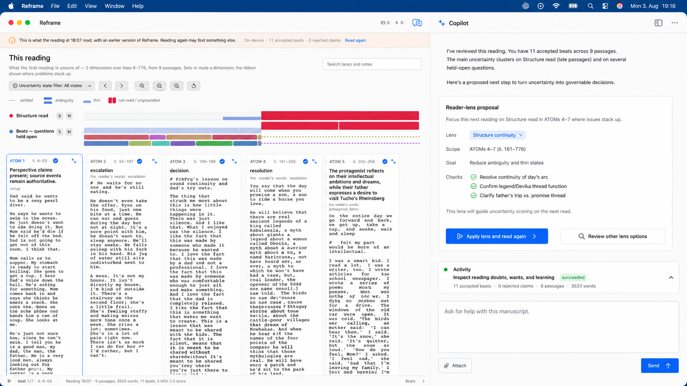
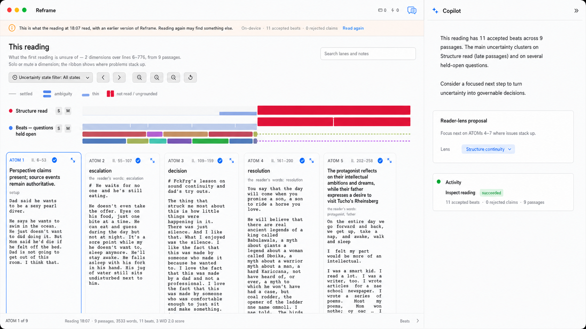

# Copilot Reading Surface and Typography — Situated, Legible, and Reframe-Native

> Chapter summary: Copilot belongs to Reframe's beat and uncertainty workspace. She is not a website sidebar, a book
> reader, or a diagnostic console. This chapter fixes the visual and interaction contract for a readable Copilot lane:
> the left projection remains primary, Copilot is the right-hand conversational authority, typography is a comfortable
> Courier reading voice, and activity remains nested and quiet until it needs to be inspected. The Book Library is the
> sole reading source; bounded citation evidence is not a browsable page.

## Purpose

The current Reframe surface already has a distinctive working object: uncertainty scoring above a horizontal set of
source-grounded beat cards. Copilot must make that object more useful without replacing it with a generic chat product.

Two design failures are explicitly excluded. First, a web-page composition — hero headings, navigation tabs, marketing
cards, and large empty regions — is not a Mac application. Second, literary book typography — serif display text,
chapter-title treatment, and parchment-like surfaces — is not the Reframe editor. Reframe is a working instrument for
reading, questioning, and structuring a manuscript.

## Design-review illustrations

These are generated concept illustrations, not implementation evidence. They establish the intended direction before
code changes:

*Working state: the beat/uncertainty surface remains the act; Copilot provides a readable situated proposal.*

*Focused state: Copilot recedes to a compact inspector so the writer can stay with the beat structure.*

## The decision

1. **The left projection is the act currently in view.** It may show a Book Library publication, publication
   structure, source passage, reading/grounding/beat/uncertainty projection, bounded citation evidence, or the
   Fountain editor. It never shows a browsable web page. The projection is selected by Copilot from live state; it is
   not a separate navigation product.

2. **Copilot is the right-hand conversational authority, not a website sidebar.** The window has two panes: the
   left projection and the right Copilot conversation/composer. The right pane names the visible situation and owns
   mediation, commands, status, and transitions. Bounded citation evidence is read-only and cannot navigate, submit,
   or authenticate into a web page.

3. **Copilot uses a Courier reading voice.** Copilot prose, proposals, the composer, activity details, labels, and
   structured result text use the platform's installed Courier face (with a documented fallback to a system
   monospaced face). The surrounding Reframe chrome may remain system sans-serif. Serif fonts are not used for the
   Copilot lane. This is a screenplay-facing writing instrument, not a book renderer.

4. **Source and Copilot share the screenplay register.** Fountain/manuscript excerpts remain monospaced, and the
   Copilot adopts the same Courier register so the conversation reads as part of the writing instrument. The face is
   not used to conceal hierarchy: size, weight, spacing, labels, and colour still distinguish prose, controls, and
   activity.

5. **Copilot recedes from the manuscript.** Copilot body text is at least the 13 pt reading floor and is smaller than
   the manuscript atom text by default. It gains readability through generous line spacing, paragraph separation, and
   a constrained measure rather than competing with the atoms by size. Section titles remain at least 15 pt; labels
   use the established system font at the 11–12 pt control tier; primary actions meet the 44 pt target. Near-black
   ink and high-contrast muted text are required in light and dark appearances.

6. **The conversation has a useful reading measure within its right pane.** Copilot prose is constrained to a readable line length, uses
   paragraph spacing, and presents multi-item results as visibly separated bullets even when the source format is not
   Fountain screenplay. A response begins near the top of the inspector and occupies only the space needed by its
   actual content. An empty white void is not a focus treatment.

7. **The uncertainty score is disclosed by default.** The current reading's score and lane rack open with the working
   surface. Structure, open-question, and any later producer lanes are the salient reading result and must be visible
   in a fresh open and in live-drive evidence. The writer may collapse the score locally, but disclosure is not a
   prerequisite for understanding what the reading found.

8. **The proposal is conversational and situated.** When the UncertaintyScore justifies a reader-lens proposal,
   Copilot explains which visible threads produced it and offers a clear writer decision. The proposal is not a new
   baseline command surface and cannot silently mutate Grounding. Its actions are named, accessible, and governed by
   the same confirmation and persistence rules as any other capability.

9. **Activity is nested, asynchronous, and last in the Copilot lane.** Activity is the last persistent line in the
   Copilot surface, immediately above the composer or disclosure. It reports real state, can expand to details, and
   never floats as a permanent badge at the top of the writer's reading field. Long-running work may update it without
   taking over the conversation.

10. **Progressive disclosure protects focus.** The default Copilot lane exposes the two or three things the writer can
   do now: read the answer, inspect the proposal, and choose the next action. Telemetry, provider detail, lifecycle
   history, and secondary tools remain one obvious disclosure away.

11. **The two panes remain one Copilot state.** The writer may resize the split for readability, but collapsing or
    restoring the right pane must not turn the left projection into an independent workflow. Reopening restores the
    same projection and conversation from live application state; it does not invent context from transcript prose.

12. **AX and human legibility are both required.** Every Copilot heading, answer, proposal, button, status, disclosure,
    and composer is exposed with role, label, value, and action in the accessibility tree. AX presence does not prove
    readability: every change also requires a rendered light/dark screenshot reviewed at reading size.

13. **The illustration is not the proof.** Generated images communicate intent only. Acceptance requires the real
    Reframe window, the real beat/uncertainty state, AX semantics, window-ID capture, and persisted FountainStore
    evidence. No generated wording can be used to claim that a capability ran.

## Amendment (2026-08-08) — the instrument stays Courier; the book setting belongs to what leaves it

Rule 4 was tested against a real page and it holds. The reading column was set as a book — a serif reading face at
16.3pt, `line-height: 1.72`, a 64-character measure, exactly the specimen's values — and looked at in the running
app beside the Courier setting it replaced. The decision, on seeing both: **the reading column stays in the
instrument's register.**

The reason is not that the book setting read badly; it read very well. It is that this page is a **workspace**.
The writer is not consuming the manuscript here — they are marking it, selecting lines that become beats, running
Writing Tools over it, composing versions against it. A tool's surface should look like a tool, and the monospaced
register is what makes the manuscript legible AS MATERIAL: a line is a unit you can point at, count, cite and
cut. Courier is not a compromise here, it is the working face.

**Where the book setting belongs is the EXPORT path** — what leaves the workspace. A downloaded page, a rendered
`.fountain`, a social card, a PDF of an annotated passage: those are read by someone who is not working on them,
on a surface with no editing, no Writing Tools and no accessibility drive to satisfy. Everything that makes book
typography expensive inside the instrument is free once the artefact is on its way out, and everything that makes
it valuable — sustained readability — is exactly what an exported page needs.

So the line is drawn by DESTINATION, not by act: inside the instrument, Courier; on the way out, a book. The
specimen that argued this out lives at `docs/specimens/ch52-two-marks/`, and it is the reference for the export
renderer rather than for this column.

**What the reading column did take from the specimen**, because none of it is a typeface: the manuscript's own
line numbers in a gutter, the reading's citations drawn in the margin beside the lines that raised them, an
apparatus that resolves each mark to its question at that question's own height, generous leading, and no rules
drawn across the page. A workspace can be quiet and well set without pretending to be a book.

## Forbidden drift

- Serif “book” typography or literary chapter-title treatment in Copilot.
- Web navigation, hero copy, browser framing, promotional cards, or dashboard composition.
- A permanently empty Copilot pane, or a pane so dense that the beat act becomes secondary.
- A single full-window Copilot canvas when the active workspace requires the governed projection/conversation split.
- A left pane with its own unmanaged navigation, import, commit, or publication authority.
- A fresh reading that hides the uncertainty score or its lane rack behind a disclosure before the writer can see the
  reading's saliency.
- Activity badges detached from the asynchronous work they describe.
- Tiny icon rows, unlabeled controls, grey-on-grey body text, or a Courier treatment that collapses all hierarchy.
- A visual redesign that changes beat identity, uncertainty meanings, source authority, or the situated Copilot contract.

## Relationship to other chapters

- **[The stage presents the act](18-the-stage-presents-the-act.md)** supplies the enforceable visual floor: glasses-test
  sizing, progressive disclosure, one act in focus, and verification by looking.
- **[The situated Copilot](15-the-situated-copilot.md)** supplies placement authority: Copilot speaks from the active
  arrangement and may not offer an object that the arrangement does not show.
- **[The beat and its arrangements](14-the-beat-and-its-arrangements.md)** keeps beat anatomy and meaning invariant;
  this chapter changes presentation, not the beat object.
- **[Copilot capability governance](37-copilot-capability-governance.md)** binds proposals and actions to registry,
  runtime, FountainStore, telemetry, and AX evidence.
- **[Validation and acceptance](08-validation-and-acceptance.md)** governs real-window, AX, store, and visual evidence.

## Acceptance

The chapter is implemented only when a real Reframe build demonstrates:

1. the left projection remains the dominant act and the right Copilot pane remains the sole conversational authority;
2. Copilot body is smaller than manuscript atoms but meets the 13 pt floor; system labels, headings, and primary
   actions meet the type and contrast floors in light and dark;
3. Copilot uses the Courier reading voice for prose, composer, and structured command text; labels and surrounding
   application chrome remain system typography;
4. the uncertainty score and its lanes are disclosed by default and visible in the live-drive window-ID capture;
5. multi-item results are visibly bulleted and spaced, even outside Fountain screenplay syntax;
6. the proposal names visible uncertainty threads, is writer-confirmable, and does not silently alter Grounding;
7. activity remains the final nested asynchronous line and expands to real details;
8. collapsing and reopening Copilot preserves situated context without transcript inference;
9. AX exposes every visible Copilot state and action, while window-ID screenshots show human-readable presentation;
10. FountainStore and telemetry prove any claimed action, and the generated illustrations are clearly labeled as design
   references rather than runtime evidence.

## Governing sentence

Copilot is the right-hand conversational authority beside a Copilot-controlled left projection: Courier prose,
system-font labels, generous screenplay spacing, disclosed saliency, quiet asynchronous activity, and AX, rendered
pixels, and persisted state must agree before the surface or any action is claimed complete.
