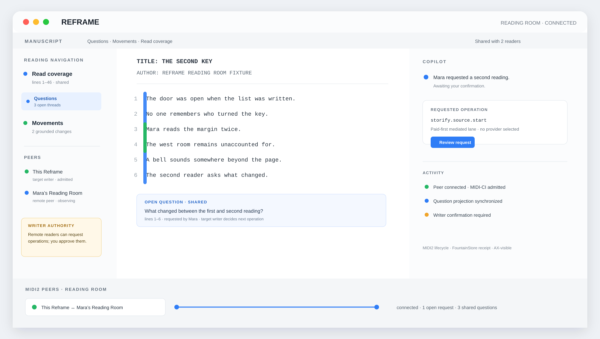

# 82 — Remote MIDI2 Reading Rooms

Chapters 71, 72, and 81 establish Reframe-to-Reframe software peers, the projections surface, and the universal
MIDI2 command plane. This chapter turns that infrastructure into a useful product boundary: a remote Reading Room
where people and Reframe instances can read, question, and develop a manuscript together without taking authority
away from the writer's Reframe.



*Design reference for the governed product direction. This illustration is not runtime, AX, FountainStore, MIDI2
transport, security, or visual-regression evidence.*

## The product

The Reading Room is a multi-user Reframe session. A writer runs Reframe as the authoritative target. A remote reader,
editor, producer, maintainer, or second Reframe connects as an admitted MIDI2 peer. The peer can see the projections
the writer has shared, ask grounded questions, request governed operations, and follow the resulting semantic and
lifecycle state.

The Reading Room is not a remote copy of the writer's Store and not a second Copilot persona. It is a collaborative
peer surface over the same typed operation and event contract.

## The authority model

The roles are deliberately distinct:

1. **Writer** owns the manuscript, sharing scope, consent, provider/lane policy, and final acceptance of mutating work.
2. **Reader or editor** may inspect shared source and semantic projections, submit questions, and request operations.
3. **Producer or reviewer** may compare readings, discuss open Questions and Movements, and request a new lens or pass.
4. **Maintainer** may connect a scenario peer, inspect evidence, and run acceptance contracts without receiving private
   manuscript material by default.
5. **Reframe peer** is the technical identity representing each connected client; it is not a human role.

MIDI2 establishes the peer relationship and carries discovery, requests, lifecycle, and results. A collaboration
layer establishes human identity, invitation, role, sharing scope, presence, and revocation. Neither layer may silently
substitute for FountainStore or writer consent.

## What a remote peer can do

Within the writer's admitted sharing scope, a peer may:

- follow shared Read coverage, Questions, Movements, and remembered findings;
- submit a grounded question or annotation tied to source identity and line range;
- request a second reading, comparison, library operation, or illustration operation;
- receive admitted, awaiting-confirmation, running, refused, failed, resumed, and completed lifecycle state;
- reconnect and recover the named terminal result without duplicating an idempotent operation; and
- observe the peer graph, authorization state, transport health, and capacity reason exposed by the projection.

A peer may not select a model, provider, or lane; bypass mediation or consent; write the target Store; access an
unshared manuscript; invent completion; or infer a result from a missing event.

## The remote journey

The canonical Reading Room journey is:

```text
invite and authenticate human
  → MIDI-CI discover the software peer
  → negotiate shared capabilities and projection scope
  → admit the peer under live capacity and authorization
  → share selected manuscript and semantic projections
  → peer asks a grounded question or requests one operation
  → target mediation, lane election, and writer consent
  → MIDI2 lifecycle and progress projection
  → FountainStore receipt and terminal result
  → peer resume, comparison, or follow-up question
```

Every consequential action retains one correlation and idempotency identity. A reconnect is a continuation of the
same session or a new explicitly admitted session; it is never an excuse to replay an operation blindly.

## Secure web transport

The first remote deployment may use an authenticated WebSocket Secure connection. WSS is a transport boundary, not a
replacement protocol: it carries encoded UMP/MIDI-CI and universal operation envelopes without changing their topics,
schemas, lifecycle, or evidence obligations.

The browser is a projection and interaction surface. A TypeScript peer process owns the protocol session. The remote
deployment must use a dedicated HTTPS host, short-lived authenticated sessions, origin checks, replay protection,
rate limits, explicit peer identity, bounded message sizes, disconnect handling, and sanitized telemetry. It must not
expose raw RTP-MIDI or an unauthenticated UDP listener to the public internet.

Reframe should prefer an outbound authenticated connection from the writer's host. The remote service must not be
given shell access, private Store access, deployment credentials, or a general-purpose callback into the writer's
machine.

## Evidence and claim boundary

The Reading Room is accepted only when the evidence tuple binds:

```text
human/session identity
  + peer process identity
  + target Reframe PID and executable
  + separate managed Store paths
  + negotiated MIDI2/WSS trace
  + sharing and consent facts
  + target AX state and window ID
  + target FountainStore lifecycle and terminal receipt
```

The public governance projection may claim a remote software-peer Reading Room only from a complete tuple. A design
mockup is not evidence. Software-peer acceptance is not hardware interoperability. A reachable web page is not proof
that a peer was authenticated, admitted, or allowed to read a manuscript.

## Scenario-first implementation gate

The implementation begins with a YAML/JSON contract derived from the existing `reframe-to-reframe-peer-projection`
scenario. The contract must add human session identity, sharing scope, remote transport, authentication, reconnect,
revocation, and privacy assertions before the web peer is treated as a product capability.

The first bounded slice is a read-only Reading Room: discover, authenticate, admit, share one fixture projection,
follow Questions and Movements, reconnect, and prove that no unshared source or target Store write crossed the boundary.
Only after that passes may the peer request a mutating capability such as Storify Source Auto.

## Governing sentence

Reframe's Reading Room is a multi-user MIDI2 collaboration boundary: the remote peer may see and request within an
explicit sharing scope, the writer remains the authority, MIDI2 carries the negotiated lifecycle, FountainStore proves
durable behavior, and the web surface never claims more privacy, authority, or interoperability than its evidence shows.
