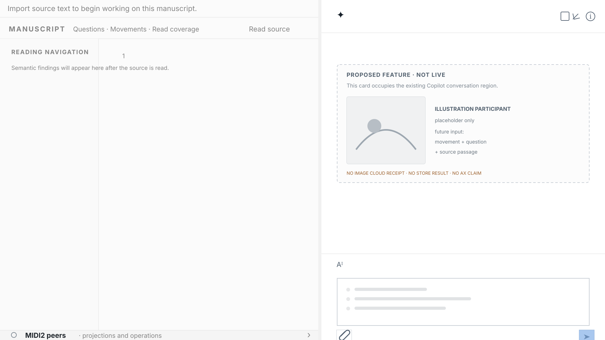

# 84 — The Reframe Design Mock Is a Governed Projection

The Teatro illustration scenario is executable but not yet live-accepted. Governance publication still needs a useful
way to show how Reframe currently looks and how a successful semantic illustration journey would appear inside that
workspace. This chapter defines the honest answer: a deterministic Reframe Design Mock.



*Design reference only. This mock is not an AX observation, FountainStore receipt, MIDI2 lifecycle trace, Image Cloud
receipt, generated image, or live acceptance of `teatro-score-myth-illustrations`.*

The current-workspace layer is grounded in a live isolated observation: a 1920×1080 light Reframe window with a
1010-pixel manuscript projection, 10-pixel divider, 900-pixel Copilot projection, and 31-pixel MIDI2 peers strip.
At capture time the source was empty, so the navigation reported “Semantic findings will appear here after the source
is read” and the manuscript exposed only blank line 1. The proposed illustration card is therefore drawn inside the
existing Copilot conversation bounds; it is not a claim that the current app renders that card.

## The decision

The default governance illustration is a reviewed design projection with two visible layers:

1. the measured current Reframe surface — its light full-screen split layout, empty manuscript state, Copilot
   conversation surface, and bottom MIDI2 peers strip; and
2. the proposed scenario rollout — a future illustration result placed inside the existing Copilot conversation
   region, with no claim that the feature exists in the current build.

The mock may show the intended relationship before the live scenario succeeds. It must never make the proposed layer
look like a completed provider call or a persisted result. The mock therefore copies the current live shell geometry,
labels the proposed feature in the conversation surface, and uses a placeholder rather than fabricated artwork or a
fake receipt.

## What the mock answers

The mock answers the design questions a publication reader has:

- What is the current Reframe workspace shape?
- Where will manuscript and semantic Questions/Movements/Read coverage appear when source material exists?
- Where does Copilot mediate a scenario?
- Where would a source-grounded illustration participant appear?
- How does the MIDI2 lifecycle sit below the writer-facing surface?
- Which parts are current design and which parts are a proposed rollout?

It does not answer the behavioral questions owned by live evidence:

- Did Storify actually settle the movement and question?
- Did the MIDI2 operation complete?
- Did Image Cloud admit an image?
- Was the image placed at the correct text location?
- Did AX expose the promised state?

Those questions remain open until the owned scenario run and its independent evidence agree.

## The design-mock engine

The mock is generated from a declarative visual state, not from a provider call or a screenshot of an unverified run.
The current-workspace state is measured from the live AX tree and window-ID capture; the proposed-feature state is
declarative.
The engine input has four parts:

```text
currentWorkspace
  manuscript, Questions, Movements, Read coverage, Copilot, MIDI2 peer surface
scenarioRollout
  source passage, movement, question, semantic handoff, proposed placement
claimBoundary
  design-reference, not-live-evidence, unestablished receipts
provenance
  source commit, renderer version, input digest, asset digest
```

The renderer produces a deterministic SVG or raster asset and a manifest. It must be possible to regenerate the same
asset from the same reviewed inputs without a model provider, secret, private prompt, manuscript, Store, or live app.
The published illustration is therefore a design artifact with provenance, not a behavioral artifact with invented
provenance.

## Rules

1. Every published mock MUST carry an explicit `DESIGN MOCK · NOT LIVE EVIDENCE` boundary in its visible surface or
   immediate caption.
2. The current workspace and proposed scenario rollout MUST be distinguishable in layout, labels, or both.
3. Questions and Movements MUST remain separate. A historical beat identifier may not be used as a substitute for
   either semantic lane in the design contract.
4. A proposed illustration participant MUST name its intended movement, question relationship when present, and source
   location. It MUST be visibly a placeholder until an Image Cloud receipt exists.
5. A mock MUST NOT contain fabricated Store IDs, MIDI2 correlations, prompt digests, provider receipts, AX
   identifiers, window IDs, or terminal statuses.
6. The renderer MUST be deterministic, reviewable, and independent of paid providers and private source material.
7. A mock may establish visual intent and information hierarchy. It cannot establish semantic truth, application
   behavior, accessibility, visual regression, image generation, placement correctness, or live acceptance.
8. The publication skill MUST record the mock's source commit, renderer/input identity, asset digest, and claim
   boundary, and MUST keep the Teatro scenario status `executable-not-live-accepted` until its evidence exists.
9. A diagram or typographic architecture illustration MUST use a vector-first canonical asset, preferably SVG. The
   canonical asset MUST NOT depend on a low-resolution rasterized text layer.
10. Canonical illustration typography MUST remain legible at its intrinsic size and at the responsive display size
    used by the chapter template. Text must have sufficient padding, line wrapping, and contrast; technically vector
    outlines do not satisfy this rule when their glyphs are too small to rasterize cleanly on screen.
11. A social JPEG or other raster derivative MUST be generated from the reviewed canonical asset. It is a delivery
    derivative, not a second illustration and not the canonical source of typography or layout.
12. Visual review MUST inspect both the canonical asset and its social derivative. A successful file conversion or
    HTTP response is not evidence of typographic legibility.

## Governing sentence

A Reframe Design Mock may show how the current workspace and a future semantic illustration rollout belong together,
but it must remain visibly and evidentially a design reference until the application, Store, AX, and independent run
prove the behavior.
