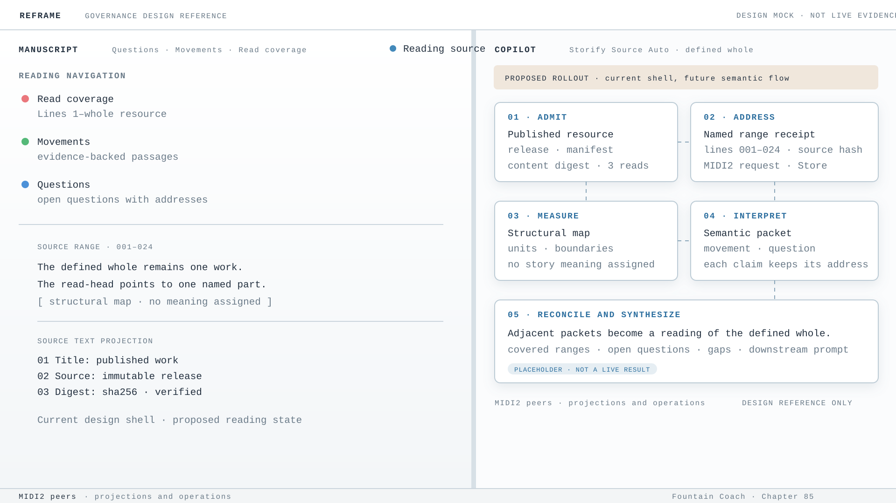

# 85 — Storify Source Auto Reads a Defined Whole

Storify Source Auto is not a text dump, a web scraper, or a model prompt with a progress bar. It is Reframe's
governed reading pipeline: a named, immutable text resource is admitted, addressed by ranges, measured for structure,
interpreted in bounded semantic passages, and reconciled into a reading of the defined whole.



*Design reference only. This mock uses the measured Chapter 84 Reframe shell and proposes the Chapter 85 reading flow;
it is not an AX observation, FountainStore receipt, MIDI2 lifecycle trace, semantic result, or live acceptance.*

*Mock provenance: declarative SVG renderer v1; input identity `chapter-84-shell + chapter-85-defined-whole-flow`;
asset SHA-256 `f73de08e7d7bdc04312170d8c1a4e9c367ca76dc06cd7765076ad5273921b6ff`.*

This chapter joins the source-provider boundary of Chapter 56, the addressable text contract of Chapter 50, the
measurement/interpretation separation of Chapter 29, the lane decision of Chapter 51, and the MIDI2 command boundary
of Chapter 81. It defines their joint behavior for Storify Source Auto. It does not override the MIDI2 IDL, live
FountainStore state, or a named build's actual acceptance status.

## The decision

The defined whole is established once by an immutable source identity. Its parts are then read by named ranges. A
deterministic structural map describes where those ranges are; it does not describe what they mean. Storify interprets
one semantically relevant range at a time, records the evidence coordinates, and only then allows a later synthesis to
reason across the packets that cover the whole.

The source is not fetched repeatedly from a floating cloud representation. The provider release, manifest digest,
content digest, and exact bytes are admitted through the native Store boundary. That custody is authoritative source
state, not a content cache. A rebuildable index may be reused when its source digest and parser revision match; it holds
coordinates and structure, never a second copy of the source text.

## What Source Auto does

One Source Auto run has these governed stages:

1. **Resource admission** — resolve a published resource by name, pin its provider release, verify its manifest and
   content digests, and require three consecutive identical reads before the source becomes readable.
2. **Structural measurement** — derive ordered units, chapters, paragraphs, speeches, stage directions, sentences,
   names, and other observable boundaries. Measurement may report ambiguity or missing boundaries; it may not assign
   story meaning.
3. **Range planning** — choose the next named source range from the measured structure and the current semantic
   question. The planner preserves causal order and continuity. It does not shrink, truncate, or discard meaningful
   source material because a numeric token or character estimate is convenient.
4. **Local interpretation** — give the selected passage, its coordinates, the relevant carried question, and only
   reasoned adjacent context to the semantic model. The response is typed and must cite the source range it interpreted.
5. **Boundary reconciliation** — compare adjacent interpretation packets when a movement or question crosses a range
   boundary. A merge or split requires evidence from the packets and remains distinct from the structural map.
6. **Whole-work synthesis** — derive the reading, question ledger, movements, uncertainties, and downstream prompt
   material from the persisted interpretation packets. The synthesis does not reopen the cloud source or require the
   whole manuscript to be placed in one prompt.
7. **Terminal projection** — persist the run, range packets, coverage, job lifecycle, and capability receipt as one
   reconciled Store result. A model response, UI progress line, or log is not terminal proof.

## Apple-native local reasoning, paid extension

The pipeline is deliberately composed rather than split into an exclusive local lane and paid lane. Apple-native
Natural Language instruments provide the deterministic local foundation: language recognition, token and sentence
boundaries, lexical and name observations, and embedding continuity where the selected framework supports it. A
paid model may then enrich or synthesize those grounded packets when the Chapter 51 decision selects the paid
writer-facing lane. The paid stage receives the local receipts; it does not replace source admission or invent a new
source copy.

The seven stage boundaries are typed MIDI2 operations:

| Stage | Operation | Contractual result |
| --- | --- | --- |
| measure | `reframe/semantic.measure` | source-addressed structural and linguistic evidence |
| embed | `reframe/semantic.embed` | source-addressed embedding continuity receipt |
| interpret | `reframe/semantic.interpret` | bounded semantic packet with cited range |
| enrich | `reframe/semantic.enrich` | paid-lane enrichment linked to interpretation receipts |
| reconcile | `reframe/semantic.reconcile` | boundary comparison and explicit unresolved gaps |
| synthesize | `reframe/semantic.synthesize` | whole-work reading from reconciled packets |
| prompt | `reframe/illustration.prompt` | grounded movement/question prompt with placement relation |

The operation handoff carries the immutable source reference, prior receipt identities, lane decision where required,
framework/model revision, and idempotency key. Payload custody remains in FountainStore. The portable operation
contract is being extracted into `FountainSemanticPipelineKit`; until that boundary is released upstream and wired to
Reframe executors, this chapter governs the target architecture rather than claiming that the complete chain is live.

## Fast reading without a content cache

The fastest correct path is:

```text
published resource
  → three-read immutable admission
  → native FountainStore source custody
  → digest-keyed structural map
  → named range receipt
  → semantic packet
  → reconciled reading
```

Metadata, release manifests, and independent future ranges may be requested concurrently. Causal reading may not be
parallelized merely to reduce wall-clock time. The next range may be prefetched after the current range has been
admitted, but it cannot be interpreted or counted as covered before its own receipt exists.

An HTTP conditional request, provider-side immutable release, or transport read-ahead may optimize delivery, but none
of them becomes semantic authority. The source digest and Store receipt remain the identity that downstream stages
consume.

## Reasoning over parts of a defined whole

The model receives the smallest semantically sufficient context for the current phase, selected by meaning and
continuity rather than by numeric fit. The pipeline keeps four different objects separate:

| Object | Authority | Contains | Does not contain |
| --- | --- | --- | --- |
| Source resource | provider release and Store | immutable text and digest | interpretation |
| Structural map | deterministic measurement | ordered ranges and observable boundaries | story conclusions |
| Interpretation packet | Storify/model response | movement, question, uncertainty, and cited evidence | uncited whole-work claims |
| Whole-work synthesis | reconciled packets | relations across covered ranges and coverage gaps | invented source material |

Adjacent packets may carry forward an open question or unresolved continuity. A carried question is context, not proof.
The packet must still cite the range that supports each new claim. A gap remains a gap; synthesis may not silently fill
it from memory, a prior model response, or a nearby range.

This makes local reasoning composable: a chapter, scene, or bounded myth can be read independently while retaining an
address into the same defined whole. It also makes reruns explainable: a changed source digest invalidates its derived
map and interpretation packets; a changed operation revision invalidates only the affected derived stage.

## MIDI2-native exchange

MIDI2 is the operation and lifecycle boundary, not a second text store. The resource read operation names:

- the resource and source document identity;
- provider release, manifest digest, and expected content digest;
- the requested line or unit range;
- the required consecutive-read count;
- an idempotency key and execution identity.

The verified data receipt returns the same identity, the exact range, content digest, and read count together with the
range text or a native Store reference appropriate to the payload contract. Large source custody remains in native
FountainStore; MIDI2 carries the typed request, admission, range receipt, lifecycle, error, and terminal references.

The adapter mirrors the declared IDL topics without changing their meaning. It must not fetch a different resource,
silently widen a range, allocate a second execution identity, or turn a timeout into completion. Replayed requests with
the same idempotency key return the same admitted result or the same typed failure.

## Rules

1. Source Auto MUST name the immutable resource, provider release, manifest digest, content digest, and source
   revision before interpretation begins.
2. Three consecutive exact reads MUST agree before a resource is admitted as stable. A mismatch MUST fail closed.
3. Storify MUST consume the admitted Store resource or a verified named-range receipt; it MUST NOT independently
   re-fetch a floating cloud source.
4. A range request MUST return only the named range, within the declared payload contract. Whole-work fetch followed by
   client-side slicing is not an implementation of named-range reading.
5. Structural measurement MUST remain factual. It may locate boundaries and observations but MUST NOT assign a beat,
   movement, question, uncertainty, or causal meaning.
6. Numeric token, byte, character, or atom limits MAY be transport telemetry and provider constraints, but MUST NOT
   decide which semantically relevant source material is included, truncated, compacted, or discarded.
7. Every interpretation packet MUST carry source coordinates, source digest, operation revision, and typed evidence
   for its claims. A summary without an address is not a grounded result.
8. A synthesis MUST distinguish covered ranges, unresolved gaps, carried questions, and reconciled movements. It MUST
   not present a partial read as a complete reading.
9. MIDI2 lifecycle, native Store receipts, AX state, window-ID capture, and logs are separate evidence authorities.
   No one of them may stand in for the others.
10. A run is accepted only when its declared terminal predicate is satisfied and the same result is reproduced across
    three independent repetitions. Intermediate progress is not acceptance.
11. Downstream image or illustration generation MUST consume only grounded movement/question packets with source
    addresses. It MUST NOT use raw cloud text or an unverified model synopsis as its prompt authority.
12. A public governance projection MAY describe this contract and its evidence boundary, but MUST NOT publish private
    Store data, prompts, manuscript material, credentials, or unestablished runtime claims.

## Current implementation boundary

The deterministic Book Library reader and the resource-read topics establish part of this contract: provider and
content digests are checked across three reads, and the IDL names the resource request and data receipt. The seven
semantic operation identities and generated facts are now declared, and the portable handoff contract has a tested
pre-release package boundary. The current Swift adapter does not yet execute the complete chain through external MIDI2
and matching Store receipts. The existing Source Auto path still contains whole-source acquisition and fit-driven
window mutation. Semantic quality gates that reject dump-like interpretations before illustration generation are not
yet live-accepted.

Those are implementation slices governed by this chapter, not claims established by publishing it.

## Governing sentence

Storify Source Auto reads a named, immutable whole through verified ranges, reasons over each part with its address, and
may speak across the whole only from persisted, reconciled evidence; MIDI2 coordinates the operation, FountainStore
holds the authority, and no progress signal becomes truth until the declared terminal evidence agrees.
