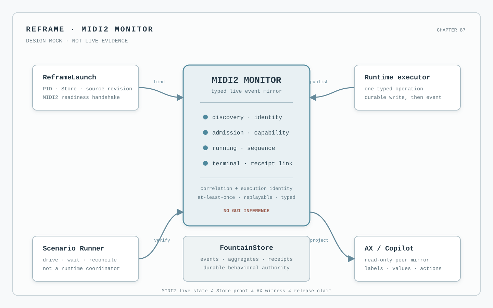

# 87 — The MIDI2 Monitor Is the Live Event Mirror

The MIDI2 Monitor is Reframe's live account of the system's negotiated activity. It is not a packet log, a
debug console, a second Copilot, or a decorative peer graph. It is the architectural boundary at which the system's
typed MIDI2 events become observable without being reinterpreted.



*Design reference for the governed monitor surface. The illustration is a deterministic architectural mock, not a
runtime screenshot, AX observation, FountainStore receipt, MIDI2 hardware result, or live-acceptance claim.*

*Mock provenance: declarative SVG renderer v1; input identity `chapter-87-midi2-monitor + reframe-peer-shell`; no
provider call, private Store data, manuscript material, or fabricated execution identity.*

This chapter positions the monitor after Chapters 70, 72, 77, 81, and 86. It does not replace the MIDI backplane
IDL, FountainStore state, the generated capability registry, or an independent acceptance witness. It defines how
those authorities meet in one live, machine-readable mirror.

## The decision

The MIDI2 Monitor is a Swift-owned, typed event projection of the governed MIDI2 backplane. It receives negotiated
peer and operation events, preserves their correlation and sequence identity, and projects the latest truthful state
to Reframe's peer surface. FountainStore remains the durable behavioral authority. The monitor is the live event
authority for what has been observed on the MIDI2 boundary. The GUI is a read-only, AX-visible mirror of the monitor.

The ownership is therefore:

```text
MIDI2 IDL and transport
        → typed monitor event source
        → FountainStore event / receipt persistence
        → AX-visible Reframe peer mirror
        → independent scenario, AX, window-ID and telemetry witnesses
```

The monitor does not create a competing truth. It joins live transport observation to durable proof and makes the
relationship inspectable.

## What the monitor owns

The monitor owns the live observation record for each admitted peer session and operation. Its records are typed and
correlated, not prose inferred from UI changes. A monitor event identifies, where applicable:

- the MIDI2 session and peer identity;
- the negotiated role, operation identity, and operation version;
- discovery, handshake, authorization, and admission state;
- execution and correlation identities;
- the monotonic lifecycle sequence and phase;
- transport and resource health;
- the source revision and managed Store intent bound to the run;
- the terminal outcome or the explicit absence of one; and
- the durable receipt identity that settles behavior after the event.

The monitor may retain a bounded live view for rendering, but numeric bounds must never select, truncate, or compress
semantic event content. A history window is a presentation choice; the persisted event and its receipt remain
addressable.

## What the monitor does not own

The monitor does not own any fact that belongs to another authority:

| Question | Authority | Monitor role |
| --- | --- | --- |
| Is this operation declared and what does its payload mean? | MIDI2 IDL, generated facts, and capability registry | Display the declared identity and version |
| Did the operation persist and what did it produce? | FountainStore event, aggregate, and receipt | Link the live event to the durable identity |
| Could the writer see and operate the result? | AX and the resolved CoreGraphics window | Mirror the state; never self-certify it |
| How did timing, QoS, or resources behave? | Telemetry | Display the measurement without promoting it to success |
| Is the build released? | Named-build release authority | Display release state only when linked evidence exists |
| Is physical MIDI2 interoperability established? | Hardware acceptance evidence | Say “not established” when only a software peer exists |

The monitor cannot make a capability available, executable, live-accepted, or released by displaying it. It cannot
turn an acknowledgement into completion, a missing event into failure, or a transport timeout into semantic truth.

## The system actors and their boundaries

Every actor that participates in production, observation, persistence, or verification is represented in the
architecture, but not every actor subscribes directly to every stream.

1. **ReframeLaunch** binds the executable, source revision, managed Store, scenario, and MIDI2 readiness identity.
2. **The runtime executor** owns the capability transition and publishes its typed lifecycle after the corresponding
   durable Store write.
3. **The MIDI2 transport adapter** negotiates the peer boundary and mirrors IDL topics without changing their meaning.
4. **The MIDI2 Monitor** receives and orders the live transport events by session, correlation, execution, and
   sequence identity.
5. **FountainStore** persists lifecycle events, aggregates, receipts, and scenario records as behavioral proof.
6. **The AX/Copilot surface** presents the monitor's current projection and exposes its labels, values, actions, and
   result state through the accessibility tree.
7. **The Scenario Runner** drives the declared operation and reconciles MIDI2, Store, AX, window-ID, telemetry, and
   provenance evidence. It is a verifier, not a runtime coordinator.
8. **Provider and lane adapters** report availability, policy, and terminal results through the same operation
   boundary. They do not become peer authorities or select a lane on their own.

An actor may be in-process or a separate Swift process. That changes topology, not authority. A direct method call,
Store write, callback, timer, shell watcher, or UI observation cannot replace the typed MIDI2 boundary.

## Event contract

The monitor consumes the MIDI2 IDL vocabulary and adds no private phase vocabulary. It may attach a semantic detail to
an event, but the transport phase remains one of the declared operation states. The minimum lifecycle is:

```text
discovered → admitted → running → progress* → succeeded | failed | canceled | refused
```

`requested`, `accepted`, and other semantic details may be retained as typed capability-phase information when the
IDL transport phase remains `progress`. They must not be sent to a reducer that does not declare them.

Every event is at-least-once and therefore de-duplicated by correlation and execution identity. Sequence numbers are
monotonic within that identity. A terminal event closes the live stream for that execution. A late subscriber receives
an explicit replay from the monitor or an unavailable result; it never reconstructs history from the current GUI.

The monitor subscribes before the associated operation is dispatched. Store `changes()` may provide an event-driven
recovery and read-after-event seam, but it is not a polling loop and it is not the command bus. A monitor may report
“no event observed” only as an observation about its stream, never as proof that the operation did not happen.

## The Reframe peer surface

The MIDI2 peers section becomes the monitor's primary writer-facing mirror. It should show the meaningful relationship
first and disclose machinery progressively:

- peer identity, role, and connection state;
- negotiated capability and authorization summary;
- the active operation and its correlation identity;
- lifecycle phase, sequence, and human-readable summary;
- transport/resource health and typed refusal reason;
- durable Store receipt identity when available; and
- explicit boundary labels such as `software peer`, `hardware not established`, `live accepted`, or `released` only
  when those claims have their own evidence.

The surface must remain legible in light and dark appearance, and every visible state must have a corresponding AX
role, label, value, identifier, and action where applicable. A peer card is a projection of monitor state; it is not a
mutable control-plane store. The writer should never need to inspect raw packets to understand that a peer is admitted,
running, completed, refused, or waiting for a resource.

## Failure, recovery, and absence

The monitor is useful precisely when the system does not complete normally. It must preserve and project:

- malformed envelope or schema mismatch;
- unknown or denied capability;
- unavailable provider or lane;
- missing Store admission or invalid Store binding;
- disconnect, reconnect, duplicate, and resume;
- capacity refusal or queueing;
- transport failure without semantic terminal proof; and
- a required witness that has not yet been established.

Failure is not inferred from silence. A watchdog may detect a hung run and emit a typed diagnostic, but it cannot
promote that diagnostic into success or semantic failure without the owning authority. Recovery reuses the original
identity where the contract permits it and records a new attempt where it does not.

## Acceptance boundary

The monitor implementation is not accepted because the peer card looks active. A monitor slice requires:

1. the event source is declared against the MIDI2 IDL and generated contract facts;
2. discovery and operation lifecycle events are received by one Swift-owned monitor with correlation and sequence
   preservation;
3. duplicate, late, terminal, refusal, disconnect, and replay behavior are tested;
4. the matching Store event and receipt are persisted before completion is projected;
5. the peer surface exposes the live state and identity through AX;
6. an independent window-ID witness identifies the rendered surface;
7. the Scenario Runner reconciles the same run tuple across MIDI2, Store, AX, CoreGraphics, telemetry, executable,
   source revision, and managed Store; and
8. software-peer acceptance is explicitly kept separate from physical MIDI2 hardware interoperability.

Only the complete evidence tuple may establish `live-accepted`. A monitor mock establishes architectural placement
and visual intent; it does not establish a runtime event, Store receipt, AX state, or hardware result.

## What this chapter forbids

- a peer card that invents state from elapsed time or a callback arrival;
- a Store watcher that polls to guess whether a MIDI2 event happened;
- a second lifecycle reducer hidden in the GUI;
- a monitor that rewrites the IDL vocabulary for convenience;
- a terminal claim based on a log, screenshot, acknowledgement, or telemetry record alone;
- a private Store path, prompt, manuscript, credential, or provider secret in the public monitor projection;
- a software-peer result presented as physical-device interoperability; and
- a public chapter or Book projection that promotes executable or available into live-accepted or released.

## Governing sentence

The MIDI2 Monitor is Reframe's live event mirror: Swift owns the typed observation, FountainStore proves the durable
behavior, AX exposes the writer-facing projection, and independent witnesses decide what may be claimed. For a
multi-instrument execution, [Chapter 103](103-fcis-kit-semantic-factory-and-wired-instrument-event-stream.md)
defines the FCIS-KIT graph and the one correlated event stream that this monitor must expose.
